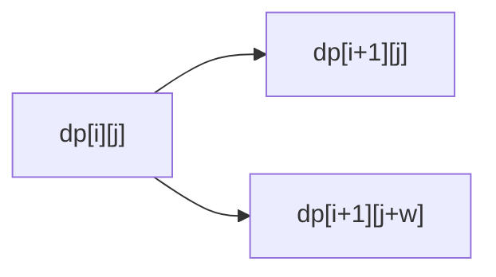
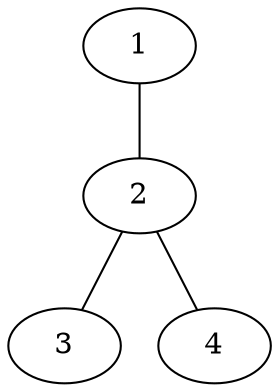

# OJ 题目解析格式规范

这个 skill 只负责 `problems/` 下题目解析文章的写作格式和 Markdown 骨架。

它不负责：

- 推导题目解法。
- 判断算法是否正确。
- 讲解双指针、DP、图论等算法内容。
- 重写已有正文的题目解析。
- 判断 `tags` 和 `categories` 的具体算法标签是否准确。
- 判断或维护题目之间的 `pre` / `common` / `recommend` 关系。

算法解析内容由另一个题目解析 skill 填写。本 skill 只保证文章结构稳定、字段完整、代码嵌入格式统一。
题目关系和外部练习推荐元数据由 `oj-problem-relation-writer` 维护。

注意：`new-problem.py` 创建的 `index.md` 只是布局中立的材料骨架。最终正文必须先根据解法之间的关系选择“直接正解、暴力到正解、并列多解法、子任务递进”之一；每个正式解法在自己的 `### 代码` 中引用对应代码。

## 使用 Grill-Me

如果用户要求先 `grill me`，按这个顺序一次只问一个问题，并给推荐答案：

1. 这个 skill 是否只管格式、不管解析内容？
2. 哪些共同章节固定，哪些正文标题由解法关系决定？
3. 是否强制最小 frontmatter 字段？
4. 是否统一使用 `@include-code(...)` 嵌入代码？
5. 题目应使用哪一种正文布局，判定依据是什么？
6. 空章节是否使用 HTML 注释占位？
7. 是否负责文件命名和存放路径？
8. 修改已有题解时，是强制套模板还是只修正格式？
9. 是否把 Mermaid、Graphviz、二维表格等可视化内容纳入格式规范？
10. 是否在 frontmatter 中加入 `description` 作为题解核心摘要？

能从本仓库已有文件判断的问题，不要问用户。

## 文件位置

只使用目录型题目结构。新建题解放在：

```text
problems/<oj>/<problem_id>/index.md
```

对应代码固定为：

```text
problems/<oj>/<problem_id>/main.cpp
```

示例：

```text
problems/luogu/P1001/index.md
problems/luogu/P1001/main.cpp
```

过程文档目录为：

```text
problems/<oj>/<problem_id>/problem-analysis-workspace/
```

不要新建或输出旧扁平结构，例如 `problems/poj/poj3061.md` 和 `problems/poj/poj3061.cpp`。

## Frontmatter

每篇题解 Markdown 必须以 YAML frontmatter 开头。

字段顺序固定为：

```yaml
---
oj: "poj"
problem_id: "3061"
title: "Subsequence"
description: "使用双指针维护满足和不小于 S 的最短连续子序列。"
difficulty: "普及-"
date: 2025-11-28 15:41
toc: true
tags: []
favorite: false
favorite_reason: ""
categories: []
pre: []
common: []
recommend: []
source: https://vjudge.net/problem/POJ-3061
---
```

字段规则：

- `oj`：小写 OJ 名称，通常来自目录名。
- `problem_id`：字符串格式。
- `title`：题目标题；不知道时使用空字符串，不编造。
- `description`：题解核心摘要，一行中文，描述最关键的解法思想；格式修正时无法判断就使用空字符串，不编造。
- `difficulty`：题目难度；新建题解默认使用 `"未知"`，最终题解应尽量评估为标准枚举值。
- `date`：新建文章使用当前本地时间；修改旧文时保留原日期。
- `toc`：固定为 `true`。
- `tags`：数组格式；本 skill 不负责填具体算法标签。
- `favorite`：布尔值，表示这道题是否被个人标记为“有很大启发”；新建题解默认 `false`。
- `favorite_reason`：字符串，记录标记为 favorite 的原因；新建题解默认空字符串。它是个人学习元数据，不替代 `tags`。
- `categories`：数组格式；本 skill 不负责填具体分类。
- `pre`：数组格式，表示当前题的前置题；本 skill 不负责判断具体关系。
- `common`：数组格式，表示和当前题相似的题；本 skill 不负责判断具体关系。
- `recommend`：数组格式，表示跨 OJ 或仓库外练习推荐；本 skill 不负责判断具体推荐。
- `source`：题目来源；不知道时留空，不编造。

`pre` / `common` / `recommend` 的元素格式由 `oj-problem-relation-writer` 维护：

```yaml
pre:
  - oj: "luogu"
    problem_id: "P1002"
    reason: "网格路径计数 DP 的基础版本"
common:
  - oj: "luogu"
    problem_id: "P1002"
    reason: "同样是带限制的网格 DP"
recommend:
  - oj: "leetcode"
    problem_id: "62"
    title: "Unique Paths"
    url: "https://leetcode.com/problems/unique-paths/"
    reason: "同样是基础网格路径计数 DP，适合作为同模型练习。"
    relation: "similar"
```

关系字段是可选扩展字段。修改已有文件时，如果原文件没有 `pre` / `common` / `recommend`，本格式 skill 不强制补充；如果已经存在，则按标准顺序保留在 `categories` 后、`source` 前。

修改已有文件时：

- 保留已有有效字段值。
- 补齐缺失字段。
- 按标准顺序整理字段。
- 不因为不知道内容而删除原有字段值。

`description` 写作规则：

- 新建题解或由 `oj-problem-analysis-writer` 生成最终题解时必须非空。
- 格式修正旧题解时，如果不能从已有正文准确判断核心思路，使用 `description: ""`。
- 只写一行，不写 Markdown，不换行。
- 推荐 20 到 80 个中文字符，最多不超过 120 个字符。
- 描述解题核心，不描述题面背景。
- 不写“本题主要考察”“详见下文”“经典题”等空话。

好的例子：

```yaml
description: "用单调队列维护窗口最值，把每次区间最优转移降到均摊 O(1)。"
description: "把强连通分量缩点成 DAG，再在拓扑结构上统计可达关系。"
description: "用树形 DP 分别维护选与不选当前节点时的最优价值。"
```

`difficulty` 标准枚举（2026-08 洛谷改版后的官方映射）：

```text
入门
普及-
普及
普及+/提高-
提高
提高+/省选-
省选/NOI-
未知
```

规则：

- 新建题解模板必须包含 `difficulty: "未知"`。
- 由 `oj-problem-analysis-writer` 生成最终题解时，必须评估并填写难度。
- 不确定时使用 `"未知"`，不要编造。
- 旧题如果缺少 `difficulty`，格式修正时可以补为 `"未知"`；检查工具在迁移期只给 warning。

难度获取顺序：

- Luogu 题目优先抓取官方 `difficulty` 字段（id 与枚举一一对应：0→`未知`、1→`入门`、2→`普及-`、3→`普及`、4→`普及+/提高-`、5→`提高`、6→`提高+/省选-`、7→`省选/NOI-`），禁止凭印象猜测。旧映射（`5→提高+/省选-`、`6→省选/NOI-`、`7→NOI/NOI+/CTSC`）已于 2026-08 被洛谷官方替换，新档位不再有 `NOI/NOI+/CTSC`。
- 其他 OJ 优先使用官方难度/rating 换算；无法可靠换算时根据算法复杂度与知识点数量评估。
- 仍不确定时写 `"未知"`。

## 正文章节与布局

frontmatter 后必须有：

```markdown
[[TOC]]
```

`## 形式化题目` 和 `## 总结` 是共同外层章节。中间正文由 `oj-problem-analysis-writer` 读取题面、约束、子任务和所有代码后选择布局；本 skill 只规定所选布局的格式。不得仅按难度选择布局。

直接正解型用于不存在独立教学层的题目：

```markdown
## 形式化题目

## 正解

### 思路

### 代码

### 复杂度

## 总结
```

暴力到正解型用于朴素方法能清楚暴露主瓶颈的题目：

```markdown
## 形式化题目

## 暴力解法

### 思路

### 代码

### 复杂度

### 瓶颈

## 正解

### 思路

### 代码

### 复杂度

## 总结
```

并列多解法型用于至少两个值得教学的独立完整解法：

```markdown
## 形式化题目

## 解法总览

## 解法一：...

### 思路

### 代码

### 复杂度

## 解法二：...

### 思路

### 代码

### 复杂度

## 复杂度对比

## 总结
```

子任务递进型用于约束或子任务形成有意义的层层优化路线：

```markdown
## 形式化题目

## 解法路线

## 暴力解法

### 适用范围

### 思路

### 代码

### 复杂度与瓶颈

## 子任务解法：实际约束

### 适用范围

### 思路

### 代码

### 复杂度与瓶颈

## 正解

### 关键观察

### 思路

### 代码

### 复杂度

## 总结
```

布局规则：

- 每个正式解法章节内部应包含 `### 思路`、`### 代码`、`### 复杂度`；递进层可以合并为 `### 复杂度与瓶颈`。
- `## 解法总览` 说明并列解法的差异，并明确正式主解及其 `main.<ext>`。
- `## 解法路线` 说明各层真实适用约束、上一层瓶颈、复用观察，并明确正式主解。
- 不要把未经核实的“60 分”“80 分”写进标题；优先写实际约束。
- 每个解法的 `### 代码` 推荐使用 `@include-code(...)`；如果代码和另一个解法完全相同，可以写“同解法一”“见解法一”“略，原因是...”，但这种省略应是刻意说明。
- 全文必须至少有一个 `@include-code(./main.<ext>, <lang>)`，作为正式主解代码。

非平凡算法题可以在 `## 总结` 后追加：

```markdown
## 图示解析
```

不要在题解正文中添加一级标题。正文只使用二级标题（`##`），题目标题由 frontmatter 的 `title` 提供。

`## 形式化题目` 写作规则：

- 去除原题的故事背景和无关信息，像数学题目一样简洁。
- 直接描述计算任务的核心数学结构：给定什么、要求什么。
- 不写输入输出格式、数据范围等与数学本质无关的细节。
- 读者应能通过形式化题目辨认同构或本质相关的题目。

## 可视化辅助格式

题解允许使用图形化内容辅助理解，但本 skill 只规定格式，不判断具体题目是否需要图。

允许的可视化形式：

- Markdown 表格：用于 DP 表、背包表、样例推演、状态变化。
- Mermaid：用于流程图、状态图、简单树形结构、样例过程。
- ASCII 文本图：用于小型流程、递归分支和状态转移的紧凑示意。
- Graphviz dot：用于图论样例图、树、DAG、拓扑关系。
- `tree_draw.py` 生成的 SVG：用于普通树、二叉树、线段树、静态树形数据结构图。
- 图片：用于 Graphviz 离线生成图、手绘标注图或复杂结构图。

可视化内容放置规则：

- 如果图只解释样例，放在 `## 形式化题目` 中样例解释附近。
- 如果图解释算法本质，放在对应正式解法的 `### 思路` 或 `### 关键观察` 附近。
- 非平凡算法题的整体思路图放在 `## 总结` 后，使用二级标题 `## 图示解析`；直接输入输出、极短模拟和纯语法学习文章可以省略。
- 除 `## 图示解析` 外，如需分段，使用三级标题，例如 `### 样例图`、`### DP 表格`。
- 不为了装饰添加图。每张图或表都必须有明确教学目标。

每个可视化块必须满足：

- 图前用 1 句话说明“这张图展示什么”。
- 图后用 2 到 5 句话说明“读者应该看什么”。
- 表格必须解释行、列、单元格含义。
- Mermaid / Graphviz 源码块内部尽量使用 ASCII 节点 ID；中文放在 label 或说明文字中。
- 普通题解最多 1 到 2 个可视化块（包含末尾的 `## 图示解析`）；难题最多 3 个。
- 图超过 30 个节点、DP 表超过 `10 x 10`、搜索树超过 3 层时，只展示关键局部。
- 树形 SVG 推荐命名为 `tree.svg`、`binary-tree.svg`、`segment-tree.svg` 或能表达内容的短横线文件名。
- 题解中插入本地 SVG 时使用标准 Markdown 图片语法，例如 ``。

Mermaid 示例：

````markdown
### 状态转移图

这张图展示从一个状态可以转移到哪些后继状态：



从图中可以看到，每个物品只有“不选”和“选”两种去向。
这正好对应 0/1 背包的一次状态转移。
````

ASCII 示例：

````markdown
### 决策流程

这张文本图展示每个位置的两种选择：

```text
当前第 i 个元素
|- 不选：继续处理 i + 1
`- 选：记录当前选择，再处理 i + 1
```

从上到下看，每一层只处理一个元素。
两条分支正好对应递归枚举中的两次调用。
````

Graphviz 示例：

````markdown
### 样例图

这张图把样例中的边画成无向图：



tree_draw.py 示例：

```markdown
### 样例树

这张图把样例中的父子关系画成树：


根节点是 `1`，它有两个直接孩子 `2` 和 `3`。
后面分析 DFS 顺序时，可以先观察每棵子树的进入顺序。
```

节点 `2` 是这个样例中的分叉点。
后面分析 DFS 顺序时，可以先盯住从 `2` 出发的几条边。
````

DP 表格示例：

```markdown
### DP 表格

这张表展示样例中前两层状态的变化：

| i \ j | 0 | 1 | 2 |
| --- | --- | --- | --- |
| 0 | 1 | 0 | 0 |
| 1 | 1 | 1 | 0 |

行表示已经处理到第 `i` 个元素。
列表示当前容量或状态值 `j`。
单元格中的值是 `dp[i][j]`。
```

## 占位注释

如果某个章节暂时没有正文，保留章节，并使用 HTML 注释占位：

```markdown
<!-- 由题目解析 skill 填写 -->
```

占位注释用于多 skill 协作，不会显示在电子书正文中。

不要使用可见文本占位，例如：

```markdown
待补充
TODO
这里写思路
```

## 代码嵌入

正式主解的 `### 代码` 使用：

```markdown
@include-code(./main.cpp, cpp)
```

规则：

- 路径必须相对当前 Markdown 文件。
- 正式主解引用同目录 `main.<ext>`；普通 C++ 题通常是 `main.cpp`。
- 不在 Markdown 中粘贴完整代码。
- 如果暂时没有代码文件，保留当前解法的 `### 代码`，并使用 HTML 注释说明：

```markdown
<!-- 缺少对应代码文件 -->
```

当朴素解是正式教学层时，放入独立的 `## 暴力解法`：

```markdown
## 暴力解法

### 思路

### 代码

@include-code(./brute.cpp, cpp)

### 复杂度与瓶颈
```

规则：

- `brute.cpp` 用于解释朴素想法和辅助对拍。
- `brute.cpp` 不替代 `main.cpp`。
- `brute.cpp` 放在暴力解法自己的 `### 代码` 中，不塞进其他解法的思路小节。
- 如果只是格式修正且缺少 `brute.cpp`，可以先保留 HTML 注释；真正写题目解析时由 `oj-problem-analysis-writer` 判断这一层是否值得展示并完成代码。

所有布局的代码嵌入规则：

- 每个正式解法内使用 `### 代码` 放置当前解法代码。
- 正式主解对应的解法章节必须引用 `main.<ext>`，例如 `@include-code(./main.cpp, cpp)`。
- 额外解法文件如 `main-link.cpp`、`main-queue.cpp` 可以在对应解法章节中引用。
- 不使用脱离具体解法的全局 `## 代码`。

## 新建文章模板

新建题解骨架时，使用仓库中的模板文件：

```text
scripts/problem-analysis-tools/template/index.md
```

填充模板时，只填能从文件名、路径、已有元数据或用户明确输入中确定的字段。不要为补全模板而编造信息。

该模板故意不预置正文布局。`oj-problem-analysis-writer` 必须先读取题面、约束、子任务、现有 `index.md` 和所有代码，再重写模板注释所在位置。

## 修改已有题解

修改已有题解时，只修正格式问题，尽量保留已有正文。

可以做：

- 补齐 frontmatter。
- 调整 frontmatter 字段顺序。
- 补上 `[[TOC]]`。
- 在能够从已有内容判断解法关系时，将章节整理为四类布局之一。
- 补齐所选布局缺失的章节。
- 将完整代码块替换为 `@include-code(...)`，前提是对应代码文件存在。
- 将作为正式教学层的暴力解整理为独立 `## 暴力解法`，并把 include 放进其 `### 代码`。
- 为缺失内容添加 HTML 注释占位。

不要做：

- 重写算法思路。
- 删除已有题目解析正文。
- 改变正文中的算法结论。
- 重新判断复杂度。
- 修改 `tags`、`categories` 的具体内容，除非用户明确要求或只是整理数组格式。
- 判断或修改 `pre`、`common`、`recommend` 的具体关系，除非用户明确要求或只是整理数组格式。
- 强制把已有可读正文改成模板化空骨架。

## 输出检查清单

交付前检查：

- Markdown 文件位于 `problems/<oj>/<problem_id>/index.md`。
- frontmatter 在文件最开头。
- frontmatter 包含 `oj`、`problem_id`、`title`、`description`、`date`、`toc`、`tags`、`favorite`、`favorite_reason`、`categories`、`source`；新建题解还应包含 `pre`、`common`、`recommend`。
- 新建题解的 `favorite` 默认为 `false`，`favorite_reason` 默认为空字符串；修改旧文章时保留已有值，缺失时可按需补齐。
- 如果存在 `pre` / `common`，它们位于 `categories` 后、`source` 前，且为数组格式。
- 如果存在 `recommend`，它位于 `common` 后、`source` 前，且为数组格式。
- frontmatter 字段顺序符合规范。
- frontmatter 后有 `[[TOC]]`。
- 正文使用已判定的四类布局之一，并在过程文档记录选择依据。
- 直接正解型包含 `## 正解`；暴力到正解型包含独立的 `## 暴力解法` 和 `## 正解`。
- 并列多解法型包含 `## 解法总览` 和至少两个 `## 解法...`；子任务递进型包含 `## 解法路线`、至少一个递进层和 `## 正解`。
- 空章节使用 HTML 注释占位。
- 每个正式解法都有自己的 `### 代码`，或者明确说明为什么不单独给出代码。
- 正式主解的 `### 代码` 使用 `@include-code(./main.<ext>, <lang>)` 或缺失代码注释。
- 没有粘贴完整代码。
- 没有编造题目标题、来源、算法标签或解析内容。

## 最终回复

完成修改后，只简短说明：

- 修改了哪个文件。
- 执行的是新建骨架还是格式修正。
- 是否保留了已有正文。
- 哪些字段或代码文件仍然缺失。
