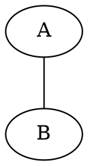
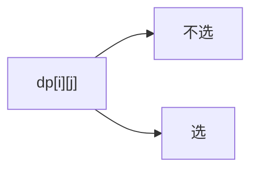
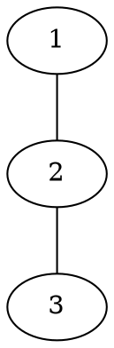
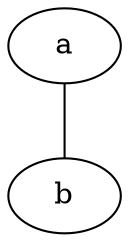

# RBook Markdown 语法参考

这份参考以当前的 `lib/markdown.js` 为准。示例默认写在一个经过
`MarkdownRenderer` 渲染的 Markdown 文件中；需要文件路径的功能以该文件的
目录为相对路径基准。

## 目录

- [基础 Markdown](#基础-markdown)
- [代码块与代码引用](#代码块与代码引用)
- [数学公式](#数学公式)
- [提示框与容器](#提示框与容器)
- [题目链接与 Markdown 链接](#题目链接与-markdown-链接)
- [Mermaid 与 Graphviz](#mermaid-与-graphviz)
- [目录、标题与锚点](#目录标题与锚点)
- [图片](#图片)
- [专用块](#专用块)
- [行内扩展](#行内扩展)
- [任务列表与 emoji](#任务列表与-emoji)
- [安全、资源和历史语法](#安全资源和历史语法)

## 基础 Markdown

`markdown-it` 使用以下选项创建：`html: true`、`linkify: true`、
`typographer: true`。因此可以使用普通 Markdown 的标题、段落、引用、列表、
强调、链接、图片、表格、分隔线和围栏代码块；完整的 HTML 也会进入渲染链。

```markdown
## 小节

一段正文，包含 **重点**、*强调*、`行内代码` 和 [普通链接](https://example.com)。

> 引用一段说明。

| 列一 | 列二 |
| --- | --- |
| 值 | 值 |
```

写作时优先使用这些基础形式。`linkify` 会把裸的完整 URL 变成链接，但仍建议
使用有意义的链接文字；`typographer` 的替换效果取决于上下文，不要在代码或
精确数据中依赖它。

## 代码块与代码引用

### 围栏代码块

普通围栏使用三个或更多反引号，第一行的第一个词是语言标签：

````markdown
```cpp
int main() {
  return 0;
}
```
````

当前渲染器会为普通代码块添加语言标题、行号和复制按钮。语言别名会映射为
高亮类：`js` -> `javascript`、`py` -> `python`、`ts` -> `typescript`、`hs` ->
`haskell`、`vue`/`html` -> `markup`、`md` -> `markdown`、`cpp`/`c++` -> `cpp`。
`text`、`plain`、`none` 以及 `input`/`output` 开头的标签按无高亮文本处理。

### 特殊围栏

```markdown



```

- `mermaid` 输出为 `<pre class="mermaid">`，由页面加载的 Mermaid 客户端脚本
  绘图；节点 ID 使用 ASCII，中文放在 label 中。
- `dot`、`graphviz` 和 `viz-<engine>` 输出为 Graphviz 容器。`viz-dot`、
  `viz-neato` 等后缀选择对应引擎；具体引擎是否被页面资源加载仍需预览验证。
- 其它语言标签按普通代码块处理，不会自动执行。

### `@include-code`

在当前 Markdown 文件中按相对路径嵌入代码：

```markdown
@include-code(./main.cpp, cpp)
```

语言参数可省略，渲染器会从文件扩展名推断：

```markdown
@include-code(./main.py)
```

规则：

- `include-code` 必须独占一行，文件路径不能包含未处理的逗号或右括号。
- 相对路径相对于当前 Markdown 文件，不是相对于仓库根目录。
- 找不到文件时，预处理阶段会保留指令；渲染阶段会显示 `include-code failed`
  警告。不要用一个空代码块掩盖路径错误。
- 题解的正式代码通常使用 `@include-code(./main.cpp, cpp)`；暴力代码是否
  嵌入由 `oj-problem-analysis-writer` 和 `oj-problem-format-spec` 决定。

### `@include_md`

递归嵌入另一份 Markdown：

```markdown
@include_md("./chapters/part.md")
```

包含文件中的 `@include_md` 和 `@include-code` 也会继续展开。文件不存在时会
留下 HTML 注释警告；这个功能适合拆分文档，不适合把不受信任的外部路径引入页面。

## 数学公式

项目使用 `markdown-it-texmath` 和 KaTeX，当前启用 `dollars`、`beg_end`、
`julia` 三组分隔符：

```markdown
行内公式 $a_i + b_i$。

$$
f(n) = f(n - 1) + f(n - 2)
$$
```

也可以使用 TeX 的 display 环境：

```markdown
\begin{aligned}
dp[i][j] &= \max(dp[i-1][j], dp[i-1][j-w_i] + v_i)
\end{aligned}
```

KaTeX 配置了 `\R` 宏，并使用 `throwOnError: false`，不支持的命令可能显示为
错误文本而不是抛出异常。公式中的反斜杠需要按 Markdown/TeX 规则转义；不要把
公式写进普通代码块后期待它被渲染。

## 提示框与容器

### Admonition

使用至少三个 `!` 开始和结束；开始标记后先写类型，再可选写标题：

```markdown
!!! warning 边界条件
区间为空时需要单独处理。
!!!
```

标题也可以包含空格而不加引号：

```markdown
!!! theorem 结论一
固定 `x` 后，合法区间必须覆盖所有更小值的位置。
!!!
```

当前允许的类型：

`note`、`abstract`、`info`、`tip`、`success`、`question`、`warning`、
`failure`、`danger`、`bug`、`example`、`quote`、`definition`、`theorem`、
`corollary`、`lemma`、`proof`、`exercise`、`problem`。

类型必须是上述小写单词；未知类型不会被这个插件接管。提示框内部可以使用
段落、列表、公式和代码块，但要保持正常 Markdown 缩进，并用单独一行的 `!!!`
结束；结束标记至少要和开始标记一样长。插件不会去掉标题外层的引号；如果写成
`!!! warning "标题"`，引号会成为标题文字的一部分。

### 普通提示容器

`markdown-it-container` 注册了 `warning`、`error`、`info`：

```markdown
::: info
这是给读者的补充说明。
:::

::: warning
这是需要注意的边界。
:::

::: error
这是一个错误示例。
:::
```

这类容器的标题图标由页面 CSS/emoji 处理，不要在正文中重复伪造图标。

### 折叠、布局和黑板

当前还注册了以下容器：

```markdown
::: fold
默认折叠内容，点击页面显示的“点击”展开。
:::

::: center
居中内容。
:::

::: oneline
需要保持一行展示的短内容。
:::

::: lb


:::

::: blackboard
适合展示需要单独强调的推导或板书内容。
:::
```

`fold` 的参数不会改变固定的摘要文字；`center`、`oneline`、`lb`、`blackboard`
依赖页面 CSS，不能假设在 GitHub 或普通 Markdown 查看器中同样显示。

`style` 容器把参数直接写入 HTML 行内样式：

```markdown
::: style text-align: center;
这段内容依赖页面样式。
:::
```

这是兼容/谨慎能力。只在普通 Markdown 无法表达布局时使用，避免把用户输入或
复杂 CSS 直接塞入页面。

## 题目链接与 Markdown 链接

### 题目双链

题目链接插件支持两种形式：

```markdown
[[luogu/P1001]]
[[problem: luogu,P1001]]
```

第一种用 `/` 分隔 OJ 和题号，第二种使用 `problem:`、逗号分隔，允许空格。
如果 `ProblemManager` 找到题目，链接文字包含题目标题；找不到时仍输出 warning
链接文字 `Missing problem: ...`。写正式题目关系时优先使用仓库中确实存在的题目
标识，不要凭空创建链接。

### 相对 Markdown 链接

相对 `.md` 链接会被转换成站点对应的 `.html` URL：

```markdown
[下一节](./next.md)
[上级说明](../README.md)
```

转换只针对以 `./` 或 `../` 开头、且以 `.md` 结尾的链接；其它链接按普通链接
处理。链接目标应存在且路径相对于当前文件可解析。

## Mermaid 与 Graphviz

Mermaid 和 Graphviz 代码块适合解释局部结构、状态转移或样例过程：

````markdown
这张图展示一次状态转移：




````

`graphviz` 与 `dot` 都使用默认 `dot` 引擎；`viz-<engine>` 可选择 `circo`、
`fdp`、`neato`、`osage`、`twopi` 等页面支持的引擎。复杂静态图应考虑先生成
`svg`/`png` 并用普通图片插入。遵守 `docs/problem-visualization.md` 的节点数量、
表格规模和图前图后解释要求。

## 目录、标题与锚点

`[[TOC]]`、`[[toc]]`、`${toc}` 等 TOC 占位符由
`markdown-it-toc-done-right` 识别；正式题解固定使用：

```markdown
[[TOC]]
```

当前 `anchor` 和 TOC 只处理二级、三级标题（`##`、`###`），并用同一个 `uslug`
规则生成 ID。标题应简短、稳定，避免仅靠标点区分两个同名标题。不要在正文中
添加题解模板规定之外的一级标题。

## 图片

### 普通图片和尺寸

使用标准图片语法，并给出有意义的 alt 文本：

```markdown


```

`markdown-it-image-figures` 会把独立成段的图片包装为 `figure`，并使用 title
作为图注（当前启用 `figcaption: true`）。图片尺寸语法由 `markdown-it-imsize`
处理：`=宽x高`、`=宽x` 或 `=x高` 均可；尺寸不确定时不要硬编码。

### Excalidraw SVG

以 `.excalidraw.svg` 结尾的图片会额外显示“Open in Excalidraw”入口：

```markdown

```

这依赖当前页面配置的 Excalidraw 服务和可访问的本地/远程图片 URL，属于兼容/谨慎
能力。普通 `.svg` 不会获得这个入口。

## 专用块

### Code tabs（当前不产生 Tab UI）

仓库仍依赖并注册了 `markdown-it-codetabs`，但 `lib/markdown.js` 最后注册的
`rbookFenceRendererPlugin` 会覆盖它的围栏 renderer。当前 `[组:标签]` 只会出现在
代码块标题中，不会产生可切换的 Tab UI，因此不要把它当作稳定能力推荐。若要记录
未来修复后的目标写法，形式是组名和标签只能使用字母、数字、下划线或空格：

````markdown
```cpp [cpp: C++17]
int main() {}
```
```python [python: Python 3]
print("hello")
```
````

如果 renderer 恢复，两个同组代码块之间只能有空白，不能插入普通段落或其它
Markdown；第一块默认选中。当前写作请使用独立的带语言代码块，避免依赖这个失效
的交互能力。

### Pseudocode

伪代码插件识别 `::: pseudocode` 块，并交给内置 pseudocode.js 渲染：

```markdown
::: pseudocode
\begin{algorithmic}
\State read next item
\If{the item is valid}
  \State update the answer
\EndIf
\end{algorithmic}
:::
```

伪代码语法由内置库决定，复杂语句先用小片段验证。渲染失败时插件会退回转义后的
文本，因此不要把伪代码当作可执行程序。

### Viz gallery

`viz-gallery` 使用至少四个 `<` 作为围栏，参数写在 `viz-gallery(...)` 中：

````markdown
<<<< viz-gallery(title="示例",engine="dot",height="400")



```neato 另一种布局
graph G {
  a -- b;
}
```
<<<<
````

这是专用能力，依赖页面的 `viz-gallery` Web Component 以及相关 JS 资源。普通
Graphviz 代码块更稳妥；只有确实需要多图切换时才使用 gallery。

### iframe

iframe 插件识别独占一行的 `/i/` 前缀：

```markdown
/i/https://www.youtube.com/embed/example
```

URL 必须包含协议分隔符（插件只检查存在 `:`），但项目写作规范要求使用完整的
HTTPS URL。它会生成 `<iframe>`，页面可能因 CSP、跨域或外部站点策略而无法加载；
不需要交互媒体时，优先使用普通链接或截图。

## 行内扩展

当前启用的行内插件和最小形式如下：

| 功能 | 语法 | 说明 |
| --- | --- | --- |
| 插入 | `++新增内容++` | 输出 `<ins>`；可追加无空格的 `[作者]` 归属标记。 |
| 删除 | `~~删除内容~~` | 输出 `<s>`；可追加无空格的 `[作者]`。 |
| 高亮 | `==重点==` | 输出 `<mark>`。 |
| 上标 | `x^2^` | 输出 `<sup>`，不支持复杂嵌套。 |
| 下标 | `H~2~O` | 输出 `<sub>`，不支持复杂嵌套。 |
| 缩写 | `*[HTML]: Hyper Text Markup Language` 后在正文写 `HTML` | 定义块通常放在文档末尾或首次使用前。 |
| 行内注释 | `<!-- 注释 -->` | `markdown-it-inline-comments` 会移除它，不会显示给读者。 |
| emoji | `:warning:`、`:smile:` | 由 `twemoji` 输出图片；只用于少量语义提示。 |

这些扩展只适合短语。算法符号、代码和精确文本应放在行内代码或公式中，不要
依赖 typographer 或高亮插件改变语义。

## 任务列表与 emoji

任务列表使用 GitHub 风格语法：

```markdown
- [ ] 待完成
- [x] 已完成
```

当前复选框默认 `disabled`，页面中通常不能直接编辑状态；它是展示进度的格式，
不是持久化任务系统。Emoji 使用短代码并由 Twemoji 渲染：

```markdown
注意 :warning:
```

## 安全、资源和历史语法

### Raw HTML 与外部资源

项目打开了 `html: true`，所以 HTML 可能直接进入输出。只在现有模板明确需要时
使用 HTML；优先用 Markdown，避免事件属性、脚本、任意内联样式和不受信任的外部
内容。iframe、Excalidraw、gallery 和 Mermaid 都可能依赖外部脚本或网络，文章应
能在资源不可用时仍保留可读的文字解释。

### 历史代码中出现但当前不应推荐的形式

旧版 `old_scripts/rbook/markdown-it` 的 README 或注释还提到脚注、`kbd`、
`markdown-it-multimd-table`、pangu、旧的 mermaid 插件和其它实验性插件。它们没有
在当前 `lib/markdown.js` 中注册，不能写入“当前支持”清单。需要这些能力时先修改
渲染器并补测试，再更新本 skill；在此之前使用普通 Markdown 或代码块降级。
