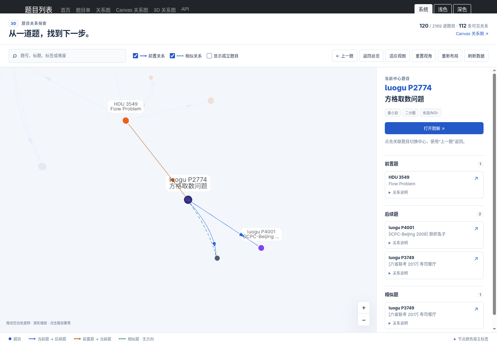
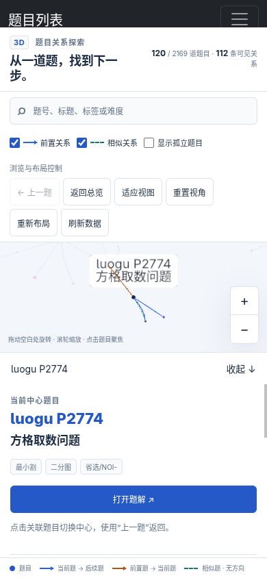

## relations3-graph 实施与验收记录

验收日期：2026-10-02，Asia/Shanghai。实现基于 `1ec39666ff1c56f78bc1cd7980313e3afbc510fe`，本次改动尚未提交、推送或部署。

新增 `/relations3`，与 `/relations`、`/relations2` 并存。全站导航及题目页已加入入口。前三个阶段的功能已实现，第四阶段的测试、构建产物比对、服务检查及真实 Chromium 验收已执行。

### 实现入口

下表便于定位后续维护时需要修改的模块。

| 模块 | 作用 |
| --- | --- |
| [App.tsx](../../relations3-graph/src/App.tsx) | 请求取消、刷新、筛选、搜索、URL、主题、异常清单回退 |
| [Graph3D.tsx](../../relations3-graph/src/Graph3D.tsx) | npm 组件适配、有限模拟、相机、鼠标拖拽、触摸点选、生命周期 |
| [graph-model.ts](../../relations3-graph/src/graph-model.ts) | 引擎对象身份稳定，业务端点与可变引擎数据分开 |
| [relation-index.ts](../../relations3-graph/src/relation-index.ts) | 一层前置、后续、相似关系及对应说明 |
| [graph-objects.ts](../../relations3-graph/src/graph-objects.ts)、[label-manager.ts](../../relations3-graph/src/label-manager.ts) | 球体、箭头、相似虚线、标签、投影避让 |
| [exploration.ts](../../relations3-graph/src/exploration.ts)、[camera.ts](../../relations3-graph/src/camera.ts) | 历史与相机检查点、保留方向的取景计算 |
| [layout-store.ts](../../relations3-graph/src/layout-store.ts) | 独立三维缓存、有效坐标检查、用户固定与缓存迁移 |
| [DetailsPanel.tsx](../../relations3-graph/src/DetailsPanel.tsx) | 三组完整清单、关系原因、切换中心和打开题解 |
| [浏览器验收脚本](../../scripts/relations3-browser-check.js) | 真实 API 样例、鼠标与触摸、失败注入、压力图及性能采样 |
| [verify-push.js](../../scripts/verify-push.js) | 三个版本分别临时构建、产物比对，新增 TypeScript 检查 |

实现使用 `react-force-graph-3d@1.29.2`、`three@0.186.1`、`three-spritetext@1.10.0`、`d3-force-3d@3.0.6`。直接依赖及新增开发依赖固定版本，使用根目录 lockfile；本地参考仓库没有进入应用依赖。`three` 已核对为同一安装版本。

自定义 Group 节点的鼠标拖拽在捕获阶段与 OrbitControls 分开处理。手机点选执行射线检测，保留原生旋转和双指缩放；打开抽屉时取消随后的兼容点击，防止布局变化使点击落到收起按钮。自定义对象的 geometry/material/texture 由安装版底层库统一释放，应用不重复释放；各节点没有共享会被单独删除的几何资源。

### 测试与构建

在仓库根目录执行了以下检查，均通过。

```bash
npm run typecheck:relations3
npm run build
npm exec --yes --package=node@22 -- npm run verify:push
```

完整验证使用 Node `v22.23.3`，204 项仓库测试和 17 项新版核心测试通过，共 221 项，零失败。核心测试覆盖一层关系、多重角色、邻居间边不误高亮、类型筛选、归一化、引擎对象变更隔离、三维布局、历史、相机和损坏缓存。集成测试验证真实 JS/CSS 可获取、题目页参数、三版导航与内容 guard。

`verify:push` 六个阶段全部通过：依赖、测试、TypeScript、三个版本的临时构建产物比对、全量内容索引、真实服务健康。内容索引为 2169 道有效题目、33 个题目单。验收在实现中的工作区执行；这些检查不代表已提交版本满足 Git push hook 的干净工作区条件。

构建产物已生成到 `public/relations3-graph/`，包含入口、样式、manifest 和按需加载的 Graph3D chunk。旧版产物经重建及比对保持一致。Graph3D chunk 约 1.43 MB，gzip 约 384 KB；Vite 的大 chunk 提示仍存在，图形依赖通过动态 import 加载。

### 浏览器与真实数据

使用实际安装的 Chromium `153.0.8010.36`，Playwright `1.63.0`。桌面有窗口模式，1440 × 1000，DPR 1；另验证 1100 × 800 尺寸。显卡实际渲染器为 `ANGLE (Intel, Mesa Intel(R) UHD Graphics 620 (WHL GT2), OpenGL ES 3.2)`。手机是 Chromium 触摸模拟，390 × 844，DPR 1，使用真实 touch/CDP 事件，尚未进行物理手机验收。

样例来自验收时真实 `/api/relations`，规模如下。

| 指标 | 数量 |
| --- | ---: |
| 全部节点 | 2169 |
| 默认参与关系的节点 | 120 |
| 孤立节点 | 2049 |
| 总边数 | 112 |
| 前置边 | 87 |
| 相似边 | 25 |

混合关系样例为 `luogu/P2774`：前置 `HDU/3549`；后续 `luogu/P4001`、`luogu/P3749`；相似 `luogu/P3749`。同一题在后续和相似组均保留。最大度样例为 `luogu/P3372`，孤立样例为 `luogu/P11230`。压力数据另构造 101 个节点、100 条中心直接边，50 条后续、50 条相似。

### 功能验收

使用浏览器实际操作，并从安装组件的公开 graphData/ref 读取坐标与相机状态进行断言；诊断代码只在验收脚本中运行，应用没有测试后门。

| 场景 | 实际结果 |
| --- | --- |
| 普通入口 | 总览有 120 节点、112 边，孤立默认关闭，无中心 |
| 搜索、清空与选题 | 中心标题完整，背景无常驻标签，节点坐标保持一致 |
| 混合关系 | 三组条目逐项与 API 对照一致，前置入边与后续出边可区分 |
| 原因与题解 | 展开真实 reason，独立打开邻居题解，真实页面返回 200 |
| 邻居探索与返回 | 点击侧栏切换；连续选题后返回上一个中心；相机检查点恢复 |
| 关闭两类边并恢复 | 图中边、清单、计数同步；恢复后没有错误或残留条目 |
| 拖拽固定与刷新 | 实际鼠标拖拽改变三维坐标，缓存固定 ID；刷新后全量坐标恢复 |
| 重置和重新布局 | 重置只改视角；重新布局生成新坐标并清除用户固定 |
| 主题和窗口尺寸 | 深浅主题及 ResizeObserver 正常，不改变节点坐标 |
| 刷新失败 | 注入 HTTP 503，保留可用图；再次加载成功并保持位置 |
| 孤立题与 URL | 孤立题可选中并说明无关系；直达正确恢复中心 |
| context lost | 主动丢失 WebGL context，清单仍可探索；重试真正重建画布 |
| 页面与资源生命周期 | 反复切换中心，三次进出两版页面；仅一张画布，几何资源无持续增长 |
| 手机操作 | 点选打开抽屉、清单完整、单指旋转、双指缩放通过 |
| 高度数压力图 | 100 个邻居完整保留在清单，标签隐藏冲突项，旋转可用 |

额外覆盖首次 WebGL 不可用、快速切换中心、刷新删除中心及空目录。共 20 个场景通过，正常桌面及手机页面未出现未捕获异常，最终结果记录在随附的 JSON 报告中。

### 可读性观察与旧版对照

真实阅读任务使用 `luogu/P2774`，找到前置 `HDU/3549`、后续 `P4001/P3749` 和相似 `P3749`，展开原因、打开题解、切到邻居再返回，全部完成。新版直接点击分组清单即可完成；[relations2 对照截图](./relations3-graph-validation-assets/relations2-comparison.png)的侧栏提供关系数量，没有对应的三组邻居清单、原因及探索返回按钮，需要在画布中识别邻居再选题。这是操作能力对照，没有进行用户实验或声称阅读速度提升的统计结论。

桌面截图可观察入边橙色、出边蓝色、相似虚线绿色，以及侧栏保留多个角色。



部分邻居标签因屏幕空间冲突隐藏，完整题号、标题和原因仍在侧栏。高邻居数图通过清单阅读全部关系，不能依靠同时展示所有文字。

另外保留了 [深色主题截图](./relations3-graph-validation-assets/desktop-dark.png)与 [100 邻居压力截图](./relations3-graph-validation-assets/high-degree.png)，用于后续回归对照。

手机截图展示抽屉展开后的可用画布及题解入口。



手机工具栏可折叠以增加画布高度；抽屉内独立滚动查看三组关系。

### 性能采样与限制

记录实际鼠标旋转期间的 rAF 间隔，测量不是静止画面的 FPS；桌面默认网络、全目录和压力图分别采样。精确数值见 [原始浏览器报告](./relations3-graph-validation-assets/report.json)。

完整硬件渲染验收记录约为默认网络 60.5 FPS、全目录 52.4 FPS、100 邻居压力图 60.5 FPS，符合规划在该设备上的初始目标。选题至侧栏反馈约 83 ms，包含自动化点击开销；初始化观察到约 204 ms 长任务。加载与初始化仍有优化空间，不能据此承诺其他机器或移动设备具有相同性能。

完整验收的首入计时等待了页面 load，记录约 21.85 秒至确认画布就绪、24.67 秒至确认布局稳定。这种计时包含全站宿主页外部 CDN 的等待，不能当成纯 3D 初始化耗时。验收脚本已改为从导航 commit 后直接观察画布状态，并单独补测：首次就绪约 3.06 秒、布局稳定约 5.89 秒，两者相差约 2.84 秒。补测中外部 CSS/JS 请求各耗时约 1.11 秒，细节记录在报告的 `initialEntryProbe` 中；不能把外部资源波动归因于力导向模拟。

还使用 SwiftShader 做过诊断。软件渲染旋转样本约为默认网络 31.8 FPS、全目录 4.8 FPS，因此软件 GPU 浏览完整目录明显较慢；不应将其与硬件渲染成绩混用。交互性能指标不作为依赖硬件的 CI 通过阈值。

资源计数只覆盖当前渲染器的 geometry、texture 和 DOM canvas；未进行长期进程内存压测。GPU 禁用和 context lost 都有清单回退。真实手机、其他浏览器及低性能机器的手动阅读体验仍需后续验证。

### 重复验收

启动正常页面使用 `npm start` 后访问 `/relations3`。自动验收脚本会自行启动临时本地服务；需要系统 Chromium 或已安装的 Playwright Chromium。

```bash
# 无窗口软件渲染验收，输出 .tmp/relations3-browser/
npm run check:relations3:browser

# 有桌面会话时，使用真实显卡；本次完整验收使用此命令
R3_HEADFUL=1 R3_SOFTWARE_GPU=0 \
  R3_BROWSER_OUTPUT=.tmp/relations3-browser-hardware \
  npm run check:relations3:browser
```

可设置 `R3_CHROMIUM=/path/to/chromium` 指定浏览器。脚本结果、失败堆栈、采样数据和截图写入输出目录；验收记录中随附的产物为本次执行副本。
