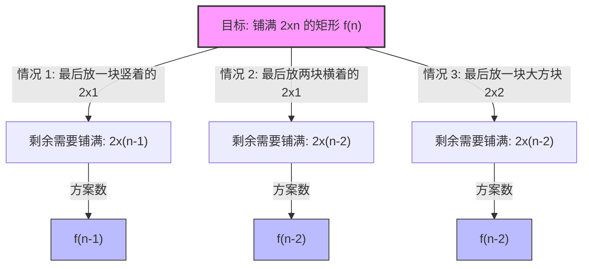

[[TOC]]

## 题目解析

你好！很高兴能作为你的算法教练来解析这道经典的题目。这是一道非常标准的 **线性动态规划（Linear DP）** 结合 **高精度运算（Big Integer Arithmetic）** 的题目。

让我们不去纠结具体的代码实现，而是把重点放在如何从数学角度构建模型，以及如何处理那些容易让人“翻车”的细节。

---

### 🧩 题目解析：骨牌铺设 (Tiling)

#### 1. 核心问题拆解

我们要在一个 $2 \times n$ 的矩形中填满骨牌。我们手头有三种“操作”方式（虽然题目说只有 $2 \times 1$ 和 $2 \times 2$ 两种骨牌，但摆放方式决定了状态转移）：

1.  **竖着放一个 $2 \times 1$**：这会占据 $2 \times 1$ 的空间。
2.  **横着放两个 $2 \times 1$**：这会占据 $2 \times 2$ 的空间（注意：必须两个一起放才能填满高度为 2 的区域）。
3.  **放一个 $2 \times 2$**：这也会占据 $2 \times 2$ 的空间。

#### 2. 状态转移的可视化 (Mermaid)

让我们把这道题想象成“我如何把长度为 $n$ 的矩形铺满”。我们只关注**最右边**是怎么结尾的。

设 $f(n)$ 为铺满 $2 \times n$ 矩形的方案总数。

**逻辑推导：**

*   **情况 1（宽度 1）：** 如果我们在最右边竖着放一块，剩下的长度就是 $n-1$。方案数就是 $f(n-1)$。
*   **情况 2（宽度 2）：** 如果我们在最右边横着放两块（上下堆叠），剩下的长度就是 $n-2$。方案数是 $f(n-2)$。
*   **情况 3（宽度 2）：** 如果我们在最右边放一块大的 $2 \times 2$，剩下的长度也是 $n-2$。方案数也是 $f(n-2)$。

#### 3. 离散数学 & 递推公式

把上面的图转化为数学公式。因为情况 2 和情况 3 都会让长度减少 2，所以它们可以合并。

$$
\begin{aligned}
f(n) &= \text{情况1} + \text{情况2} + \text{情况3} \\
f(n) &= f(n-1) + f(n-2) + f(n-2) \\
f(n) &= f(n-1) + 2 \cdot f(n-2)
\end{aligned}
$$

**这就是本题的核心递推式。** 它非常像斐波那契数列，只是 $f(n-2)$ 的系数变成了 2。

**基础情况 (Base Cases):**

*   $n=0$: $f(0) = 1$ (数学定义上，空集也是一种铺法，或者你可以直接从 n=1, n=2 开始定义)
*   $n=1$: $f(1) = 1$ (只能竖着放)
*   $n=2$: $f(2) = 3$ (两竖，两横，一大方)
*   检查公式: $f(2) = f(1) + 2 \cdot f(0) = 1 + 2 \times 1 = 3$。逻辑成立。

---

### ⚠️ 细节警示：隐藏的陷阱

这道题如果仅仅写出递推式，在很多 OJ 上会直接 **WA (Wrong Answer)** 或者 **RE (Runtime Error)**。

**陷阱：数据范围爆炸**

请看题目输入范围：$0 \le n \le 250$。
请看 Sample Output 的最后一行：`107129...5223`。

这是一个天文数字！
我们来估算一下：$f(n)$ 每次都至少是前一项的 2 倍（近似）。
$f(250) \approx 2^{250}$。

*   `int` (32位) 最大值 $\approx 2 \times 10^9$
*   `long long` (64位) 最大值 $\approx 9 \times 10^{18}$
*   $2^{250}$ 远远超过了 C++ 内置整数类型的范围。

**解决方案：高精度算法 (Big Integer)**

既然不能直接用 `long long`，你就需要手动模拟小学生的加法运算。

1.  使用 `vector<int>` 或 `int[]` 来存储每一位数字（比如数组 `A[0]` 存个位，`A[1]` 存十位）。
2.  你需要实现一个函数：`BigInt Add(BigInt a, BigInt b)`。
3.  你需要实现一个函数：`BigInt MultiplyTwo(BigInt a)` (或者 `Add(a, a)`)。

---

### 📐 “离散数学”模块：深入理解

#### 1. 算子映射 (Operator Mapping)

*   **加法原理 (Rule of Sum):** 我们将所有可能的铺法分为了互斥的三类（尾部是竖条、尾部是横条对、尾部是大方块），所以总方案数是这三类之和。
*   **状态空间 (State Space):** 问题定义域从 $n$ 缩小到 $n-1$ 和 $n-2$，这是一个典型的线性递归结构。

#### 2. 特征方程 (Characteristic Equation)

从离散数学的**线性常系数齐次递推关系**角度看，方程 $a_n - a_{n-1} - 2a_{n-2} = 0$ 对应的特征方程是：
$$r^2 - r - 2 = 0$$
$$(r-2)(r+1) = 0$$
解得特征根 $r_1 = 2, r_2 = -1$。
通解形式为 $a_n = A \cdot 2^n + B \cdot (-1)^n$。
带入 $a_0=1, a_1=1$ 可以解出 $A$ 和 $B$ 的具体值。
这意味着 $a_n$ 的增长速度是 $O(2^n)$ 级别的，这从数学原理上再次印证了必须使用高精度算法。

---

### 📶 信号反射 & 思维模板

1.  **关键信号 (Key Signals)**:
    *   题目类型：铺砖 (Tiling) / 覆盖问题。
    *   约束：$2 \times N$ 的矩形。
    *   数据范围：$N=250$ (暗示结果极大)。
    *   样例输出：非常长的一串数字。

2.  **逻辑跃迁 (Logic Jump)**:
    *   看到 $2 \times N$ 的铺砖问题 $\rightarrow$ 立即想到只考虑**最右端**（或最左端）的一列是如何被覆盖的。
    *   发现切分后变为子问题 $\rightarrow$ 确定是 **DP / 递推**。
    *   看到 $N=250$ 且是指数级递推 $\rightarrow$ 必须实现 **高精度加法**。

3.  **模式识别 (Pattern Recognition)**:
    *   **特征：** “多少种方式铺满” + “形状规则” + “N 较大”。
    *   **本能反应：** **递推公式 ($f(n) = \dots$) + 高精度数组模拟**。

## 代码 

@include-code(./1.py, python)

## C++策略

如果你一定要写c++,可以先用python 进行 打表,然后存在c++里面(使用string 数组),然后直接输出
