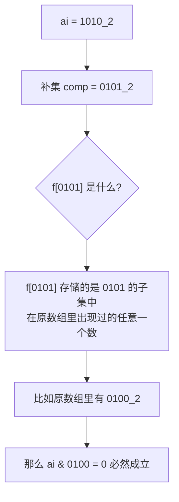

[[TOC]]

## 题目解析

这道题是 SOS DP 的经典入门题。要解决它，我们需要把“位运算条件”转化为“集合包含条件”。

### 1. 核心逻辑转换

题目要求找到一个 $a_j$，使得 $a_i \ \& \ a_j = 0$。

在离散数学中，如果我们将数字看作集合（二进制位为 1 的位置是集合元素），$a_i \ \& \ a_j = 0$ 意味着这两个集合**不相交**。

不相交等价于：**$a_j$ 必须是 $a_i$ 补集的子集。**

- 设全集 $U = 2^{22}-1$（因为 $4 \cdot 10^6 < 2^{22}$）。
- $a_i$ 的补集为 $mask = (\sim a_i) \ \& \ U$。
- 只要任何一个 $a_j$ 满足 $a_j \subseteq mask$，那么 $a_i \ \& \ a_j = 0$ 必定成立。

### 2. SOS DP 状态定义

我们需要一个数组 `f[mask]`，它的定义如下：

- 如果存在某个原数组中的数 $a_j$ 是 $mask$ 的子集，则 `f[mask] = a_j`。
- 如果不存在，则 `f[mask] = -1`。

状态转移：

和求和不同，这里我们只需要维护“存在性”。只要子状态里有一个不是 $-1$ 的值，当前状态就可以继承它。

### 3. 解题步骤

1. 初始化：

   开一个大小为 $2^{22}$ 的数组 f，全部初始化为 -1。

   遍历输入数组 $a$，对于每个出现的数字 $x$，设置 f[x] = x。

2. 运行 SOS DP：

   我们要计算的是 Sum (or Existence) Over Subsets。


```cpp
for (int i = 0; i < 22; ++i) {
   for (int mask = 0; mask < (1 << 22); ++mask) {
       if (mask & (1 << i)) {
           // 如果当前 mask 还没有找到对应的 aj
           // 看看它的子集（把第 i 位变成 0）有没有对应的 aj
           if (f[mask] == -1) {
               f[mask] = f[mask ^ (1 << i)];
           }
       }
   }
}
```

3. 查询结果：

   对于每个原始输入的 $a_i$：

   - 计算补集 `comp = (~a_i) & ((1 << 22) - 1)`。
   - 直接输出 `f[comp]`。

### 4. 为什么这样做是对的？

代码段



### 5. 复杂度分析

- 时间复杂度：$O(N + K \cdot 2^K)$，其中 $K=22$。

  $22 \times 4 \cdot 10^6 \approx 8.8 \cdot 10^7$，在 Codeforces 的 4 秒时限内绰绰有余。

- **空间复杂度**：$O(2^K)$，大约需要 16MB 的内存（使用 `int` 数组）。

------

### 实现小贴士 (Codeforces)

- 由于 $a_i$ 最大是 $4 \cdot 10^6$，你需要至少 22 位二进制位。
- 输入规模较大 ($10^6$)，建议使用快速 IO（`scanf` 或 `cin.tie(0)`）。
- 全集掩码常量：`const int ALL = (1 << 22) - 1;`

这道题是不是让你感觉到 SOS DP 就像是一个**高效的预处理器**？它一次性把所有可能的补集查询都准备好了。

**如果你写完了这题，想试试那道更难一点的“异或和平方” (CF 383E) 吗？它需要一点点容斥原理。**

## 代码 

@include-code(./1.cpp, cpp)

