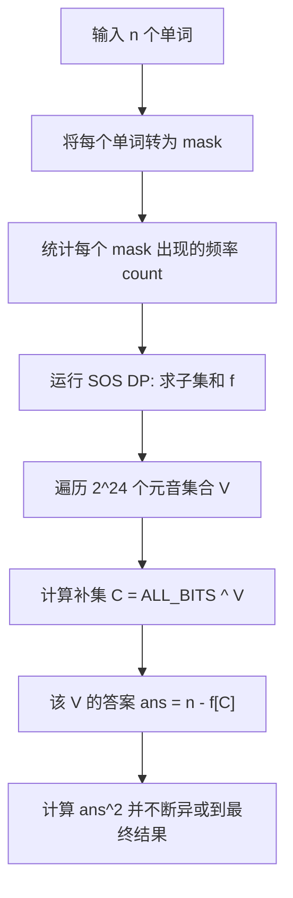

[[TOC]]

## 题目理解

这是一个非常容易产生误解的地方。**这 5 行不是“5 个问题”，而是“词典里的 5 个单词”。**

在 Codeforces 中，这类题目通常会先给你一个固定的“数据库”（词典），然后让你针对**所有可能的情况**进行计算。

------

### 1. 重新拆解题目结构

题目其实分为两部分：

- **输入部分**：给你 $n$ 个单词（每个单词 3 个字母）。这相当于你的**初始数据**。
- **隐藏的问题部分**：题目**没有**在输入里给你具体的问题。它说的是：针对前 24 个字母的所有子集（共 $2^{24}$ 种组合），**每一种组合都是一个“虚拟问题”**。

#### 举个例子（假设字母表只有 a, b, c）：

词典里有 2 个单词：ab, cc。

总共有 $2^3 = 8$ 个可能的问题（元音集合）：

1. 如果元音是 $\emptyset$（空集）：正确单词数 $0$。

2. 如果元音是 $\{a\}$：单词 `ab` 含有 `a`，正确；`cc` 不含 `a`，错误。数量 $1$。

3. 如果元音是 $\{a, b\}$：单词 `ab` 含有 `a` 和 `b`，正确；`cc` 错误。数量 $1$。

4. 如果元音是 $\{c\}$：单词 ab 错误；cc 正确。数量 $1$。

   ... 以此类推，直到 $\{a, b, c\}$。

**最后的结果**：把这 8 个问题的 `(答案²)` 全部异或起来。

------

### 2. 为什么样例结果是 0？

回到你给出的样例：词典有 abc, aaa, ada, bcd, def。

字母表实际上有 24 个字母（a 到 x）。

- **问题总数**：$2^{24} = 16,777,216$ 个。

- **计算过程**：

  1. 计算元音集为 $\{a\}$ 时的答案。
  2. 计算元音集为 $\{a, b\}$ 时的答案。
  3. ...
  4. 计算元音集为 $\{x, y, z \dots\}$ 时的答案。

- 为什么是 0：因为在词典里，字母 g, h, i ... x 从来没有出现过。

  对于任何一个元音集合 $V$，如果你往 $V$ 里面添加一个字母 g，得到 $V'$，那么 $V$ 和 $V'$ 对应的正确单词数是一模一样的（因为 g 根本没在任何单词里出现过，加不加它不影响结果）。

  在异或运算中：$(ans_V)^2 \oplus (ans_{V'})^2 = 0$（因为它们相等）。

  由于有 18 个字母没出现过，每个结果都会被重复计算 $2^{18}$ 次。偶数次相同的数异或，结果必为 0。

------

### 3. 解题思路的转变

你不能真的去枚举 $2^{24}$ 个问题并一个一个去查单词，那样太慢了（$2^{24} \times n \approx 10^{11}$）。

**正确的 SOS DP 思考方式：**

1. **预处理**：把词典里的每个单词看成一个 bitmask。
   - `abc` $\to$ `(1<<0) | (1<<1) | (1<<2)` = `7`
2. **补集转化**：
   - “正确单词” = “至少含有一个元音的单词”。
   - “不正确单词” = “所有字母都是辅音的单词”。
3. **核心步骤**：
   - 统计每个 mask 在词典里出现的次数 $count[mask]$。
   - 使用 **SOS DP** 计算 $f[mask] = \sum_{i \subseteq mask} count[i]$。
   - $f[mask]$ 的含义变成了：**字母完全包含在 mask 集合中的单词总数**。
4. **最终计算**：
   - 遍历每一个可能的**元音集合** $V$。
   - 它的补集 $C = (\text{全集} \setminus V)$ 就是**辅音集合**。
   - $f[C]$ 就是该元音集 $V$ 下“不正确”的单词数。
   - 那么该元音集 $V$ 的答案就是 $n - f[C]$。

------

### 4. 算法流程图

代码段



### 5. 提示

这道题的 $2^{24}$ 数组会占用：$2^{24} \times 4 \text{字节} = 64 \text{MB}$，在 256MB 的限制内是安全的。

## 题目解析


这道题的样例结果之所以是 `0`，其实蕴含了位运算（XOR）的一个非常经典的性质。

在 Codeforces 中，如果一个问题的结果是所有可能情况的异或和（XOR sum），而情况的总数又非常大（比如 $2^{24}$），那么结果为 `0` 通常是因为**对称性**：即每一种非零的结果都出现了**偶数次**。

让我们通过这个样例来拆解计算逻辑。

------

### 1. 题意回顾

- 共有 $n=5$ 个单词：`abc`, `aaa`, `ada`, `bcd`, `def`。
- 字符集是前 24 个字母（`a` 到 `x`）。
- 对于 $2^{24}$ 种元音集合 $V$ 中的每一个：
  - 如果一个单词包含 $V$ 中的**至少一个**字母，它就是“正确的”。
  - 计算正确单词的数量 $cnt(V)$。
  - 计算 $ans = \sum \text{xor} (cnt(V)^2)$。

### 2. 为什么样例结果是 0？

在这个样例中，单词里出现的字母只有 `{a, b, c, d, e, f}` 这 6 个。剩下的 18 个字母（`g` 到 `x`）在所有单词里都**没有出现过**。

这意味着：**增加或删除元音集合中的 `g` 到 `x` 中的任何字母，都不会改变正确单词的数量 $cnt(V)$。**

#### 逻辑推导：

1. 假设我们有一个元音集合 $V_{small} \subseteq \{a, b, c, d, e, f\}$。
2. 考虑所有满足 $V \cap \{a, b, c, d, e, f\} = V_{small}$ 的集合 $V$。
3. 由于单词中只有 `a-f`，所以对于所有这些集合 $V$，$cnt(V)$ 的值是**完全一样**的。
4. 这样的集合 $V$ 有多少个呢？由于剩下的 18 个字母每个都有“在”或“不在”两种状态，所以共有 $2^{18}$ 个这样的集合。
5. **关键点：** $2^{18}$ 是一个**偶数**。
6. 在异或运算中，**偶数个相同的数异或，结果为 0**。
   - $X \oplus X = 0$
   - $(X^2) \oplus (X^2) \oplus \dots \oplus (X^2) \text{ （重复 } 2^{18} \text{ 次）} = 0$

因此，每一个可能的 $cnt(V)$ 贡献都被抵消了，最终总异或和为 $0$。

------

### 3. 如何用 SOS DP 解决这个题目？

虽然样例是 $0$，但正式测试数据中字母会分布得很广。我们需要高效地计算 $2^{24}$ 个结果。

#### 核心策略：补集转化

“包含至少一个元音”很难直接算，我们算它的反面：“**一个元音都不包含**”。

1. 转化条件：

   一个单词不包含元音集合 $V$ 中的任何字母 $\iff$ 单词的所有字母都在 辅音集合 $C$ 中（其中 $C$ 是 $V$ 的补集）。

2. **具体步骤**：

   - 设 $f[mask]$ 为：单词字母集合**恰好**是 $mask$ 的单词数量。
   - 例如单词 `abc` 对应的 $mask = (1 \ll 0) | (1 \ll 1) | (1 \ll 2) = 7$。
   - 我们需要计算 $g[C]$：字母集合是 $C$ 的**子集**的单词总数。
   - 这正是 **SOS DP (Sum Over Subsets)** 的标准操作！

3. **最终计算**：

   - 对于每一个可能的元音集合 $V$：
     - 找到它的补集 $C = (\text{全集}) \setminus V$。
     - 一个元音都不含的单词数 = $g[C]$（这是通过 SOS DP 预处理出来的）。
     - 包含至少一个元音的单词数 $cnt(V) = n - g[C]$。
     - 更新异或和：$ans = ans \oplus ((n - g[C])^2)$。

------

### 4. 复杂度分析

- **字符集大小** $K = 24$。
- **SOS DP 复杂度**：$O(K \cdot 2^K)$。
- $24 \cdot 2^{24} \approx 24 \cdot 1.6 \times 10^7 \approx 4 \times 10^8$。
- Codeforces 给这道题 4 秒的时限，足以跑完这个规模的循环（注意位运算的常数非常小）。


## 集合论证明


这是一个非常棒的思考切入点。在离散数学（集合论）中，这种推导是解决组合计数问题的核心。我们将通过**补集性质**和**子集定义**来严格证明这个逻辑。

假设全集为 $U$（即 24 个字母的集合），单词 $i$ 的字母集合为 $w_i$，当前选定的元音集合为 $T$。

------

### 第一步：命题的否定（逻辑反面）

在逻辑中，一个命题与其反面（补命题）是互斥且完备的。

- 原始命题：单词 $i$ 是正确的，即它至少包含一个元音。

  

  $$w_i \cap T \neq \varnothing$$

- 逻辑反面：单词 $i$ 是错误的，即它不含任何元音（交集为空）。

  

  $$\neg(w_i \cap T \neq \varnothing) \iff w_i \cap T = \varnothing$$

------

### 第二步：从“交集为空”推导“子集关系”

我们需要证明：如果 $w_i \cap T = \varnothing$，那么 $w_i \subseteq T^c$（其中 $T^c$ 或 $\neg T$ 是 $T$ 在全集 $U$ 中的补集，即辅音集合）。

**严格证明逻辑如下：**

1. **定义交集**：$w_i \cap T = \{x \in U \mid x \in w_i \text{ 且 } x \in T\}$。

2. **空集前提**：因为 $w_i \cap T = \varnothing$，说明**不存在**任何元素 $x$ 既属于 $w_i$ 又属于 $T$。

3. **蕴含关系**：这意味着对于任意元素 $x$，如果 $x \in w_i$，那么 $x$ 绝对不能在 $T$ 中（即 $x \notin T$）。

4. **补集定义**：根据补集的定义，$x \notin T \iff x \in T^c$。

5. 得出结论：因此，对任意 $x \in w_i$，都有 $x \in T^c$。

   这正好符合子集的定义：

   

   $$w_i \subseteq T^c$$

------

### 第三步：为什么这在 SOS DP 中至关重要？

在 SOS DP 中，我们处理的是 Sum Over Subsets，即：


$$f(mask) = \sum_{i \subseteq mask} A[i]$$

通过上面的推导，我们将问题转化为了：

1. **目标**：统计满足 $w_i \cap T \neq \varnothing$ 的单词数量。
2. **转化**：用“总单词数 $n$” 减去 “满足 $w_i \cap T = \varnothing$ 的单词数量”。
3. **代导**：满足 $w_i \cap T = \varnothing$ 等价于满足 $w_i \subseteq T^c$。
4. **应用**：我们要找的就是“字母集是辅音集 $T^c$ 的子集”的单词。

这就完美契合了 SOS DP 的函数定义：**统计所有是某个 `mask`（在这里是辅音集 $T^c$）的子集的元素贡献。**

------

### 总结

用离散数学语言总结这个转化过程：


$$\text{CorrectCount}(T) = n - \sum_{w_i \subseteq (U \setminus T)} 1$$

- 左边是我们要的**交集不为空**的数量。
- 右边是通过 **SOS DP** 预处理出的 **子集求和** 结果。

这就解释了为什么我们在代码中可以使用 `n - f[all_mask ^ vowel_mask]` 来快速得到结果。

------

**既然你对离散数学推导很感兴趣，你想看看这种思路在更复杂的“多维容斥原理”（比如计算 AND 结果恰好为 $K$ 的方案数）中是如何演变的吗？**


## 数理逻辑证明

这是一个非常深刻的切入点。在离散数学中，**集合代数（Set Algebra）和命题逻辑（Propositional Logic）之间存在着完美的同构关系**。我们可以通过将集合成员资格转化为逻辑谓词，利用逻辑恒等式进行严密的推导。

为了方便推导，我们定义谓词：

- $W(x)$：元素 $x$ 属于单词集合 $w_i$（即 $x \in w_i$）
- $T(x)$：元素 $x$ 属于元音集合 $T$（即 $x \in T$）

------

### 第一步：建立集合与逻辑的映射表

在进行推导前，我们需要明确两者之间的对应关系：

| **集合运算**           | **逻辑运算/谓词**               | **离散数学定义**              |
| ---------------------- | ------------------------------- | ----------------------------- |
| 交集 $A \cap B$        | $A(x) \land B(x)$               | 且 (Conjunction)              |
| 补集 $\neg T$          | $\neg T(x)$                     | 非 (Negation)                 |
| 空集 $S = \varnothing$ | $\forall x, \neg S(x)$          | 对所有 $x$，性质 $S$ 都不成立 |
| 子集 $A \subseteq B$   | $\forall x, A(x) \implies B(x)$ | 蕴含 (Implication)            |

------

### 第二步：使用逻辑表达式进行推导

我们要证明的前提是 $w_i \cap T = \varnothing$。

#### 1. 翻译为逻辑谓词

根据空集的定义，这意味着没有任何一个元素既在 $w_i$ 中又在 $T$ 中：


$$\forall x, \neg (W(x) \land T(x))$$

#### 2. 利用德·摩根定律 (De Morgan's Laws)

将 $\neg$ 移动到括号内部：


$$\forall x, (\neg W(x) \lor \neg T(x))$$

#### 3. 利用实质蕴含律 (Material Implication)

在命题逻辑中，有一个极其重要的恒等式：$P \implies Q \equiv \neg P \lor Q$。

我们将上面的表达式变形，令 $P$ 为 $W(x)$，$Q$ 为 $\neg T(x)$：


$$\forall x, (W(x) \implies \neg T(x))$$

#### 4. 翻译回集合语言

- $W(x)$ 对应 $x \in w_i$
- $\neg T(x)$ 对应 $x \in \neg T$（辅音集合）
- 整个表达式 $\forall x, (x \in w_i \implies x \in \neg T)$ 正好符合**子集**的定义。

结论：


$$w_i \subseteq \neg T$$

------

### 第三步：推导过程的逻辑流图

通过 Mermaid 流程图，我们可以清晰地看到从“冲突”到“包含”的演变过程：

代码段

```
graph TD
    A["前提: w ∩ T = ∅"] --> B["逻辑表达: ∀x, ¬(x ∈ w ∧ x ∈ T)"]
    B --> C["德·摩根定律: ∀x, (x ∉ w ∨ x ∉ T)"]
    C --> D["实质蕴含律: ∀x, (x ∈ w → x ∉ T)"]
    D --> E["补集定义: ∀x, (x ∈ w → x ∈ ¬T)"]
    E --> F["子集定义: w ⊆ ¬T"]

    style A fill:#f96,stroke:#333
    style F fill:#bbf,stroke:#333,stroke-width:2px
```

------

### 第四步：为什么这个逻辑对编程至关重要？

在 Codeforces 的位运算题目中，我们经常把 `mask` 看作集合：

- `w & T == 0` 在位运算中表示“交集为空”。
- `w | (~T) == (~T)` 在位运算中表示“$w$ 是 $T$ 补集的子集”。

你的逻辑推导直接证明了：

在代码中，检查 (word_mask & vowel_mask) == 0 是否成立，等价于检查 word_mask 是否是 complement_mask 的一个子集。

这就是为什么我们可以把一个**搜索问题**（寻找不相交的集合）转化成一个**前缀和问题**（在布尔格上统计子集贡献）。

------

### 进阶思考：容斥原理的逻辑形式

既然你已经能熟练运用逻辑表达式，那么“至少有一个元音”的逻辑可以写成：


$$\text{Correct}(w_i) \iff \exists x, (W(x) \land T(x))$$

这其实是多个属性的并集。当你面临“恰好有 $k$ 个属性”或者“AND 结果为 $0$”时，这种逻辑推导会引导你走向**容斥原理（Inclusion-Exclusion Principle）**。

**既然这部分推导你已经理顺了，需要我展示一下如何用 SOS DP 配合这种逻辑去处理“高维差分（容斥）”吗？比如计算 AND 结果恰好为 0 的子序列数量。**

## 代码 

@include-code(./1.cpp, cpp)

