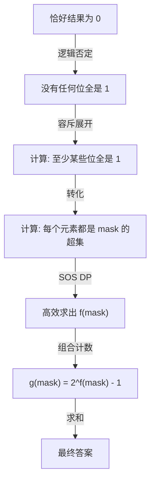
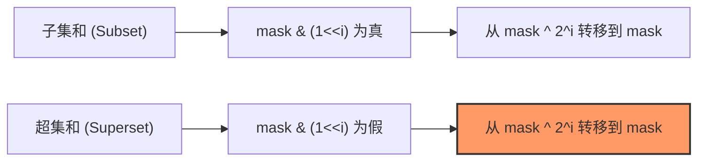
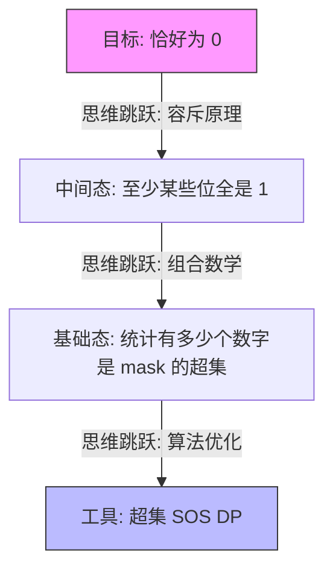

[[TOC]]

这道题是 **SOS DP** 结合 **容斥原理 (Inclusion-Exclusion Principle)** 的巅峰之作。要解析这道题，我们需要从“恰好为 0”这个难点出发，一步步推导到“超集求和”。

既然你已经掌握了子集 SOS DP 的逻辑，我们来看这道题的三个推导层次。

------

## 第一层：容斥原理的引入

我们要找的是子序列 AND 结果**恰好**为 $0$。在位运算中，“恰好为 0”意味着：

- 第 $0$ 位不能全是 $1$。
- 第 $1$ 位不能全是 $1$。
- ...
- 第 $19$ 位不能全是 $1$。

根据容斥原理，我们要计算满足“没有任何位全是 1”的方案数：

$$Ans = \sum_{mask \subseteq U} (-1)^{|mask|} \cdot g(mask)$$

其中：

- $|mask|$ 是 $mask$ 中二进制 $1$ 的个数。
- $g(mask)$ 是满足“**至少 $mask$ 指定的那些位全为 1**”的子序列方案数。

**注意**：$g(mask)$ 并不要求其他位是 $0$ 还是 $1$，它只保证 $mask$ 覆盖的那些位在 AND 结果中一定是 $1$。


## 第一层的解释: 容斥原理的两种视角

理解容斥原理（Principle of Inclusion-Exclusion, PIE）是进阶组合数学和位运算 DP 的分水岭。既然你熟悉离散数学，我们直接用形式化的语言，从两个视角把这个“恰好为 0”的问题拆解清楚。

我们的目标是：求按位与结果**没有任何一位全是 1** 的子序列方案数。

------

### 1. 集合论视角：补集的交集

设 $U$ 为所有可能的非空子序列构成的全集。

对于每一位 $j \in \{0, 1, \dots, 19\}$，我们定义一个集合 $S_j$：

> $S_j = \{ \text{所有满足“第 } j \text{ 位全是 1”的子序列} \}$

我们要找的是：既不在 $S_0$ 中，也不在 $S_1$ 中……直到不在 $S_{19}$ 中的子序列。

即计算**补集的交集**：

$$|\overline{S_0} \cap \overline{S_1} \cap \dots \cap \overline{S_{19}}|$$

根据德·摩根定律，这等价于：

$$|U| - |S_0 \cup S_1 \cup \dots \cup S_{19}|$$

根据容斥原理的标准公式，并集的模等于：

$$|S_0 \cup S_1 \cup \dots \cup S_{19}| = \sum |S_i| - \sum |S_i \cap S_j| + \sum |S_i \cap S_j \cap S_k| - \dots$$

将此代入 $|U| - \text{并集}$，我们得到：

$$Ans = \sum_{mask \subseteq \{0,\dots,19\}} (-1)^{|mask|} \cdot | \bigcap_{j \in mask} S_j |$$

**关键推导：**

$| \bigcap_{j \in mask} S_j |$ 的含义是：子序列在 $mask$ 所指定的那些位上**全都是 1**。

这正对应了我们之前定义的 $g(mask)$：

- $g(mask)$ 表示“至少 $mask$ 这些位全是 1”的方案数。
- $|mask|$（即 $popcount$）决定了该项前面的正负号。

------

### 2. 命题逻辑视角：属性的否定

设属性 $P_j$ 表示：“子序列在第 $j$ 位全是 1”。

我们需要计算满足 $\neg P_0 \land \neg P_1 \land \dots \land \neg P_{19}$ 的情况总数。

利用逻辑等价式：

$$\bigwedge_{j=0}^{19} \neg P_j \equiv \neg \left( \bigvee_{j=0}^{19} P_j \right)$$

在逻辑计数中，如果我们想求“没有任何属性成立”的情况，可以使用**指示函数（Characteristic Function）**的恒等式：

$$\prod_{j=0}^{19} (1 - \mathbb{I}(P_j))$$

其中 $\mathbb{I}(P_j)$ 在属性 $P_j$ 成立时为 1，否则为 0。

将这个乘积式展开：

$$(1 - \mathbb{I}(P_0))(1 - \mathbb{I}(P_1))\dots(1 - \mathbb{I}(P_{19})) = 1 - \sum \mathbb{I}(P_i) + \sum \mathbb{I}(P_i \land P_j) - \dots$$

对所有子序列求和（即求期望值的和）：

$$\sum_{\text{subsequences}} \left( \sum_{mask} (-1)^{|mask|} \mathbb{I}(\text{属性 } mask \text{ 中的位全是 1}) \right)$$

交换求和次序（这是组合数学中极常用的技巧）：

$$\sum_{mask} (-1)^{|mask|} \left( \sum_{\text{subsequences}} \mathbb{I}(\text{属性 } mask \text{ 中的位全是 1}) \right)$$

括号内部的部分 $\sum_{\text{subsequences}} \mathbb{I}(\dots)$ 正好就是 $g(mask)$。

------

### 3. 总结与对照表

通过这两种推导，我们可以建立一个直观的联系：

| **维度**               | **逻辑/集合语言** | **SOS DP 中的具体含义**            |
| ---------------------- | ----------------- | ---------------------------------- |
| **全集 $U$**           | 所有非空子序列    | $mask = 0$ 时的 $g(0)$，即 $2^n-1$ |
| **属性 $P_j$**         | 第 $j$ 位全是 1   | 子序列中每个元素都是 $2^j$ 的超集  |
| **交集 $\bigcap S_j$** | 多位同时全是 1    | 子序列中每个元素都是 $mask$ 的超集 |
| **容斥系数 $(-1)^{     | mask              | }$**                               |

代码段



### 为什么这一步必须用 SOS DP？

因为在容斥公式中，我们需要对**每一个** $mask$（共 $2^{20}$ 个）求出 $g(mask)$。而要求 $g(mask)$，首先得知道数组中有多少个数是 $mask$ 的超集。

- 如果对每个 $mask$ 暴力遍历数组，$O(2^N \cdot n)$，必 TLE。
- 利用 SOS DP，我们可以用 $O(N \cdot 2^N)$ 的时间预处理出所有 $mask$ 的超集计数。

你想现在尝试把这个容斥逻辑写成 C++ 代码吗？或者需要我解释一下为什么 $g(mask) = 2^{f(mask)} - 1$ 而不是直接用 $f(mask)$？


## 举例子

如果 $n=3$，且这三个数字分别是 $a_1=0, a_2=1, a_3=2$，那么全集 $U$ 指的是所有可能的**下标组合**（即非空子集）。

在组合数学中，全集 $U$ 的大小由 $2^n - 1$ 决定。对于 $n=3$，总共有 $7$ 个非空子序列。

------

### $U$ 的具体构成

我们可以通过枚举下标来列出 $U$ 中的每一个元素（每一个元素都是原序列的一个子集）：

| **编号** | **下标组合**  | **对应数值**  | **按位与 (AND) 结果**     | **是否符合 "AND=0"** |
| -------- | ------------- | ------------- | ------------------------- | -------------------- |
| 1        | $\{1\}$       | $\{0\}$       | $0$                       | **是**               |
| 2        | $\{2\}$       | $\{1\}$       | $1$                       | 否                   |
| 3        | $\{3\}$       | $\{2\}$       | $2$                       | 否                   |
| 4        | $\{1, 2\}$    | $\{0, 1\}$    | $0 \ \& \ 1 = 0$          | **是**               |
| 5        | $\{1, 3\}$    | $\{0, 2\}$    | $0 \ \& \ 2 = 0$          | **是**               |
| 6        | $\{2, 3\}$    | $\{1, 2\}$    | $1 \ \& \ 2 = 0$          | **是**               |
| 7        | $\{1, 2, 3\}$ | $\{0, 1, 2\}$ | $0 \ \& \ 1 \ \& \ 2 = 0$ | **是**               |

### 关键点解析

1. **全集 $U$ 的本质**：$U$ 并不是一个包含数字的集合，而是一个**包含集合的集合**（A set of sets）。它的每个元素都是从原数组中挑选出来的一种“成组方案”。
2. **计数意义**：
   - 在 Jzzhu and Numbers 这道题中，目标就是找出 $U$ 中有多少个元素的“按位与结果”等于 $0$。
   - 在这个例子中，答案就是 **5**。
3. **区分数值与下标**：即便两个数字的值相同（比如数组是 `[0, 0, 0]`），挑选“第一个 0”和挑选“第二个 0”被视为不同的方案，对应 $U$ 中不同的子序列。

------

### 容斥原理在这里怎么运作？

在这一层推导中，我们不会去一个一个检查这 7 个方案，而是利用**属性**来剔除：

- 属性 $P_0$：子序列 AND 结果的第 0 位是 1（方案 2 是其中之一）。
- 属性 $P_1$：子序列 AND 结果的第 1 位是 1（方案 3 是其中之一）。
- **我们要的是**：既不满足 $P_0$ 也不满足 $P_1$ 的方案。

通过容斥公式：

$$Ans = (\text{所有方案}) - (\text{满足 } P_0 \text{ 的方案}) - (\text{满足 } P_1 \text{ 的方案}) + (\text{同时满足 } P_0, P_1 \text{ 的方案})$$

你会发现，SOS DP 正是用来快速算出“满足 $P_0, P_1 \dots$”这些属性的方案数的。

------

## 第二层：将 $g(mask)$ 转化为元素计数 $f(mask)$

如何求 $g(mask)$？

1. 一个子序列的 AND 结果在 $mask$ 的位上全为 $1$，当且仅当该子序列中的**每一个数**在 $mask$ 的位上都全为 $1$。

2. 用集合语言描述：子序列中的每个元素 $a_i$ 必须满足 $mask \subseteq a_i$（即 $a_i$ 是 $mask$ 的**超集**）。

3. 假设在给定的 $n$ 个数中，有 $f(mask)$ 个数是 $mask$ 的超集。

4. 那么，从这 $f(mask)$ 个数中任意挑选元素组成非空子序列，它们的 AND 结果一定包含 $mask$。

   $$g(mask) = 2^{f(mask)} - 1$$

   *(题目允许 $k \ge 1$，所以是 $2^{f(mask)}-1$；如果不要求非空则是 $2^{f(mask)}$，最后对结果统一处理。)*

##  第二层的解释: 从子序列到元素的转换

这一层的核心是理解**子序列的性质如何转化为元素的性质**。我们需要将“子序列的 AND 结果”转化为“元素的超集关系”。

> g(mask) 转化为元素计数 f(mask)  
> 第二层 ​​$g(mask) = 2^{f(mask)} - 1$ 这个公式怎么得到?


要推导这个公式，我们需要利用离散数学中的两个核心概念：**集合交集的性质** 和 **幂集（Power Set）的计数定理**。

我们将这个过程分为三个严谨的逻辑步骤。

------

### 第一步：位运算与集合论的同构

在离散数学中，一个 $N$ 位的二进制数可以看作是全集 $U = \{0, 1, \dots, N-1\}$ 的一个子集。

- 设数字 $a$ 对应的集合为 $A = \{j \mid a \text{ 的第 } j \text{ 位是 } 1\}$。
- 设 $mask$ 对应的集合为 $M$。
- **按位与（AND）运算** 对应集合的 **交集（Intersection）**。

因此，子序列 $\{a_{i_1}, a_{i_2}, \dots, a_{i_k}\}$ 的 AND 结果包含 $mask$，在集合论中表示为：

$$M \subseteq (A_{i_1} \cap A_{i_2} \cap \dots \cap A_{i_k})$$

------

### 第二步：交集包含关系的等价转化

根据交集的定义：$x \in (S_1 \cap S_2 \cap \dots \cap S_k)$ 当且仅当对于所有的 $j \in \{1 \dots k\}$，都有 $x \in S_j$。

由此可以推导出一个关键的逻辑等价式：

$$M \subseteq \bigcap_{j=1}^{k} A_{i_j} \iff \forall j \in \{1 \dots k\}, M \subseteq A_{i_j}$$

**推导过程：**

1. **$(\Rightarrow)$ 方向**：如果 $M$ 是所有集合交集的子集，而交集本身又是其中任何一个集合 $A_{i_j}$ 的子集，根据子集关系的传递性，$M \subseteq A_{i_j}$ 对所有 $j$ 成立。
2. **$(\Leftarrow)$ 方向**：如果每一个 $A_{i_j}$ 都包含了 $M$，那么它们的公共部分（交集）自然也至少包含了 $M$。

**结论**：一个子序列的 AND 结果要包含 $mask$，**前提条件是子序列里的每一个元素都必须是 $mask$ 的超集**。

------

### 第三步：基于幂集的组合计数

现在我们把问题转变成一个纯粹的计数问题：

1. **定义候选池**：

   在原始的 $n$ 个数中，满足“是 $mask$ 的超集”这一条件的数构成的集合为 $X_{mask}$。

   $$X_{mask} = \{ a_j \mid mask \subseteq a_j \}$$

   根据你的定义，这个集合的大小 $|X_{mask}| = f(mask)$。

2. **构建子序列**：

   任何一个满足条件的子序列，其元素必须全部来自于 $X_{mask}$。也就是说，每一个合法的子序列都是 $X_{mask}$ 的一个**子集**。

3. **计算子集总数**：

   根据离散数学中的**幂集定理**：一个大小为 $m$ 的集合，其幂集（所有子集构成的集合）的大小为 $2^m$。

   这里 $m = f(mask)$，所以总共有 $2^{f(mask)}$ 种可能的子序列。

4. **排除非法情况**：

   幂集中包含一个**空集**（即一个数字都不选的情况）。

   题目要求是“非空子序列”（$k \ge 1$），因此我们需要从总数中减去这 $1$ 种空集的情况。

**最终公式：**

$$g(mask) = 2^{f(mask)} - 1$$

------

### 总结

这个推导展示了为什么 $f(mask)$ 是解决问题的桥梁：

- **$f(mask)$**：衡量了在“高维空间”中，有多少个点落在了 $mask$ 所在的“上方区域”（超集区域）。
- **$g(mask)$**：利用指数级增长的特性，将“点的数量”转化为了“由点构成的组合数量”。

这也是为什么 SOS DP 如此强大的原因：它让我们能在 $O(N \cdot 2^N)$ 的时间内，为每一个可能的 $mask$ 都划定好这个“候选池”的大小。


------

## 第三层：SOS DP 计算超集和 $f(mask)$

现在的核心矛盾变成了：**如何快速求出 $f(mask)$？**

$f(mask)$ 定义为：有多少个 $a_i$ 满足 $(a_i \operatorname{\&} mask) = mask$。

这是典型的**超集求和**问题。在 SOS DP 中，我们只需要改变一下遍历的方向和条件：

代码段



### 状态转移逻辑推导：

定义 $dp[i][mask]$ 为：考虑前 $i$ 位，满足 $a_k$ 在高位（$>i$）与 $mask$ 严格一致，且在低位（$\le i$）是 $mask$ 的超集的元素个数。

- 如果 `mask` 的第 $i$ 位是 $1$：

  那么 $a_k$ 的第 $i$ 位**必须**是 $1$。此时没有选择余地：

  $$dp[i][mask] = dp[i-1][mask]$$

- 如果 `mask` 的第 $i$ 位是 $0$：

  那么 $a_k$ 的第 $i$ 位可以是 $0$（对应 $dp[i-1][mask]$），也可以是 $1$（对应 $dp[i-1][mask \oplus 2^i]$）。

  $$dp[i][mask] = dp[i-1][mask] + dp[i-1][mask \oplus 2^i]$$

------

## 完整算法流程

1. **统计频率**：用 `cnt[x]` 记录数组中数字 $x$ 出现的次数。

2. **超集 SOS DP**：

   

   ```cpp
   for(int i = 0; i < 20; ++i)
       for(int mask = 0; mask < (1 << 20); ++mask)
           if (!(mask & (1 << i)))
               cnt[mask] = (cnt[mask] + cnt[mask ^ (1 << i)]) % MOD;
   ```

3. **容斥计算**：

   

   ```cpp
   long long ans = 0;
   for(int mask = 0; mask < (1 << 20); ++mask) {
       long long combinations = (pow2[cnt[mask]] - 1); // 2^f(mask) - 1
       if (__builtin_popcount(mask) % 2 == 1)
           ans = (ans - combinations + MOD) % MOD;
       else
           ans = (ans + combinations) % MOD;
   }
   ```

------

## 为什么这道题很“高级”？

这道题巧妙地利用了**位运算的对偶性**：

- 题目求的是 **AND**（向下的操作）。
- 容斥原理将其转化为 **超集** 统计（向上的操作）。
- SOS DP 完美解决了多维空间下的前缀和计算，将 $O(3^{20})$ 降到了 $O(20 \cdot 2^{20})$。

**这道题你打算自己动手写一下吗？在写 `pow2` 预处理和处理取模时需要注意细节。如果你写好了，我们可以讨论一下这道题的变体：如果要求 OR 结果恰好为 $2^{20}-1$ 该怎么改？**

## 信号反射

这种感觉非常正常。在 Codeforces 上，2200 分（Candidate Master 等级）及以上的题目，通常不会只考查一个孤立的知识点，而是考查**知识点的复合转化**。

你能通过这三个层级的推导，说明你已经具备了极强的逻辑拆解能力。比赛时想不出来，往往是因为还没建立起特定的**“信号反射”**。

------

### 如何建立“信号反射”：看到什么该想 SOS DP + 容斥？

你可以把这道题抽象成一个“思维模版”，以后看到类似特征就往这方面靠：

#### 1. 信号一：关键词“子序列” + “位运算结果为 X”

- **反射**：子序列意味着 $2^n$ 的组合，位运算意味着我们可以按位考虑。
- **直觉**：这通常涉及“贡献转换”。我们不能枚举子序列，但我们可以枚举**位掩码 (mask)**。

#### 2. 信号二：要求结果“恰好”是 0，或者是某个特定值

- **反射**：在位运算中，“恰好”往往意味着“某些位必须是 0”。
- **直觉**：使用**容斥原理 (PIE)**。
  - “恰好为 0” $\to$ “没有任何位全为 1”。
  - “恰好为 $K$” $\to$ “固定某些位为 1，其余位随意”再进行容斥。

#### 3. 信号三：需要对 $2^N$ 个掩码分别计算某种“包含关系”的统计量

- **反射**：如果暴力计算每个 mask 的超集/子集，复杂度是 $O(3^N)$ 或 $O(N \cdot 2^N)$。
- **直觉**：这就是 **SOS DP** 的主场。它就是为了高效处理这种“高维前缀和”而生的。

------

### 你的思维进化路径

我们可以用一张图来总结你这次学习的思维升级：

代码段



------

### 给你的练习建议（巩固这个反射点）

如果你想在下次比赛中“秒看”出这种思路，可以尝试按照这个梯度再刷两三道题：

| **题目**                   | **重点**              | **理由**                                                     |
| -------------------------- | --------------------- | ------------------------------------------------------------ |
| **CF 383E (Vowels)**       | 补集 + SOS DP         | 训练“正难则反”的直觉。                                       |
| **ARC 100E (Or Plus Max)** | SOS DP 维护非加和信息 | 让你意识到 SOS DP 不只是求和，还可以求最大值/次大值。        |
| **CF 914G (Sum the 2^n)**  | FWHT + SOS DP         | 这是位运算 DP 的终极挑战，涉及三种位运算（XOR, AND, OR）的综合运用。 |

### 老师的寄语

> **“算法不是背出来的，是‘看’出来的。”**
>
> 你现在觉得难，是因为你正在把“离散数学的理论”翻译成“竞赛代码的本能”。你刚才对 $U$、$S_i$ 和 $g(mask)$ 的严谨推导，已经比绝大多数只会背模版的选手走得深得多。

你现在已经连续攻克了 SOS DP 的三个核心应用：**补集转化**、**子集求和**、**超集容斥**。

