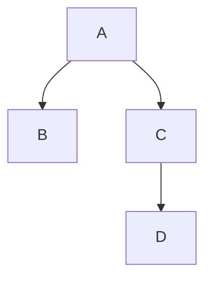

[[TOC]]

### 题意

给出同一棵二叉树的中序遍历和后序遍历，要求输出这棵树的先序遍历。

### 思路

最直接的办法是先把整棵树建出来，再做一次先序遍历。

先看一个可以直接验证想法的朴素解：

@include-code(./brute.cpp, cpp)

`brute.cpp` 用字符串切片递归建树，然后再先序遍历，适合帮助理解。

正式解没必要真的把树节点一个个建出来。关键观察是：

- 后序遍历的最后一个字符一定是根
- 在中序遍历中找到根后，左边就是左子树，右边就是右子树

这张树形图正好对应题目样例：

从图中可以直观看出：后序串 `BDCA` 的最后一个字符 `A` 是根。它把中序串切成左边 `B` 和右边 `DC` 两段。于是左子树大小就固定了，后序串里左右子树对应的区间也随之确定。

因此可以写一个区间递归函数：

- 当前后序区间 `post_l..post_r`
- 当前中序区间 `in_l..in_r`

先输出根，再递归处理左子树，最后递归处理右子树，就正好得到先序遍历。

### Python 知识

- 后序字符串的 `postfix[-1]` 直接取得根。
- 字符串切片把左右子树的中序、后序片段交给下一层。
- 递归函数返回 `根 + 左先序 + 右先序`，无需显式建树。
- `/home/rainboy/mycode/hugo-blog/content/program_language/python/input_output_and_strings.md`：字符串下标、切片与拼接。
- `/home/rainboy/mycode/hugo-blog/content/program_language/python/brute_force_validation.md`：递归分解。

### 代码

@include-code(./main.py, python)

### 复杂度

字符串查找和切片使最坏时间复杂度为 $O(n^2)$，空间复杂度为 $O(n^2)$。本题最多 8 个节点，直接切片能更清楚地展示左右子树划分。

### 总结

这题的核心就是“后序定根，中序分左右”。一旦看出这一点，先序遍历只是在递归顺序上改成“根左右”而已。

### 一图流解析

这张图把本题的建模、关键转移、实现检查和训练方法压缩到一页，适合读完正文后复盘。

