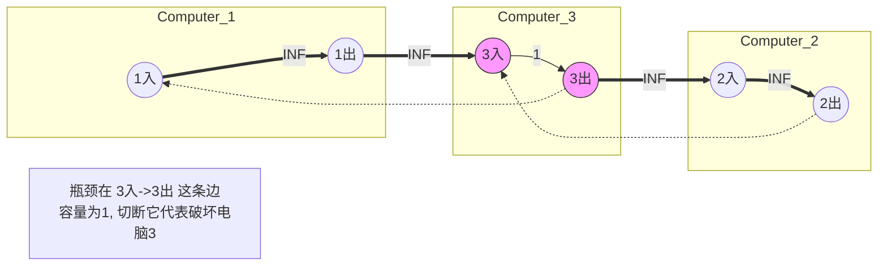

[[TOC]]

## 题目解析

这道题目 P1345 [USACO5.4] 奶牛的电信，核心在于：我们需要破坏最少的**点**（电脑），让两个特定的点（$c_1$ 和 $c_2$）无法通信。

---

### 1. 题目核心分析

#### 🎯 目标
破坏最少的**电脑（节点）**，切断 $c_1$ 到 $c_2$ 的路径。
注意：题目明确说 $c_1$ 和 $c_2$ 这两台电脑不能被破坏。

#### 💡 难点：点割 vs 边割
通常的网络流最小割模型（Max-Flow Min-Cut）是用来计算**最小割边**的（切断边的权值和最小）。
但这里要求切断的是**点**。

#### 🔑 破局关键：拆点法 (Vertex Splitting)
我们需要把“点的限制”转化为“边的限制”。
怎么做呢？我们可以把**一个点裂变成两个点**，中间连一条边。
如果我们要“破坏这个点”，在图论模型中就等价于“切断这个点内部的这条边”。

---

### 2. 图解：拆点法构建网络

假设有一个节点 $u$。
1.  我们要把它拆成 **入点 ($u_{in}$)** 和 **出点 ($u_{out}$)**。
2.  在这两点之间连一条有向边：$u_{in} \to u_{out}$。
3.  这条边的**容量（Capacity）**就是破坏这个点的代价。

#### 构建规则

我们需要构建一个新的流网络，跑最大流（Max Flow）。根据最大流最小割定理，最大流量 = 最小割容量。

1.  **点内部的连边 (Node Edge)**：
    *   对于每一个节点 $i$ ($1 \le i \le N$)，将其拆为 $i$ (入点) 和 $i+N$ (出点)。
    *   **普通电脑**：连接 $i \to i+N$，容量为 **1**。（表示破坏它只需要移除1台电脑）。
    *   **起止电脑 ($c_1, c_2$)**：题目说不能破坏。连接 $c_1 \to c_1+N$ 和 $c_2 \to c_2+N$，容量为 **INF**（无穷大，表示这条边永远切不断）。

2.  **原本的连线 (Wire Edge)**：
    *   原图中如果有边 $(u, v)$，表示线路。线路是不会坏的，只有电脑会坏。
    *   所以线路的容量也是 **INF**。
    *   但在拆点后的图中，信号是从一个电脑的“输出”传到另一个电脑的“输入”。
    *   连接 $u_{out} \to v_{in}$，即 $(u+N) \to v$，容量 **INF**。
    *   连接 $v_{out} \to u_{in}$，即 $(v+N) \to u$，容量 **INF**。

3.  **源点与汇点**：
    *   **源点 (S)**：$c_1$ 的入点（或者 $c_1$ 的出点也可以，因为中间边是 INF）。通常取 $c_1$ (即 $c_1$ 的入点)。
    *   **汇点 (T)**：$c_2$ 的出点 (即 $c_2+N$)。这意味着流必须完整走过 $c_2$ 这台机器。

#### Mermaid 图示

假设原图是 `1 -- 3 -- 2`，我们要切断 `1` 和 `2`，`3` 是中间节点。
$N=3$，拆点后变成 6 个点。

---

### 3. 代码实现

我们将使用经典的 **Dinic 算法** 来求最大流。
由于 $N$ 很小 ($100$)，Dinic 算法会飞快地跑完。

@include-code(./1.cpp,cpp)

### 4. 易错点与细节

1.  **节点编号**：
    *   因为要拆点，数组大小记得开 $2N$ 以上。
    *   `u` 对应的出点是 `u + N`。如果你的节点编号是从 0 开始的，那就是 `u + N`；如果是从 1 开始的（本题），依然是 `u + N`，只要保证不冲突即可。

2.  **源点和汇点**：
    *   最大流的源点是 $c_1$ (入点)，汇点是 $c_2+N$ (出点)。
    *   如果写成 `dinic(C1, C2)`，虽然大多数情况也能跑通（因为中间边是 INF），但逻辑上不严谨，应该涵盖整个流的路径。

3.  **INF 的设置**：
    *   $c_1, c_2$ 内部边权是 INF（因为不能被破坏）。
    *   电脑之间的连线边权是 INF（因为只能破坏电脑，不能剪断网线）。
    *   只有普通电脑内部边权是 1。

4.  **无向图处理**：
    *   题目给的是无向连接。在拆点后的图中，这意味着 $u \to v$ 和 $v \to u$ 都要建边。

