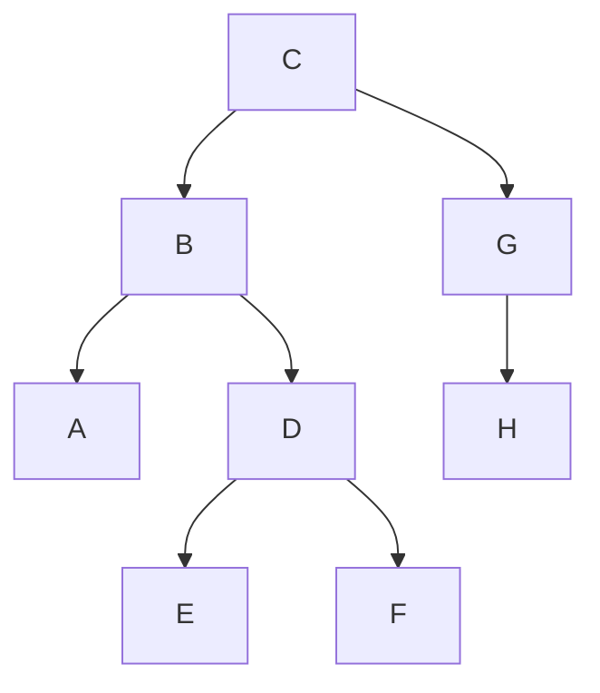

[[TOC]]

### 题意

给出同一棵二叉树的中序遍历和前序遍历，要求输出这棵树的后序遍历。

### 思路

最直接的办法是先把整棵树建出来，再做一次后序遍历。

先看一个可以直接验证想法的朴素解：

@include-code(./brute.cpp, cpp)

`brute.cpp` 用字符串切片递归建树，然后再后序遍历，适合帮助理解。

正式解没必要真的把树节点一个个建出来。关键观察是：

- 前序遍历的第一个字符一定是根
- 在中序遍历中找到根后，左边就是左子树，右边就是右子树

这张树形图正好对应题目样例：

从图中可以直观看出：根 `C` 把中序串切成左边 `ABEDF` 和右边 `HG` 两段。于是左子树大小就固定了，前序串里左右子树对应的区间也随之确定。

因此可以写一个区间递归函数：

- 当前前序区间 `pre_l..pre_r`
- 当前中序区间 `in_l..in_r`

先递归处理左子树，再递归处理右子树，最后输出根，就正好得到后序遍历。

### Python 知识

- 字符串切片直接得到左右子树的中序和前序片段，适合本题最多 26 个节点的小规模。
- 递归函数直接返回后序字符串，不需要显式创建树节点类。
- `infix.index(root)` 定位根在中序中的分割位置。
- `/home/rainboy/mycode/hugo-blog/content/program_language/python/input_output_and_strings.md`：字符串切片与不可变字符串。
- `/home/rainboy/mycode/hugo-blog/content/program_language/python/brute_force_validation.md`：递归分解状态。

### 代码

@include-code(./main.py, python)

### 复杂度

字符串 `index` 和切片使最坏时间复杂度为 $O(n^2)$；递归和切片的最坏空间复杂度为 $O(n^2)$。本题 $n\leqslant26$，这种写法更便于学习遍历关系。

### 总结

这题的核心就是“前序定根，中序分左右”。一旦看出这一点，后序遍历只是在递归顺序上改成“左右根”而已。

### 一图流解析

这张图把本题的建模、关键转移、实现检查和训练方法压缩到一页，适合读完正文后复盘。

