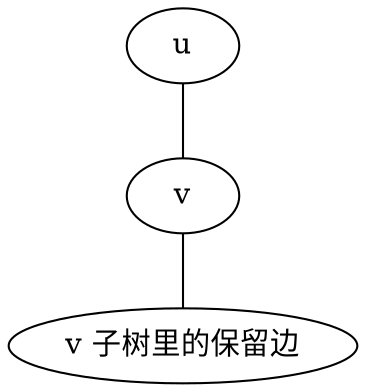

[[TOC]]

### 题意

给一棵树，每条边上有若干苹果。

现在恰好保留 `Q` 条边，要求保留下来的这些边仍然和根 `1` 连通，并使留下的苹果数最大。

### 思路

先看一个可以直接验证想法的朴素解：

@include-code(./brute.cpp, cpp)

`brute.cpp` 把每条边看成一个 01 选择：`chosen[i] = 0/1` 表示不保留或保留。递归先生成完整选择，叶子节点再检查是否恰好保留 `Q` 条边、这些边是否都能和根连通，并统计苹果数。
这个做法完全正确，但显然不能作为正解。

这题是很标准的树上背包。

设 `dp[u][j]` 表示：

- 在 `u` 子树里
- 恰好保留 `j` 条边
- 且这些边都能通过 `u` 连回根

时能得到的最大苹果数。

为什么这个状态定义很自然？

因为如果想从儿子 `v` 子树里保留任何边，那么父边 `u-v` 本身也必须保留，否则这些边就断掉了，不能算留下。

所以合并儿子时，如果从 `v` 子树中拿 `take` 条边，那么：

- 边数会增加 `take + 1`
- 收益会增加 `dp[v][take] + w(u,v)`

于是整个过程就是一个树上的分组背包。

#### DP 转移方程

合并儿子 `v` 时，若当前 `u` 已经保留 `used` 条边，从 `v` 子树保留 `take` 条边，则：

$$
dp[u][used+take+1] =
\max(dp[u][used+take+1],\ dp[u][used]+dp[v][take]+w(u,v))
$$

这里的 `+1` 就是必须额外保留父边 `u-v`。

下面这张图可以帮助理解“为什么父边也必须保留”：

如果你想让 `X` 这部分苹果还能连到根，那么 `U-V` 这条边一定不能剪掉。
这正是转移里 `+1` 的来源。

### 代码

@include-code(./main.cpp, cpp)

### 复杂度

本题 `N <= 100`，树上背包总复杂度是 `O(N^3)`，空间复杂度是 `O(N^2)`。

### 总结

这题最关键的理解就是：

- 儿子子树里的边如果想保留下来，父边也必须一起保留

看清这一点后，状态设计和转移都会非常自然。

### 一图流解析

这张图把本题的建模、关键转移、实现检查和训练方法压缩到一页，适合读完正文后复盘。

