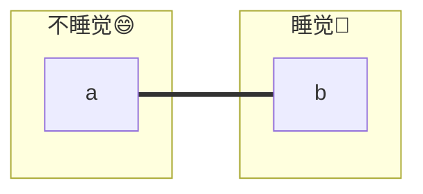
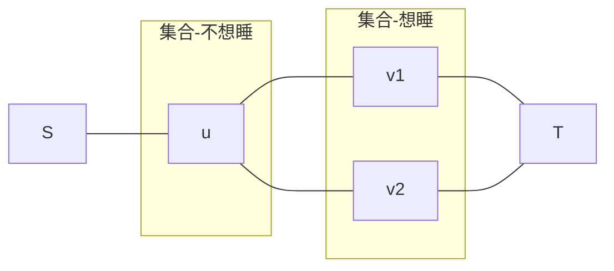

[[TOC]]

## 题目解析

> 思考:  
> 核心: 有冲突,怎么选冲突最小

算样例

```
3 3
1 0 0
1 2
1 3
3 2
```

> 如果不考虑朋友的限制, 那么这个题目就是贪心: 答案恒等于0  
> 但是要考虑和朋友选的是否一样  
>
> !! 💡 考虑到最简单的情况: 发现 只有a b 两个人是朋友 且 选则不一样的时候才会有冲突 !!!


证明:

1. $p$ : a,b 不是好朋友,则 a,b 不可能发生冲突
2. $q$ : a,b 是好朋友 且 a,b的选择一样,则 a,b 不可能发生冲突

- 显然: $p \lor q$ 则 a,b 不可能发生冲突, 
- $\neg (p \lor q) \Leftrightarrow \neg p \land \neg q$ ??? 这里有问题

------

这道题的本质是一个**二者择一的最小化问题**，在离散数学中，这对应于**布尔格（Boolean Lattice）的划分问题**。

------

## 🧠 离散数学模块：理解题目本质

### 1. 逻辑算子与集合划分

我们将 $n$ 个小朋友映射为集合 $V = \{x_1, x_2, \dots, x_n\}$。每个小朋友的状态是一个布尔变量 $v_i \in \{0, 1\}$。

> 既然是二元选择,那么选择后肯定是两个集合

定义两个相互排斥的集合（划分为两个等价类）：

- $S = \{x_i \mid v_i = 1\}$ (最终决定睡觉的人)
- $T = \{x_i \mid v_i = 0\}$ (最终决定不睡觉的人)

### 2. 冲突函数的谓词逻辑表示

题目定义的“冲突数” $C$ 是两个谓词逻辑项的并集：

- **意愿背离项 ($C_1$)**: $\sum_{i=1}^n [v_i \neq \text{original}_i]$
  - 若原本想睡 ($1$) 却归入 $T$，或原本不想睡 ($0$) 却归入 $S$，产生 $1$ 单位代价。
- **朋友矛盾项 ($C_2$)**: $\sum_{(i,j) \in E} [v_i \neq v_j]$
  - 若 $(i,j)$ 是朋友且被划分到了不同的集合 ($S$ 和 $T$)，产生 $1$ 单位代价。

### 3. 修正你的逻辑推导

你提到的 $\neg (p \lor q)$ 只是揭示了“朋友间产生冲突”的条件。要推导出**最小割模型**，我们需要构建一个**耗散函数 (Cost Function)**。

设 $A$ 为原意愿为 1 的集合，$B$ 为原意愿为 0 的集合。

最小化目标：

$$min \left( \sum_{i \in A} [x_i \in T] + \sum_{j \in B} [x_j \in S] + \sum_{(u,v) \in E} [u \in S \land v \in T \text{ or } u \in T \land v \in S] \right)$$

这在图论中完美对应了**源点 $S$（代表 1）与汇点 $T$（代表 0）之间的割**。

------

## 📊 动态训练营：模型转换 (Min-Cut)

为了最小化冲突，我们构造如下容量网络：

1. **意愿约束**：
   - 若小朋友 $i$ 意愿为 $1$：连边 $(S, i)$，容量为 $1$。割断此边表示“背离意愿”，代价为 $1$。
   - 若小朋友 $i$ 意愿为 $0$：连边 $(i, T)$，容量为 $1$。割断此边表示“背离意愿”，代价为 $1$。
2. **关系约束**：
   - 若 $i, j$ 是朋友：连**双向边** $(i, j)$，容量为 $1$。
   - **关键逻辑**：一旦 $i \in \text{源点集}$ 且 $j \in \text{汇点集}$（即两人选得不一样），跨越切口的边 $(i, j)$ 就会被计入割。

------

## 📶 信号反射 & 思维模板

### 1. 关键信号 (Key Signals)

- **二元选择**：题目要求在两个对立的状态（睡觉/不睡觉）中做出选择。
- **最小化损失/冲突**：这种“代价最小化”且带有“约束关联”的特征是典型的最小割信号。
- **关系边**：朋友关系 $(i,j)$ 产生的代价与绝对位置无关，仅与 $i, j$ 是否属于**同一集合**有关。

### 2. 逻辑跃迁 (Logic Jump)

从“好朋友选择不同产生冲突”转换到“图的切分”。

- **直觉**：把“睡觉”看作南极，“不睡觉”看作北极。
- **跃迁点**：我们要把所有点拉向两极。如果一对朋友被拉向了不同的极点，他们之间的连线就会被“撕断”。撕断连线所需的力（容量）就是冲突代价。

### 3. 模式识别 (Pattern Recognition)

以后看到 **“$n$ 个元素做二选一决策 + 元素间存在违背关系的成本 + 元素自身选择的固有成本”**，本能反应就应该是 **“最小割 (Min-Cut = Max-Flow)”**。

------

**教练点评：**

你对离散数学的敏感度很高。记住，在这种题目里，**“冲突”等价于“割边”**。逻辑推导的终点应该是证明：**每一个合法的投票方案都唯一对应图的一个割，且方案的冲突数等于割的容量。**

## 我的最终理解

最小化

$$min \left( \sum_{i \in A} [x_i \in T] + \sum_{j \in B} [x_j \in S] + \sum_{(u,v) \in E} [u \in S \land v \in T \text{ or } u \in T \land v \in S] \right)$$



1. 每次都要做选择
   1. u,v 选择哪个集合
   2. 朋友是否在用一个集合
2. 割完美映射了**选择**

**“冲突”等价于“割边”**。逻辑推导的终点应该是证明：**每一个合法的投票方案都唯一对应图的一个割，且方案的冲突数等于割的容量。**

## 📶 信号反射 & 思维模板

- **关键信号 (Key Signals)**：
  - “$N$ 个点二选一”、“最小冲突数”、“朋友/邻居间限制”。
  - 数据范围 $N \le 300$，这是明显的网络流复杂度信号。
- **逻辑跃迁 (Logic Jump)**：
  - 看到“不同则产生代价”，立刻联想到**切断连接两个不同状态集合的边**。
  - 将原本的意愿视为与源/汇点的“引力”，将朋友关系视为点与点之间的“粘性”。
- **模式识别 (Pattern Recognition)**：
  - 以后看到 **“二元状态分配 + 违背意愿代价 + 邻接状态冲突代价”**，本能反应就应该是 **“最小割建模，$S$ 连意愿 $1$，$T$ 连意愿 $0$，朋友连双向边”**。

## 代码 

@include-code(./1.cpp, cpp)

