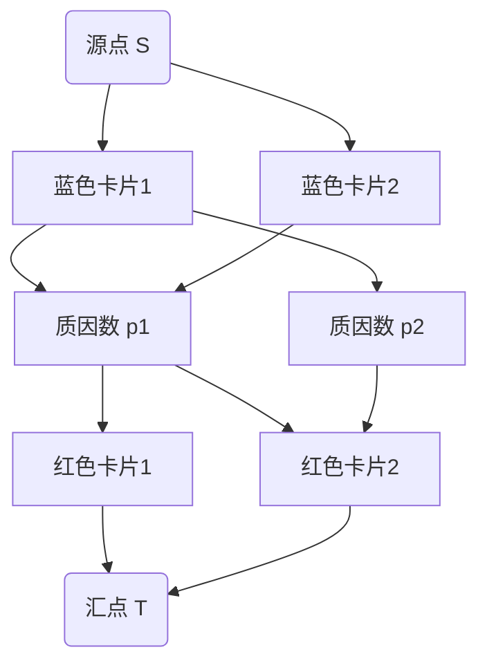

[[TOC]]

## 题目解析


我们有 $m$ 张蓝色卡片和 $n$ 张红色卡片，每张卡片上有一个大于 1 的整数。每次可以拿走一张蓝色卡片和一张红色卡片组成一组，要求这两张卡片上的数字**最大公约数大于 1**。问最多可以拿走多少组卡片。

### 关键点
- 每次只能拿走**一蓝一红**两张卡片
- 这两张卡片的数字必须有**公共的质因数**（因为 gcd > 1）
- 每张卡片只能被使用一次

## 问题转化

这是一个典型的**二分图最大匹配**问题：
- 左侧：所有蓝色卡片
- 右侧：所有红色卡片
- 边：如果蓝色卡片 $b_i$ 和红色卡片 $r_j$ 的 gcd > 1，则它们之间有一条边

我们需要找到最多的匹配对数。

## 算法设计

### 方法一：直接建图 + 最大流（代码1）
这是最直观的方法，直接将蓝色卡片和红色卡片作为二分图的两部分，用最大流求解。

**建图方式：**


1. 源点 S 连接所有蓝色卡片，容量为 1
2. 所有红色卡片连接汇点 T，容量为 1
3. 如果蓝色卡片 i 和红色卡片 j 的 gcd > 1，则从蓝色 i 到红色 j 连一条容量为 1 的边

**复杂度分析：**
- 节点数：$m + n + 2 ≈ 1002$
- 边数：最坏 $m × n = 250,000$（当 m=n=500 时）
- 使用 Dinic 算法，在二分图中的复杂度约为 $O(E√V) ≈ 250,000 × √1000 ≈ 8 × 10^6$

这个方法虽然简单，但边数较多，在 T=100 组数据时可能达到临界。

### 方法二：质因数分解优化建图（代码2）
更高效的方法是利用**质因数作为中间节点**。

**核心思想：** 两张卡片匹配的条件是它们有公共质因数。我们可以通过质因数节点来连接蓝色和红色卡片。

**建图方式：**


1. 源点 S → 每张蓝色卡片（容量 1）
2. 蓝色卡片 → 该卡片数字的所有质因数节点（容量 1）
3. 质因数节点 → 拥有该质因数的红色卡片（容量 1）
4. 红色卡片 → 汇点 T（容量 1）

**为什么这样是正确的？**
- 从 S 到 T 的一条流路径代表一组匹配：S → 蓝色 → 质因数 → 红色 → T
- 只有当蓝色和红色有公共质因数时，才可能存在这样的路径
- 每条边容量为 1，保证了每张卡片只被使用一次

> !!! 质数这一层 条件了一个 blue 选择 red 的限制条件 : 拥有同一个 质因子: 
> 
> 这是一种通用的 有条件的二分图匹配的处理方式

**优点：**
- 边数大大减少：每张卡片最多有 8 个质因数（因为 $2×3×5×7×11×13×17×19 > 10^7$）
- 总边数从 $O(mn)$ 降到 $O((m+n)×8)$

## 代码解析（以优化版本为例）

### 1. 预处理质数表
```cpp
void get_primes_euler(int n) {
    is_composite.assign(n+5,0);
    primes.clear();
    for (int i = 2; i <= n; i++) {
        if (!is_composite[i]) primes.push_back(i);
        for (int p : primes) {
            if (1LL * p * i > n) break;
            is_composite[i * p] = true;
            if (i % p == 0) break;  // 关键优化
        }
    }
}
```
- 使用欧拉筛法，时间复杂度 $O(n)$
- 筛到 $10^7$，因为卡片数字最大为 $10^7$

### 2. 质因数分解
```cpp
void get_factors(int x) {
    facs.clear();
    for (int p : primes) {
        if (p * p > x) break;  // 只需检查到 sqrt(x)
        if (x % p == 0) {
            facs.push_back(p);
            while (x % p == 0) x /= p;  // 除尽该质因数
        }
    }
    if (x > 1) facs.push_back(x);  // 剩余的大质数
}
```
- 只使用预处理好的质数表进行试除
- 时间复杂度 $O(\text{质数个数}) ≈ O(\sqrt{10^7})$

### 3. 网络流建图
```cpp
// 节点编号分配
int s = 0, t = 1;  // 源点、汇点
int blue_start = 2;  // 蓝色卡片从 2 开始
int red_start = m + 2;  // 红色卡片
int prime_start = m + n + 2;  // 质因数节点动态分配

// 蓝色卡片：S → Blue
for (int i = 1; i <= m; i++) {
    dinic.addEdge(s, blue_start + i - 1, 1);
    // 分解质因数，连接 Blue → Prime
    get_factors(blue_val);
    for (int p : facs) {
        if (!p_to_id.count(p)) 
            p_to_id[p] = prime_start++;  // 新质因数节点
        dinic.addEdge(blue_start + i - 1, p_to_id[p], 1);
    }
}

// 红色卡片：Prime → Red → T
for (int i = 1; i <= n; i++) {
    dinic.addEdge(red_start + i - 1, t, 1);
    get_factors(red_val);
    for (int p : facs) {
        if (!p_to_id.count(p))
            p_to_id[p] = prime_start++;
        dinic.addEdge(p_to_id[p], red_start + i - 1, 1);
    }
}
```

### 4. 最大流计算
使用 Dinic 算法计算从 S 到 T 的最大流，即为最大匹配数。

## 复杂度分析

| 步骤 | 时间复杂度 | 说明 |
|------|-----------|------|
| 预处理质数表 | $O(10^7)$ | 只需执行一次 |
| 每组数据分解质因数 | $O((m+n) × \sqrt{10^7})$ | 每张卡片分解约 446 次试除 |
| 网络流 Dinic | $O(E√V)$ | 节点数约 9000，边数约 9000 |

总复杂度在可接受范围内，能通过 T=100 组数据。

## 关键细节

1. **质因数去重**：分解质因数时，同一个质因数只记录一次
2. **质因数节点共享**：不同卡片可能有相同质因数，使用 `map` 记录质因数对应的节点编号
3. **大质数处理**：如果试除后剩下的数 > 1，它本身也是质因数
4. **数组大小**：合理估算最大节点数和边数，避免 RE

## 示例分析

以样例第一组数据为例：
```
4 3
2 6 6 15
2 3 5
```

**质因数分解：**
- 蓝色：2→{2}, 6→{2,3}, 6→{2,3}, 15→{3,5}
- 红色：2→{2}, 3→{3}, 5→{5}

**可能的匹配：**
- 蓝色2(6) ↔ 红色2(3) [通过质因数3]
- 蓝色3(6) ↔ 红色2(3) [通过质因数3]
- 蓝色4(15) ↔ 红色3(5) [通过质因数5]
- 蓝色1(2) ↔ 红色1(2) [通过质因数2]

但每张红色卡片只能匹配一次，所以最大匹配为 3。

## 总结

这道题的关键在于：
1. 将卡片匹配问题转化为二分图最大匹配
2. 使用质因数作为中间节点优化建图，减少边数
3. 熟练掌握质因数分解和网络流算法

通过这种方法，即使 m,n 达到 500，也能高效求解。

## 代码 1

@include-code(./1.cpp, cpp)


## 代码 2

@include-code(./2.cpp, cpp)

