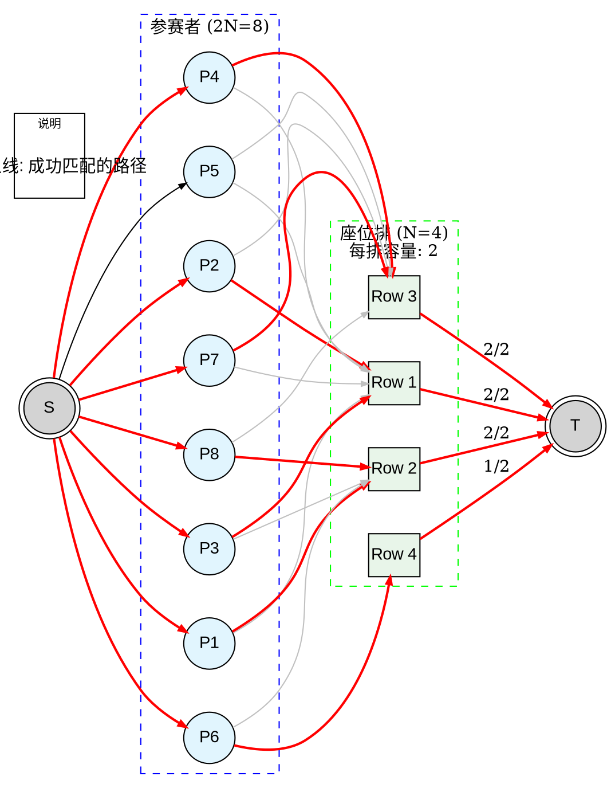

[[TOC]]

## 题目解析


这道题目是典型的 **二分图最大匹配** 问题，或者更准确地说是 **二分图多重匹配** 问题（因为右边的每个节点容量为2）。

1.  **左侧节点（人）**：有 $2N$ 个人，每个人都有两个想坐的排数选择。
2.  **右侧节点（座位排）**：有 $N$ 排座位，每排座位最多能坐 **2** 个人。
3.  **边（Edge）**：如果某个人想坐第 $i$ 排，就在该人与第 $i$ 排之间连一条边。
4.  **目标**：选择尽可能多的边，使得每个人最多连一条边（只能坐一个位置），每排最多连两条边（每排坐两人）。

### 样例数据分析

**输入：**
```
4        (N=4, 所以有4排座位，8个人)
1 2      (Person 1: 想坐 Row 1 或 Row 2)
1 3      (Person 2: 想坐 Row 1 或 Row 3)
1 2      (Person 3: 想坐 Row 1 或 Row 2)
1 3      (Person 4: 想坐 Row 1 或 Row 3)
1 3      (Person 5: 想坐 Row 1 或 Row 3)
2 4      (Person 6: 想坐 Row 2 或 Row 4)
1 3      (Person 7: 想坐 Row 1 或 Row 3)
2 3      (Person 8: 想坐 Row 2 或 Row 3)
```

**输出：**
```
7
```
这意味着最多有7个人能坐到满意的座位。

### 图形绘制 (Graphviz)

为了清晰展示，我将使用网络流的视角来构建这个图：
*   **源点 S** 连接所有人，容量为1（每个人只能坐一个位置）。
*   **汇点 T** 连接所有排，容量为2（每排能坐两人）。
*   人与排之间容量为1。
*   我在图中会标出一种可能的最大流路径（红色边），使得总流量为7。



### 方案解释
在这个可能的解法中，共有7人被满足：
*   **Row 1 (满)**: 坐了 P2, P3
*   **Row 2 (满)**: 坐了 P1, P8
*   **Row 3 (满)**: 坐了 P4, P7
*   **Row 4 (半满)**: 坐了 P6
*   **未满足**: P5 (因为他想去的 Row 1 和 Row 3 都坐满了)

总计：$2+2+2+1 = 7$。


## 建模思路

我们将问题转化为网络流模型：

1. **节点划分**：
   - **源点 $S$**：代表流量的起点。
   - **人节点 ($1 \dots 2N$)**：代表 $2N$ 个参赛者。
   - **座位排行节点 ($1 \dots N$)**：代表 $N$ 排座位。
   - **汇点 $T$**：代表匹配成功。
2. **建边策略**：
   - **源点 $\to$ 人**：
     - 从 $S$ 向每个“人节点”连一条边。
     - **容量为 1**：表示每个人只能被安排一个位置。
   - **人 $\to$ 座位排**：
     - 如果第 $i$ 个人想坐第 $u$ 排或第 $v$ 排，则从“人节点 $i$”分别向“座位排节点 $u$”和“座位排节点 $v$”连边。
     - **容量为 1**：表示这个人如果去这排，占 1 个坑。
   - **座位排 $\to$ 汇点**：
     - 从每个“座位排节点”向 $T$ 连一条边。
     - **容量为 2**：题目限制“每排座位只能坐两人”。
3. **答案**：
   - 该网络的最大流即为最多能满足的人数。

### 节点编号映射

为了在代码中方便处理，我们规定：

- $S = 0$
- 人节点：$1 \sim 2N$
- 座位排节点：$2N + 1 \sim 2N + N$
- $T = 2N + N + 1$


## 代码 

@include-code(./1.cpp, cpp)

