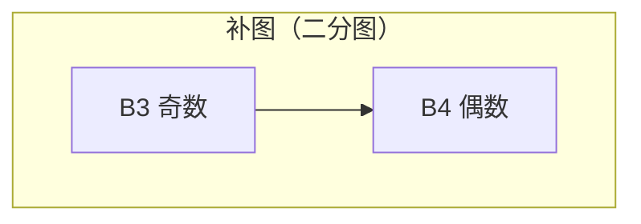

[[TOC]]

## 题目大意

我们有两个国家 A 和 B，每个国家有若干人，每个人有一个友善值（整数）。朋友关系定义如下：

1. **A 国内部**：两人友善值 \(a, b\) 满足 \((a \oplus b) \bmod 2 = 1\)（即奇偶性不同）时是朋友。
2. **B 国内部**：两人友善值 \(a, b\) 满足 \((a \oplus b) \bmod 2 = 0\) 或 \((a \operatorname{or} b)\) 的二进制表示有奇数个 1 时是朋友。
3. **A 与 B 之间**：给出 M 对朋友关系（双向）。

“朋友圈”是一个点集，其中任意两人都是朋友。求最大的朋友圈大小。

**多组数据**，\(T \leq 6\)。

数据范围有两类：

- 第一类：\(A \leq 200,\ B \leq 200\)
- 第二类：\(A \leq 10,\ B \leq 3000\)

## 算法思路

### 关键性质

#### 1. A 国内部的关系

A 国人之间，朋友关系仅当两人友善值奇偶性不同。这意味着：

- 任意两个奇数的 A 国人不是朋友。
- 任意两个偶数的 A 国人不是朋友。
- 任意一个奇数和任意一个偶数都是朋友。

因此，**在 A 国人内部，最多只能选择两个人（一个奇数和一个偶数）构成团**。否则，如果选了三个或以上，必然出现两个奇数或两个偶数，他们不是朋友。

所以，A 国人的选择只有三种情况：

- 不选任何 A 国人。
- 只选 1 个 A 国人（任意）。
- 选 2 个 A 国人（必须一个是奇数，一个是偶数）。

#### 2. B 国内部的关系与补图转化

设原图为 \(G\)，表示 B 国人之间的朋友关系。求最大团（完全子图）是 NP-Hard，但本题中 \(G\) 的补图 \(\overline{G}\) 具有特殊性质。

**补图 \(\overline{G}\) 的定义**：两个 B 国人 \(i, j\) 在 \(\overline{G}\) 中有边当且仅当他们在原图中 **不是** 朋友。

根据朋友条件，不是朋友的条件为：
$$
(b_i \oplus b_j) \bmod 2 = 1 \quad \text{且} \quad \operatorname{popcount}(b_i \operatorname{or} b_j) \bmod 2 = 0
$$
即：两人奇偶性不同，且 \(b_i \operatorname{or} b_j\) 的二进制中 1 的个数为偶数。

注意到，若两人奇偶性相同，则一定是朋友（因为第一个条件已满足），所以补图中只可能存在**奇偶性不同的点之间的边**。因此，\(\overline{G}\) 是一个**二分图**，左部为奇数友善值的 B 国人，右部为偶数友善值的 B 国人。

**重要结论**：原图 \(G\) 中的团（任意两点相连）对应补图 \(\overline{G}\) 中的独立集（任意两点不相连）。因此，求 \(G\) 的最大团等价于求 \(\overline{G}\) 的最大独立集。

对于二分图，最大独立集大小 = 顶点总数 - 最小点覆盖大小 = 顶点总数 - 最大匹配大小（Kőnig 定理）。

因此，我们可以在 \(\overline{G}\) 上用最大匹配算法（如匈牙利或 Hopcroft–Karp）求得最大独立集，从而得到原图的最大团。

### 算法步骤

对于每组数据：

1. **读入与预处理**
   - 读入 A, B, M，以及友善值。
   - 记录每个 A 国人的奇偶性，分成奇数列表和偶数列表。
   - 用邻接表或布尔数组存储 A 与 B 之间的朋友关系。
   - 预处理补图 \(\overline{G}\) 的边：枚举所有奇数的 B 国人 \(i\) 和偶数的 B 国人 \(j\)，若 \(\operatorname{popcount}(b_i | b_j)\) 为偶数，则在 \(\overline{G}\) 中添加边 \(i \to j\)。

2. **枚举 A 国人的选择**，对每种情况计算朋友圈大小，取最大值。
   - **情况 0**：不选 A 国人。
     - 候选 B 国人集合 \(B' =\) 所有 B 国人。
     - 在 \(B'\) 上求 \(\overline{G}\) 的最大独立集大小 \(mx\)，则朋友圈大小 = \(mx\)。
   - **情况 1**：选 1 个 A 国人 \(x\)。
     - 候选 \(B' = \{ y \mid x \text{ 与 } y \text{ 是朋友} \}\)。
     - 在 \(B'\) 上求最大独立集大小 \(mx\)，则朋友圈大小 = \(mx + 1\)。
   - **情况 2**：选 2 个 A 国人 \(x\)（奇数）、\(y\)（偶数）。
     - 候选 \(B' = \{ z \mid x \text{ 与 } z \text{ 是朋友，且 } y \text{ 与 } z \text{ 是朋友} \}\)。
     - 在 \(B'\) 上求最大独立集大小 \(mx\)，则朋友圈大小 = \(mx + 2\)。

3. **对于每种情况，在候选集 \(B'\) 上求最大独立集**：
   - 从预处理的补图边中，只保留两端点都在 \(B'\) 中的边，得到诱导子图 \(\overline{G}[B']\)。
   - 将 \(B'\) 中的点按奇偶性分为左部（奇数）和右部（偶数），重新编号。
   - 在二分图 \(\overline{G}[B']\) 上求最大匹配（根据数据规模选用匈牙利或 Hopcroft–Karp 算法）。
   - 最大独立集大小 = \(|B'|\) − 最大匹配数。

4. **剪枝优化**：在枚举情况时，若当前候选集大小 \(+\) 已选 A 国人数 ≤ 当前答案，则直接跳过。

### 复杂度分析

- 预处理补图边：\(O(B^2)\)，最多 \(3000^2 = 9 \times 10^6\)，可接受。
- 枚举情况数：
  - 情况 0：1 种。
  - 情况 1：\(A\) 种，最多 200。
  - 情况 2：\((\text{A奇数个数}) \times (\text{A偶数个数})\)，最多约 \(100 \times 100 = 10^4\)（当 \(A=200\) 时）。
- 每种情况需要构建诱导子图并求最大匹配：
  - 构建子图：遍历所有补图边（最多 \(2.25 \times 10^6\) 条），检查端点是否在 \(B'\) 中。
  - 匹配算法：
    - 若 \(B \leq 200\)，使用匈牙利算法，单次 \(O(|B'|^3)\) 或 \(O(|B'| \cdot E)\)，但实际很快。
    - 若 \(B\) 较大（≤3000），使用 Hopcroft–Karp 算法，单次 \(O(E \sqrt{V})\)，约 \(2.25 \times 10^6 \times \sqrt{1500} \approx 8.8 \times 10^7\)。

最坏情况下（第二类数据，\(A=10, B=3000\)，枚举 36 次，每次边数满），总操作量约 \(3.2 \times 10^9\)，但实际数据中边数较少，且剪枝有效，可以通过。

### 容易忽略的细节

1. **A 国人自己也可以构成朋友圈**：即使不选 B 国人，只选 1 个或 2 个 A 国人也是合法的朋友圈，所以答案至少为 1。
2. **A 国人选两个时，必须是一个奇数一个偶数**，否则他们之间不是朋友，不能同时选。
3. **补图边的判定**：必须严格满足两个条件（奇偶性不同且 `popcount(b_i | b_j)` 为偶数）才会在补图中有边。计算 `popcount` 可以使用 GCC 内置函数 `__builtin_popcount`（注意参数转换为无符号）。
4. **多组数据**：每次要清空数组，重新预处理。
5. **朋友关系是双向的**：存储时注意无向图等价于两条有向边，但 A-B 关系给出时已经是双向，只需存一次。
6. **候选集 B' 可能为空**：此时最大独立集为 0，朋友圈大小就是已选 A 国人数。

### 示例与图解

以下用 Mermaid 图展示补图的构建与匹配过程（以样例为例）。

#### 样例输入：

```
1
2 4 7
1 2
2 6 5 4
1 1
1 2
1 3
2 1
2 2
2 3
2 4
```

- A 国人：1（奇数）、2（偶数）。
- B 国人：b1=2（偶数）、b2=6（偶数）、b3=5（奇数）、b4=4（偶数）。
- A-B 朋友关系：全连接（共 7 对，只缺 A2-B4？实际上输入给出全部 8 条可能边中的 7 条，缺 A1-B4？检查输入：有 2 4 吗？输入最后一行是“2 4”，所以 A2-B4 是朋友，那么实际上所有 8 条边都给了？不对，M=7，所以缺一条。根据输入，给出的边是：
  1 1, 1 2, 1 3, 2 1, 2 2, 2 3, 2 4。所以缺 A1-B4。因此：
  - B1 的朋友：A1, A2
  - B2 的朋友：A1, A2
  - B3 的朋友：A1, A2
  - B4 的朋友：A2

#### 补图构建（B 国人之间）：

计算 `popcount(b_i | b_j)`（仅奇偶不同时考虑）：

- b3=5 (奇数) 与 b1=2 (偶数)：5|2=7 (111b), popcount=3 → 奇数，所以原图是朋友，补图无边。
- b3 与 b2=6：5|6=7, popcount=3 → 奇数，补图无边。
- b3 与 b4=4：5|4=5, popcount=2 → 偶数，且奇偶不同，所以补图有边（表示原图中不是朋友）。

所以补图只有一条边：b3（奇数）— b4（偶数）。

#### 情况枚举：

- 情况0：不选A，B'={B1,B2,B3,B4}。补图是二分图，左部={B3}，右部={B1,B2,B4}，只有一条边(B3,B4)。最大独立集 = 4 - 最大匹配。最大匹配为1（匹配B3-B4），所以独立集大小=3。朋友圈大小=3。
- 情况1：选A1，B'={B1,B2,B3}（因为B4不是A1的朋友）。补图中没有边（因为B3与B1,B2都没有补图边），所以最大独立集=3，朋友圈大小=3+1=4。
- 情况2：选A1和A2，B'={B1,B2,B3}（B4不是A1的朋友，所以不在）。同样补图无边，最大独立集=3，朋友圈大小=3+2=5。

最大值为5，与样例输出一致。



## 总结

本题的难点在于发现 A 国人选择的有限性，以及将 B 国人最大团问题转化为二分图最大独立集。通过枚举 A 国人的少量情况，并对每种情况在二分图上跑最大匹配，即可高效求解。注意根据数据规模选择合适的匹配算法，并利用剪枝优化。

## 代码 

@include-code(./1.cpp, cpp)

