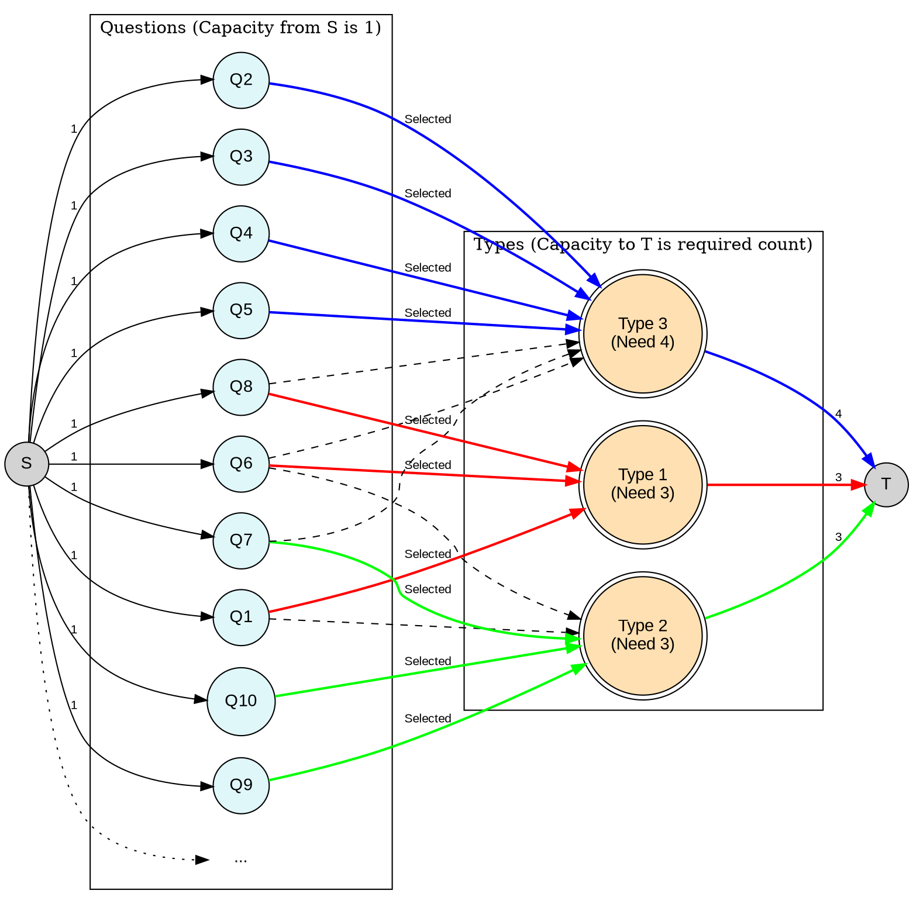

[[TOC]]

## 样例解析
这是一个经典的网络流（最大流）模型问题。我们可以将其转化为一个二部图匹配的变种，利用源点、汇点以及容量限制来解决。

### 题目分析

1.  **模型构建**：
    *   **源点 ($S$)**：提供流量。
    *   **汇点 ($T$)**：接收流量。
    *   **试题节点 ($Q_1 \dots Q_n$)**：代表题库中的每一道题。
    *   **类型节点 ($T_1 \dots T_k$)**：代表需要的题目类型。

2.  **连边规则**：
    *   **源点 -> 试题节点**：从源点 $S$ 向每一个试题节点 $Q_i$ 连一条边，容量为 $1$。这表示每道题只能被选一次。
    *   **试题节点 -> 类型节点**：如果试题 $Q_i$ 属于类型 $T_j$，则从 $Q_i$ 向 $T_j$ 连一条边，容量为 $1$。这表示这道题可以作为该类型的题目被选中。
    *   **类型节点 -> 汇点**：从每一个类型节点 $T_j$ 向汇点 $T$ 连一条边，容量为该类型需要的题目数量（输入中给出的第 $j$ 个数）。这限制了该类型最终只能选出这么多道题。

3.  **解的判定**：
    *   计算从 $S$ 到 $T$ 的最大流。
    *   如果最大流等于总共需要选出的题目数 $m$（即各类型所需题数之和），则有解。
    *   否则无解。

4.  **方案输出**：
    *   对于每一个类型节点 $T_j$，查看它的入边（来自试题节点 $Q_i$）。如果边 $(Q_i, T_j)$ 有流量（流为1），则说明试题 $i$ 被选作类型 $j$。

### 样例数据图形化

**输入样例数据分析：**
*   **k=3, n=15**
*   **需求量**: Type 1 (3题), Type 2 (3题), Type 3 (4题)。总共 $m=10$。
*   **试题属性**:
    *   Q1: [1, 2]
    *   Q2: [3]
    *   ... (以此类推)

为了图形清晰，我将简化显示部分节点和连边，重点展示流向和结构。

### Graphviz 代码

### 图形解释

1.  **左侧 (S)**：源点。
2.  **中间左侧 (Q1...Q10...)**：代表题目。
    *   从 $S$ 连向每个 $Q$ 的边容量为 1，确保每题只用一次。
3.  **中间右侧 (Type1, Type2, Type3)**：代表试题类型。
    *   边 $(Q, Type)$ 表示该题属于该类型。
    *   **红色/绿色/蓝色加粗边**：表示在这个具体的解中，这道题实际上被分配给了哪个类型（有流量经过）。
    *   **虚线边**：表示这道题虽然属于该类型，但在当前方案中没有被选中去充当该类型的题目（可能被选去充当别的类型了，或者根本没被选中）。
4.  **右侧 (T)**：汇点。
    *   从类型节点连向 $T$ 的边容量限制了该类型需要的总题数（例如 Type 3 需要 4 题）。

这个图直观地展示了题目如何“流向”对应的类型需求桶中。

## 代码 

@include-code(./1.cpp, cpp)

