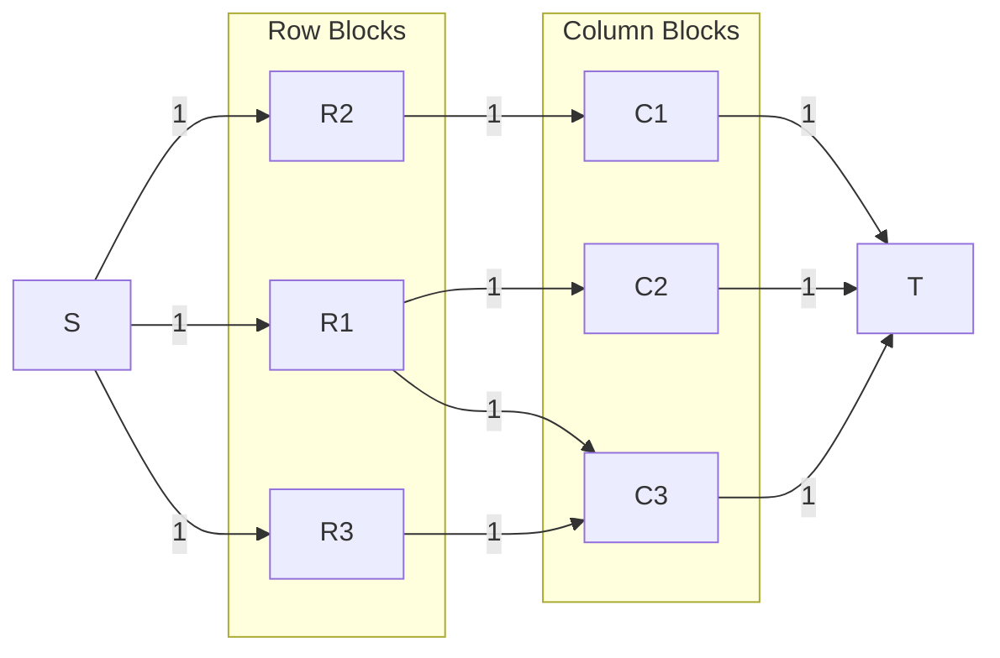
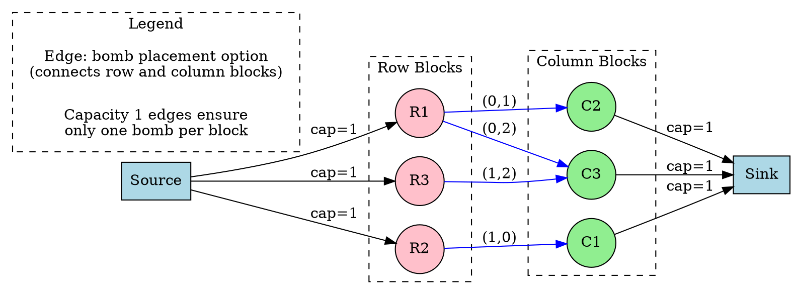
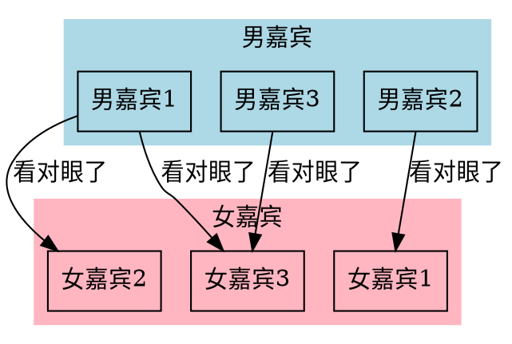
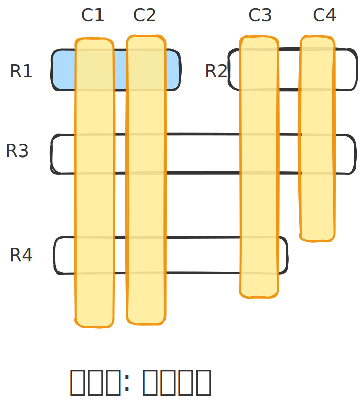

[[TOC]]

## 题目解析

## 1. 核心难点与转化

题目核心：

在一个 $N \times M$ 的网格中放炸弹，炸弹攻击范围是整行整列，但会被硬石头 # 阻挡。软石头 x 不阻挡炸弹，但也无法放置炸弹。要求放置最多的炸弹且互不攻击。

思维陷阱：

初学者容易想到使用搜索（DFS）或者状态压缩 DP。但是 $N, M \le 50$，状态压缩 DP 的复杂度 $2^{50}$ 显然不可行。DFS 也会超时。

正确思路：二分图最大匹配

我们需要转换视角。不要把“坐标点 $(r, c)$”看作节点，而是把“一段连续的可放置区域”看作节点。

### 关键点：硬石头 `#` 的切割作用

- 如果没有 `#`，一行只能放一个炸弹。
- 有了 `#`，一行可能被切成好几段，每一段都可以（且最多只能）放一个炸弹。

例如：`* * # * *`

- 左边的 `* *` 是一个独立的“行块”。
- 右边的 `* *` 是另一个独立的“行块”。
- 这两个块互不干扰，可以各放一个炸弹。

## 2. 建模步骤

### 2.1 提取“行块”与“列块”

我们可以对地图进行两次扫描：

1. **行扫描**：找出所有横向的连续块。遇到 `#` 则当前块结束，新起一块。遇到 `*` 或 `x` 则属于同一块。
2. **列扫描**：同理，找出所有纵向的连续块。

编号映射：

我们需要给每一个“行块”和每一个“列块”分配一个唯一的 ID。

假设我们扫描完后，得到了 $cntR$ 个行块，和 $cntC$ 个列块。

### 2.2 构建二分图

- **左部点（U集合）**：所有的“行块”，编号 $1 \dots cntR$。
- **右部点（V集合）**：所有的“列块”，编号 $1 \dots cntC$。
- **连边规则**：
  - 遍历地图上的每一个格子 $(i, j)$。
  - 如果该格子是 **空地 `*`**：
    - 它属于某个行块 $ID_{row}$。
    - 它同时也属于某个列块 $ID_{col}$。
    - 这意味如果我们在这里放炸弹，就同时占用了 $ID_{row}$ 和 $ID_{col}$。
    - **连边**：从 $ID_{row}$ 连向 $ID_{col}$，容量为 1。
  - 如果格子是 `x` 或 `#`，则不连边（因为不能放炸弹）。

### 2.3 网络流 / 匈牙利算法

- **源点** $S$ 连向所有 **行块**，容量 1。
- 所有 **列块** 连向 **汇点** $T$，容量 1。
- **行块** 连向 **列块**（由 `*` 产生的边），容量 1。
- **求最大流**。最大流量即为最多能放置的炸弹数。

## 3. 图解示例

**地图**：

```
# * *
* # *
```

**1. 处理行块 (Row Blocks)**：

- 第 1 行：`#` (跳过), `* *` (记为行块 R1)
- 第 2 行：`*` (记为行块 R2), `#` (分隔), `*` (记为行块 R3)
- 总行块：R1, R2, R3

**2. 处理列块 (Col Blocks)**：

- 第 1 列：`#` (跳过), `*` (记为列块 C1)
- 第 2 列：`*` (记为列块 C2), `#` (分隔) -> 下面没空地了
- 第 3 列：`*` (记为列块 C3), `*` (记为列块 C3延续) -> 也就是 `**` 是一整个列块 C3
- 总列块：C1, C2, C3

**3. 连边 (只有 `*` 处可以连边)**：

- 坐标 (0, 1) 是 `*`: 属于 R1, 属于 C2 $\rightarrow$ 连边 $R1 - C2$
- 坐标 (0, 2) 是 `*`: 属于 R1, 属于 C3 $\rightarrow$ 连边 $R1 - C3$
- 坐标 (1, 0) 是 `*`: 属于 R2, 属于 C1 $\rightarrow$ 连边 $R2 - C1$
- 坐标 (1, 2) 是 `*`: 属于 R3, 属于 C3 $\rightarrow$ 连边 $R3 - C3$
- 求解：

这是一个二分图匹配问题。求最大匹配数。






## 4. 为什么不是 MCMF (最小费用最大流)?

你在上一个问题中使用的是 MCMF，因为那个问题有“权值”（路程长度、配合优势）。

而本题只问“最多能放多少个”，没有权值/费用的概念，所以只需要普通的 最大流 (Dinic) 或者 二分图最大匹配 (匈牙利算法) 即可。

## 5. 代码实现提示 (基于 Dinic 模板)

1. 预处理 ID 数组：

   row_id[55][55] 和 col_id[55][55]。

2. 生成行 ID：

   双层循环遍历 $i, j$。如果遇到 #，当前的 ID 计数器加 1。如果遇到 * 或 x，row_id[i][j] = current_id。

3. 生成列 ID：

   同理，先遍历列 $j$，再遍历行 $i$。

4. 建图：

   $S \to$ 行块 (cap 1)

   列块 $\to T$ (cap 1)

   遍历所有 $i, j$，如果是 *：addEdge(row_id[i][j], col_id[i][j], 1)。

5. **Run Dinic**。


## 疑问

> 连边规则：
> - 遍历地图上的每一个格子 (i, j)。
> - 如果该格子是 空地 *：
> - 它属于某个行块 ID_{row}。
> - 它同时也属于某个列块 ID_{col}。
> - 这意味如果我们在这里放炸弹，就同时占用了 ID_{row} 和 ID_{col}。
> - 连边：从 ID_{row} 连向 ID_{col}，容量为 1。
> - 如果格子是 x 或 #，则不连边（因为不能放炸弹）。
> 
> -------
> 
> 我想知道,这个 连 边 代表什么含义 ? 是冲突吗?


这是一个非常深刻且直指核心的问题！

简单的回答是：**这条连边代表“放置炸弹的一个候选位置（可行方案）”，而不是冲突。**

但在二分图匹配的模型中，它的深层含义是将“位置”转化为“资源占用”的关系。为了让你彻底理解，我们把它拆解开来讲。

### 1. 边的物理含义：一次“合法的放置机会”

在这个二分图中：

- **左边的点（行块）**：代表“横向的空位资源”。（比如：第一行左边的那个空隙）
- **右边的点（列块）**：代表“纵向的空位资源”。（比如：第一列上边的那个空隙）

当你发现坐标 $(i, j)$ 是空地 `*` 时，你连接 `ID_row` $\to$ `ID_col`，这条边的含义是：

> **“坐标 $(i, j)$ 是一个合法的坑位。如果你选择在这里放炸弹，你就必须同时消耗掉它所属的【行块资源】和【列块资源】。”**

### 2. 为什么不是“冲突”？

在图论中，通常有两种建模思路，不要混淆：

1. **冲突图（Conflict Graph）**：
   - 节点是“位置”，边代表“互相排斥”。
   - 例如：位置 A 和位置 B 不能同时放，就连一条边。
   - 目标是求**最大独立集**（很难，通常是 NP-hard）。
2. **匹配图（Matching Graph / Bipartite Graph）** —— **本题是这种！**
   - 节点是“资源限制”（行块、列块）。
   - 边是“可以做的事情”（放炸弹）。
   - **连边代表“利用”**：利用 Row 资源和 Col 资源可以生成一个炸弹。

### 3. 如何通过“连边”解决“冲突”？

你可能会问：“如果不代表冲突，那怎么保证炸弹不互相炸到呢？”

答案在于流量限制（容量），而不是边的存在。

请看这个逻辑链条：

1. **源点限制**：源点 $S \to$ 行块 $A$，容量为 1。
   - 这意味着：**行块 A 最多只能被用一次**（最多只能放一个炸弹）。
2. **汇点限制**：列块 $B \to$ 汇点 $T$，容量为 1。
   - 这意味着：**列块 B 最多只能被用一次**。
3. **中间连边**：行块 $A \to$ 列块 $B$（代表位置 $(i, j)$）。

场景模拟：

假设同一行块 $A$ 里有两个空地：位置 $(i, j_1)$ 和 位置 $(i, j_2)$。

- 位置 $(i, j_1)$ 对应边：行块 $A \to$ 列块 $B$。
- 位置 $(i, j_2)$ 对应边：行块 $A \to$ 列块 $C$。

因为 **源点 $\to$ 行块 $A$** 的流量只有 1，所以流（Flow）只能二选一：

- 要么流向列块 $B$（在 $j_1$ 放炸弹）。
- 要么流向列块 $C$（在 $j_2$ 放炸弹）。
- **绝不可能同时流向两者**。

**结论**：

- **连边**代表：**“我可以在这里放炸弹”**。
- **容量（流）**代表：**“互斥关系”**（同一个行块只能供养一个炸弹）。

### 4. 举个生动的例子

想象这是一个 **相亲大会**：

- **左边的点（行块）** = **男嘉宾**（比如 1号男嘉宾）。
- **右边的点（列块）** = **女嘉宾**（比如 2号女嘉宾）。
- **地图上的 `*` (空地)** = **两人看对眼了**（有缘分，可以配对）。

连边的含义：

> 如果 1号男 和 2号女 在地图交叉点是 `*`，说明他们**可以**牵手。

冲突的解决：

> 因为这是一夫一妻制（最大匹配），1号男嘉宾一旦选择了 2号女嘉宾（流量流过这条边），他就不能再选别人了，2号女嘉宾也不能再选别人了。



### 总结

- **`*` (空地)**：代表**机遇**。在二分图中变成一条边，连接了它占用的“行资源”和“列资源”。
- **`x` 或 `#`**：代表**不可行**。没有边，流就流不过去，自然永远不会在那里放炸弹。

这是一种将 **“几何位置排斥问题”** 转化为 **“资源分配问题”** 的经典建模手段。


## 思考与理解



- R1 的可行区域只能放一个Bomb(显然)
- R1 可以选择 C1 或 C2,这两个位置放
  - 如果 R1 选择了 C1
  - 那么 R3 R4 就不能选择 C1 
- 这显然是一种**选择冲突**
- 问题: **不能冲突的最大匹配**

## 代码 

@include-code(./1.cpp, cpp)

