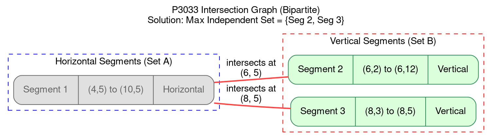
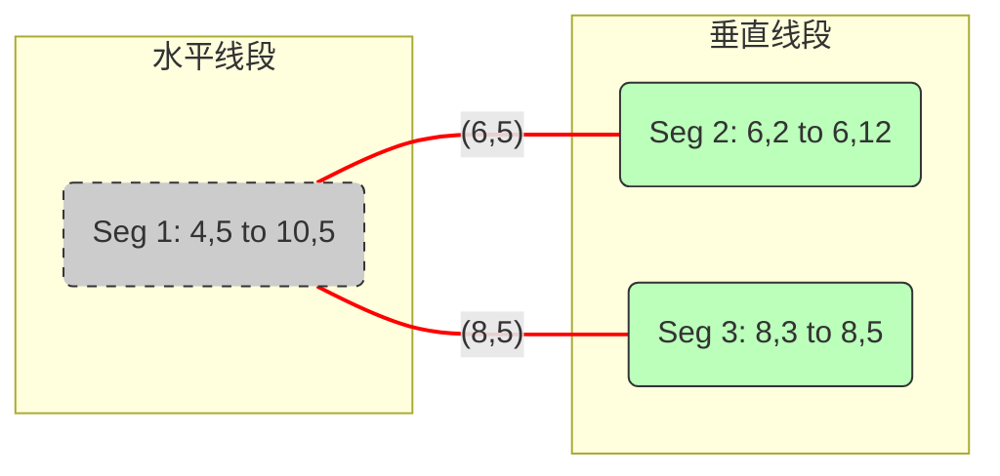

[[TOC]]

## 1. 题目核心分析

**问题描述**： 给出 $N$ 条线段，这些线段要么是水平的，要么是垂直的。 题目保证：水平线段之间互不相交，垂直线段之间互不相交。 **目标**：选择尽可能多的线段，使得它们互不相交。

**转化**： 这是一个典型的 **最大独立集 (Maximum Independent Set)** 问题。

- **节点**：每一条线段看作一个节点。
- **冲突（边）**：如果两条线段相交，则在它们之间连一条边。
- **目标**：选出最多的节点，使得任意两个节点之间没有边相连。

## 2. 建模思路：二分图

通常情况下，求一般图的最大独立集是 NP-Hard 问题。但本题有一个特殊的性质：

> **题目保证初始示意图中任意两条水平线段不会相交，任意两条垂直线段也不会相交。**

这意味着：

- 冲突只可能发生在 **水平线段** 和 **垂直线段** 之间。
- 水平线段内部没有边。
- 垂直线段内部没有边。

**这正是一个二分图 (Bipartite Graph)！**

- **左部点集 (**$U$**)**：所有的水平线段。
- **右部点集 (**$V$**)**：所有的垂直线段。
- **边 (**$E$**)**：若水平线段 $u$ 与垂直线段 $v$ 相交，连边 $(u, v)$。

## 3. 数学原理：最大独立集与最大匹配

在二分图中，有著名的 **Kőnig 定理** 推论：

$$\text{最大独立集大小} = \text{节点总数} - \text{最小点覆盖数}$$

而在二分图中：

$$\text{最小点覆盖数} = \text{最大匹配数}$$

因此：

$$\text{最多能选择的线段数} = N - \text{最大匹配数}$$

### 算法流程：

1. **分类**：将输入的 $N$ 条线段分为“水平”和“垂直”两组。
2. **建图**：
   - 设立源点 $S$ 和汇点 $T$。
   - $S \to$ 每个水平线段，容量 1。
   - 每个垂直线段 $\to T$，容量 1。
   - 枚举每一对（水平线段 $i$，垂直线段 $j$）。如果它们在几何上相交，建立边 $i \to j$，容量 1。
3. **求解**：运行最大流算法（Dinic）求出最大匹配数。
4. **输出**：$N - \text{max\_flow}$。

## 4. 几何相交判断

设水平线段为 $y = Y_h, x \in [X_{h1}, X_{h2}]$ (保证 $X_{h1} \le X_{h2}$)。 设垂直线段为 $x = X_v, y \in [Y_{v1}, Y_{v2}]$ (保证 $Y_{v1} \le Y_{v2}$)。

它们相交的充要条件是：

1. 垂直线段的 $X$ 坐标在水平线段的 $X$ 范围内：$X_{h1} \le X_v \le X_{h2}$
2. 水平线段的 $Y$ 坐标在垂直线段的 $Y$ 范围内：$Y_{v1} \le Y_h \le Y_{v2}$

## 5. 复杂度分析

- **节点数**：$N \le 250$。
- **边数**：最坏情况下水平和垂直线段两两相交，约 $(N/2) \times (N/2) \approx 1.5 \times 10^4$。
- **Dinic 复杂度**：对于二分图匹配，Dinic 的复杂度为 $O(E\sqrt{V})$，在此数据规模下瞬间完成。


## 样例分析

1.  **几何转图论**：题目中的线段分为“水平”和“垂直”两类。
    *   题目保证水平线段之间不相交，垂直线段之间不相交。
    *   冲突（相交）只发生在水平线段和垂直线段之间。
2.  **二分图性质**：如果我们把每个线段看作图中的一个**节点**，如果两条线段相交，就在它们之间连一条**边**。由于同类线段不相交，这个图必然是一个**二分图**（左边是水平线段集合，右边是垂直线段集合）。
3.  **目标**：选出最多的线段，使得它们互不相交。这等价于在二分图中寻找**最大独立集**。
4.  **公式**：在二分图中，`最大独立集 = 节点总数 - 最大匹配数`。


### 样例数据分析
输入：
```
3 
4 5 10 5    (线段1, 水平)
6 2 6 12    (线段2, 垂直)
8 3 8 5     (线段3, 垂直)
```

**相交判断**：
*   **线段1 (H)**: $y=5, x \in [4, 10]$
*   **线段2 (V)**: $x=6, y \in [2, 12]$。交点 $(6,5)$。由于 $4 \le 6 \le 10$ 且 $2 \le 5 \le 12$，**相交**。
*   **线段3 (V)**: $x=8, y \in [3, 5]$。交点 $(8,5)$。由于 $4 \le 8 \le 10$ 且 $3 \le 5 \le 5$（端点接触），**相交**。

**结论**：线段1 与 线段2、线段3 都冲突。如果我们选了线段1，就不能选2和3（数量为1）。如果我们不选线段1，就可以同时选2和3（数量为2）。最优解是选2和3。

---

### 图形绘制 (Graphviz)

这个图形展示了线段之间的冲突关系。
*   **红色边**：表示两个线段在空间上相交（冲突）。
*   **绿色节点**：表示最优解中选择的线段。
*   **灰色节点**：表示为了最优解而舍弃的线段。



### 图形解读
1.  **左侧 (Horizontal)**：只有 `Segment 1`。
2.  **右侧 (Vertical)**：有 `Segment 2` 和 `Segment 3`。
3.  **连线 (Edges)**：
    *   `Segment 1` 连向 `Segment 2`，因为它们在点 $(6,5)$ 相交。
    *   `Segment 1` 连向 `Segment 3`，因为它们在点 $(8,5)$ 相交。
4.  **解的表示**：
    *   这是一个 "1对2" 的结构。
    *   为了让选出的点互不相连（互不相交），我们有两种选择：
        *   方案A：选 `Segment 1` (排除 2, 3)。总数 1。
        *   方案B：选 `Segment 2` 和 `Segment 3` (排除 1)。总数 2。
    *   图中将 **Seg 2**和 **Seg 3** 标记为绿色，表示这是最优解（Max Independent Set）。

### 对应的 Mermaid 代码 (备选)
如果你只需要查看简单的拓扑结构，可以使用 Mermaid：



### 总结
这道题的核心在于：
1.  根据坐标建立二分图（建图复杂度 $O(N^2)$）。
2.  求二分图最大匹配（匈牙利算法或网络流）。
3.  答案 = $N$ - 最大匹配数。
    *   本例中 $N=3$，最大匹配数为1（边 `H1-V1` 或 `H1-V2` 只能选一条），所以答案为 $3-1=2$。

## 代码 

@include-code(./1.cpp, cpp)

