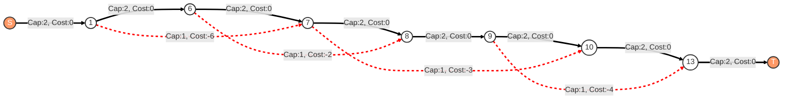
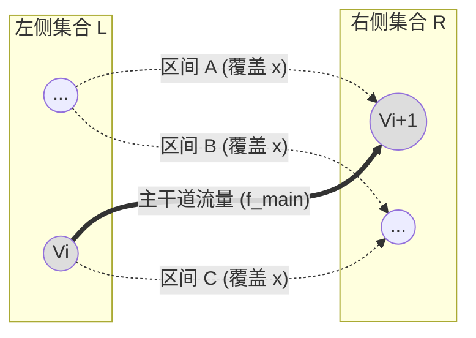

[[TOC]]

## 题目解析

## **一句话本质**

**最大费用流建模的区间选择问题，将区间选择转化为流量分配，利用节点间的容量限制实现每个点最多被覆盖k次。**

- 限制每个点最多被覆盖 k 次
- 求取: 最长的可选区间的长度和

---

## **🧠 问题分析与离散化**

### **核心矛盾**

我们需要从 $n$ 个区间中选择一个子集 $S$，满足：

1. **容量约束**：任意点 $x$ 最多被 $k$ 个区间覆盖
2. **优化目标**：最大化所选区间的总长度 $\sum |z|$

这是一个典型的**资源受限的区间调度问题**，其中“资源”就是每个点的覆盖次数容量 $k$。

### **离散数学视角**

设区间集合 $I = \{[l_i, r_i)\}$，长度 $w_i = r_i - l_i$

对于任意实数点 $x$，定义：

- 覆盖函数：$\mathrm{cov}(x) = |\{ i \in S : l_i \le x < r_i \}|$
- 约束：$\forall x \in \mathbb{R},\ \mathrm{cov}(x) \le k$
- 目标：$\max \sum w_i\cdot x_i$，其中 $x_i \in \{0,1\}$ 表示是否选择区间 $i$

这是一个0-1整数线性规划问题，但通过流网络可以高效求解。

---

## **🌉 网络流建模（核心思想）**

参考了: [题解 P3358 【最长k可重区间集问题】 - 洛谷专栏](https://www.luogu.com.cn/article/zw0st8g2)

核心想表达的逻辑是：**利用网络流的“串联”和“并联”物理特性来模拟区间的“相容”与“互斥”。**

### 1. 核心逻辑：电流与电阻

文中提到了一个物理直觉：

*   **串联 (Series)**：代表“先后发生”。如果你选了区间 A，**紧接着**还能选区间 B，说明它们在时间（坐标）上没有重叠冲突。
*   **并联 (Parallel)**：代表“同时发生”。在同一段坐标内，如果好几个区间都要选，它们就是并联关系。
*   **流量限制 (Current Limit)**：总电流（流量）限制为 $K$。这意味着在电路的任何一个截面上，并联的电阻（区间）不能超过 $K$ 个。

> 串联容易理解并建立模型,但是**并联** 怎么建立模型
> 注意 **截面** 指的是: 网络流的 截面

### 2. 建图步骤拆解 (针对样例)

#### 第一步：离散化 (建立“电线杆”)
首先，我们将所有区间的端点（$l$ 和 $r$）提取出来，排序并去重。这些点就是我们电路图中的**接线柱（节点）**。

*   原始数据：`[1, 7], [6, 8], [7, 10], [9, 13]`
*   端点集合：`1, 7, 6, 8, 7, 10, 9, 13`
*   **排序去重后节点**：**1, 6, 7, 8, 9, 10, 13**

这些点构成了我们的**主干道**。

#### 第二步：铺设主干电缆 (Main Wire)
图片中提到的“不相交就由 $r$ 连向 $l$”，在图论实现中，就是连接相邻的离散点。
*   **连边逻辑**：从点 $i$ 连向点 $i+1$。
*   **容量 (Cap)**：$K$ (样例中为 2)。这代表“如果不选区间，这里最大可以通过 2 的空闲流量”。
*   **费用 (Cost)**：0。走主干道没有收益。

#### 第三步：接入区间电阻 (Interval Arcs)
每一个区间，相当于一根**跨接**在两个接线柱之间的“有收益导线”。
*   **连边逻辑**：对于区间 $[u, v]$，从节点 $u$ 连向节点 $v$。
*   **容量 (Cap)**：1。每个区间只能选一次。
*   **费用 (Cost)**：$-Length$ (即 $-(v-u)$)。因为要求最大长度，我们取负求最小费用。

#### 第四步：接入电源 (Source/Sink)
*   **超级源点 S**：连向第一个点 (1)，容量 $K$，费用 0。
*   **超级汇点 T**：从最后一个点 (13) 连入，容量 $K$，费用 0。

---

### 3. Mermaid 可视化详解

这就是基于图片逻辑生成的样例图。请仔细观察**红色虚线**（区间）是如何“分流”**黑色实线**（主干）的流量的。

> 注意这个图上的并联的实现

### 4. 深度解析：为什么这张图是对的？

让我们回到图片作者提到的“串联”与“并联”：

**场景一：区间 1 `[1, 7]` 和 区间 3 `[7, 10]`**
*   **流向**：流量从 $S$ 出来，可以先走红色虚线 `1->7` (选了区间1)，到达点 7 后，立刻接着走红色虚线 `7->10` (选了区间3)。
*   **物理连接**：这就是**串联**。
*   **意义**：因为首尾相接，同一个单位的流量（1 unit flow）可以连续吃掉这两个区间。这反映了它们**不冲突**，只需要占用 1 个通道配额。

**场景二：区间 2 `[6, 8]` 和 区间 3 `[7, 10]`**
*   **流向**：
    *   流 A 走了 `6->8` (区间2)。
    *   流 B 走了 `7->10` (区间3)。
*   **冲突点**：在截面 `7->8` 这段主干道上，流 A 正在 `6->8` 的“高架桥”上飞越，流 B 刚刚从点 7 起飞进入 `7->10` 的高架桥。
*   **物理连接**：这就是**并联**。
*   **意义**：它们在空间上重叠了。为了同时维持这两个流，我们必须消耗 **2 个单位** 的总流量（即 $K$ 必须 $\ge 2$）。如果 $K=1$，流量不够分，就只能二选一。

### 5. 教练总结

图片中作者强调的思路，翻译成工程语言就是：

1.  **时间轴是河床**（节点和主干边）。
2.  **K 是河水的总流量**。
3.  **区间是运河（支流）**。
4.  如果你开凿一条运河 `u->v`，水流就会从主河道分流进运河。
5.  **费用流算法**会自动帮我们分配水流，使得流经“运河”（即选择区间）的总长度最大。

这个建模方式是解决 **“K重覆盖问题”** 的标准指纹。你看懂这张图的流动逻辑了吗？

### **具体构图**

1. **离散化所有端点**：将所有区间的左右端点收集、排序、去重，得到m个关键点
2. **构建链式结构**：
   - 创建节点：源点s，汇点t，每个离散化点对应一个节点
   - 对于相邻点i→i+1：添加容量为k，费用为0的边
3. **添加区间选择边**：
   - 对于每个区间[l, r)，找到对应离散化节点u(左)和v(右)
   - 添加边u→v，容量为1，费用为 **-长度**（最小费用流）或 **+长度**（最大费用流）
4. **连接源汇**：
   - s→第一个节点：容量k，费用0
   - 最后一个节点→t：容量k，费用0

### **为什么这样建模？**

- **链式边**：控制每个"段"的流量不超过k，对应每个点的覆盖限制
- **区间边**：流量1表示选择该区间，费用为区间长度的负值（最小费用流）
- **总流量**：每条从s到t的路径对应一个区间的选择，流量在链上传递

## 证明

> 上面的方法是如何保证 : 点$x$ 最多被覆盖 K 次的

这是一个非常核心的数学证明题。如果不理解这一点，做网络流题就像是在“撞大运”。

这个证明利用了网络流中最基本的定理：**最大流最小割定理（Max-flow Min-cut Theorem）** 的一个推论，以及 **流量守恒（Flow Conservation）** 定律。

我们将通过 **“截面法” (The Cut Method)** 来证明。

---

### 1. 建立模型：把数轴切一刀

想象我们在图上的任意两个离散点 $v_i$ 和 $v_{i+1}$ 之间，用一把刀垂直切下去。
这个切口对应实数轴上的一个小区间 $(v_i, v_{i+1})$。假设这里有一个点 $x$。

我们来看这个截面上会有哪些流量经过？

### 2. 数学符号定义

1.  **$F_{total}$ (总流量)**：
    整个网络从源点 $S$ 流出的总流量。
    由建图可知，源点 $S \to \text{第一个点}$ 的容量限制为 $K$。
    $$F_{total} \le K \quad \text{......(公式 1)}$$

2.  **截面流量 (Flow across the cut)**：
    根据网络流的**流量守恒定律**：在一个封闭系统中，任意一个将 $S$ 和 $T$ 分开的截面，其流过的净流量必须等于总流量 $F_{total}$。

    > 这个就是核心

3.  **截面上的两种边**：
    在这个截面 $(v_i, v_{i+1})$ 上，流量只能通过两种方式流过：
    *   **方式 A：主干道边** $(v_i \to v_{i+1})$。设其流量为 $f_{main}$。
    *   **方式 B：跨越这个截面的区间边**。即所有起点 $l \le v_i$ 且终点 $r \ge v_{i+1}$ 的区间边。设这些区间的集合为 $S_x$（即覆盖点 $x$ 的区间集合）。每个区间流量为 1。

### 3. 证明过程

**步骤 1：列出守恒方程**
在任意截面 $(v_i, v_{i+1})$ 处，流过的总流量等于各部分流量之和：
$$ F_{total} = f_{main} + \sum_{j \in S_x} (\text{区间 } j \text{ 的流量}) $$

**步骤 2：代入数值**
因为每个被选中的区间流量恒为 1（容量限制）：
$$ F_{total} = f_{main} + \text{count}(S_x) $$
其中 $\text{count}(S_x)$ 就是点 $x$ 被覆盖的次数。

**步骤 3：利用不等式推导**
我们有两个关键的物理限制：
1.  **总流量限制**：$F_{total} \le K$ （源点瓶颈）。
2.  **流量非负性**：$f_{main} \ge 0$ （主干道流量不可能倒流，且最小为0）。

将它们代入方程：
$$ \text{count}(S_x) = F_{total} - f_{main} $$

由于 $F_{total} \le K$ 且 $f_{main} \ge 0$，我们可以得出：
$$ \text{count}(S_x) \le K - 0 $$
$$ \text{count}(S_x) \le K $$

**证毕 (Q.E.D.)**

---

### 4. 物理直觉解释（通俗版）

把这个系统想象成一条宽为 $K$ 米的大河。

*   **$S \to T$ 的总水量**最多只有 $K$ 吨/秒。
*   **主干道** 是原本的河床。
*   **每一个区间** 是一条架设在空中的“引水管”，它从上游抽水，绕过一段距离，在下游把水排回去。

**结论：**
如果在某一点 $x$ 上方有 $M$ 条引水管同时在运水（即覆盖次数为 $M$），那么这 $M$ 吨水加上河床里剩下的水，总和不能超过源头的 $K$ 吨。

如果 $M > K$，那就意味着这 $M$ 条管子里的水比源头出来的总水流还多，这违背了物理定律（流量守恒）。

所以，**只要源头卡死了流量是 $K$，系统中任何一个截面上并行的“引水管”数量就绝不可能超过 $K$。**

### 5. 举个反例帮助理解

假设 $K=2$，我们在某处选了 3 个重叠的区间。
*   那么在这个截面上，需要 3 个单位的流量从这 3 条“区间边”流过去。
*   此时主干道流量 $f_{main} \ge 0$。
*   截面总流量 $= 3 + f_{main} \ge 3$。
*   但是源点总共只发出了 2 个单位的流。$2 \ge 3$ 显然矛盾。
*   因此，最大流算法**自动**不会选择这 3 个区间同时存在，它会放弃其中费用（长度）最小的那个，来满足 $K=2$ 的限制。

---

## **⚙️ 离散数学模块**

### **算子映射**

| 抽象概念       | 具体实现       | 离散数学对应         |
| -------------- | -------------- | -------------------- |
| "选择区间"     | 流量通过区间边 | 边选择变量xᵢ ∈ {0,1} |
| "点覆盖限制"   | 节点间容量限制 | 线性约束∑xᵢ ≤ k, ∀t  |
| "最大化总长度" | 最小化负费用   | 目标函数max ∑wᵢxᵢ    |

### **思维模板**

**资源受限区间调度 → 时间线离散化 → 构建容量链 → 添加带权区间边 → 费用流求解**

### **快速识别**

看到以下特征组合，立即想到费用流建模：

1. **特征A**：区间选择问题（每个区间有收益）
2. **特征B**：每个点有覆盖次数限制（容量约束）
3. **特征C**：需要最大化总收益

### **数学推导**

设离散化后得到 $m$ 个点，形成 $m-1$ 个连续段。

对于每个段 $[j, j+1)$，令其长度为 $d_j = \mathrm{pos}_{j+1} - \mathrm{pos}_j$

设 $y_j$ 表示通过段 $j$ 的流量（即覆盖该段的区间数量），则有：

- $0 \le y_j \le k$（容量约束）
- 对于区间 $i$ 覆盖段集合 $T_i$，选择区间 $i$ 则 $y_j$ 增加 1（流量守恒）

费用流模型恰好等价于：

$$
\begin{aligned}
\min\ & \sum (-w_i) x_i \\
	ext{s.t.}\ & \sum x_i \le k, \quad \text{对于所有点（通过链式边实现）} \\
& x_i \in \{0,1\}
\end{aligned}
$$

---

## **📶 信号反射 & 思维模板**

### **关键信号 (Key Signals)**

1. **"开区间集合"** → 边界处理要小心
2. **"任意一点x包含x的开区间个数不超过k"** → 点覆盖容量约束
3. **"$\sum |z|$ 达到最大"** → 最大化权重和
4. **数据范围：$k \le 3,\ n \le 500$** → 费用流可行

### **逻辑跃迁 (Logic Jump)**

从"每个点覆盖次数限制"跳跃到"流量在时间轴上的分配问题"：

- 每个点如同一个检查站，只能通过k个区间
- 区间如同车辆，从起点到终点，占用沿途所有检查站的容量
- 问题转化为：如何安排车辆路线使得总行驶距离最大

### **模式识别 (Pattern Recognition)**

**特征A（区间选择）+ 特征B（点覆盖限制）+ 特征C（最大化权重）**
**= 费用流建模（离散化时间轴+链式容量边）**

---

**教练提示**：这道题是网络流经典应用，掌握后可以解决一系列类似的资源分配问题。下次遇到"每个时间点有容量限制的活动安排"问题时，记得这个模板！

## 代码 

@include-code(./1.cpp, cpp)

