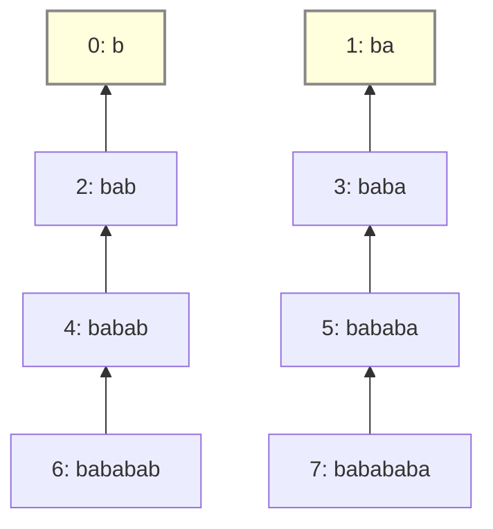

[[TOC]]

### 题意

对字符串 $s$ 的**每个前缀**求最长真周期长度，并把所有长度加起来。

周期定义：$p$ 是前缀 $s[1..len]$ 的周期，当 $s[1..len]$ 是 $s[1..p]$ 重复若干次后的前缀（最后一次允许不完整），且 $1 \leqslant p < len$。

样例 $s = \text{babababa}$，答案 $24$。

### 思路

**一句话本质**：周期和 border 是同一枚硬币的两面——长度为 $len$ 的前缀有周期 $p$，当且仅当它有 border $len-p$。所以最长周期 = $len$ 减**最短非空 border**，而最短 border 藏在 KMP 前缀函数的失配链链尾。

**直接验证一个周期要做什么？**

先看暴力：对每个前缀枚举候选周期 $p$，再逐位检查是否每个位置都与周期串对应：

@include-code(./brute.cpp, cpp)

每验证一个 $p$ 都要把整个前缀重扫一遍，总代价 $O(n^3)$ 级别，而且一次验证只得到一个周期的结论。

**能不能把"逐位重扫"变成"一次判断"？**

周期 $p$ 的意思是：对每个 $i > p$，$s[i]$ 必须等于 $s[i-p]$。把这些等式放在一起看，等价于后半段 $s[p+1..len]$ 与前半段 $s[1..len-p]$ 逐位相同——这正是"$len-p$ 是 $s[1..len]$ 的 border"的定义。反过来，只要 $b = len-p$ 是 border，把等式倒过来读，$p$ 就是周期。

所以"$p$ 是周期" ⇔ "$len-p$ 是 border"。验证周期变成判断一个长度是否为 border，一步完成，不需要重扫。

**那么最长周期对应什么？**

$p = len - b$，$p$ 最大 ⇔ $b$ 最小。问题变成：**对每个前缀求最短非空 border**。

**KMP 只给了最长 border，最短的怎么找？**

前缀函数 $pi[i]$ 只记录最长 border，但所有 border 有固定的结构：沿 $pi$ 反复跳可以拿到全部 border——$pi[i], pi[pi[i]-1], pi[pi[pi[i]-1]-1], \ldots$，长度严格递减。链上第一个非零点就是最短非空 border。

**每条链都跳到底会不会太慢？**

会。像 $\text{aaaaa}$ 这样的串链非常长，每个前缀都跳一遍是 $O(n^2)$。但观察链的嵌套结构：前缀 $i$ 的 border 集合 = $\{pi[i]\}$ ∪ 前缀 $pi[i]-1$ 的 border 集合。所以最短非空 border 满足递推：

$$mini[i] = \begin{cases} i+1 & pi[i] = 0 \\ mini[pi[i]-1] & pi[i] > 0 \end{cases}$$

其中 $mini[i]$ 表示前缀 $s[0..i]$ 的**最短非空 border 长度**（0-indexed）；$pi[i] = 0$ 表示没有 border，此时贡献 $0$。

#### 失配树视角

这个递推从失配树上读最清楚。失配树：节点 $i$ 代表前缀 $s[0..i]$，父节点是 $pi[i]-1$（当 $pi[i] > 0$），$pi[i] = 0$ 的节点是根。**树上 $i$ 的所有祖先恰好就是前缀 $i$ 的全部 border**。下图是样例的失配树：



从图上读 $mini[i]$：从节点 $i$ 沿箭头向上，遇到的**第一个根节点**的"长度"（节点号 $+1$）就是最短非空 border。例如 $7 \to 5 \to 3 \to 1$（根），所以 $mini[7] = 1+1 = 2$——"babababa" 的最短 border 是 "ba"。

这也正是 dp 方程的树形解释：

- $pi[i] > 0$ 时 $mini[i] = mini[pi[i]-1]$：**继承父节点的答案**——非根节点沿树向上冒泡，最终停在某个根上；
- $pi[i] = 0$ 时自己是根，$mini[i] = i+1$（自身长度 = 无 border）。

而 $pi[i]-1 < i$ 保证计算 $mini[i]$ 时父节点的值已经算好，依赖顺序天然安全。同时这张图解释了为什么不能每个前缀都跳链：最坏情况下树退化成一条链（如 $\text{aaaaa}$），每个节点重新向上跳就是 $O(n^2)$，继承式 dp 让每个节点只做一次 $O(1)$ 转移。

每个位置 $O(1)$ 递推，答案累加 $(i+1) - mini[i]$。

### 代码

@include-code(./main.cpp, cpp)

### 复杂度

前缀函数与递推各 $O(n)$，总时间 $O(n)$；空间 $O(n)$。

### 总结

本题的核心卡点不是 KMP 本身，而是把题面里的"周期"翻译成"border"：$len - p$ 是 border 当且仅当 $p$ 是周期。翻译之后：

- 最长周期 → 最短非空 border；
- 最短 border → 在 $pi$ 链上递推，$O(1)$ 每位置。

以后看到"周期 / 重复串"，先想 border；看到"所有 border"，先想 $pi$ 链。

## 图示解析

以 $s = \text{babababa}$ 的前缀 $s[0..7]$（$len = 8$）为例：

```
border 链（沿 pi 反复跳）：
  pi[7] = 6   "bababa"
  pi[5] = 4   "baba"        ← pi[pi[7]-1] = pi[5]
  pi[3] = 2   "ba"          ← pi[pi[5]-1] = pi[3]
  pi[1] = 0   链底

最短非空 border = 2（"ba"）→ 最长周期 = 8 - 2 = 6
```

读图方法：border 链每步跳到更短的前缀（下标 $i \to pi[i]-1$），不是跳到 $i-1$。链上第一个非零值就是最短 border；它越长，周期越短，所以要找链底附近的值。
