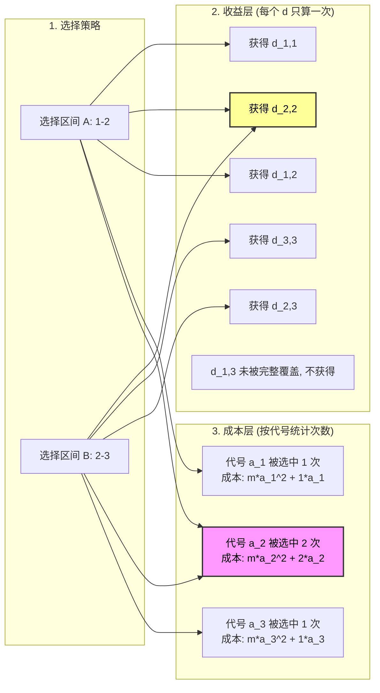
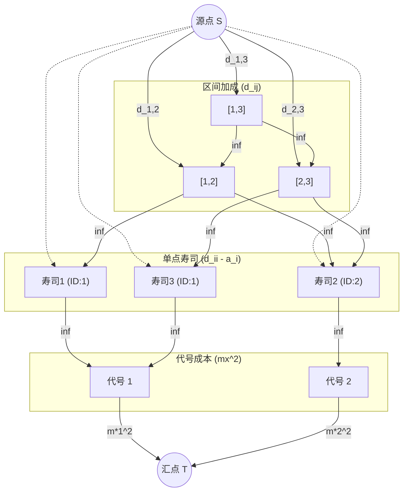

[[TOC]]

## 题目解析

> 🗑语文题   
> 题目本身不是很难, 但是我花了大量的时间在理解题目在说什么
> 尤其是 一会种,一会份, 一会类  

> 垃圾1:  如果包含了餐厅提供的从第 i 份到第 j 份的所有寿司, 量词和前面说的不统一

> Kiana 一共吃过了 c (c>0) **种** 代号为 x 的寿司，则她需要为这些寿司付出 $mx^2 +cx$ 元钱  
> 这个 **种** 原来意思是: 不同的代号为 x 的寿司🍣 的数量: 😡,浪费我1个小时

## 简化题目

这是一份去除了背景故事和干扰信息的极简题目描述：

### 核心模型

**给定：**
1. 一个长度为 $n$ 的寿司序列，第 $i$ 个寿司有一个代号 $a_i$。
2. 一个价值矩阵 $d_{i,j}$（其中 $1 \le i \le j \le n$），表示区间 $[i, j]$ 的美味度。
3. 一个常数 $m$。

**操作：**
你可以任意选择若干个区间 $[l, r]$（可以重叠）。

**收益计算（加法）：**
- 对于任意一对 $(i, j)$，只要区间 $[i, j]$ 被你选择的**任意一个**区间完全覆盖，你就能获得 $d_{i,j}$ 的值。
- **注意**：每个 $d_{i,j}$ 的值全场**只能获得一次**（即使被多个区间覆盖）。

**成本计算（减法）：**
- 按**代号**分类计算成本。
- 对于代号为 $x$ 的寿司，统计它在所有被选区间中出现的**总次数** $c$。
- 该代号产生的成本为 $mx^2 + cx$。

**目标：**
最大化 **(总收益 - 总成本)**。

---

### 这里的关键逻辑图解 (Mermaid)

**图例解释：**
- **黄色高亮**：虽然区间 A 和 B 都覆盖了第 2 个寿司（$d_{2,2}$），但收益只算一次。
- **粉色高亮**：第 2 个寿司被选中了 2 次，这会增加代号 $a_2$ 的 $c$ 值（成本变高）。

## 解析

这道题 **P3749 [六省联考 2017] 寿司餐厅** 是一道非常经典的**网络流（Network Flow）**题目，具体来说，它是**最大权闭合子图**模型的一个精彩应用。

很多同学看到这种“选这个就必须选那个”、“收益减去代价”的题目，通过 DP 很难处理（因为状态太复杂），这时候就要往**最小割**的方向去想。

下面我们一步步拆解这道题。

---

### 1. 核心模型：最大权闭合子图

首先，我们要把题目翻译成图论模型。
题目要求我们做一系列**选择**，每个选择都有对应的**权值**（有正有负），并且选择之间存在**依赖关系**。

*   **目标**：最大化（总收益 - 总花费）。
*   **转化**：这等价于 **所有正收益之和 - 最小割（最小损失）**。

在最小割模型中：
*   我们从源点 $S$ 向代表“正收益”的物品连边，容量为收益值。
*   从代表“负收益（成本）”的物品向汇点 $T$ 连边，容量为成本的绝对值。
*   如果物品 A 依赖于物品 B（选 A 必选 B），则从 A 向 B 连一条容量为 $\infty$ 的边（表示割不断，即这种依赖关系必须满足）。

---

### 2. 题目中的依赖关系分析

这道题的难点在于如何正确地建立依赖图。我们需要分析出题目中隐含的三层结构。

#### 第一层：区间的依赖 (金字塔结构)
题目定义了 $d_{i, j}$。为了拿到区间 $[i, j]$ 的美味度（假设 $i < j$），意味着你必须吃了这一段寿司。
逻辑上，我们可以这样定义依赖：
*   要想拥有区间 $[i, j]$ 的加成，你必须拥有子区间 $[i+1, j]$ 和 $[i, j-1]$ 的加成。
*   这样一直递归下去，最终会依赖到单点 $[i, i], [i+1, i+1] \dots [j, j]$。
>  这里是区间DP,也是这个题目的难点!!

> **为什么要这样连边？**
> 如果直接从 $[i, j]$ 连向所有 $[k, k]$ ($i \le k \le j$)，边数会达到 $O(N^3)$，太多了。
> 通过 $[i, j] \to [i+1, j]$ 和 $[i, j] \to [i, j-1]$，我们只需要 $O(N^2)$ 的边就能间接覆盖所有依赖。

#### 第二层：单点寿司的依赖与成本拆解
对于单点寿司 $i$，它的收益是 $d_{i, i}$，但它也有成本。
题目说：吃了 $c$ 个代号为 $x$ 的寿司，花费 $mx^2 + cx$。
我们可以把花费拆开：
1.  **固定花费（门票费）**：只要你吃了代号为 $x$ 的寿司（无论吃几个），就要付 $mx^2$。
2.  **按量花费**：每吃一**种**代号为 $x$ 的寿司，要多付 $x$ 元。

>> 这里最难理解的就是这个$C\times x$,比如 有第1种,第2种寿司,代码都是1, 那么分别吃了3,4 个,那么这里的C 是 $2$,因为吃了2种代号为 1 的寿司

**处理策略**：
*   对于单点节点 $(i, i)$，它的净收益修正为：$d_{i, i} - a_i$。
    *   因为 $cx$ 这一项是线性的，可以直接分摊到每个寿司头上。
*   如果修正后的 $d_{i, i} - a_i$ 是正的，连 $S$；如果是负的，连 $T$。

#### 第三层：类型（代号）的依赖
如果你选择吃第 $i$ 个寿司（代号为 $a_i$），那么你必须支付该代号的“门票费” $m \cdot a_i^2$。
*   我们需要为每一种**寿司代号**（Type）建立一个独立的节点。
*   单点寿司节点 $(i, i)$ 连向 对应的 **代号节点**，容量 $\infty$。
*   **代号节点** 向 $T$ 连边，容量为 $m \cdot a_i^2$。

---

### 3. 图解构建 (Mermaid)

让我们把这三层结构画出来，帮助理解。
假设我们有 3 个寿司，代号分别是 1, 2, 1。

---

### 4. 详细连边规则总结

1.  **节点编号**：
    *   源点 $S$，汇点 $T$。
    *   区间节点 $(i, j)$：可以用二维转一维的映射函数 `id(i, j)` 给每个区间分配一个编号。
    *   代号节点 $Type_x$：为出现过的每个代号 $x$ 分配一个编号（代号范围 1~1000）。

2.  **构建边的逻辑**：
  
    *   **对于每个区间 $(i, j)$** (其中 $i < j$)：
        *   若 $d_{i, j} > 0$：连边 $S \to id(i, j)$，容量 $d_{i, j}$。
        *   若 $d_{i, j} < 0$：连边 $id(i, j) \to T$，容量 $-d_{i, j}$。（作为一种必须支付的惩罚成本，虽然逻辑上一般这类区间不会被选，但如果被更大的正收益区间包含，则必须选）。
        *   **依赖**：连边 $id(i, j) \to id(i+1, j)$，容量 $\infty$。
        *   **依赖**：连边 $id(i, j) \to id(i, j-1)$，容量 $\infty$。

    *   **对于每个单点 $(i, i)$**：
        *   计算权值 $W = d_{i, i} - a_i$。
        *   若 $W > 0$：连边 $S \to id(i, i)$，容量 $W$。
        *   若 $W < 0$：连边 $id(i, i) \to T$，容量 $-W$。
        *   **依赖**：连边 $id(i, i) \to TypeNode(a_i)$，容量 $\infty$。

    *   **对于每个代号节点 $Type_x$**：
        *   连边 $TypeNode(x) \to T$，容量 $m \cdot x^2$。

3.  **最终答案**：
    *   `Answer` = `所有正权值之和` - `最大流(最小割)`。

---

### 5. 容易忽略的细节 (避坑指南)

作为老师，我要提醒你几个写代码时容易出错的地方：

1.  **总收益的统计**：
    在建图之前，你需要把所有 $d_{i, j} > 0$ 的值加起来作为“理论最大收益”。注意，对于单点 $(i, i)$，如果 $d_{i, i} - a_i > 0$，也要加进这个总和里。如果是负的，就不加，而是作为图中的流量（代价）处理。

2.  **$d_{i, j}$ 为负数的情况**：
    *   如果 $d_{i, j}$ 是负的，它不贡献正收益，反而变成了选择该区间的一个“代价”。
    *   所以它应该像成本一样：从节点连向 $T$，容量为 $|d_{i, j}|$。
    *   这一点很容易漏掉，很多同学只处理了正收益的 $d_{i, j}$。

3.  **节点数量估算**：
    *   $N \le 100$。
    *   区间节点数 $\approx N^2/2 \approx 5000$。
    *   代号节点数 $\approx 1000$。
    *   Dinic 算法跑这个规模是完全没问题的。

4.  **$m=0$ 的情况**：
    *   题目数据范围里有 $m=0$ 的情况。虽然公式 $mx^2$ 算出来是 0，代码逻辑通用，但要注意如果你的建图逻辑里依赖了 $m$ 来判断是否建点，不要特判漏了。建议统一处理，容量为 0 的边自然会被算法处理掉（或者优化掉不建这个边）。

5.  **代号 $a_i$ 的范围**：
    *   $a_i$ 最大是 1000，不要用 $N$ 去开代号节点的数组，要用 $\max(a_i)$。

### 6. 总结

这道题是 **最大权闭合子图** 的进阶版。解题的关键在于：
1.  **拆分成本**：将 $mx^2 + cx$ 拆分为“类型固定成本”和“单点线性成本”。
2.  **构建依赖**：利用 $d_{i, j}$ 的包含关系建立 $O(N^2)$ 的金字塔依赖图。
3.  **转化问题**：利用最小割求解最大收益。

希望这个解析能帮你理清思路！如果理解了，就去尝试写一下代码吧。加油！

## 代码 

@include-code(1.cpp, cpp)
