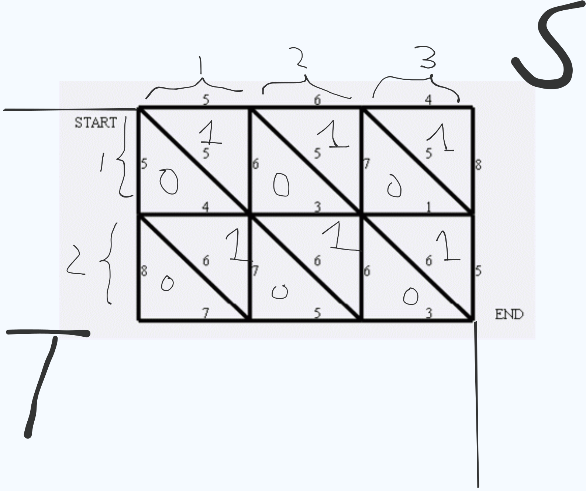

[[TOC]]

## 题目解析

你好！看来你已经从之前的“坏牛奶”问题进化到了更复杂的“狼抓兔子”场景。这道题是网络流模型中的一个**里程碑式**的题目。

虽然它的直观表象是一个**最小割（Minimum Cut）**问题，但如果你直接套用 Dinic 算法，在 $N, M = 1000$ 的数据范围下（节点数达 $10^6$，边数约 $3 \times 10^6$），大概率会因为超时（TLE）或内存溢出而被狼抓走。

作为你的算法教练，我将为你深度拆解这道题背后的**对偶图（Dual Graph）**转化技巧。

------

## 🧠 逻辑驱动：从最小割到最短路的进化

### 1. 算子映射：平面图的特性

本题给出的网格图是一个典型的**平面图（Planar Graph）**，即所有边除了在顶点处外都不相交。

在离散数学中，平面图有一个神奇的性质：**平面图的最小割等于其对偶图的最短路。**

- **原图 (Primal Graph)**：节点是 $(x, y)$，目标是求 $S(1,1)$ 到 $T(N,M)$ 的最小割。
- **对偶图 (Dual Graph)**：
  - 原图中的每一个“面”（由边围成的封闭区域）变成对偶图中的一个**顶点**。
  - 原图中两个面之间的“边界”（边）变成连接对偶图中相应顶点的**边**，权值不变。
  - 原图的 $S-T$ 切割线，对应对偶图中从“外部面 A”到“外部面 B”的一条**路径**。

### 2. 数学推导：对偶图的构建

我们要将网格中的每个 $1 \times 1$ 方格看作由一条对角线划分为两个三角形（即两个“面”）。

- **节点数量**：每个小方格有 $2$ 个三角形面，总共有 $(N-1) \times (M-1) \times 2$ 个内部面。
- **外部面**：我们需要定义两个特殊的外部面：
  1. **源点 $S'$**：位于网格的左上方和上方（原本 $S$ 的上方区域）。
  2. **汇点 $T'$**：位于网格的右下方和下方（原本 $T$ 的下方区域）。
- **边的转化**：
  - **横向边**：连接了上下相邻的两个三角形。
  - **纵向边**：连接了左右相邻的两个三角形。
  - **斜向边**：连接了同一个方格内的两个三角形。

在对偶图中跑一次 **Dijkstra 算法**，求出 $S'$ 到 $T'$ 的最短路径，其权值之和即为原图的最小割。

------

## 📓 错题集：为什么不直接跑最大流？

1. **时间复杂度瓶颈**：Dinic 在一般图上的复杂度是 $O(V^2 E)$，虽然在简单网络中表现优异，但在 $10^6$ 级别的点集下，常数因子稍大就会崩盘。
2. **空间开销**：网络流需要存储反向边，边数翻倍，对内存极不友好。
3. **思维盲点**：很多选手看到“最小代价阻断路径”就本能写下 `max_flow`，却忽略了题目特殊的**网格几何结构**。

------

## 🧪 离散数学模块：理解题目本质

### 1. 算子映射

- **原图切割 ($\text{Cut}$)**：对应逻辑算子中的“阻断”。
- **对偶路径 ($\text{Path}$)**：对应逻辑算子中的“穿透”。
- **性质**：任何一条从 $S$ 到 $T$ 的路径，必然会经过对偶图中从 $S'$ 到 $T'$ 路径上的某条边。

### 2. 思维模板：三角形网格对偶化

- 我们将每个方格分为：**上三角 (Upper)** 和 **下三角 (Lower)**。
- 方格 $(i, j)$ 的 `Upper` 节点编号可定为 $(i-1) \times (M-1) \times 2 + j$。
- 方格 $(i, j)$ 的 `Lower` 节点编号紧随其后。

### 3. 数学证明：欧拉公式的应用

根据欧拉公式 $V - E + F = 2$，平面图的面数 $F$ 与点线关系固定。这保证了对偶图的节点数与原图处于同一量级（$O(NM)$），但最短路算法 Dijkstra 的 $O(E \log V)$ 在处理这种大规模稀疏图时比最大流稳定得多。

------

## 📶 信号反射 & 思维模板

### 1. 关键信号 (Key Signals)

- **网格状地形** + **无向边**。
- **最小化代价阻断连通性**（最小割标志）。
- **$N, M \ge 1000$**（最大流算法的禁区信号）。

### 2. 逻辑跃迁 (Logic Jump)

看到“超大规模平面图最小割” $\to$ 意识到最大流无法处理 $\to$ 利用平面几何特性 $\to$ 建立对偶图 $\to$ 转化为最短路问题。

### 3. 模式识别 (Pattern Recognition)

以后看到 **“网格图 + 连通性阻断 + 数据范围 $10^6$”**，本能反应应该是 **“对偶图最短路”** 而不是 Dinic。

------

**教练建议：**

这道题的难点不在于算法实现（Dijkstra 是基础），而在于**如何精准地完成节点编号的映射**。你需要细心地处理边界情况（比如第一行、最后一行、第一列、最后一列的边连接到 $S'$ 还是 $T'$）。

你想让我帮你梳理一下具体的节点映射逻辑（即如何根据坐标 $(i, j)$ 计算对偶图中三角形节点的具体 ID）吗？


## 如何建图


在平面图转对偶图的过程中，最核心的难点在于如何将原图中的“面”转换成对偶图中的“点”，并建立正确的连边关系。

我们可以将 $(N,M)$ 的网格看作是由 $(N-1) \times (M-1)$ 个小方格组成的。每个小方格被一条从左上到右下的斜向边分割成两个三角形，即：**上三角 (Upper)** 和 **下三角 (Lower)**。

------

## 🧩 节点映射逻辑详解

### 1. 节点定义与编号

首先，我们要给所有的三角形区域编号。

- **区域总数**：总共有 $(N-1) \times (M-1)$ 个方格，每个方格 $2$ 个三角形，共 $2(N-1)(M-1)$ 个三角形节点。
- **辅助节点**：定义两个超级源汇点 $S'$ 和 $T'$。
- **编号公式**：
  - 对于位于第 $i$ 行、第 $j$ 列的方格（$1 \le i < N, 1 \le j < M$）：
  - **上三角 $U(i, j)$**：编号为 $2 \times [(i-1)(M-1) + (j-1)] + 1$。
  - **下三角 $L(i, j)$**：编号为 $2 \times [(i-1)(M-1) + (j-1)] + 2$。
  - **$S'$**：编号为 $0$。
  - **$T'$**：编号为 $2(N-1)(M-1) + 1$。

> 这个公式(上下三角)的是如何推导的呢? 


```
[0] [1] [2]
[3] [4] [5]
[6] [7] [8]

那么是一个N  = 3, M = 3,这就是一个二维的数组

则每个点的编号是: (i-1) * M + (j-1)

每个点都乘以2 
[0] [2] [4]
[6] [8] [10]
[12] [14] [16]

这样每个点就可以容纳两个编号

2 * [ (i-1) * M + (j-1) ] + 1 
2 * [ (i-1) * M + (j-1) ] + 2
```


------

### 2. 三类边的对应关系

我们需要根据原图中边的位置，判断它连接了哪两个三角形（或源汇点）。

| **原图边类型** | **位置条件**         | **对偶图连接节点**                      | **备注**                 |
| -------------- | -------------------- | --------------------------------------- | ------------------------ |
| **横向边**     | 第一行 ($i=1$)       | $S' \longleftrightarrow U(1, j)$        | 阻断兔子向上逃逸         |
|                | 最后一行 ($i=N$)     | $L(N-1, j) \longleftrightarrow T'$      | 阻断兔子向下逃逸         |
|                | 中间行 ($1 < i < N$) | $L(i-1, j) \longleftrightarrow U(i, j)$ | 分隔上下两个方格         |
| **纵向边**     | 第一列 ($j=1$)       | $L(i, 1) \longleftrightarrow T'$        | 阻断兔子向左逃逸         |
|                | 最后一列 ($j=M$)     | $S' \longleftrightarrow U(i, M-1)$      | 阻断兔子向右逃逸         |
|                | 中间列 ($1 < j < M$) | $U(i, j) \longleftrightarrow L(i, j-1)$ | 分隔左右两个方格         |
| **斜向边**     | 任何方格内部         | $U(i, j) \longleftrightarrow L(i, j)$   | 分隔同一个方格的两个三角 |

------




## 代码


```cpp
#include <iostream>
#include <vector>
#include <queue>
#include <cstring>

using namespace std;

// 使用 long long 防止最短路权值溢出 (1e6 * 1e6)
typedef long long ll;
const ll INF = 0x3f3f3f3f3f3f3f3fll;

struct Edge {
    int to;
    int w;
    int next;
};

// 预估边数：每个方格 2 个三角形，每个三角形最多 3 条边，总边数约 3 * 2 * N * M
const int MAXN = 2000005; 
const int MAXM = 6000005;

Edge edge[MAXM];
int head[MAXN], tot;
ll dist[MAXN];
bool vis[MAXN];

// 链式前向星加边
void add_edge(int u, int v, int w) {
    edge[++tot] = {v, w, head[u]};
    head[u] = tot;
    // 无向图在对偶图中依然对应双向边
    edge[++tot] = {u, w, head[v]};
    head[v] = tot;
}

// 经典的 Dijkstra + 优先队列优化
void dijkstra(int s, int t) {
    memset(dist, 0x3f, sizeof(dist));
    priority_queue<pair<ll, int>, vector<pair<ll, int>>, greater<pair<ll, int>>> pq;
    
    dist[s] = 0;
    pq.push({0, s});
    
    while (!pq.empty()) {
        ll d = pq.top().first;
        int u = pq.top().second;
        pq.pop();
        
        if (d > dist[u]) continue;
        
        for (int i = head[u]; i; i = edge[i].next) {
            int v = edge[i].to;
            if (dist[v] > dist[u] + edge[i].w) {
                dist[v] = dist[u] + edge[i].w;
                pq.push({dist[v], v});
            }
        }
    }
}

/**
 * 映射逻辑说明：
 * 每个 1x1 方格划分为两个三角形：
 * 1. Upper (U): 编号为 2 * idx - 1
 * 2. Lower (L): 编号为 2 * idx
 * 其中 idx = (i-1)*(M-1) + j
 */
int main() {
    ios::sync_with_stdio(false);
    cin.tie(0);

    int N, M;
    if (!(cin >> N >> M)) return 0;

    // 特判：1x1 或 1xM 的情况最小割直接看边权即可（本题 N,M >= 3）
    if (N == 1 || M == 1) {
        int res = 2e9, val;
        int count = (N == 1 ? M - 1 : N - 1);
        while (count--) { cin >> val; res = min(res, val); }
        cout << (res == 2e9 ? 0 : res) << endl;
        return 0;
    }

    int S_prime = 0;
    int T_prime = 2 * (N - 1) * (M - 1) + 1;
    auto get_id = [&](int i, int j, int type) {
        return (i - 1) * (M - 1) * 2 + (j - 1) * 2 + type + 1;
    };

    int w;
    // 1. 横向边
    for (int i = 1; i <= N; ++i) {
        for (int j = 1; j <= M - 1; ++j) {
            cin >> w;
            if (i == 1) add_edge(S_prime, get_id(1, j, 1), w);
            else if (i == N) add_edge(get_id(N - 1, j, 0), T_prime, w);
            else add_edge(get_id(i, j, 1), get_id(i - 1, j, 0), w);
        }
    }

    // 2. 纵向边
    for (int i = 1; i <= N - 1; ++i) {
        for (int j = 1; j <= M; ++j) {
            cin >> w;
            if (j == 1) add_edge(get_id(i, 1, 0), T_prime, w);
            else if (j == M) add_edge(S_prime, get_id(i, M - 1, 1), w);
            else add_edge(get_id(i, j, 0), get_id(i, j - 1, 1), w);
        }
    }

    // 3. 斜向边
    for (int i = 1; i <= N - 1; ++i) {
        for (int j = 1; j <= M - 1; ++j) {
            cin >> w;
            add_edge(get_id(i, j, 0), get_id(i, j, 1), w);
        }
    }

    dijkstra(S_prime, T_prime);
    cout << dist[T_prime] << endl;

    return 0;
}
```

