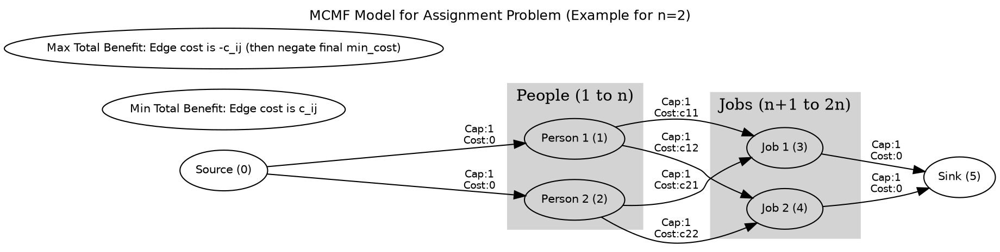
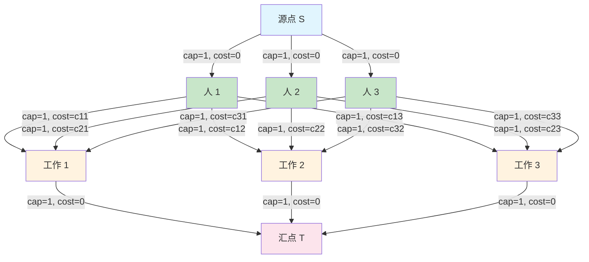
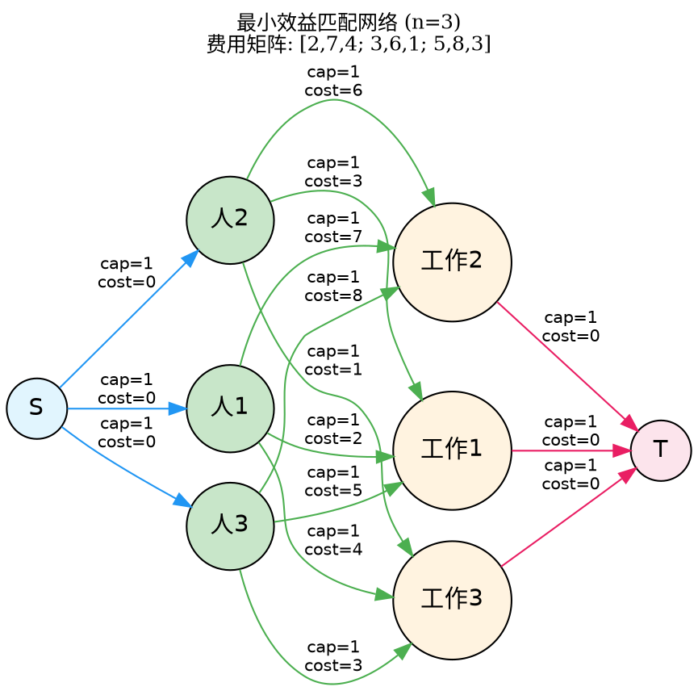
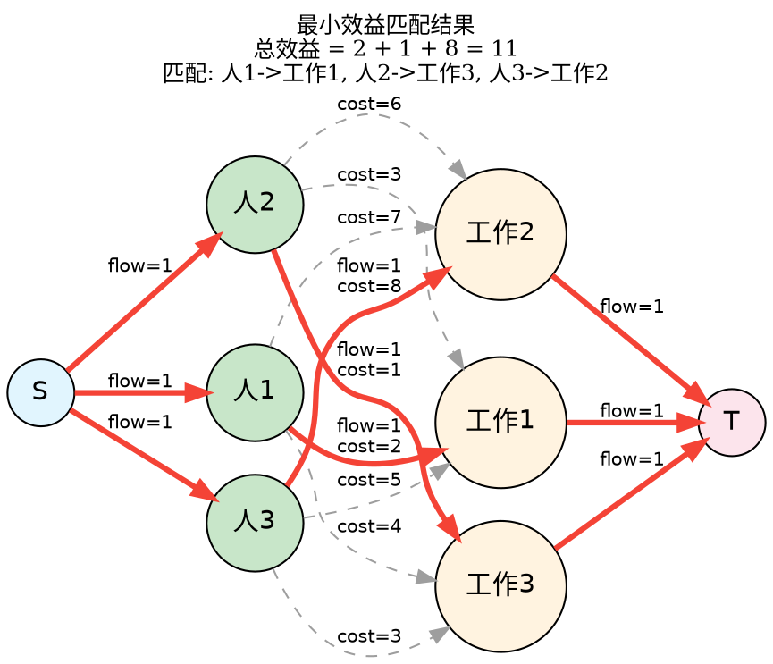
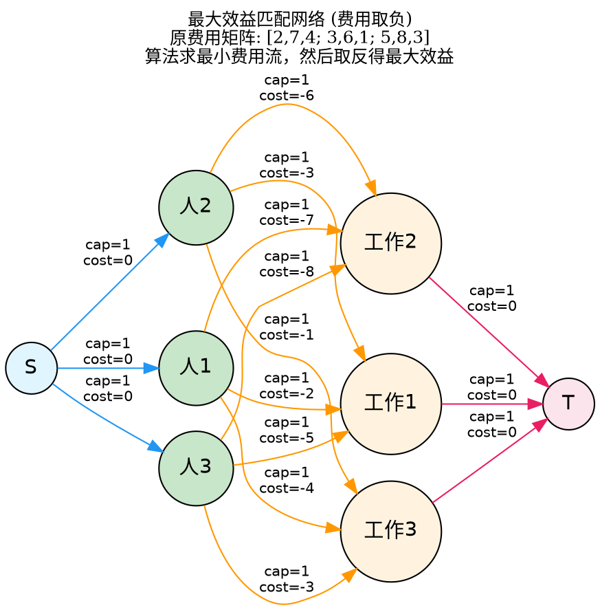
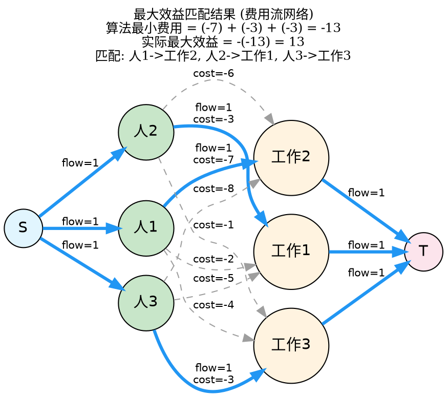
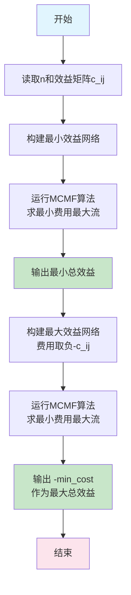

[[TOC]]

## 题目解析

# P4014 分配问题 - 费用流详细解析

## 1. 题目背景与核心问题

题目描述：

有 $n$ 个人和 $n$ 件工作。

每个人做每件工作都有一个对应的效益值 $c_{ij}$。

要求：

1. 每个人只能做一件工作。
2. 每件工作只能由一个人做。
3. **目标 1**：求分配方案使得总效益**最小**。
4. **目标 2**：求分配方案使得总效益**最大**。

核心转化：

这是一个标准的二分图最佳完美匹配 (Minimum/Maximum Weight Perfect Matching) 问题。

在网络流中，我们可以通过构建流量限制，强制模型找出“一一对应”的关系，并通过费用（Cost）属性来优化总效益。

## 2. 建模思路：最小费用最大流 (MCMF)

我们将问题转化为一个**流量为** $n$ 的最小费用流模型。

### 2.1 节点设置

我们需要构建一个流网络图：

- **源点 (**$S$**)**：编号 $0$。
- **人节点 (**$People$**)**：编号 $1 \dots n$。
- **工作节点 (**$Jobs$**)**：编号 $n+1 \dots 2n$（为了区分人和工作，给工作编号加 $n$）。
- **汇点 (**$T$**)**：编号 $2n+1$。

### 2.2 建边策略

我们需要建立三层边结构，每一层都有明确的物理意义：

#### 第一层：源点 $\to$ 人

- **连接**：$S \to i$ （其中 $1 \le i \le n$）
- **容量 (Capacity)**：$1$
- **费用 (Cost)**：$0$
- **意义**：每个人最多只能提供 $1$ 个单位的劳动力（只能做一份工）。

#### 第二层：人 $\to$ 工作

- **连接**：$i \to j+n$ （其中 $1 \le i, j \le n$）
- **容量 (Capacity)**：$1$
- **费用 (Cost)**：
  - **求最小效益时**：费用为 $c_{ij}$。
  - **求最大效益时**：费用为 $-c_{ij}$（取相反数，利用“最小费用”算法求“最大收益”）。
- **意义**：如果流走了这条边，代表第 $i$ 个人做了第 $j$ 件工作，并产生了对应的效益（代价）。

#### 第三层：工作 $\to$ 汇点

- **连接**：$j+n \to T$ （其中 $1 \le j \le n$）
- **容量 (Capacity)**：$1$
- **费用 (Cost)**：$0$
- **意义**：每件工作最多只能被 $1$ 个人完成。

费用流模型图示 (以 $n=2$ 为例):



### 2.3 为什么这样建模有效？

1. **最大流约束**：
   - 由于源点 $S$ 发出的总容量是 $n$（有 $n$ 条容量为 1 的边连向人）。
   - 汇点 $T$ 接收的总容量也是 $n$（有 $n$ 条容量为 1 的边来自工作）。
   - 当最大流达到 $n$ 时，意味着必然有 $n$ 条路径贯通了 $S \to 人 \to 工作 \to T$。
   - 这保证了**所有人**都被安排了工作，且**所有工作**都有人做（完美匹配）。
2. **最小费用优化**：
   - MCMF 算法会在所有可能的满流（流量为 $n$）方案中，寻找**总费用最小**的那一种。
   - 这正是题目要求的“最小总效益”。

## 3. 处理“最大总效益”的技巧

常用的 MCMF 算法（如 SPFA 版）是求**最小**费用的。如何求最大费用？

**核心技巧：取反（Negation）**

数学原理：


$$\max(\sum c_{ij}) \iff \min(\sum -c_{ij})$$

求最大效益时，我们将所有人与工作之间的连边费用设为 $-c_{ij}$。

1. 运行最小费用最大流算法。
2. 得到的 `min_cost` 将是一个负数（因为我们在累加负权值）。
3. 最终答案为 **`-min_cost`**。

## 4. 算法流程总结

对于本题，我们需要运行**两次** MCMF 算法：

### 第一步：求最小效益

1. **清空图** (`init`)。
2. 建立 $S \to i$ 和 $j \to T$ 的边。
3. 建立 $i \to j$ 的边，**费用为** $c_{ij}$。
4. 运行 `mcmf.solve(s, t)`。
5. 输出 `mcmf.min_cost`。

### 第二步：求最大效益

1. **清空图** (`init`)。
2. 建立 $S \to i$ 和 $j \to T$ 的边。
3. 建立 $i \to j$ 的边，**费用为** $-c_{ij}$。
4. 运行 `mcmf.solve(s, t)`。
5. 输出 `-mcmf.min_cost`（注意取反）。

## 更多图例


### 1.1 整体网络结构 (n=3 示例)



## 2. 具体示例图解 (n=3)

假设输入为：
```
3
2 7 4
3 6 1
5 8 3
```

### 2.1 最小效益匹配 (费用为正数)



### 2.2 最小效益匹配结果 (流量=3)



### 2.3 最大效益匹配 (费用取负数)



### 2.4 最大效益匹配结果 (流量=3)



## 3. 算法流程总结图



## 4. 关键点说明

1. **容量限制**：
   - 所有边的容量都是 1，确保每个人只做一份工作，每份工作只由一个人做
   - 最大流为 n 时，表示找到了完美匹配

2. **费用设置**：
   - 最小效益：费用 = c_ij
   - 最大效益：费用 = -c_ij（利用最小费用流求最大效益）

3. **算法保证**：
   - MCMF 算法会在所有流量为 n 的可行流中，找到总费用最小的方案
   - 由于网络是二分图结构，匈牙利算法也可以解决，但 MCMF 更通用

这些图示清晰地展示了如何将分配问题转化为网络流问题，并通过费用流算法求解最小和最大效益匹配。

## 为什么求“最大费用”时要取反？

### 1. 我们的工具箱里有什么？

首先，我们要明确一点：我们手头现成的代码模板（基于 SPFA 或 Dijkstra 的算法）叫什么名字？

它是 “最小费用” 最大流算法 (Min-Cost Max-Flow)。

- **SPFA/Dijkstra 的核心本能**：寻找**最短**路径。
- 它们就像水往低处流一样，天生只会找“数值最小”的那条路。
- 如果你给它一堆正数代表效益（比如 100, 200, 500），它会毫不犹豫地选 **100**，因为 100 比 500 小，这显然不是我们想要的“最大效益”。

所以，我们面临的问题是：**我们要找“最高”的山峰，但我们手里的探测器只会找“最深”的峡谷。**

### 2. 数学上的“镜像”魔法

怎么办呢？我们不需要重新发明一个“找山峰”的探测器，我们只需要把地图**颠倒**过来。

想象一下数轴：

- 我们有两个数：$10$ 和 $2$。
- 显然，$10$ 是大的（最大效益），$2$ 是小的。
- 现在，我们把它们都乘上 $-1$（取反）。
- 变成了：$-10$ 和 $-2$。
- 这时候，谁更小？$-10$ **更小！**

**发现规律了吗？**

> 在正数世界里越**大**的数，取反后在负数世界里就越**小**。

### 公式推导

假设我们要选一组边 $e$，使得它们的费用之和 $\sum Cost$ 最大：

$$\text{目标：} \max(Cost_1 + Cost_2 + \dots)$$

根据数学等式：$\max(A) = -\min(-A)$

$$\text{等价于：} -\min((-Cost_1) + (-Cost_2) + \dots)$$

这就意味着：

1. 把所有边的权值 $W$ 变成 $-W$。
2. 告诉 SPFA：“去吧，帮我找费用最小的路径！”
3. SPFA 会非常开心地找到 $-100$（因为它比 $-1$ 小得多）。
4. 实际上，它选中的正是原本权值为 $100$ 的那条大边。

### 3. 举个栗子 🌰

假设你要分配工作，有两个选择：

- **工作 A**：效益 100 元
- **工作 B**：效益 10 元

**如果我们直接跑最小费用流：**

- 算法看到：费用 100，费用 10。
- 算法选择：**工作 B**（因为它便宜）。
- **结果**：总效益 10。（亏了！）

**如果我们取反跑最小费用流：**

- **工作 A**：费用 -100
- **工作 B**：费用 -10
- 算法看到：-100 比 -10 更小（更靠数轴左边）。
- 算法选择：**工作 A**（因为它“最小”）。
- **跑出来的结果**：min_cost = -100。
- **还原结果**：我们把 -100 再取个反，得到 **100**。
- **结果**：总效益 100。（赚了！选到了最大的！）

### 4. 总结

作为一个聪明的程序员，我们不需要为了“最大费用”单独写一份代码。我们只需要用这个简单的**三步走**策略：

1. **输入取反**：读入数据时，把所有的 $c_{ij}$ 变成 $-c_{ij}$。
2. **跑最小费用流**：用你最熟悉的模板（SPFA版）跑一遍。
3. **输出取反**：最后得到的 `min_cost` 肯定是个负数，把它再变回正数（`-mcmf.min_cost`）就是我们要的最大效益。

这就好比你想找全班最高的同学，但你只会找最矮的。那你只需要让全班同学倒立过来，头朝下，那个“最矮”（头离天花板最远）的人，就是原本最高的人！

## 5. 代码实现

@include-code(./2.cpp,cpp)

## 6. 复杂度分析

- **点数** $V$：$2n + 2 \approx 100$。
- **边数** $E$：$n^2 + 2n \approx 2600$。
- **流量** $F$：$n = 50$。
- **MCMF (SPFA) 复杂度**：大致为 $O(k \cdot E \cdot F)$，其中 $k$ 是 SPFA 的平均松弛次数（通常较小）。
- 计算量非常小，完全可以在 1s 内通过。

