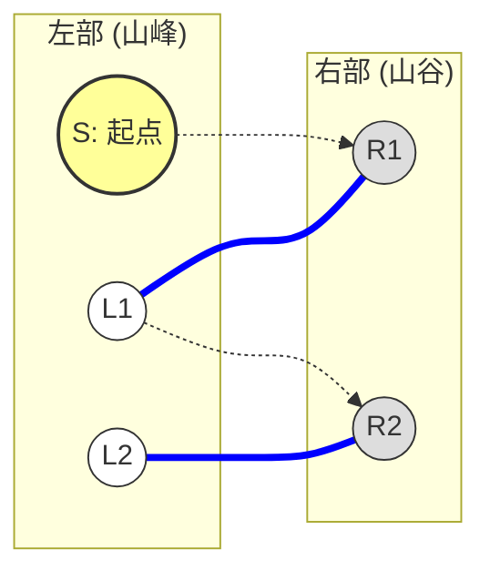
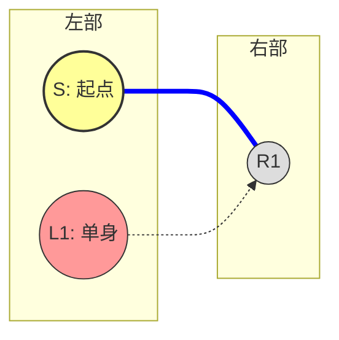
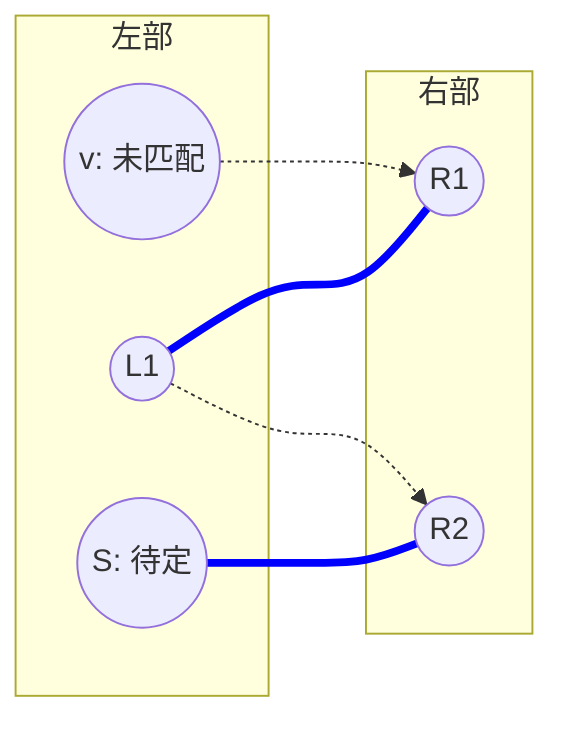
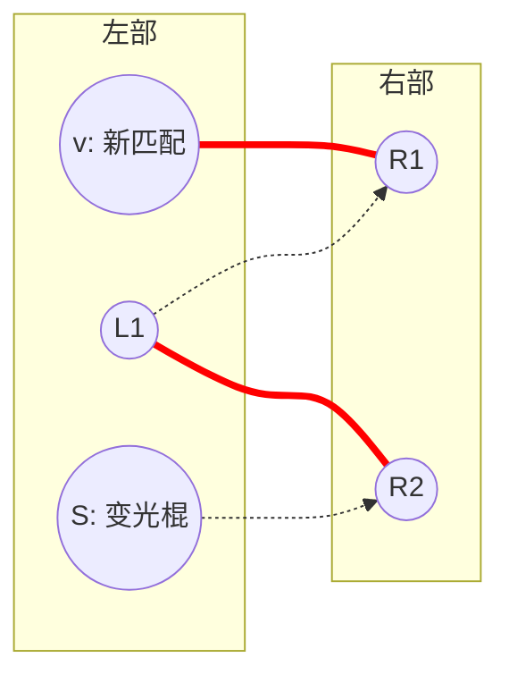

[[TOC]]

## 题目解析

> 你好！我是你的算法老师。很高兴看到你已经掌握了二分图最大匹配（匈牙利算法）和增广路的基本定义。

这道题是 **二分图博弈** 的经典入门题。你现在卡在最核心的博弈结论上：**“为什么起点的匹配状态决定了谁必胜？”**

别担心，这其实是二分图博弈中最迷人也最反直觉的地方。为了让你彻底理解，我们不堆砌数学公式，而是通过图解和逻辑推演来“破解”这个结论。

---

### 一、 游戏规则梳理

首先，我们要把题目中的故事翻译成博弈模型：

1.  **地图**：是一个二分图。
    *   左边集合（山峰）：$L$
    *   右边集合（山谷）：$R$
2.  **角色**：
    *   **先手（Slavko）**：目前在 $L$，必须走到 $R$。
    *   **后手（Mirko）**：目前在 $R$，必须走到 $L$。
3.  **规则**：
    *   交替移动，不能经过重复的点。
    *   **输赢判定**：谁无路可走，谁就输了（标准博弈规则）。
        *   如果停在 $L$（轮到 Slavko 走但没路了），Mirko 赢。
        *   如果停在 $R$（轮到 Mirko 走但没路了），Slavko 赢。

---

### 二、 核心结论图解

我们要证明的结论是：

> **如果起点 $S$ 一定在最大匹配中（即无论怎么画最大匹配，都必须包含 $S$），则先手（Slavko）必胜。否则，后手（Mirko）必胜。**

我们分两种情况来剖析。

#### 情况 1：起点 $S$ 不在某个最大匹配中（Mirko 必胜）

假设我们求出了一个最大匹配（下图中粗线表示匹配边），而起点 $S$ 恰好没有被匹配。

**推演过程：**

1.  **Slavko (先手) 行动**：$S$ 是非匹配点。Slavko 必须沿着某条边走出去，比如走到 $R1$。
    *   注意：$R1$ **一定**是一个匹配点。
    *   *为什么？* 如果 $R1$ 也是非匹配点，那么 $S \to R1$ 就是一条增广路！这就意味着当前匹配不是最大匹配，与假设矛盾。所以 Slavko 只能走到一个“名草有主”的山谷。
2.  **Mirko (后手) 行动**：现在球在 $R1$ 手里。因为 $R1$ 是匹配点，Mirko 只要**沿着匹配边**走回去即可（走到 $L1$）。
    *   这是必经之路吗？是的，这是 Mirko 的最优策略。
3.  **循环**：现在的局势等同于 Slavko 在 $L1$ 重新开始。但 $L1$ 是匹配点，如果 Slavko 再往外走（比如去 $R2$），$R2$ 也必然是匹配点（否则 $S \to R1 \to L1 \to R2$ 就是增广路了）。
4.  **结局**：
    *   Mirko 的策略是：“**你只要敢过来，我就沿着匹配边把你踢回去**”。
    *   因为没有增广路（最大匹配的性质），这条路径**不可能**在右边（山谷）停下。
    *   路径最终一定会停在左边（山峰），轮到 Slavko 走投无路。
    *   **Mirko 胜**。

**结论 1**：如果起点 $S$ 不在最大匹配中，Mirko 只要死守“沿着匹配边走”的策略，Slavko 必输。

---

#### 情况 2：起点 $S$ 在当前的最大匹配中，但“不一定”在所有最大匹配中（Mirko 必胜）

这是最容易绕晕的地方。
**什么叫“不一定”？** 意思是：虽然当前的匹配方案里 $S$ 被匹配了，但我们可以通过“换边”，搞出另一个最大匹配方案，让 $S$ 变成单身。

看下图：

*   当前匹配：$(S, R1)$。$S$ 被匹配了。
*   但是，我们可以发现一条交错路径：$L1 \to R1 \to S$。
*   如果我们把匹配边换一下，变成 $(L1, R1)$，匹配数依然是 1（最大），但 $S$ 变成了**非匹配点**。

**只要 $S$ 能变成非匹配点，就回到了【情况 1】，Mirko 必胜。**

**怎么判断这种情况？**
如果在残量网络里，存在一个非匹配点 $L_{free}$，能够通过交错路径走到 $S$，那我们就可以把这条路径“取反”，让 $L_{free}$ 变成匹配点，让 $S$ 变成非匹配点。

---

#### 情况 3：起点 $S$ 在“所有”最大匹配中（Slavko 必胜）

这是 Slavko 唯一赢的机会。
这意味着：**无论你怎么画最大匹配，都无法让 $S$ 单身。**

**推演过程：**

1.  **Slavko (先手) 行动**：因为 $S$ 一定被匹配，Slavko 只要**沿着匹配边**走向 $R1$。
2.  **Mirko (后手) 行动**：Mirko 现在在 $R1$。
    *   他能不能走到一个非匹配点 $L_{free}$ 从而结束游戏赢下比赛？
    *   **不能！** 如果 Mirko 能从 $R1$ 走到非匹配点 $L_{free}$，那路径就是 $S \to R1 \to L_{free}$。
    *   这又是一条交错路！我们可以把匹配边 $(S, R1)$ 换成 $(R1, L_{free})$。这样 $S$ 就变成单身了。
    *   但这违背了前提：“$S$ 必须在所有最大匹配中”。
    *   所以，Mirko 无论怎么走，都只能走到另一个**匹配点** $L2$。
3.  **结局**：
    *   Slavko 的策略变成了：“**我就沿着匹配边走，把你踢到左边去**”。
    *   这就变成了【情况 1】的角色互换版！
    *   Slavko 只要死守匹配边，Mirko 就不得不走到新的匹配点。
    *   最终一定会停在右边（山谷），轮到 Mirko 走投无路。
    *   **Slavko 胜**。

---

### 三、 总结与算法实现思路

**总结：**

*   **Mirko 赢** $\iff$ 能够找到一种最大匹配方案，使得起点 $S$ 是非匹配点。
    *   这包括两种情况：$S$ 本身就匹配不上；或者 $S$ 虽然匹配了，但可以通过交错路换成非匹配点。
*   **Slavko 赢** $\iff$ 起点 $S$ 被死死锁在匹配中，怎么换都换不出来。

**算法步骤：**
我们不需要枚举所有匹配，只需要反着想：**找出所有“Mirko 赢”的点，剩下的就是“Slavko 赢”的点。**

1.  **跑一遍匈牙利算法**，得到任意一个最大匹配。
2.  **初始标记**：所有在这次匹配中**没被匹配到的左边点**，肯定是 Mirko 赢（对应【情况 1】）。
3.  **传染标记**：
    *   从这些非匹配点出发，沿着 **“非匹配边 -> 匹配边 -> 非匹配边...”** 的顺序走（也就是寻找增广路/交错树）。
    *   凡是能从非匹配点走到的左边点（意味着可以通过“换边”让它变成非匹配点），都是 Mirko 赢（对应【情况 2】）。
4.  **剩余点**：既不是非匹配点，也连不通非匹配点，那就是“铁打的匹配点”，Slavko 赢。

## 补充证明

你的直觉非常敏锐！你列出的 1-5 点逻辑核心是完全正确的。你抓住了问题的本质：**要证明一个点 $S$ 不一定在最大匹配中，等价于找到另一个最大匹配 $M'$，使得 $S \notin M'$。**

只是在第 4、5 步的推导上，我们可以用图论中**交错路（Alternating Path）**的性质来把它从“直觉”变成“严谨的数学证明”。

我来帮你把这部分逻辑补全，使其严丝合缝。

---

### 命题：如何判断点 $S$ 是否“锁定”在所有最大匹配中？

我们定义：
*   $M$：当前求出的任意一个最大匹配。
*   $U_{free}$：在 $M$ 中**未被匹配**的左部点集合。
*   $S$：我们想要检测的、当前在 $M$ 中已匹配的点。

#### 1. 核心逻辑链（完善你的思路）

你提到的 **“从哪里找？一定是从一个新的没有匹配点 $v$ 开始”**，这是最关键的洞察。我们可以这样严谨地描述：

1.  **假设**：存在另一个最大匹配 $M'$，使得 $S$ 在 $M'$ 中是**未匹配**的（即 $S \notin M'$）。
2.  **守恒定律**：因为 $M$ and $M'$ 都是**最大**匹配，它们包含的边数必须相等，即 $|M| = |M'|$。
3.  **彼消此长**：
    *   在 $M$ 中，点 $S$ 贡献了 1 条匹配边。
    *   在 $M'$ 中，点 $S$ 变成了光棍（贡献 0 条）。
    *   为了保持总数 $|M'| = |M|$ 不变，必然存在另一个在 $M$ 中是光棍的点 $v$（即 $v \in U_{free}$），它在 $M'$ 中变成了**已匹配**状态。
4.  **连通性（交错路定理）**：
    *   在二分图中，如果两个匹配 $M$ 和 $M'$ 的大小相等，那么 $M$ 和 $M'$ 的**对称差**（即 $M \oplus M'$，只在其中一个匹配中出现的边）是由若干个**独立的环**和**独立的路径**组成的。
    *   既然 $S$ 的状态改变了（匹配 $\to$ 未匹配），$v$ 的状态也改变了（未匹配 $\to$ 匹配），那么 $S$ 和 $v$ 必然位于同一条**交错路径**上。
    *   这条路径长这样：$v \to \dots \to S$。
5.  **结论**：
    *   如果 $S$ 能变成未匹配点，那么它**必须**能通过一条交错路连通到一个当前未匹配的点 $v$。
    *   反之，如果我们从所有未匹配点 $v$ 出发，搜索所有能到达的已匹配点 $S$，这些 $S$ 就是“可以被替换下来的”。

---

### 2. 图解演示：为什么必须从“未匹配点”出发？

我们来看一个“换人”的过程。这在算法中叫**寻找偶数长度的交错路径**。

假设：
*   **黑色粗线**是当前的最大匹配 $M$。
*   **$v$** 是未匹配点。
*   **$S$** 是我们要检测的点（目前已匹配）。

#### 状态 A：当前的匹配 $M$
$v$ 是光棍，$S$ 匹配了 $R2$。

#### 寻找路径
我们发现一条路径：$v \to R1 \to L1 \to R2 \to S$。
这是一条**交错路**：非匹配边 $\to$ 匹配边 $\to$ 非匹配边 $\to$ 匹配边。

#### 状态 B：取反后的新最大匹配 $M'$
我们将这条路径上的边的状态**取反**（匹配变非匹配，非匹配变匹配）。
总边数不变（2条），但 $v$ 上位了，$S$ 被踢掉了。

**证明总结：**
只有当 $S$ 处于一条以“未匹配点” $v$ 为起点的交错树上时，我们才能通过“取反”操作，把 $v$ 拉进匹配，把 $S$ 挤出匹配，同时保持最大匹配数不变。

---

### 3. 完善后的判定流程

根据上面的证明，我们可以把你的步骤完善为最终的算法逻辑：

1.  **求基准**：先运行一次匈牙利算法，得到一个任意的最大匹配 $M$。
2.  **定初值**：
    *   如果点 $S$ 在 $M$ 中本身就没匹配上，那它肯定不在“所有”最大匹配中（它甚至不在 $M$ 中）。**标记：Mirko 胜**。
    *   将这些**初始未匹配点**加入队列（或作为 DFS 起点）。
3.  **搜路径 (传染)**：
    *   从这些未匹配点出发，沿着 **“非匹配边 $\to$ 匹配边”** 的交错路径进行搜索（BFS 或 DFS）。
    *   凡是能被搜到的左部点 $u$，都意味着它可以通过“路径取反”变成未匹配点。
    *   **标记这些点 $u$：Mirko 胜**。
4.  **下结论**：
    *   所有**没有被标记**的已匹配点，就是“无论如何也甩不掉匹配身份”的点。
    *   **这些点：Slavko 胜**。

这样解释，是否把你心中的那个“缺环”补上了？核心在于：**最大匹配数的守恒性，迫使任何状态的改变都必须通过一条连接“未匹配点”的链式反应来完成。**

---

### 最后的复习

1.  **为什么不一定在最大匹配中 = Mirko 赢？**
    因为 Mirko 可以利用“换边”策略（或者本来就是非匹配点），迫使 Slavko 最终停在左边，无路可走。
2.  **为什么一定在最大匹配中 = Slavko 赢？**
    因为 Slavko 可以利用“匹配边”策略，迫使 Mirko 只能沿着匹配边走，最终停在右边。

希望这个图解和代码解析能帮你彻底搞懂这道题！如果还有哪里卡住了，随时问我。

## 代码 

1.  **标记左部匹配状态**：
    匈牙利算法的 `match` 数组记录的是 `match[右边点] = 左边点`。我们需要反过来知道哪些**左边点**已经被匹配了，方便找到 BFS/DFS 的起点。
2.  **交错路搜索 (DFS)**：
    *   从所有**未匹配的左边点**开始 DFS。
    *   如果在 DFS 中能走到某个左边点 `u`，说明 `u` 可以通过“换边”变成未匹配状态。
    *   标记 `mirko_win[u] = true`。
3.  **输出结果**：
    根据 `mirko_win` 数组输出答案。

@include-code(./1.cpp, cpp)

### 关键点解析（给学生的备忘录）

1.  **为什么需要 `left_matched` 数组？**
    *   你的 `match` 数组只告诉了我们“哪个右边点配了哪个左边点”（`match[Right] = Left`）。
    *   为了找到搜索的**起点**，我们需要知道哪些**左边点**是单身。所以遍历一遍 `match` 数组，把有对象的左边点标记一下，剩下的就是单身点。

2.  **`dfs_mark_mirko` 函数在做什么？**
    *   它的路线是：`左(u) -> 右(v) -> 左(match[v]) -> ...`
    *   `u -> v` 这一步走的肯定是**非匹配边**。
    *   `v -> match[v]` 这一步走的肯定是**匹配边**。
    *   这就是我们在理论部分画的那条“交错路”。凡是这条路上的左边点，都可以通过“取反”操作变成单身，所以它们都是 Mirko 的胜利点。

3.  **时间复杂度**：
    *   匈牙利算法最坏 $O(NM)$，但一般跑不满。
    *   后面的 DFS 每个点和边最多访问一次，是 $O(N+M)$。
    *   对于 $N=5000$，这个算法非常安全。

祝贺你！理解了这一步，二分图博弈的大门就已经向你打开了。