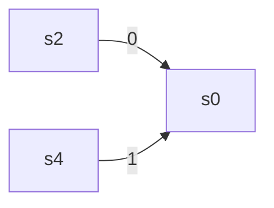
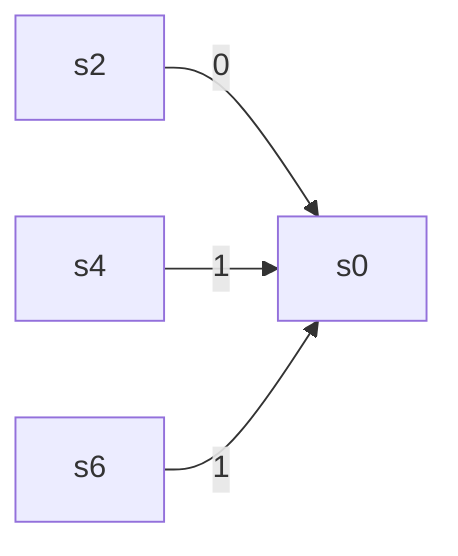
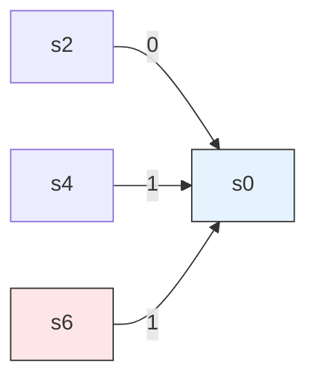

# P5937 DSU 树建模过程

## 处理 ① s[0]⊕s[2]=0

```mermaid
graph LR
    s2 --"0"--> s0
```

## 处理 ② s[2]⊕s[4]=1

```mermaid
graph LR
    s2 --"0"--> s0
    s4 --"1"--> s0
```

## 处理 ③ s[4]⊕s[6]=0

```mermaid
graph LR
    s2 --"0"--> s0
    s4 --"1"--> s0
    s6 --"1"--> s0
```

## 处理 ④ s[0]⊕s[6]=0（发生矛盾）

```mermaid
graph LR
    s2 --"0"--> s0
    s4 --"1"--> s0
    s6 --"1"--> s0
    style s0 fill:#e6f3ff,stroke:#333
    style s6 fill:#ffe6e6,stroke:#333
```
