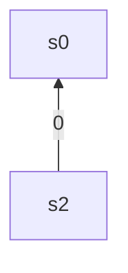
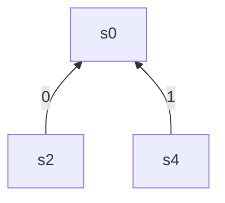
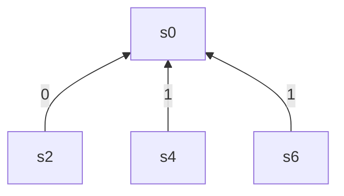
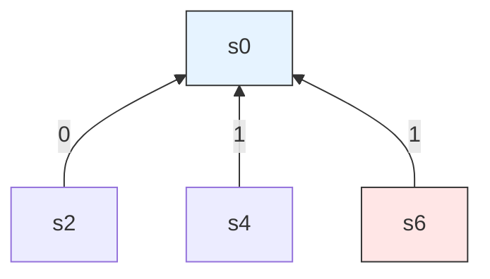

[[TOC]]

### 题意

Alice 写下一个长度为 $n$ 的 $01$ 序列。她依次询问区间 $[l,r]$ 中有奇数个还是偶数个 $1$，Bob 给出 $m$ 个回答。我们要找出第一个**必然错误**的回答：

- 前 $x$ 个回答应该还能由某个 $01$ 序列同时满足；
- 前 $x+1$ 个回答已经不存在任何满足它们的序列。

输出这个 $x$。如果所有回答都没有矛盾，就输出 $m$。

输入中的 `odd` 表示奇数，`even` 表示偶数。题目中 $n$ 最大为 $10^9$，但回答数 $m\le 5000$，所以不能真的创建长度为 $n$ 的数组。

样例中前 3 条回答可以同时成立，第 4 条回答与它们推出的关系相反，因此答案是 $3$。

### 思路

#### 1. 先看最直接的暴力

如果 $n$ 很小，可以枚举所有 $01$ 序列。每生成一个序列，就依次检查回答，记录它最多能满足前多少条回答；所有序列中的最大值就是答案。

这段暴力代码故意保持“每一位做 0/1 选择”的形状。它不适合本题的大数据，却能先把题目的逻辑说清楚：我们要判断的是“是否存在一个序列满足回答前缀”，而不是找出某一个固定序列。

@include-code(./brute.cpp, cpp)

暴力的瓶颈是 $2^n$ 个序列。接下来要做的关键变化是：不再关心每一位具体是 $0$ 还是 $1$，只记录前缀中 $1$ 的奇偶性。

#### 2. 把区间奇偶改写成前缀异或

定义

$$
s[i]=a_1\oplus a_2\oplus\cdots\oplus a_i,
\qquad s[0]=0。
$$

因为异或两次相同的部分会抵消，所以区间 $[l,r]$ 中 $1$ 的奇偶性为

$$
s[r]\oplus s[l-1].
$$

于是每条回答都可以变成两个前缀点之间的关系。令 $x=l-1$，$y=r$：

| Bob 的回答 | 对前缀点的约束 |
|---|---|
| `even` | $s[x]\oplus s[y]=0$，也就是 $s[x]=s[y]$ |
| `odd` | $s[x]\oplus s[y]=1$，也就是 $s[x]\ne s[y]$ |

例如样例前 3 条回答变成：

```text
1 2 even  -> s[0] XOR s[2] = 0
3 4 odd   -> s[2] XOR s[4] = 1
5 6 even  -> s[4] XOR s[6] = 0
```

沿着这三条约束可以推出 $s[0]\oplus s[6]=1$，而第 4 条回答要求 $s[0]\oplus s[6]=0$，所以它矛盾。

注意：$n$ 虽然很大，但每条回答只会用到两个前缀位置 $l-1$ 和 $r$。最多只有 $2m$ 个位置真正出现，可以先离散化这些位置。下面记离散化后的位置个数为 $K$。

#### 3. 解法一：带权并查集

##### 3.1 用样例走一遍并查集建模

在深入公式之前，先用样例数据感受一下：并查集如何一步步建树、如何检查矛盾。

回忆第 2 节，样例前 4 条回答转化为前缀异或约束（$w=0$ 表示 even，$w=1$ 表示 odd）：

| 序号 | 原始回答 | 前缀约束 | $w$ |
|------|----------|----------|---|
| ① | `1 2 even` | $s[0]\oplus s[2]=0$ | $0$ |
| ② | `3 4 odd`  | $s[2]\oplus s[4]=1$ | $1$ |
| ③ | `5 6 even` | $s[4]\oplus s[6]=0$ | $0$ |
| ④ | `1 6 even` | $s[0]\oplus s[6]=0$ | $0$ |

下面边画出并查集树的形态，边说明每一步做了什么。树上每个箭头 `x —[v]→ y` 表示 $\text{parent}[x]=y$，且 $v = s[x]\oplus s[y]$。

**处理 ①：$s[0]\oplus s[2]=0$**

$s[0]$ 和 $s[2]$ 分属两棵树，合并。取 $s[0]$ 为根，$s[2]$ 指向 $s[0]$，边权取 $w=0$：



沿箭头：$s[2]$ 到根的异或为 $0$，即 $s[2]=s[0]\oplus 0=s[0]$。

**处理 ②：$s[2]\oplus s[4]=1$**

$s[2]$ 的根是 $s[0]$（$s[2]\to s[0]$ 位移为 $0$），$s[4]$ 是独立的。现在要把 $s[4]$ 的根也接到 $s[0]$ 下，需要算出 $s[4]$ 到 $s[0]$ 的边权。

沿着路径 $s[0]\to s[2]\to s[4]$：$s[0]$ 到 $s[4]$ 的位移 $=0\oplus 1=1$。



验证：$s[2]$ 到 $s[4]$ = $(s[2]\to s[0]$ 的 $0) \oplus (s[0]\to s[4]$ 的 $1)=1$，满足 ②。

**处理 ③：$s[4]\oplus s[6]=0$**

$s[4]$ 到 $s[0]$ 的位移是 $1$，$s[4]$ 到 $s[6]$ 的位移 $w=0$。沿 $s[0]\to s[4]\to s[6]$：$s[0]$ 到 $s[6]$ 的位移 $=1\oplus 0=1$。



此时可以通过树算出任意两点间的关系。例如 $s[0]\oplus s[6]=1$，$s[2]\oplus s[6]=0\oplus 1=1$。

**处理 ④：$s[0]\oplus s[6]=0$（发生矛盾）**

$s[0]$ 和 $s[6]$ 已经在同一棵树中，走到各自根的位移分别是 $0$ 和 $1$，所以现有关系 $=0\oplus 1=1$。但 ④ 要求的 $w=0$，$1\neq 0$，矛盾！



上图中 $s[0]$（蓝底）和 $s[6]$（红底）是当前回答涉及的两个点。怎么用公式发现矛盾？分三步：

1. **找到各自到根的位移**：$s[0]$ 自身就是根，位移 $\textit{xor}[0]=0$；$s[6]$ 沿箭头走到 $s[0]$，位移 $\textit{xor}[6]=1$。
2. **算出两点间的现有关系**：$\textit{xor}[0]\oplus\textit{xor}[6]=0\oplus 1=1$。这个 $1$ 就是当前 $s[0]\oplus s[6]$ 的值。
3. **跟回答比较**：回答要求的 $w=0$，$1\neq 0$，矛盾！

为什么 $\textit{xor}[x]\oplus\textit{xor}[y]$ 等于 $s[x]\oplus s[y]$？因为两人都以同一个根为参照——$s[x]=s[root]\oplus\textit{xor}[x]$，$s[y]=s[root]\oplus\textit{xor}[y]$，异或后 $s[root]$ 抵消，剩下的正好是 $\textit{xor}[x]\oplus\textit{xor}[y]$。

至此输出 $3$，表示前 $3$ 条回答可以成立。

这段手动过程包含了带权并查集的全部操作：合并时沿路径推导新边权（$\textit{xor}[\textit{ry}] = \textit{xor}[x]\oplus\textit{xor}[y]\oplus w$），以及同集合时用异或检查约束。接下来各节把这个过程写成通用公式。

##### 3.2 普通并查集还缺什么

普通并查集只能回答“两个点是否连通”。本题还需要知道连通点之间是相同还是相反，因此给每个节点增加一个异或权值。

下面把前缀值 $s[x]$ 简写成 `value[x]`，所以 `value[x]` 和 `s[x]` 是同一个东西。

并查集维护下面这个不变量：

```text
xor_to_parent[x] = value[x] XOR value[parent[x]]
```

路径压缩后，`xor_to_parent[x]` 就表示 `value[x] XOR value[root[x]]`。

权值的含义只有两种：

| 权值 | 含义 |
|---|---|
| `0` | 两个前缀值相同 |
| `1` | 两个前缀值相反 |

可以把权值看成 parent[x] 到 x 的位移向量——0 表示"没动"，1 表示"翻了一下"。于是树上任意两点的值差，就是路径上位移向量的逐段异或。

##### 3.3 路径压缩为什么要异或

假设 $x$ 的父亲是 $p$，而 $p$ 的根是 $r$：

$$
value[x]\oplus value[r]
=(value[x]\oplus value[p])\oplus(value[p]\oplus value[r]).
$$

所以递归 `find` 回来后，只需要执行：

```text
xor_to_parent[x] ^= xor_to_parent[old_parent]
```

原来的两段关系就被折叠成一段 $x\to r$ 的关系。这本质上就是向量的三角形法则：x→r 的位移 = x→p 的位移 + p→r 的位移。

##### 3.4 合并公式怎么推出来

当前回答要求

$$
value[x]\oplus value[y]=w,
$$

其中 `w=0` 表示 `even`，`w=1` 表示 `odd`。

设 `rx=find(x)`，`ry=find(y)`。路径压缩后：

$$
\begin{aligned}
value[x]&=value[rx]\oplus xor[x],\\
value[y]&=value[ry]\oplus xor[y].
\end{aligned}
$$

代入约束并整理：

$$
value[rx]\oplus value[ry]
=xor[x]\oplus xor[y]\oplus w.
$$

因此令

```text
relation = xor[x] XOR xor[y] XOR w
```

如果把 `ry` 挂到 `rx`，就设置：

```text
xor[ry] = relation
```

这正好记录了 `value[ry] XOR value[rx]`。从向量视角看，这个公式无非是沿着路径 rx→x→y→ry 把三段位移向量加起来。

代码会按集合大小决定到底挂哪一棵树；因为异或满足交换律，交换两个根后这个 `relation` 数值仍然正确。

##### 3.5 用“关系向量”理解合并

上面的公式也可以用向量首尾相接来记忆。这里的“向量”不是平面几何向量，而是前缀值之间的相对位移；本题中位移只有 `0` 和 `1`，向量相加就是 XOR。

把 `d[x]` 看成从父节点指向 `x` 的关系向量：

```text
d[x] = value[x] XOR value[parent[x]]
```

路径压缩就是把两段向量接成一段：

```text
root ---- d[old_parent] ----> old_parent ---- d[x] ----> x

root ---------------------- d[old_parent] XOR d[x] ----------------------> x
```

合并时，设 `rx=find(x)`、`ry=find(y)`，并且当前回答给出 `x -> y` 的关系 `w`：

```text
rx ---- xor[x] ----> x ---- w ----> y ---- xor[y] ----> ry
```

这里把 `y -> ry` 也写成 `xor[y]`，是因为 XOR 中正向和反向的关系数值相同。

因此两个根之间的关系就是：

```text
rx -> ry = xor[x] XOR w XOR xor[y]
```

这正是代码中的：

```text
relation = xor[x] XOR xor[y] XOR w
```

如果用普通加法向量表达，公式会写成 `dx + w - dy`。但在 XOR 关系中，每个值都是自己的逆元，因为 `a XOR a = 0`，所以“减去 `dy`”和“再 XOR 一次 `dy`”是同一件事。这也解释了为什么本题的合并公式看起来特别简洁。

更一般地说，带权并查集可以看成维护每个节点相对于根的“局部坐标”。合并两棵树，就是根据新约束计算两个局部坐标系原点之间的位移；距离并查集使用普通加减法，而本题使用 XOR。

##### 3.6 同集合时如何判矛盾

如果 `x` 和 `y` 已经在同一个集合，已有关系已经被唯一确定：

```text
old_relation = xor[x] XOR xor[y]
```

`xor[x] XOR xor[y]` 正是 x 沿树走到根再走到 y 的位移和，自然等于 `value[x] XOR value[y]`。

只要 `old_relation != w`，当前回答就是第一条矛盾回答；相等则说明它只是重复描述了已有事实。

##### 3.7 样例跟踪

忽略离散化编号，直接写前缀下标：

| 回答 | 加入的约束 | 当前推出的关系 |
|---|---|---|
| `1 2 even` | $s[0]\oplus s[2]=0$ | $s[0]=s[2]$ |
| `3 4 odd` | $s[2]\oplus s[4]=1$ | $s[0]\oplus s[4]=1$ |
| `5 6 even` | $s[4]\oplus s[6]=0$ | $s[0]\oplus s[6]=1$ |
| `1 6 even` | 要求 $s[0]\oplus s[6]=0$ | 与已有关系 $1$ 冲突 |

因此处理到第 4 条时输出下标 `3`，表示前 3 条回答可以成立。

##### 3.8 带权并查集代码

下面先给出 C++17 版本。它先读入并离散化所有前缀坐标，再用数组实现并查集。

@include-code(./main.cpp, cpp)

Python 版本使用字典按需创建节点，不需要把 $10^9$ 范围的坐标压成数组下标；权值维护完全相同。

@include-code(./main.py, python)

#### 4. 解法二：2N 并查集

带权并查集把“相同/相反”压缩成一个二进制权值。另一种更直观的办法是：把每个前缀变量拆成两个角色。

对离散化后的每个前缀点 $x$ 建立：

```text
x       表示 value[x] = 0
x + K   表示 value[x] = 1
```

这两个角色不能在同一个集合中。若最终出现 `find(x)==find(x+K)`，就说明同一个变量被迫同时取 $0$ 和 $1$，已经矛盾。

##### 4.1 每条约束如何转成合并

| 关系 | 合并操作 |
|---|---|
| $value[x]=value[y]$（`even`） | `union(x, y)`，`union(x+K, y+K)` |
| $value[x]\ne value[y]$（`odd`） | `union(x, y+K)`，`union(x+K, y)` |

这就是“敌人的敌人是朋友”：如果 $x$ 和 $y$ 不同，那么 `x=0` 要和 `y=1` 归为一类，`x=1` 要和 `y=0` 归为一类；两条“不等”关系连起来，自然会推出两点相等。

##### 4.2 为什么这样一定能判冲突

每个节点的两个角色代表它的两种可能取值。合并操作只连接彼此必须同时成立的角色：

- 相等约束连接同值角色；
- 不等约束连接异值角色。

如果某个变量的两个角色被并到同一连通分量，说明约束链同时要求它取 0 和取 1；反之，只要所有变量的两个角色仍然分离，就可以从每个连通分量中选择一种取值，满足当前所有关系。因此 `find(x)==find(x+K)` 恰好等价于矛盾。

##### 4.3 2N 并查集代码

C++ 版本如下：

@include-code(./main-2N-dsu.cpp, cpp)

Python 版本也保留在仓库中。它和 C++ 一样先完成坐标压缩，固定 `offset=K`，避免新坐标出现时第二层编号发生变化。

@include-code(./main-2N-dsu.py, python)

#### 5. 两种解法怎么选

| 对比项 | 带权并查集 | 2N 并查集 |
|---|---|---|
| 节点数 | $K$ | $2K$ |
| 额外信息 | 每条父边存一个异或权 | 不存权，只复制两种角色 |
| 合并 | 推导 `relation` 后合并一次 | 每条约束合并两次 |
| 判矛盾 | 检查两点已有异或关系 | 检查 `x` 与 `x+K` 是否同根 |
| 学习重点 | 带权并查集的路径压缩与公式 | 种类并查集、敌我关系建模 |

两种写法的时间复杂度都足够通过本题。第一次学习时，建议先用 2N 并查集建立“角色连通”的直觉，再回到带权并查集理解如何把两种角色压缩成一个异或权值。

#### 6. 常见错误

1. **忘记把左端点改成 `l-1`**：区间前缀关系一定是 `s[r] XOR s[l-1]`。
2. **把 `even` 当成 1**：本题中 `even=0`、`odd=1`，它们正好就是异或约束的右值。
3. **路径压缩时只改父亲不改权值**：压缩后权值必须把两段路径异或起来。
4. **2N 写法的偏移量中途改变**：若使用 `x+K`，必须先知道最终的 `K`；Python 版本因此先读完查询再离散化。
5. **输出第一条错误回答的编号**：循环下标从 0 开始，若第 `i` 条回答矛盾，应输出 `i`，它正好等于前面已经正确的回答数。

### 代码

本题保留 Python 解，同时提供等价的 C++17 解：

#### 带权并查集

@include-code(./main.cpp, cpp)

@include-code(./main.py, python)

#### 2N 并查集

@include-code(./main-2N-dsu.cpp, cpp)

@include-code(./main-2N-dsu.py, python)

### 复杂度

设不同前缀坐标的数量为 $K$，则 $K\le 2m$。

- 坐标排序和离散化：$O(m\log m)$。
- 带权并查集：$O(m\alpha(K))$ 时间，$O(K)$ 空间。
- 2N 并查集：$O(m\alpha(K))$ 时间，$O(2K)$ 空间。
- Python 带权版本用字典保存实际出现的坐标，空间复杂度同样为 $O(K)$。

其中 $\alpha$ 是反阿克曼函数，可以认为增长极慢。

### 总结

这题的真正主线只有三步：

1. **区间奇偶转前缀异或**：$[l,r]$ 的答案变成 $s[l-1]\oplus s[r]$。
2. **维护前缀点之间的相等/相反关系**：可以用带异或权的并查集，也可以把每个点拆成 0/1 两个角色，用 2N 并查集维护。
3. **按输入顺序找第一条冲突**：新约束若与已有关系不一致，当前下标就是答案。

带权并查集的核心不变量是“节点到根的异或值”；2N 并查集的核心不变量是“同一变量的两个角色不能同根”。理解这两个不变量，今后遇到相等/不等、同类/异类、奇偶关系的题目，就能快速识别出对应的并查集模型。

### 一图流解析

这张图把本题的建模、两种并查集、实现检查和训练方法压缩到一页，适合读完正文后复盘。


## 推荐

本题的权值只有 `0/1`，所以用 XOR 就能表示“相同/相反”。如果想把“关系向量”的视角继续练熟，建议沿着下面的顺序做题：先练普通加法位势，再练多状态循环关系。

### 1. 距离型位势：P1196「银河英雄传说」

题目链接：[P1196 [NOI2002] 银河英雄传说](../1196/index.md)

这题维护的是战舰到队头的相对距离：

- `dist_to_head[x]` 就是节点相对于根的位移；
- 路径压缩时把两段距离相加；
- 合并两列时，根据另一列的长度设置根之间的位移。

它和 P5937 的代码骨架几乎一样，区别只是“关系的加法”换了：

```text
P5937：相对位移用 XOR，只有 0/1 两种关系
P1196：相对位移用普通加法，表示实际距离
```

练习时重点检查：父子方向是什么、路径压缩后距离如何累加、合并时为什么要加上另一棵树的大小。

### 2. 模 $k$ 关系：P2024「食物链」

题目链接：[P2024 [NOI2001] 食物链](../2024/index.md)

这题可以看成 `k=3` 的循环关系：同类、吃、被吃分别相差 $0$、$1$、$2$。它通常用 3N 拆点来写，但底层关系仍然是模 3 的加法：

$$
rel(x,z)=(rel(x,y)+rel(y,z))\bmod 3。
$$

建议分两步练习：

1. 先用题解中的 3N 拆点法，熟悉“一个对象对应多个关系角色”；
2. 再尝试把每条父边改成一个 `0/1/2` 的模 3 权值，自己推导路径压缩和合并公式。

这样就能从本题的二元 XOR 关系，迁移到一般的模 $k$ 关系并查集。

### 3. XOR 约束进阶：Codeforces 1615D「X(or)-mas Tree」

题目链接：[Codeforces 1615D X(or)-mas Tree](https://codeforces.com/problemset/problem/1615/D)

这题把 XOR 关系放到了树上：边权可能未知，但给出的路径约束必须同时成立。它适合用来练习“已知两点相对 XOR，如何沿树传递并检查冲突”，是本题前缀点关系模型的图结构版本。

练习时先不要急着套模板，先明确每条树边的 `0/1` 关系，再思考如何把“路径 XOR”转成节点到根的相对关系。

### 4. 2N 拆点进阶：Codeforces 468B「Two Sets」

题目链接：[Codeforces 468B Two Sets](https://codeforces.com/problemset/problem/468/B)

这题适合继续训练 2N 并查集：每个元素都有两种互补选择，约束会把“选择 0”的节点和另一个元素的某种角色连起来。它不再是区间奇偶，但“为每个对象建立两个角色、用并查集维护互斥关系”的思想完全相通。

练习重点是自己写出：

- 两个角色分别代表什么；
- 一条约束要合并哪两对节点；
- 如何检查一个元素的两个角色是否被合并到同一集合。

### 推荐顺序

```text
P5937：模 2 / XOR，理解关系权值
  -> P1196：普通加法，理解距离位势
  -> P2024：模 3，理解多状态循环关系
  -> CF 1615D：树上的 XOR 路径约束
  -> CF 468B：两层角色与互补选择
```
