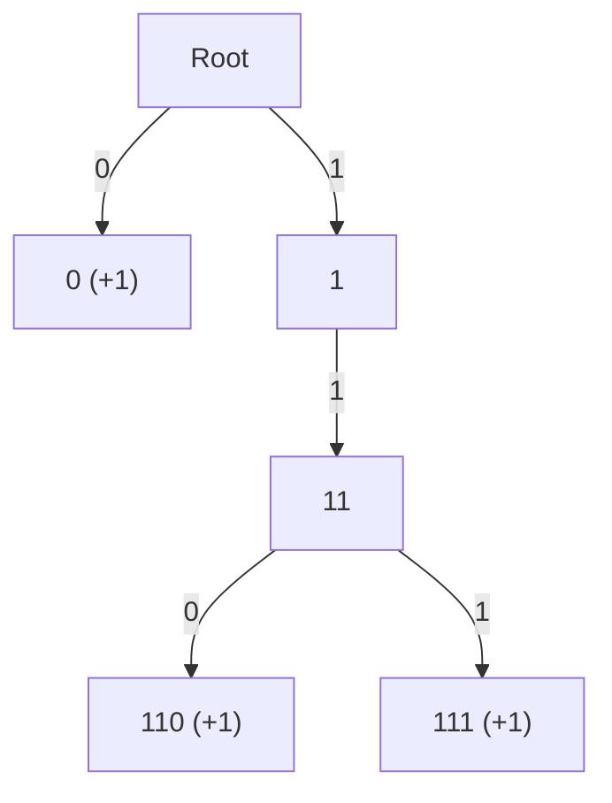
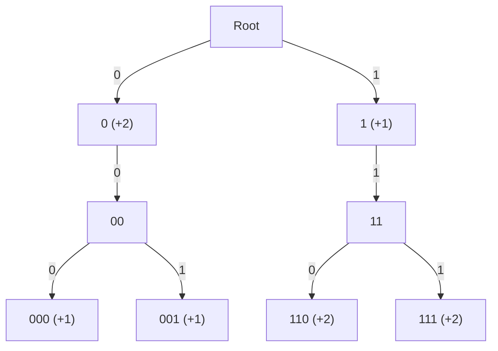

[[TOC]]

### 题意

任选非负整数 $x$，最大化满足 $(a_i \oplus x) \le k$ 的元素数量。

**数据范围**：$1 \le n, k, a_i \le 10^6$。

### 思路

#### 人脑思考路径

**一句话本质**：将“对选择的 $x$ 遍历 $a_i$ 进行合法性判定”转化为“对于每个 $a_i$，在 $x$ 的字典树（超平面）上进行区间/子树贡献覆盖”。

**直接枚举 $x$ 的瓶颈在哪里？**
由于 $x$ 可以是任意非负整数，虽然有用范围在位宽以内（约 $2^{20}$），但如果针对每个 $x$ 都去扫描一遍 $n$ 个数进行异或判定，总复杂度将高达 $O(N \cdot 2^{20})$，这在 $n \le 10^6$ 的数据范围下是无法接受的。我们必须避免“选择一个 $x$ 再去匹配所有 $a_i$”的被动思路。

**如果反过来思考，从每一个独立的 $a_i$ 出发会看到什么？**
对于一个确定的 $a_i$，能让 $(a_i \oplus x) \le k$ 成立的 $x$ 并不是杂乱无章的。由于大小比较是二进制字典序，这等价于 $a_i \oplus x$ 的高位与 $k$ 相同，且在某个 $k$ 为 1 的数位上异或结果取 0 使得低位可以任取。如果我们把 $x$ 视为未知数前缀，那么每个 $a_i$ 能接受的所有 $x$ 集合可以分解成若干个“高位确定、低位任取”的前缀区间。在 01-Trie 上，这些区间恰好对应着若干个不相交的整棵子树。

**如何在 Trie 树上刻画这些能接受 $x$ 的子树？**
我们可以直接构建 $x$ 的 01-Trie。对于每个 $a_i$，顺着异或字典序的比较过程，在树上查找：
1. 如果遇到 $k$ 的当前位为 $1$，只要 $x$ 的当前位取 $a_i$ 的当前位，异或值即为 0，这部分 $x$ 的子树已经严格小于 $k$，我们可以对其根节点打上 `+1` 懒标记，代表这片区域全部被 $a_i$ 覆盖；同时为了处理“相等”的情况，指针走向另一条分支（让异或值为 1）继续深入比较。
2. 如果遇到 $k$ 的当前位为 $0$，异或值绝对不能为 1，所以指针必须且只能走向让异或值为 0 的那条分支。
3. 走到底层时，对于相等的分支也打上 `+1` 标记。

**如何得到最终的答案？**
当我们把所有 $a_i$ 的合法区间在 $x$ 的 Trie 树上全部打上标记之后，我们只需要从根节点出发，做一次 DFS 把高层的懒标记累加并下传（Push Down）到所有叶子节点。每个叶子节点最终累加得到的覆盖值，就代表该叶子对应的数值 $x$ 能够喝到的可乐箱数。最后扫描所有叶子，求最大值即可。这就像是在树上做了一次一维区间的“差分与前缀和”。

---

#### 1. 核心思路：贡献覆盖

要用 01-Trie 来解这道题，我们的核心思路从单纯的“查找”转变为“**贡献覆盖**”。

我们不再是拿着一个确定的 $x$ 去树上找有多少个 $a_i$ 满足条件，而是**把每个 $a_i$ 能够接受的所有 $x$ 对应的节点，在 01-Trie 上打上 `+1` 的懒标记（Lazy Tag）**。最后通过一次 DFS 把标记下传到叶子节点，找出被覆盖次数最多的叶子就是最佳的 $x$。

#### 2. 详细遍历与打标规则

对于 01-Trie 的遍历，当我们处理 $k$ 的第 $j$ 位时：

1. **若 $k_j = 1$**：说明 $a_i \oplus x$ 的这一位如果取 `0`，那么整体已经**严格小于** $k$。此时低位可以任取。我们直接给 $x_j = a_i[j] \oplus 0$ 对应的分支打上 `+1` 标记；同时，为了处理等于的情况，当前指针必须向 $x_j = a_i[j] \oplus 1$ 的分支继续深入。
2. **若 $k_j = 0$**：说明 $a_i \oplus x$ 的这一位只能取 `0`，否则会大于 $k$。我们没有“严格小于”的分支可以选，指针只能向 $x_j = a_i[j] \oplus 0$ 的分支深入。

---

#### 3. 样例 1 全局模拟

已知：
* $k = 5$，二进制为 `101`（低 3 位：位 2, 位 1, 位 0）。
* 序列 $a = \{2, 3, 4\}$，二进制分别为 `010`, `011`, `100`。

##### 步骤一：处理 $a_1 = 2 \ (010_2)$

当前路径前缀为空，从根节点出发。

* **第 2 位 ($k_2 = 1, a_1[2] = 0$)**：
  * 严格小于：$x_2 = 0 \oplus 0 = 0$。给左分支（代表 `0xx`）打上 `+1` 标记。
  * 保持相等：指针走向 $x_2 = 0 \oplus 1 = 1$。目前路径为 `1`。
* **第 1 位 ($k_1 = 0, a_1[1] = 1$)**：
  * 只能保持相等：$x_1 = 1 \oplus 0 = 1$。指针走向 `1`。目前路径为 `11`。
* **第 0 位 ($k_0 = 1, a_1[0] = 0$)**：
  * 严格小于：$x_0 = 0 \oplus 0 = 0$。给节点 `110` 打上 `+1` 标记。
  * 保持相等：指针走向 $x_0 = 0 \oplus 1 = 1$。目前路径为 `111`。
* **末尾**：抵达叶子节点 `111`，给精确匹配的叶子打上 `+1`。

###### 状态图 1
下图展示了在插入第一个元素 $a_1 = 2$ 并根据 $k=5$ 的数位决策进行标记后的 01-Trie 状态：

从该图中可以看出：
- 左分支 `0` 被打上 `+1` 标记，表示所有以 `0` 开头的 $x$（即 `000` 到 `011`）都在第一步被覆盖。
- 随后指针沿着相等路径走向右分支，最终在 `110` 打上 `+1`，并在精确相等的叶子 `111` 处也打上 `+1`。

##### 步骤二：处理 $a_2 = 3 \ (011_2)$

当前路径前缀为空，重置到根节点。

* **第 2 位 ($k_2 = 1, a_2[2] = 0$)**：
  * 严格小于：$x_2 = 0 \oplus 0 = 0$。给左分支 `0` 打上 `+1` 标记（此时 `0` 节点的 tag 累加为 2）。
  * 保持相等：指针走向 $x_2 = 0 \oplus 1 = 1$。目前路径为 `1`。
* **第 1 位 ($k_1 = 0, a_2[1] = 1$)**：
  * 只能保持相等：$x_1 = 1 \oplus 0 = 1$。指针走向 `1`。目前路径为 `11`。
* **第 0 位 ($k_0 = 1, a_2[0] = 1$)**：
  * 严格小于：$x_0 = 1 \oplus 0 = 1$。给节点 `111` 加上 `+1`（注意，这是给子树打标记）。
  * 保持相等：指针走向 $x_0 = 1 \oplus 1 = 0$。目前路径为 `110`。
* **末尾**：抵达叶子节点 `110`，给该叶子打上 `+1`。

###### 状态图 2
下图展示了继续插入第二个元素 $a_2 = 3$ 后的 01-Trie 状态：

从该图中可以看出：
- 由于 $a_2$ 在高位与 $a_1$ 相同，左分支 `0` 再次被覆盖，标记值累加到了 `+2`。
- 右侧子树 `11` 分支下，节点 `110` 和 `111` 各自再次得到 `+1` 标记，标记值都累计到了 `+2`。

##### 步骤三：处理 $a_3 = 4 \ (100_2)$

回到根节点。

* **第 2 位 ($k_2 = 1, a_3[2] = 1$)**：
  * 严格小于：$x_2 = 1 \oplus 0 = 1$。给右分支 `1` 打上 `+1` 标记。
  * 保持相等：指针走向 $x_2 = 1 \oplus 1 = 0$。目前路径为 `0`。
* **第 1 位 ($k_1 = 0, a_3[1] = 0$)**：
  * 只能保持相等：$x_1 = 0 \oplus 0 = 0$。指针走向 `0`。目前路径为 `00`。
* **第 0 位 ($k_0 = 1, a_3[0] = 0$)**：
  * 严格小于：$x_0 = 0 \oplus 0 = 0$。给节点 `000` 打上 `+1`。
  * 保持相等：指针走向 $x_0 = 0 \oplus 1 = 1$。目前路径为 `001`。
* **末尾**：抵达叶子 `001`，打上 `+1`。

###### 状态图 3
下图展示了插入第三个元素 $a_3 = 4$ 后的最终 01-Trie 标记分布形态：

从该图中可以看出：
- 插入 $a_3$ 时，右分支 `1` 被打上 `+1` 标记。
- 在左侧分支下，节点 `00` 被创建，叶子 `000` 和 `001` 各自被标记，形成了整棵树的最终覆盖状态。

##### 步骤四：标记下传 (Push Down) 找答案

现在我们要把高层的 Tag 像瀑布一样流到叶子节点，计算每个叶子最终受到的覆盖总和。

* 根节点的左孩子 `0` 原本有 `+2` 的 Tag，它会将这 `+2` 继承给它的所有子孙（即 `000, 001, 010, 011`）。
  * 叶子 `000`：继承 `+2`，自身有 `+1` -> 总计 **3**
  * 叶子 `001`：继承 `+2`，自身有 `+1` -> 总计 **3**
  * 叶子 `010` 和 `011`：只继承 `+2` -> 总计 **2**
* 根节点的右孩子 `1` 有 `+1` 的 Tag，同样下传（给 `100` 到 `111`）。
  * 叶子 `100` 和 `101`：只继承 `+1` -> 总计 **1**
  * 叶子 `110`：继承 `+1`，加上之前累计的 `+2` -> 总计 **3**
  * 叶子 `111`：继承 `+1`，加上之前累计的 `+2` -> 总计 **3**

扫描所有叶子节点，最大覆盖数为 **3**（当 $x = 000, 001, 110, 111$ 即 $x \in \{0, 1, 6, 7\}$ 时，都能喝到 3 箱可乐），这与样例 1 的输出完全吻合！

---

#### 4. 概念模型与数学本质

##### 集合重叠（最大覆盖）本质
对于每一个 $a_i$，满足条件 $a_i \oplus x \le k$ 的 $x$ 构成了一个个独立的集合 $S_i = \{x \mid a_i \oplus x \le k\}$。题目所求的“使得喝到可乐箱数最大”的 $x$，其本质就是寻找一个元素 $x$，使得包含 $x$ 的集合 $S_i$ 的数量最大。
01-Trie 在这里扮演了**集合的高效表示与区间求和工具**角色。每个 $S_i$ 在 $x$ 的 01-Trie 上都表现为至多 $\log V$ 个子树的并集。我们在 Trie 上给这些对应的子树打上 `+1` 懒标记，最后通过 DFS 累加下传，本质上就是在求所有集合在具体元素（叶子 $x$）上的覆盖重叠度，以此高效定位出重叠度最高的数字。

##### 算子映射
在 01-Trie 的拓扑结构中，从根到叶子的深度递增，映射了布尔空间维度的坍缩。条件 $a_i \oplus x \le k$ 中的 $k$ 作为截断条件，本质上是对超立方体进行的“半空间切割”。那些严格小于的分支，就是在高维空间中被完全包含的子立方体，因此可以对该子树对应的根节点进行一次 $O(1)$ 的标量赋值（Lazy Tag）。

##### 思维模板：Trie 树懒标记
在求解“最大化满足条件的元素个数”时，如果判定条件是前缀强相关的位运算，将其转换为“对所有合法前缀打 Tag，最后 DFS 聚合”。这等价于在一维空间里进行区间差分。

##### 快速识别
* **指纹特征**：给定数组 $A$，求使得 $\sum [A_i \oplus X \le K]$ 最大的 $X$。
* **结构等价**：这种全局询问的问题，如果用 01-Trie 做，实际上就是“树上差分 / 懒标记下推”；如果降维到一维数组，就是“区间差分 + 前缀和”。两者数学本质完全同构。

##### 数学推导
设 Trie 树上节点 $u$ 代表前缀 $P_u$。令 $Tag(u)$ 为该节点获得的标记值。
对于任意叶子节点 $v$（对应特定的整数 $x$），其最终覆盖度 $C(v)$ 等于根到该叶子路径上所有标记的和：

$$C(v) = \sum_{u \in Path(Root \to v)} Tag(u)$$

这完美避免了枚举 $x$，将 $O(V \log V)$ 的复杂度降维到 $O(N \log V)$ 建树 + $O(V)$ 遍历。

#### 5. 避坑指南

* **标记位置的选择**：在处理严格小于分支时，容易搞错是要把标记打在“当前节点”还是“下一个状态的节点”上。一定要记住，标记必须打在**与 $x$ 的二进制位对应的边走向 of 子节点**上。
* **DFS 剪枝与遍历优化**：如果一个分支从没被创建过，说明没有 $a_i$ 在那个分支上有比当前更深的贡献。我们在 DFS 遍历时，不需要访问不存在的空分支，直接遍历已有分支即可，因为未建出的隐式分支的最大贡献必然不超过其非空祖先。

### 代码

@include-code(./main.py, python)

@include-code(./main.cpp, cpp)

静态数组版（与模板版同思路：打标记规则相同，DFS 下传时只结算实际分配出来的叶子）：

@include-code(./main-dfs.cpp, cpp)

### 复杂度

设值域位数为 $L \le 21$（$a,k \le 10^6 < 2^{20}$，实际最高位 ≤ 19，代码 `MAX_BIT=20` 留一位余量）。打标记为 $O(nL)$，DFS 下传只遍历已建节点，整体时间与空间均为 $O(nL)$。

**为什么 DFS 不会超时**：下传只遍历"实际分配出来的节点"——每个 `insert` 沿 $L$ 位走一遍、每层最多新建 1 个节点（共享前缀复用），所以节点数 $\le nL + 1 \approx 2.1 \times 10^6$（$n = 10^5$），每个节点 $O(1)$ 结算。对比理论满二叉树：$L$ 位对应 $2^L$ 个叶子（即可能的 $x$ 个数）、满树节点 $2^{L+1}-1$——就算遍历满树也很快，但完全没有必要。

**为什么隐式叶子不用访问（正确性）**：一个已分配叶子 $u$ 的累计值 $acc(u)$ 恰好等于它下面所有隐式 $x$ 的覆盖数——接受性只由根到 $u$ 路径上的标记决定，$u$ 之下没有更深的标记，整片区域共享同一个 $acc$。所以"结算已分配叶子取最大" = "全体 $2^L$ 个 $x$ 的最大覆盖"，一个不漏。

### 总结

本题通过将 $(a_i \oplus x) \le k$ 的判定转化为 $x$-Trie 上的区间标记覆盖，成功将异或前缀关系映射到树上。利用“区间差分”的思想打懒标记并进行 DFS 一次性下传，极大地优化了暴力枚举的复杂度。
