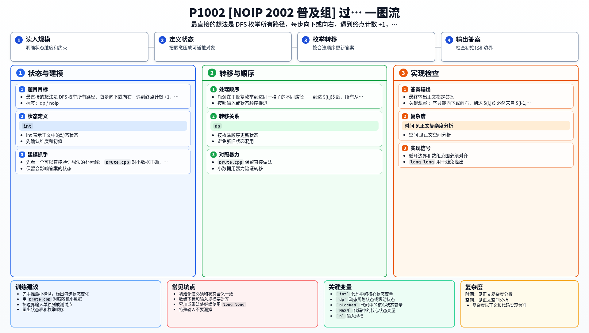

[[TOC]]

### 题意

卒从 `(0,0)` 走到 `(n,m)`，每次只能向右或向下。棋盘上有一匹马，马所在格和马一步能跳到的格子都不能经过。

求从起点到终点的合法路径数。

### 思路

先标记所有不能走的格子：

- 马所在位置；
- 马按日字跳能到达的 8 个位置。

然后做网格 DP。令 `dp[x][y]` 表示从 `(0,0)` 走到 `(x,y)` 的路径数。

如果 `(x,y)` 被马控制：

```text
dp[x][y] = 0
```

否则卒只能从上方或左方走来：

```text
dp[x][y] = dp[x-1][y] + dp[x][y-1]
```

不存在的来源按 `0` 处理，起点 `dp[0][0] = 1`。

#### 样例 DP 表格

样例中 `B=(6,6)`，马在 `(3,3)`，`x` 表示控制点：

| x\\y | 0 | 1 | 2 | 3 | 4 | 5 | 6 |
|---|---|---|---|---|---|---|---|
| 0 | 1 | 1 | 1 | 1 | 1 | 1 | 1 |
| 1 | 1 | 2 | x | 1 | x | 1 | 2 |
| 2 | 1 | x | 0 | 1 | 1 | x | 2 |
| 3 | 1 | 1 | 1 | x | 1 | 1 | 3 |
| 4 | 1 | x | 1 | 1 | 2 | x | 3 |
| 5 | 1 | 1 | x | 1 | x | 0 | 3 |
| 6 | 1 | 2 | 2 | 3 | 3 | 3 | 6 |

最终 `dp[6][6] = 6`。

### Python 知识

- 二维数组要用 `[[0] * (m + 1) for _ in range(n + 1)]`，不要写成浅拷贝形式。
- 马的 9 个控制偏移可以放在列表里统一枚举。
- Python 大整数自动扩展，路径数不需要手写高精度。

参考笔记：

- `/home/rainboy/mycode/hugo-blog/content/program_language/python/cpp_to_python_pitfalls.md`
- `/home/rainboy/mycode/hugo-blog/content/program_language/python/math_tools.md`

### 代码

@include-code(./main.py, python)

@include-code(./main.cpp, cpp)


### 复杂度

标记控制点是 $O(1)$，DP 遍历整个棋盘是 $O(nm)$。空间复杂度为 $O(nm)$。

### 总结

只向右和向下走，说明每个格子只依赖上方和左方；把不能走的格子强制为 `0`，就是完整的网格路径计数 DP。

### 一图流解析

这张图可以作为读完正文后的复盘。


