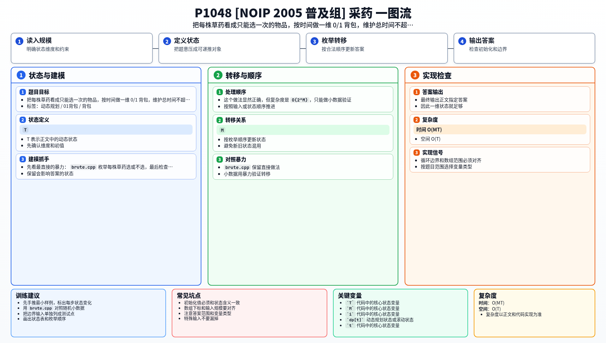

[[TOC]]

## 形式化题目

给定 $M$ 件物品，第 $i$ 件物品消耗 $time_i$、价值 $value_i$。给定总容量 $T$，每件物品至多选一次，求总消耗不超过 $T$ 时的最大总价值。

## 暴力

先看最直接的暴力：

@include-code(./brute.cpp, cpp)

`brute.cpp` 把每株草药看成一个 01 选择：`choose_herb[i] = 0/1` 表示不采或采。递归先生成完整选择，叶子节点再检查总时间是否超限，并统计总价值。

这个做法显然正确，但复杂度是 $O(2^M)$，只能做小数据验证。

## 思路

**一句话本质：** 把每株草药看成重量和价值对应的物品，按时间做 0/1 背包——每个物品只能选一次。

本题给出两种解法，它们是同一个状态定义下的两种填表方式：

- **解法一：记忆化搜索**（`main-memo.cpp`）。定义二维状态 `f[n][time]`，用递归自顶向下填表，第一次算完就存起来。
- **解法二：一维 0/1 背包**（正式主解，对应 `main.cpp`）。把状态压成一维 `dp[t]`，自底向上迭代填表，容量倒序枚举保证每株草药最多采一次。

两种解法的核心都是：**不记录“选了哪几株”，只记录“前几株、用了多少时间、拿到多少价值”**。区别只是记忆化搜索保留二维状态、一维 DP 把状态滚动压缩。

#### 样例 DP 状态表

以样例为例：$T = 70, M = 3$，三株草药为 $(71, 100), (69, 1), (1, 2)$。

这张表展示二维状态 `f[n][time]` 的关键转移，观察每个状态如何从“前 $n-1$ 株”的状态推出来：

| 状态 | 值 | 转移来源 |
| --- | --- | --- |
| `f[1][70]` | 0 | 草药 1 耗时 71 > 70，只能不选 |
| `f[2][69]` | 1 | 选草药 2：`f[1][0] + 1 = 1` |
| `f[2][70]` | 1 | 选草药 2：`f[1][1] + 1 = 1`，和不选（`f[1][70] = 0`）取最大 |
| `f[3][70]` | 3 | 选草药 3：`f[2][69] + 2 = 3`，和不选（`f[2][70] = 1`）取最大 |

答案 $f[3][70] = 3$，对应采草药 2 和草药 3（耗时 $69+1=70$，价值 $1+2=3$）。

## 解法一：记忆化搜索

### 思路

暴力卡在 $O(2^M)$：搜索树里有大量“路径不同、状态相同”的节点。比如先采草药 1 再采草药 2，和先采 2 再采 1，之后面对的都是“剩余时间相同、可选草药相同”的局面，答案完全一样，暴力却会把它们各算一遍。

记忆化搜索只做一件事：把 `dfs` 的参数当成状态，第一次算完存进 `memo`，以后再遇到直接返回。

设 `dfs(n, time)` 表示只考虑前 `n` 株草药、时间上限为 `time` 时的最大总价值：

- 不采第 `n` 株：`dfs(n-1, time)`
- 采第 `n` 株（需要 `time >= need_time[n]`）：`dfs(n-1, time - need_time[n]) + herb_value[n]`
- 两者取较大值

边界是 `n == 0`（没有草药可用）时答案为 0。

状态 `(n, time)` 最多只有 $M \times T$ 个，每个状态只算一次，所以复杂度从指数级降到 $O(MT)$。

和 `brute.cpp` 的区别：暴力递归只带当前枚举位置，已用时间藏在路径里不参与去重，于是有 $2^M$ 条路径；记忆化把“前 $n$ 株、时间上限 $time$”当作完整状态，不同路径到达同一状态时只算一次。

### 代码

@include-code(./main-memo.cpp, cpp)

### 复杂度

- 时间复杂度：$O(MT)$，每个状态 `(n, time)` 至多计算一次
- 空间复杂度：$O(MT)$，需要 `memo[M+1][T+1]` 保存全部状态；递归深度至多 $M$

## 解法二：一维 0/1 背包（正式主解）

### 思路

解法一用二维表 `f[n][time]` 填表。观察转移可以发现：第 `n` 层只依赖第 `n-1` 层，因此可以把第一维滚动掉，只保留一维 `dp[t]`。

设 `dp[t]` 表示时间上限为 `t` 时能取得的最大总价值。处理第 $i$ 株草药时：

- 不采它：`dp[t]` 不变
- 采它：从 `dp[t - need_time[i]]` 转移过来，再加上 `herb_value[i]`

所以转移是：

$$
dp_t=\max(dp_t,\ dp_{t-time_i}+value_i)
$$

**为什么要倒序枚举 $t$？**

因为每株草药最多采一次。如果正序，当从 `dp[t - time_i]` 更新 `dp[t]` 时，`dp[t - time_i]` 可能刚在本轮被这株草药更新过，等于同一株草药被采了多次——那是完全背包的做法。倒序保证 `dp[t - time_i]` 还是上一轮（前 $i-1$ 株草药）的最优值。

#### 样例一维更新表格

还是上面的样例，观察 `dp` 一维数组如何逐株更新：

| 处理草药 | $time_i$ | $value_i$ | $dp$ 变化（关键容量） |
| --- | --- | --- | --- |
| 初始 | — | — | $dp_{0 \sim 70} = 0$ |
| 草药 1 | 71 | 100 | 71 > 70，无法放入，$dp$ 不变 |
| 草药 2 | 69 | 1 | $dp_{69} = 1, dp_{70} = 1$ |
| 草药 3 | 1 | 2 | $dp_1 = 2, dp_{69} = 2, dp_{70} = \max(1, dp_{69}+2) = 3$ |

答案 $dp_{70} = 3$，与解法一的 `f[3][70]` 一致。

### 代码

@include-code(./main.cpp, cpp)

### 复杂度

- 时间复杂度：$O(MT)$
- 空间复杂度：$O(T)$

## 复杂度对比

| 解法 | 时间复杂度 | 空间复杂度 | 特点 |
| --- | --- | --- | --- |
| 暴力 `brute.cpp` | $O(2^M)$ | $O(M)$ | 思路最直接，只适合小数据 |
| 解法一 记忆化搜索 | $O(MT)$ | $O(MT)$ | 最贴近递归枚举，容易理解状态 |
| 解法二 一维 0/1 背包 | $O(MT)$ | $O(T)$ | 空间最小，是正式主解 |

## 总结

这题是 0/1 背包最标准的入门模型：

- 物品只能选一次
- 容量受一个维度限制
- 目标是最大化总价值

两种解法殊途同归：记忆化搜索把“自顶向下递归”变成填表，一维 DP 把“自底向上填表”滚动压缩。以后看到“时间不超过多少、收益尽量大、每个对象最多用一次”这类条件，就可以优先往 0/1 背包上想。

## 图示解析

这张图把本题的建模、关键转移、实现检查和训练方法压缩到一页，适合读完正文后复盘。

