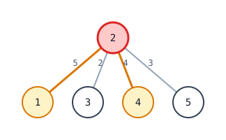
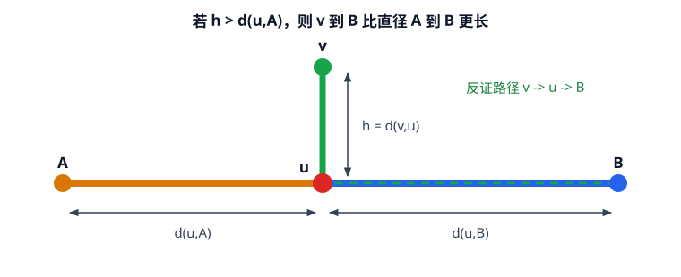
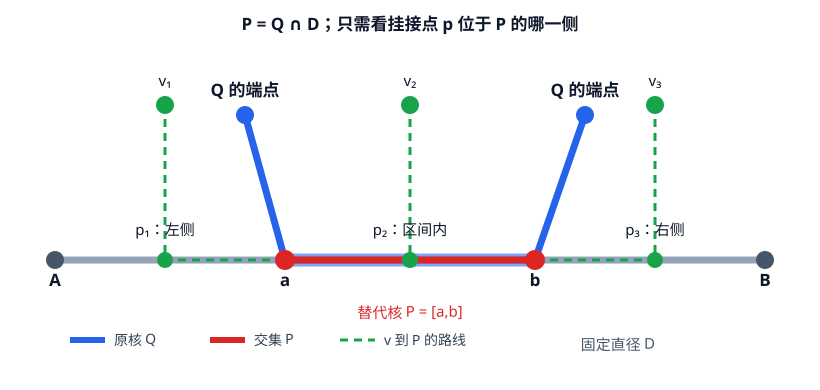
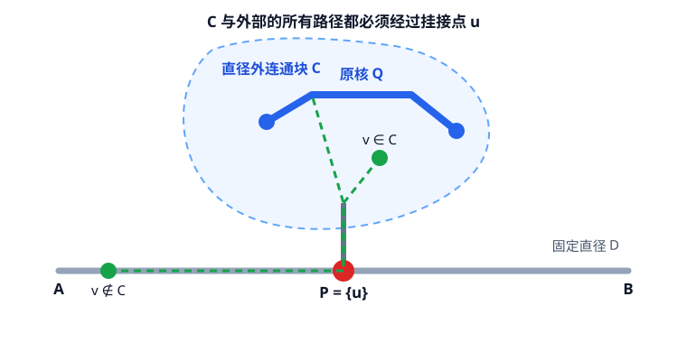

[[TOC]]

## 形式化题目

给定一棵带非负边权的无根树与一个长度上界 $s$。树上一条简单路径称为"核"，若它的长度不超过 $s$，则它是"直径上的核"当且仅当它位于某条树的直径上。定义核 $F$ 的**偏心距**为所有节点到 $F$ 的距离的最大值。求所有直径上的核中偏心距的最小值。

### 样例图

用样例 `in1` 的树来看"直径"和"核"长什么样。黄色节点（1、2、4）构成直径 `1-2-4`，红色节点 2 是核（单点，长度 0 不超过 $s=2$），边上标出了权值：



先看这棵树的形状：从节点 2 出发连到 3、5 的两条分支不在直径上，它们的最大深度是 3。核取单点 2 时，偏心距 = max(节点 1 到 2 的距离 5, 节点 4 到 2 的距离 4, 分支深度 3) = 5，正是样例答案——后面所有公式都会落到这张图上。

## 暴力

先看一个完全按定义实现的暴力解：

@include-code(./brute.cpp, cpp)

`brute.cpp` 先两次最远点搜索求出直径，再对每个节点做一次 DFS 得到全源距离 $dist[u][v]$；然后枚举直径上所有长度不超过 $s$ 的核区间 $[l,r]$，对每个区间按定义计算偏心距——即对每个节点 $x$，取它到区间内各节点的距离最小值，再对这些最小值取最大。

这个暴力完全回避了偏心距的公式，直接按定义结算，是验证后续所有优化的可靠基准；但每对区间都要重扫整棵树，复杂度高达 $O(k^3 n)$（最坏 $O(n^4)$，$k$ 为直径上节点数），只适合小数据对拍。

## 思路

三层递进，逐步去掉重复计算：

1. **暴力层**（`brute.cpp`）：枚举直径区间 + 按定义算偏心距，最慢但最可信。
2. **解法一**（`main-user.cpp`）：在直径上用公式直接结算偏心距，从 $O(n^4)$ 降到 $O(n^3)$。
3. **解法二**（`main.cpp`）：把"分支最大深度"与区间解耦，用双指针把枚举压到线性 $O(n)$，是正式主解。

两层优化都依赖两个关键性质：**任取一条固定直径，只在这条直径上寻找核也不会漏掉最优解**；对这条直径上的核区间 $[l,r]$，偏心距可以拆成三段：

$$\text{ECC}([l,r]) = \max\big(d(A,l),\ d(r,B),\ \text{分支最大深度}\big)$$

其中 $A,B$ 是直径端点，"分支最大深度"是所有直径节点挂载的直径外子树深度的最大值，它是一个与区间选择无关的全局量。解法一每枚举一个区间就套这个公式，解法二进一步发现这个公式只依赖区间的两个端点，于是可以用双指针移动端点。

用样例 `in1` 的直径把三段公式落到具体数值上（核取单点 2，长度 0 不超过 $s=2$）：

```text
直径 A=1 → B=4，长度 9

  dist(A,l)=5               dist(r,B)=4
  ◄──────────┤                 ├──────────►
  1 ──(5)── [ 2 ] ──(4)── 4
                │
                └─ 分支深度 = 3（直径外子树最大深度）

ECC = max( 5, 4, 3 ) = 5  ← 样例答案
```

图中 `[2]` 是核：它到左端点 A 的距离是 5，到右端点 B 的距离是 4，挂载的直径外分支最大深度是 3。三者取最大得偏心距 5。可以看到，偏心距只由"核两端到直径端点的距离"和"全局分支最大深度"决定，这就是后续优化的全部依据。

### 公式证明

下文统一用 $d(x,y)$ 表示两个节点的树上距离，用

$$d(v,P)=\min_{z\in P}d(v,z)$$

表示节点 $v$ 到路径 $P$ 的距离。整段证明只使用树的唯一简单路径，以及直径是全树最长路径这两个事实。

#### 先记住三个树结构事实

后面的证明会反复用到下面三个事实：

1. 两条树上简单路径的交集仍是一条连续路径，也可能退化为一个节点。
2. 如果 $Q\cap D=[a,b]$，那么 $Q$ 离开 $D$ 的部分只能从 $a$ 或 $b$ 向外延伸。
3. 删除直径 $D$ 上的节点后，每个直径外连通块只通过一个直径节点与 $D$ 相连；否则树中会出现环。

这些事实都来自树上路径的唯一性。接下来只需处理距离关系。

#### 先证：分支深度有界

设 $A,B$ 是直径 $D$ 的两个端点。对于不在 $D$ 上的节点 $v$，记 $u$ 为从 $v$ 沿唯一道路走到 $D$ 时第一次到达的节点，称它为 $v$ 在 $D$ 上的**挂接点**。要证明

$$d(v,u)\leqslant\min\big(d(u,A),d(u,B)\big)$$

这张图只展示引理中的三条关键路径：分支深度 $h=d(v,u)$，以及直径两侧的 $d(u,A)$、$d(u,B)$。



假设 $d(v,u)>d(u,A)$。从 $v$ 到 $B$ 的唯一路径必须经过 $u$，所以

$$d(v,B)=d(v,u)+d(u,B)>d(u,A)+d(u,B)=d(A,B)$$

这说明路径 $v\to B$ 比直径 $A\to B$ 还长，矛盾。于是 $d(v,u)\leqslant d(u,A)$。交换 $A,B$ 的位置，同理得到 $d(v,u)\leqslant d(u,B)$，引理得证。

#### 再证：任取固定直径都不会漏解

题面规定核必须是“某条直径上的一段路径”。虽然树的直径可能不止一条，但程序用两次最远点搜索求出的只有其中一条直径 $D=[A,B]$。因此我们需要证明：任意一个满足定义的核 $Q$（可能在其它直径上），都能在这条固定的直径 $D$ 上，找到一个长度不更大、偏心距不更大的替代路径 $P$。

设 $R=\text{ECC}(Q)$。按 $Q$ 是否与 $D$ 相交分两种情况。

**情况一：$Q\cap D\neq\varnothing$。**

令

$$P=Q\cap D=[a,b]$$

并按 $A\to B$ 的方向排列为 $A,\ldots,a,\ldots,b,\ldots,B$。因为 $P\subseteq Q$，所以 $P$ 的长度不超过 $s$。又因为 $Q$ 离开 $D$ 的部分只从 $a,b$ 向外延伸，所以

$$d(A,Q)=d(A,a),\qquad d(B,Q)=d(b,B)$$

这张图展示相交情形的结构：红色是固定直径 $D$ 上的替代核 $P$，蓝色是可能位于另一条直径上的原核 $Q$，绿色节点是一个任意的观察节点 $v$。



对任意节点 $v$，如果 $v\in D$，令 $p=v$、$h=0$；否则令 $p$ 为 $v$ 在 $D$ 上的挂接点，$h=d(v,p)$。我们按 $p$ 的位置分类：

- **$p$ 在 $a$ 的左侧。** 由分支深度引理（若 $v\in D$ 则 $h=0$）有 $h\leqslant d(p,A)$，因此

  $$d(v,P)=h+d(p,a)\leqslant d(p,A)+d(p,a)=d(A,a)=d(A,Q)\leqslant R$$

- **$p$ 在 $a,b$ 的内部。** 此时 $p\in P\subseteq Q$。从 $v$ 到 $D$ 的唯一路径在 $p$ 处第一次到达 $Q$，所以 $d(v,Q)=h$，从而

  $$d(v,P)=h=d(v,Q)\leqslant R$$

- **$p=a$。** 有 $d(v,P)=h$。由引理（或 $v\in D$ 时的 $h=0$），

  $$d(v,P)=h\leqslant d(A,a)=d(A,Q)\leqslant R$$

- **$p=b$。** 这与 $p=a$ 的情况对称，有 $d(v,P)\leqslant d(b,B)=d(B,Q)\leqslant R$。
- **$p$ 在 $b$ 的右侧。** 这与 $p$ 在 $a$ 左侧的情况对称，同样得到 $d(v,P)\leqslant d(b,B)=d(B,Q)\leqslant R$。

因此所有节点到 $P$ 的距离都不超过 $R$，即

$$\mathrm{ECC}(P)\leqslant\mathrm{ECC}(Q)$$

另一方面，$P\subseteq Q$，缩短路径只会让到路径的距离变大或不变，因此

$$\mathrm{ECC}(Q)\leqslant\mathrm{ECC}(P)$$

两边合起来得到

$$\mathrm{ECC}(P)=\mathrm{ECC}(Q)$$

**情况二：$Q\cap D=\varnothing$。**

删除 $D$ 上的所有节点后，$Q$ 完全位于某个直径外连通块 $C$ 中。设 $C$ 通过节点 $u\in D$ 与 $D$ 相连，取

$$P=\{u\}$$

它是 $D$ 上长度为 $0$ 的合法核。这张图展示不相交情形：原核 $Q$ 留在分支 $C$ 中，而替代核退化为固定直径上的单点 $u$。



- 如果 $v\notin C$，从 $v$ 到 $Q$ 的路径必须先经过 $u$，所以 $d(v,P)=d(v,u)\leqslant d(v,Q)\leqslant R$。
- 如果 $v\in C$，它在 $D$ 上的挂接点就是 $u$。由分支深度引理，$d(v,u)\leqslant d(A,u)$；而从 $A$ 到 $Q$ 必须经过 $u$，所以 $d(A,u)\leqslant d(A,Q)\leqslant R$。因此仍有 $d(v,P)=d(v,u)\leqslant R$。

于是 $\mathrm{ECC}(P)\leqslant\mathrm{ECC}(Q)$。这里可能是严格不等式，因为原核 $Q$ 在分支内部，替换为挂接点后可能真的降低偏心距。

综合两种情况，任意合法核都能替换成固定直径 $D$ 上的合法核，且偏心距不会变大。对一个全局最优核进行替换，就得到固定直径 $D$ 上的全局最优核。因此程序只需枚举它求出的那一条直径。

#### 最后证：直径区间的三段公式

固定直径 $D=A\to B$ 上的核区间 $[l,r]$。对每个直径节点 $u$，定义 $h(u)$ 为从 $u$ 沿不属于 $D$ 的边进入各个直径外分支后能到达的最大距离；如果 $u$ 没有直径外节点，就定义 $h(u)=0$。记

$$M=\max_{u\in D}h(u)$$

要证明

$$\mathrm{ECC}([l,r])=\max\big(d(A,l),d(r,B),M\big)$$

**先证上界。** 记右侧最大值为

$$H=\max\big(d(A,l),d(r,B),M\big)$$

任取节点 $v$。若 $v\in D$，直径上离区间 $[l,r]$ 最远的方向只有向 $A$ 或向 $B$，所以 $d(v,[l,r])\leqslant\max(d(A,l),d(r,B))\leqslant H$。若 $v\notin D$，设 $u$ 是它在 $D$ 上的挂接点、$h_v=d(v,u)$。$v$ 到区间 $[l,r]$ 的最短路径必须经过 $u$，于是距离可以拆成"分支深度 + 挂接点到区间的距离"：

$$d(v,[l,r])=h_v+d(u,[l,r])$$

下面按 $u$ 的位置分三种情况：

- **$u\in[l,r]$。** 此时 $d(u,[l,r])=0$，于是

  $$d(v,[l,r])=h_v=d(v,u)$$

  也就是说：**挂接点落在区间内的点，到整个核区间的距离，恰好等于它到自己的挂接点 $u$ 的距离**。这一类点的距离集合，正是"区间内各挂接点 $u$ 到挂在它下面的点的距离"，最大值为 $\max_{u\in[l,r]}h(u)\leqslant M\leqslant H$。

- **$u$ 在 $l$ 的左侧。** 由分支深度引理 $h_v\leqslant d(u,A)$，所以

  $$d(v,[l,r])=h_v+d(u,l)\leqslant d(u,A)+d(u,l)=d(A,l)\leqslant H$$

- **$u$ 在 $r$ 的右侧。** 对称地有 $d(v,[l,r])\leqslant d(r,B)\leqslant H$。

所有节点到 $[l,r]$ 的距离都不超过 $H$，所以 $\mathrm{ECC}([l,r])\leqslant H$。

**再证下界。** 三项都能由具体节点给出：

- 节点 $A$ 到区间的距离恰为 $d(A,l)$，节点 $B$ 到区间的距离恰为 $d(r,B)$。
- 如果 $M>0$，取满足 $h(u)=M$ 的直径节点 $u$，再取其分支中满足 $d(x,u)=M$ 的节点 $x$。若 $u\in[l,r]$，则 $d(x,[l,r])=d(x,u)=M$；若 $u$ 在区间外，从 $x$ 到区间必须先经过 $u$，所以 $d(x,[l,r])\geqslant M$。如果 $M=0$，则 $\mathrm{ECC}([l,r])\geqslant0=M$ 显然成立。

因此 $\mathrm{ECC}([l,r])\geqslant H$。上下界相同，三段公式得证。

## 解法一：枚举直径上的所有核区间

### 思路

在直径上先算出每个节点到左端点 $st$ 的坐标 $pos[u]$，于是直径上任意两点距离就是坐标差，不用每次 DFS 重新求。再对每个直径节点预先求出其挂载的直径外子树最大深度 `branch_depth[i]`。

然后枚举所有区间 $[i,j]$：

- 若 $pos[j]-pos[i] > s$ 则跳过；
- 否则偏心距 $= \max\big(pos[i],\ diameter\_len - pos[j],\ \max_{k\in[i,j]}branch\_depth[k]\big)$，更新答案。

相比暴力，这里用"坐标差"和"三段公式"替代了按定义的全源距离结算，但区间枚举本身仍是 $O(k^2)$，每个区间还要扫一遍分支深度 $O(k)$。

### 代码

@include-code(./main-user.cpp, cpp)

### 复杂度

- 时间：求直径与分支深度 $O(n)$，区间枚举 $O(k^2)$、每个区间扫分支深度 $O(k)$，总 $O(n + k^3)$，最坏 $O(n^3)$。
- 空间：邻接表与直径数组，$O(n)$。

## 解法二：直径上双指针

### 思路

解法一中"每个区间扫一遍分支深度"是多余的：分支最大深度是全局量，可以在枚举前一次性算好 `branch_max`，与选哪段区间无关。于是偏心距公式只剩两个与区间端点相关的量：

$$\text{ECC}([l,r]) = \max\big(d(A,l),\ d(r,B),\ branch\_max\big)$$

这里的 `branch_max` 不是"当前区间 `[l,r]` 里面这些点各自能往外走多远"，而是**整条直径上所有挂接分支的最大深度**。也就是先对每个直径点 $u$ 计算它往直径外能走到多远，再取全局最大值 $M$；这个 $M$ 只跟整棵树有关，不跟区间 `$[l,r]$` 变化，所以可以提前预处理一次。

固定左端点 $l$ 时，右端点 $r$ 在"区间长度不超过 $s$"的前提下越靠右越好——$r$ 越右，$d(r,B)$ 越小，而 $d(A,l)$ 和 $branch\_max$ 不变。因此 $r$ 只增不减，每个 $l$ 用 $O(1)$ 结算一次偏心距，枚举从 $O(k^2)$ 降到 $O(k)$。

用样例 `in2`（直径 $8-7-4-3-1$，长度 13，$s=6$，全局分支最大深度 4）演示双指针的完整滑动过程：

| 左端点 l | 右端点 r | 区间长度 | 结算偏心距 | 是否更新答案 |
| --- | --- | --- | --- | --- |
| 0（节点 8） | 2（节点 4） | 5 | 8 | 是 |
| 1（节点 7） | 2（节点 4） | 2 | 8 | 否 |
| 2（节点 4） | 3（节点 3） | 6 | 5 | 是 |
| 3（节点 3） | 4（节点 1） | 2 | 11 | 否 |
| 4（节点 1） | 4（节点 1） | 0 | 13 | 否 |

从表中看两点：第一，$r$ 只会向右移动（2 → 2 → 3 → 4 → 4），绝不会回退，这是双指针 $O(k)$ 的关键；第二，答案只在 `l=2` 时被更新为 5，此时区间 `[4,3]` 位于直径中间、两端距离最小，与"两端距离尽量小"的直觉一致。

### 代码

@include-code(./main.cpp, cpp)

### 复杂度

- 时间：两次最远点搜索求直径 $O(n)$、分支最大深度 $O(n)$、双指针 $O(k)$，总 $O(n)$。
- 空间：邻接表与直径数组，$O(n)$。

## 复杂度对比

| 方案 | 核心思路 | 时间复杂度 | 空间复杂度 |
| --- | --- | --- | --- |
| `brute.cpp` | 按定义全源距离结算偏心距 | $O(k^3 n)$，最坏 $O(n^4)$ | $O(n^2)$ |
| `main-user.cpp` | 直径区间枚举 + 三段公式 | $O(k^3)$，最坏 $O(n^3)$ | $O(n)$ |
| `main.cpp` | 直径双指针 + 全局分支深度 | $O(n)$ | $O(n)$ |

三者的差异只在"偏心距怎么算、区间怎么枚举"：暴力按定义算，解法一用公式但枚举不减，解法二让枚举随端点滑动。

## 总结

树网的核是"先降到直径，再在直径上做约束枚举"的经典模型。核心洞察是把偏心距拆成三段，其中分支最大深度与区间选择无关，于是问题退化成在直径上找"两端距离尽量小、长度不超过 $s$"的区间——一个典型的两端约束，双指针天然适用。解法一用直白的枚举验证公式，解法二用双指针逼近线性，两条路径共用同一套直径求法。

## 图示解析

这张 ASCII 图展示整道题的解题路线：

```text
朴素模拟（brute.cpp）
  枚举直径上所有长度不超过 s 的核区间
  对每个区间按定义 BFS/全源距离算偏心距      O(k^3 n)
        |
        | 瓶颈：每个区间都要重新算整棵树到核的最大距离
        v
关键性质
  任取一条固定直径 D，只在 D 上寻找也不会漏掉最优核
  对直径上的核 [l, r]：
    偏心距 = max( A 到 l 的距离, r 到 B 的距离, 直径外所有分支的最大深度 )
  分支最大深度是全局量，与选哪段无关
        |
        v
解法一（main-user.cpp）：枚举直径区间套公式          O(k^3)
        |
        | 改进：分支深度与区间无关，公式只依赖端点
        v
解法二（main.cpp）：左端点固定时右端点单调右移        O(n)
```

观察要点：三条主线对应"暴力慢在哪""直径上的核如何把偏心距拆成三段""为什么 $r$ 可以只往右走"。核心是分支最大深度与区间选择无关，所以双指针每次移动都只用两端距离做比较。

## 另一视角：Gemini 的证明

上面的证明从"挂接点 + 交并分情况"出发；Gemini 给出了另一套讲法——多直径"相交且对称"的视角，两个版本互相印证，适合对照阅读：

@include_md("./gemini.md")
