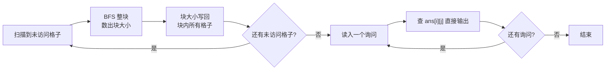

[[TOC]]

## 形式化题目

给定一个 $n \times n$ 的 0/1 矩阵 $A$。把每个格子看成一个点，两个有公共边的格子之间连一条边，当且仅当它们的数值不同：

$$(i,j) \sim (i',j') \iff |i - i'| + |j - j'| = 1 \ \text{且}\ A_{i,j} \neq A_{i',j'}$$

对每个询问 $(i,j)$，求点 $(i,j)$ 在这个无向图中所属连通分量的大小。

题面说的“从这一格开始能移动到多少个格子”，就是“从这一点出发能走到的点数”。两格数值不同这个条件交换两端后依然成立，所以这是一张无向图；走到的点集又是传递封闭的，于是答案恰好就是从 $(i,j)$ 出发那一个连通分量的大小。

样例 $n = 2$、$A = \begin{pmatrix} 0 & 1 \\ 1 & 0 \end{pmatrix}$：四对相邻格子的数值都不同，四条边全在，四个点连成一块，因此每个询问都回答 $4$。

## 暴力解法

### 思路

最直接的做法是按题面直译：每个询问单独搜一次。

从询问的格子出发做 BFS（DFS 同样可以），每一步只走四邻中数值不同的格子，用 `vis` 记住本次搜索走过的格子，走完后统计访问了多少格，就是答案。因为图是无向的，“能走到的点”和“能走到起点的点”是同一批，搜索不会漏解。

这份代码就是这条思路的实现：读入迷宫后，对每个询问调用一次 `bfs_count`，函数内部先清空 `vis`，再从起点整片搜一遍，返回访问的格子数。

值得注意的一点：**迷宫不能按 0/1 简单分区**。`01 / 10` 里 0 和 1 交错摆放，四个格子互相都可达；反过来，相邻同数值的格子之间没有边，但这也并不表示它们不在同一块里——绕一格就能连通。

### 代码

@include-code(./brute.cpp, cpp)

### 复杂度

单次搜索最多访问 $n^2$ 个格子，每条内部相邻关系最多被检查两次，所以单次是 $O(n^2)$；$m$ 个询问合起来是 $O(m n^2)$。`vis` 数组占用 $O(n^2)$ 空间。

### 瓶颈

$n \leqslant 1000$、$m \leqslant 100000$，于是 $m n^2$ 达到 $10^{11}$ 量级，必然超时。

瓶颈其实不在“搜一次太慢”——搜一次只要 $O(n^2)$——而在**同一份信息被重复计算**：多个询问很可能落在同一个连通块里，它们的答案一模一样，暴力却每次都从头 BFS 一遍，白白多花 $m$ 倍时间。消除这个重复，就是正解的出发点。

## 正解

### 思路

关键观察：**同一个连通块内所有格子的答案完全相同，都等于这个连通块的大小。**

分两步说清为什么：

1. 连通块内任意两点互相可达。题面问的是“从这个格子能走到多少格”，也就是从它出发的可达点个数；块内任意两点可达集合相同，所以答案必然相同。
2. 块内任意一点都走不到块外。若某点能走到块外的格子，那么按连通分量的定义，块外那个格子本来就该属于这一块，矛盾。所以可达集合恰好是整个块，答案就等于块的大小。

把“块内答案相同”这句话当成算法：**每个连通块只需要算一次**。对每个还没被任何块覆盖过的格子，把它所在的整块 BFS 一遍，数出块的大小，再把这个大小写回块内所有格子。预处理结束后每个格子的答案都躺在表里，询问只剩一次查表。

实现上有两个不显然的决定：

- `ans[i][j]` 同时承担“答案”和“访问标记”。`0` 表示还没有任何块覆盖它；BFS 过程中先写 `-1` 表示“已经入队、大小还没定”，避免同一个格子被重复入队；块大小数出来后，再把块内所有格子统一改成这个正整数。
- BFS 时把块内格子按访问顺序记进 `block_cells`，编码成 `x * MAXN + y`。原因是 BFS 过程中还不知道块最终有多大，只能先把格子存下来，等数完再回填；把坐标压成一个整数比开两个平行数组省事。

正确性靠“一进一出”两条保证：每个格子恰好被某一个连通块认领一次（`ans` 非 0 就不再入队），且块内回填的大小正是该块的真实格子数，因此查表得到的值与“单独搜一次”完全一致——这也正是对拍要检验的东西。

### 代码

@include-code(./main.cpp, cpp)

### STL 写法

上面的 `main.cpp` 用固定数组：`char g[1005][1005]` 存迷宫、`int ans[1005][1005]` 存答案、`queue<pair<int, int> >` 存坐标对。C++ 里还能把这些换成 STL 写法，思路一点不变，只是数据的摆放方式不同。

迷宫用 `vector<string>` 按行存，一行一个字符串：`grid[x][y]` 直接取字符，不用自己算行宽、也不用管末尾的换行符。答案用 `vector<vector<int> >`，容量跟着 `n` 走，不会再出现“数组开多大”的问题。

队列里放的东西也换了。放 `pair<int, int>` 每次都要 `make_pair` 构造一个二元组；这里把坐标**压平**成一个整数 $\text{idx} = x \cdot n + y$，队列退化成 `queue<int>`，出队时用 `idx / n` 和 `idx % n` 还原坐标。好处不只是一次内存搬运更小：块内格子也能用同一套下标记进 `vector<int>` 里，回填答案时直接还原坐标即可。

最后一点是下标基准。`vector` 从 0 开始，所以这里整个网格都用 0 基下标，读入询问时减一，恰好把题面的 1 基编号换算成内部编号，省得每一处都写 `x - 1`。

网格本身就已经是一张图，不需要像邻接表那样先建边：扩展时用 `dx`、`dy` 试探上下左右四个邻居即可，这也是本题比一般建图题更轻的地方。

对应的 cppbook 章节：[vector：能改变长度的数组](https://cppbook.roj.ac.cn/stl/sequence-containers/vector/)、[queue：先进先出](https://cppbook.roj.ac.cn/stl/container-adapters/queue/)

@include-code(./main-stl.cpp, cpp)

### 复杂度

预处理时每个格子恰好入队一次，每条相邻关系最多被检查两次（两端各一次），所以所有 BFS 的时间合计 $O(n^2)$；$m$ 个询问每次 $O(1)$ 查表。总时间复杂度 $O(n^2 + m)$，空间复杂度 $O(n^2)$（`ans`、`block_cells` 和迷宫本身）。

在 $n = 1000$、$m = 100000$ 的满数据上，`main.cpp` 实测只有 $0.02 \sim 0.05$ 秒（随机迷宫约 $0.04$ 秒，棋盘交错约 $0.025$ 秒）；同样的数据用暴力按 $O(m n^2)$ 至少要几百秒，两者相差四个数量级。

## 总结

- 把问题抽象成图：格子是点，数值不同的相邻格之间连边，询问就是问连通分量大小。
- 暴力对每个询问单独 BFS，正确但重复：同一连通块被反复搜索，$O(m n^2)$ 无法接受。
- 关键观察：同一连通块内所有格子答案相同，都等于块的大小；于是把“每个询问搜一次”改成“每个块搜一次”，块大小写回块内所有格子，询问退化成查表。
- 总复杂度 $O(n^2 + m)$。“预处理一次、查询多次”是这类多询问题的通用套路。

## 图示解析

### 例子的连通块分解

下面这个 $4 \times 4$ 迷宫用来展示“同块同答案”。左边是迷宫本身，中间把每个格子标上它所属的块编号，右边写上该格子的答案（也就是它所在块的大小）：

| 迷宫 | 块编号 | 答案 |
| --- | --- | --- |
| `0100` `1101` `1001` `0011` | `A A A B` `A B B B` `B B C C` `B C C D` | `4 4 4 7` `4 7 7 7` `7 7 4 4` `7 4 4 1` |

4 个块的大小分别是 $4$、$7$、$4$、$1$。预处理只做了 4 次 BFS，而不是等询问来了再做 $m$ 次：例如询问 $(2,2)$ 和 $(3,1)$ 都落在块 `B` 上，两个询问共享同一次搜索的结果，都回答 $7$。右下角的 $(4,4)$ 是 $1$，因为它的上邻 $(3,4)$ 和左邻 $(4,3)$ 数值都是 $1$，与它相同，四条边一条也画不出去。

### 预处理与询问的关系

这张图说明正解的执行顺序：先一次预处理把所有块的答案铺满整张表，询问阶段只做查表。

朴素解里 `A -> B` 会在每个询问上重复一次；正解把它提前到询问之前，每个格子只入队一次，于是左侧的预处理一共只跑 $O(n^2)$ 步，右侧的询问循环变成纯粹的输出。
