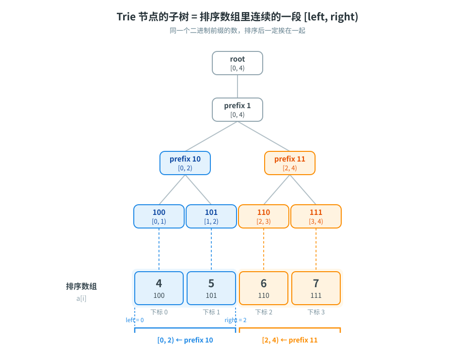

[[TOC]]

## 形式化题目

给定序列 $a$，从中选择恰好 $k$ 个元素。设所选元素最大值为 $m$，最大化
$\sum(a_i\mathbin{\mathrm{xor}}m)$。

## 暴力解法

### 思路

递归枚举所有长度为 $k$ 的下标组合。生成完整组合后求出最大值 $m$，再计算 $\sum(a_i\mathbin{\mathrm{xor}}m)$ 并更新答案。

### 代码

@include-code(./brute.cpp, cpp)

### 复杂度与瓶颈

共有 $\binom{n}{k}$ 个组合，每个组合需要 $O(k)$ 时间计算权值，总复杂度为 $O\!\left(k\binom{n}{k}\right)$，只能用于 $n \leqslant 20$ 的子任务。瓶颈是同时枚举最大值和其余元素。

## 正解

### 关键观察

先固定所选序列中的最大值 $m$。因为 $m\mathbin{\mathrm{xor}}m=0$，其余 $k-1$ 个元素应该从所有不大于 $m$ 的元素中选出，使 $a_i\mathbin{\mathrm{xor}}m$ 的和最大。

### 思路

将所有 `a_i` 排序。依次把当前元素 `a_i` 作为“最后一个最大值”考虑，Trie 中只放它之前的元素：这样既允许更小的值，也允许同值的更早出现，但不会重复使用当前这个元素。

固定 `m` 后，比较两个候选异或值时，最高不同位决定大小。因此在二进制 Trie 的每一层，优先走与 `m` 当前位相反的分支：这一分支的异或当前位为 `1`，其中的所有值都比另一分支更优。

如果优先分支的元素数不超过还需要的数量，就整支取走；整支的异或和用每一位的 `1` 的个数计算。为了支持这个总和计算，预处理排序数组每一位的前缀计数。

实现上，Trie 节点只维护子树元素个数 `pass` 和子树区间的左端点 `left`，区间长度就是 `pass`，右端点由 `left + pass` 得到。这样“取一整支”就变成“对一段排序下标求和”，可以用位前缀计数一次算完；具体推导见下面的「关键函数」小节。

### 代码

@include-code(./main.cpp, cpp)

### 关键函数：整棵子树的异或和

正解里最不容易一眼看懂的，是“整支取走”时用来求和的 `xor_sum`。它要在 O(31) 的时间内算出

$$\sum_{v \in \text{subtree}(u)} (v \oplus x)$$

而不是去遍历子树里的每个数。下面分四步拆开。

**第一步：按二进制位拆开。** 设 $\text{bit}_b(y)$ 表示 $y$ 的第 $b$ 位，则

$$\sum_v (v \oplus x) = \sum_b 2^b \cdot \#\{\, v : \text{bit}_b(v) \oplus \text{bit}_b(x) = 1 \,\}$$

也就是说：**每一位单独统计“异或后这一位是 1”的元素个数，再乘 $2^b$ 累加**。

**第二步：这一位为 1 的个数怎么数。** 记子树里共有 `total` 个数，其中第 `b` 位原本是 1 的有 `ones` 个。异或的规则是“不同才为 1”，所以：

| `x` 的第 `b` 位 | 异或后第 `b` 位为 1 的是 | 个数 |
| --- | --- | --- |
| `0` | 原本为 `1` 的数 | `ones` |
| `1` | 原本为 `0` 的数 | `total - ones` |

**第三步：`ones` 和 `total` 用排序区间的下标算。** 一个 Trie 节点代表一个二进制前缀，而**同一个前缀的所有数，在按大小排序后的数组里必然是一段连续的下标**。注意这个“连续区间”是排序数组上的**下标区间**，不是树的 dfs 序——代码从头到尾没有遍历过 Trie，靠的只是这条链：

> 前缀相同 → 数值落在某个区间里 → 排序后下标连续。

节点记录的区间是左闭右开的 `[left, right)`：`left` 在建节点时就确定了（第一次走到这个前缀时的下标），而区间长度恰好等于子树里的元素个数 `pass`。所以代码只存 `left` 和 `pass`，右端点用 `right = left + pass` 算出来，不需要单独维护：

```cpp
int l = tree[u].left;                                  // 子树区间左端点
int total = tree[u].pass;                              // 子树元素个数，也是区间长度
int r = l + total;                                     // 右端点：left + pass
int ones = bit_one[bit][r] - bit_one[bit][l];          // 第 bit 位为 1 的个数
int xor_ones = ((x >> bit) & 1) ? total - ones : ones; // 异或后这一位为 1 的个数
result += (long long)xor_ones * (1LL << bit);          // 这一位的贡献
```

下面这张图用一个 3 位数的例子说明 `[left, right)` 到底指什么：



图中排序数组是 `4,5,6,7`，每个 Trie 节点都标出自己管的下标区间：叶子只管一格，`prefix 10` 管 `a[0..1]` 即 `[0, 2)`，`prefix 11` 管 `a[2..3]` 即 `[2, 4)`。`left` 是这段的第一个下标，`right` 是最后一个下标加一，所以写成左闭右开。

`total` 一眼看出是 4；`bit_one[1]` 在右端点 4 处为 2、左端点 0 处为 0，所以第 1 位为 1 的有 `ones = 2` 个。

**第四步：为什么只算到 `highest_bit` 就够了。** 容易误以为要算全部 31 位。回想调用时机：只有在“整支取走优先分支”时才调用它；而查询向下走时，只有优先分支不够才会进入另一分支，也就是只在 $v$ 这一位与 $x$ **相同**时继续往下。于是路径上 `highest_bit` 以上的每一位，子树里的 $v$ 都和 $x$ 相同，异或结果恒为 0，不必统计。传入的 `highest_bit = bit` 正好把范围收在 `0..bit`。

**完整走一个例子。** 取上面的子树 `[4,5,6,7]` 和 `x = 2`，其中 `left = 0`、`right = 4`、`total = 4`，而 $x = 010_2$。

| `bit` | 原本该位为 1 的 `ones` | `x` 该位 | 异或后为 1 的 `xor_ones` | 贡献 |
| --- | --- | --- | --- | --- |
| 2 | 4 | 0 | 4 | 4 × 4 = 16 |
| 1 | 2 | 1 | 2 | 2 × 2 = 4 |
| 0 | 2 | 0 | 2 | 2 × 1 = 2 |

合计 `16 + 4 + 2 = 22`。手工验算 $4 \oplus 2 = 6$、$5 \oplus 2 = 7$、$6 \oplus 2 = 4$、$7 \oplus 2 = 5$，加起来同样是 22。

!!! note 区间必须只包含已插入的元素
`xor_sum` 把 `[left, right)` 当作“子树里现有的数”，因此主循环必须先查询、后 `insert` 当前元素，否则区间会混进还没激活的数。
!!!

### 复杂度

Trie 高度为 `31`。每次查询至多访问 `31` 层，并在至多 `31` 个整支上计算 `31` 位的异或和，时间复杂度为 `O(n·31^2)`，可视为 `O(n log^2 A)`。
预处理和 Trie 空间复杂度为 `O(n log A)`。

## 总结

“最大值”是这题的切入口：固定它以后，目标就变成静态集合中的前 `k-1` 大异或值之和。排序保证最大值约束，Trie 保证异或值按二进制高位贪心选取。

## 图示解析

这张图串起本题从最大值枚举到异或求和的主线：

```text
排序后的序列
`- 枚举最后一个最大值 m
   `- 查询前缀中的 k-1 个元素
      |- 异或当前位为 1：优先进入
      `- 不足时补另一分支
         `- 累加前 k-1 大异或值
```

排序前缀保证候选值不超过当前最大值，且当前元素尚未被激活。Trie 的高位优先顺序正好等价于比较异或值的大小。
