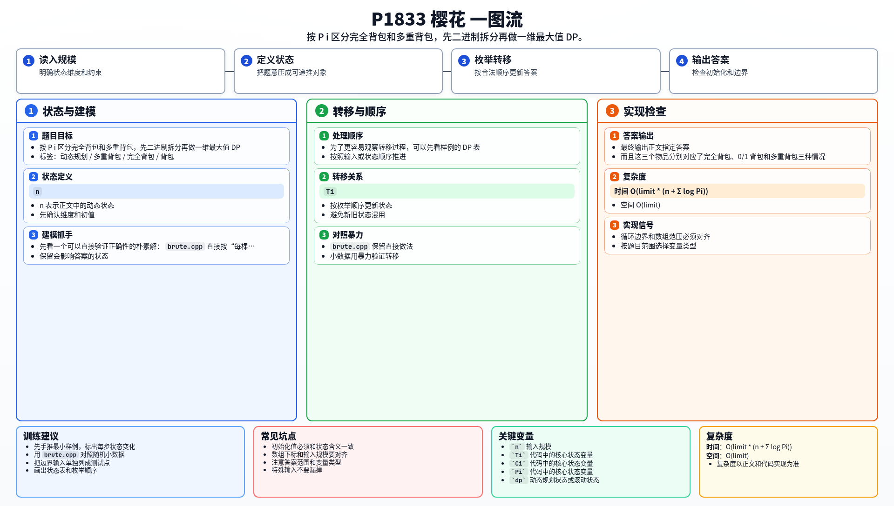

[[TOC]]

### 题意

有 `n` 棵樱花树，每棵树看一次要花 `Ti` 分钟，得到 `Ci` 的美学值。

`Pi` 表示这棵树最多能看多少次：

- `Pi = 0`：可以无限次观看
- `Pi > 0`：最多观看 `Pi` 次

要在 `Te - Ts` 分钟内，选择若干棵树观看若干次，使总美学值最大。

这张表把题意翻成了背包模型：

| 原题对象 | 背包含义 |
| --- | --- |
| 一棵樱花树 | 一个物品 |
| 看一次的时间 `Ti` | 重量 |
| 看一次的美学值 `Ci` | 价值 |
| `Pi = 0` | 完全背包物品 |
| `Pi > 0` | 多重背包物品 |

### 思路

**一句话本质**：混合背包——$P_i=0$ 走完全背包（正序），$P_i>0$ 走多重背包（二进制拆分后倒序）。

先看最直接的做法：

@include-code(./brute.py, py)

`brute.py` 对每棵树枚举看 $0 \sim \max_k$ 次。$n$ 最大 $10000$，每棵树可选次数不确定，组合数爆炸。

**怎么看出是混合背包？**

- $P_i = 0$：可无限次看 → 完全背包物品
- $P_i = 1$：最多看一次 → 0/1 背包物品
- $P_i > 1$：最多看 $P_i$ 次 → 多重背包物品

三种类型混在一起，但容量（时间）只有一个维度 $T$。核心是把每种类型统一到同一个 $dp$ 框架里。

**为什么完全背包要正序枚举容量？**

正序意味着转移 $dp_j \leftarrow \max(dp_j, dp_{j-t} + c)$ 时，$dp_{j-t}$ 可能已经是用过这件物品的状态。这恰恰允许"同一件物品取多次"。倒序则强制每件物品只用一次。

**为什么多重背包要倒序？**

二进制拆分后，每组只选一次——是 0/1 物品。倒序保证每组最多取一次，恰好拼出 $0 \sim P_i$ 的所有取法。

**为什么要做二进制拆分而不是逐件枚举？**

如果每件物品都枚举 $0 \sim P_i$ 次，时间复杂度是 $O(T \cdot \sum P_i)$。当 $P_i$ 很大时会超时。二进制拆分把 $P_i$ 拆成 $\log P_i$ 个包，总物品数降到 $O(\sum \log P_i)$。

**拆完之后怎么处理？**

每包形成一个新的 0/1 物品（重量 $= use \cdot t_i$，价值 $= use \cdot c_i$），然后倒序做 0/1 背包。最终 $dp_T$ 就是答案。

### 代码

@include-code(./main.cpp, cpp)

### 复杂度

- 时间复杂度：$O(\text{limit} \cdot (n + \sum \log P_i))$
- 空间复杂度：$O(limit)$

### 总结

这题的关键不是赏花本身，而是把每棵树的“可选次数”翻译成背包类型。

`Pi = 0` 走完全背包，`Pi > 0` 走多重背包，最后统一到一维 `dp` 就行。

### 一图流解析

这张图把本题的建模、关键转移、实现检查和训练方法压缩到一页，适合读完正文后复盘。

