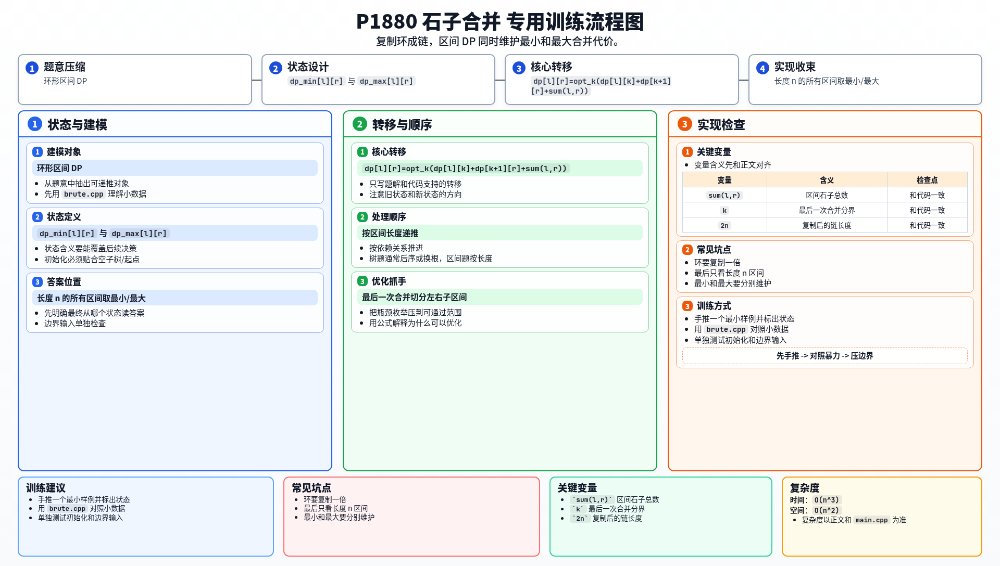

[[TOC]]

### 题意

有 `n` 堆石子围成一个环。

每次只能选相邻两堆合并，得分等于这两堆石子数之和。

问把所有石子最终合成一堆时：

- 最小总得分是多少
- 最大总得分是多少

### 思路

先看一个可以直接验证想法的朴素解：

@include-code(./brute.cpp, cpp)

暴力做法就是递归模拟：

- 当前环上有多少堆石子
- 枚举把哪一对相邻石子合并
- 继续递归

这样可以帮助理解题目，但复杂度是指数级，只能做很小的数据。

这题的标准做法是区间 DP。

如果石子是排成一条链，那么设：

- `dp_min[l][r]`：把区间 `[l, r]` 合成一堆的最小代价
- `dp_max[l][r]`：把区间 `[l, r]` 合成一堆的最大代价

转移时枚举最后一次合并的位置 `k`：

- 左边先合成一堆
- 右边先合成一堆
- 最后再把这两堆合并

所以有：

- `dp_min[l][r] = min(dp_min[l][k] + dp_min[k+1][r] + sum(l,r))`
- `dp_max[l][r] = max(dp_max[l][k] + dp_max[k+1][r] + sum(l,r))`

其中 `sum(l,r)` 表示区间石子总数，因为最后这一次把两大堆合起来，得分就是整个区间总和。

但原题是一个环，不是链。

处理环形区间 DP 的常见办法是：

1. 把数组复制一遍，变成长度 `2n`
2. 这样所有“断环成链”的方案，都能对应成一个长度为 `n` 的连续区间
3. 枚举每个起点 `l`，看区间 `[l, l+n-1]` 的答案

最后：

- 所有这些长度为 `n` 的区间里，最小值的最小者就是答案
- 最大值的最大者就是答案

#### DP 转移方程

核心状态：

`dp_min[l][r]` 与 `dp_max[l][r]`

核心转移：

`dp[l][r]=opt_k(dp[l][k]+dp[k+1][r]+sum(l,r))`

答案收束：

长度 n 的所有区间取最小/最大

### 代码

@include-code(./main.cpp, cpp)

### 复杂度

区间 DP 一共有 $O(n^2)$ 个区间，每个区间再枚举一个分割点，所以总复杂度是 $O(n^3)$。

空间复杂度是 $O(n^2)$。

### 总结

这题是非常典型的“环形区间 DP”。

关键步骤只有两件事：

1. 先写好链上的区间 DP
2. 再用“复制数组”的方式把环断成链

一旦想清楚最后一次合并一定会把某个区间 `[l,r]` 的左右两部分拼起来，转移就很自然了。

### 一图流解析

这张图把本题的建模、关键转移、实现检查和训练方法压缩到一页，适合读完正文后复盘。

