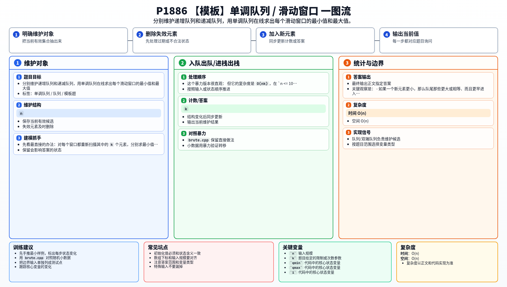

[[TOC]]

## 形式化题目

给定长度为 $n$ 的序列 $a_1,\dots,a_n$ 与窗口大小 $k$，对每个满足 $1 \leqslant l \leqslant n-k+1$ 的窗口 $[l,\,l+k-1]$，分别求窗口内元素的最小值与最大值，并按窗口从左到右的顺序输出两行答案。

窗口之间的重叠部分是固定的：相邻两个窗口只差「删掉最左边一个元素、加入最右边一个元素」这一步。所有做法都围绕这一点展开。

## 解法总览

三种解法都能独立完成本题，前一种是本题的正统做法，后两种都是「把窗口当成有序多重集」这一模型的实现：

- **解法一（`main.cpp`，正式主解）**：单调队列。抓住「值更差且更早过期的候选永远没用」这一性质，把窗口里还有可能成为答案的候选压成一个单调队列，队头就是答案，整体 $O(n)$。
- **解法二（`main-fhq.py`）**：把窗口当成一个**有序多重集**（multiset），直接维护「第 1 小」和「第 $k$ 小」。每次右移就删除一个出窗元素、插入一个入窗元素，再用 FHQ-Treap 查询第 $k$ 小。复杂度是 $O(n\log n)$，练习价值在于「插入 / 删除 / 查询第 $k$ 小」这三个接口。
- **解法三（`main-multiset.cpp`）**：和解法二完全相同的模型，但直接使用 C++ 标准库的 `std::multiset`，不手写平衡树，是这道题在 C++ 里最省事的 $O(n\log n)$ 写法。

也就是说，解法一是本题的正统做法，解法二、三是拿本题当有序多重集的练习场：解法三用现成容器，解法二手写结构。想看更系统的基础讲解，可以参考 rbook 里的《单调队列》：
<https://rbook2.roj.ac.cn/data_structure/monotonic_queue/index.html>

## 解法一：单调队列

### 思路

先看最直接的办法：对每个窗口都重新扫描其中的 `k` 个元素，分别求最小值和最大值。

这个暴力版本很直观：

@include-code(./brute.cpp, cpp)

但它的复杂度是 $O(nk)$，在 $n <= 10^6$ 时肯定过不去。

这题的关键观察是：

- 如果一个新元素更小，那么队尾那些更大或相等、而且更早进入窗口的元素，以后都不可能再成为最小值；
- 如果一个新元素更大，那么队尾那些更小或相等、而且更早进入窗口的元素，以后都不可能再成为最大值。

所以我们可以分别维护两个存“下标”的单调队列：

- `qmin`：值递增，队头是当前窗口最小值下标；
- `qmax`：值递减，队头是当前窗口最大值下标。

每次处理位置 `i` 时：

1. 先把所有已经不在窗口中的下标从队头删掉；
2. 再从队尾删掉所有不可能成为未来答案的候选；
3. 把当前下标 `i` 入队；
4. 当 $i >= k$ 时，队头就是当前窗口答案。

### C++ 实现

- `qmin`、`qmax` 保存下标，并用 `head`、`tail` 模拟双端队列；这样不会产生节点对象，适合 $n \leqslant 10^6$ 的数据范围。
- 队列里的下标严格递增；最小值队列对应的值非降，最大值队列对应的值非升。
- 两行答案分别暂存到静态数组，最后以空格分隔输出。

### 代码

@include-code(./main.cpp, cpp)

### 复杂度

- 时间复杂度：$O(n)$（每个下标最多进队一次、出队一次）
- 空间复杂度：$O(n)$

## 解法二：FHQ-Treap 有序多重集


### 思路

就是把fhq-treap  当成 `multiset` 来使用

换一个模型：窗口里的元素就是一个可重集合，我们只需要它能回答两个问题——「最小值是多少」和「最大值是多少」，也就是第 $1$ 小与第 $k$ 小。窗口右移时，集合只发生一次删除和一次插入：

```text
窗口 [l, l+k-1]  →  窗口 [l+1, l+k]

  删除 a[l]（出窗）       插入 a[l+k]（入窗）
```

于是整道题退化成三个基本操作：**插入**、**删除一个值**、**查询第 k 小**。FHQ-Treap（无旋 Treap）正是实现这种有序多重集的常用结构，它只用两个核心操作就能拼出全部接口：

- `split(u, v)`：按值把树 $u$ 切成 `(<= v)` 与 `(> v)` 两棵，递归下去后顺着原路径改接儿子并更新子树大小；
- `merge(x, y)`：要求 $x$ 中所有值都不大于 $y$ 中所有值，比较两棵根的随机优先级，优先级大的当父节点，继续递归合并。

**为什么树高是 $O(\log n)$。** 每个节点的优先级独立随机生成，`merge` 只在两者之间比大小，因此树形等价于对节点随机建堆，期望高度为 $O(\log n)$，插入、删除、第 $k$ 小的期望复杂度都是 $O(\log n)$。

**为什么第 $k$ 小可以 $O(\log n)$ 查到。** 每个节点记录子树大小 `size`，从根往下走：若 $k$ 不大于左子树大小就往左走，等于左子树大小加一就命中当前节点，否则减去左子树大小加一后往右走。这与在有序序列上二分定位是同一件事。

本题的实现直接复用了 P3369 的 FHQ-Treap 模板：`Node` + `FHQTreap` 两部分**逐字符相同**，本题只在文件末尾追加了 `solve()` 与 `main()`，只调用 `insert` / `delete` / `kth` 三个接口。

- 节点是 `__slots__ = ("val", "pri", "size", "l", "r")` 的轻量对象，`size` 记录子树大小，`l` / `r` 是左右儿子；
- `split` / `merge` 是模板里的两个核心，`insert` 与 `delete` 都由它们拼出；
- `kth` 从根往下走，比较 $k$ 与左子树大小决定去向，是标准的 BST 定位。

因为题目保证删除的元素一定在窗口内，`delete` 一定能命中，不需要处理「删除不存在的值」。

**注意模板与本题的规模不匹配。** 这是通用写法（对象节点 + 递归 + 三段分裂删除），常数较大。实测 $n = 10^6$ 时需要约 33s，而单调队列只需约 2.6s。本题只是拿它练习接口，真正的提交应使用 `main.cpp`。

### Python 知识

- `sys.setrecursionlimit(300000)`：`split / merge` 都是递归的，随机优先级只保证**期望**树高，留足上限更稳。
- `__slots__` 省掉每个节点的 `__dict__`，在 $10^5$ 级别的节点数上有明显的内存与访问收益。
- `typing.Optional / Tuple / List` 标注让 `None` 表示的「空树」在阅读代码时更清楚。
- `random.getrandbits(64)` 取种子：避免固定种子被针对性构造数据退化。
- 把 `solve(a, n, k)` 单独抽出，`main()` 只负责读入与输出，便于本地对拍时直接调用；模板部分一行未改，两个题目可以对照阅读。

### 代码

@include-code(./main-fhq.py, python)

### 复杂度

- 时间复杂度：$O(n\log n)$。每个窗口两次修改（一次删除、一次插入）加两次查询，单次期望 $O(\log n)$。
- 空间复杂度：$O(n)$。节点数最多为 $n$（每个元素只插入一次）。

## 解法三：C++ std::multiset

### 思路

模型和解法二完全一样：把窗口当成有序多重集，只需知道集合的最小值与最大值。区别在于 C++ 标准库已经提供了现成的有序可重集 `std::multiset`，不必自己写平衡树。

用到的三个接口：

- `insert(x)`：插入一个 $x$（允许重复）；
- `find(x)` 配合 `erase(it)`：删除**一个**等于 $x$ 的元素；
- `*ms.begin()` 是当前最小值，`*ms.rbegin()` 是当前最大值。

这里有一个很容易踩的坑：直接写 `ms.erase(x)` 会把**所有**等于 $x$ 的元素一次删光，而窗口右移只需要删掉一个。正确写法是先用 `find(x)` 拿到某一个等于 $x$ 的迭代器，再 `erase(it)`。因为窗口里一定有 $x$，`find` 保证不会返回 `end()`。

窗口滑动和前面一样：先把第一个窗口装进去，之后每次删 `a[i-k]`、插 `a[i]`，再读首尾元素。

同样是有序多重集模型，底层都是平衡树（`std::multiset` 是红黑树，FHQ-Treap 是笛卡尔树），但语言和实现常数差别巨大：$n = 10^6$ 时这份 C++ 代码只需约 0.56s，比 Python 手写的 FHQ-Treap（约 33s）快两个数量级。在 C++ 里遇到「需要有序可重集」，直接用 `std::multiset` 就是最短的路。

### 代码

@include-code(./main-multiset.cpp, cpp)

### 复杂度

- 时间复杂度：$O(n\log n)$。每次窗口右移一次删除加一次插入，每次 $O(\log n)$。
- 空间复杂度：$O(n)$。

## 复杂度对比

| 方案 | 语言 / 维护结构 | 每次窗口的代价 | 时间复杂度 | 空间复杂度 |
| --- | --- | --- | --- | --- |
| `main.cpp` | C++，两个单调队列 | 均摊 $O(1)$ | $O(n)$ | $O(n)$ |
| `main-fhq.py` | Python，手写 FHQ-Treap | 期望 $O(\log n)$ | $O(n\log n)$ | $O(n)$ |
| `main-multiset.cpp` | C++，`std::multiset` | $O(\log n)$ | $O(n\log n)$ | $O(n)$ |

单调队列快在它丢弃了信息：它不关心窗口里全部元素，只保留还有机会成为答案的那一小部分候选。两种多重集解法保留了完整的多重集，所以能回答「第 $k$ 小」这类更一般的问题，代价就是每个操作多一个 $\log$。本题只需最小值和最大值，因此单调队列是更合适的选择；多重集的价值在于换一个题目仍然适用。

同样是 FHQ-Treap，写法不同常数差别很大：`main-fhq.py` 为了和 P3369 的模板保持逐字符一致，用的是对象节点 + 递归 + 三段分裂删除，$n = 10^6$ 时约 33s；如果改成数组内存池（用下标代替对象、插入删除改成非递归的 BST 下降），可以压到约 17s，但仍远慢于单调队列。而 C++ 的 `std::multiset` 在同规模下只要约 0.56s。

## 总结

单调队列的本质是：只保留窗口里还有机会成为答案的候选。

这道题是最标准的单调队列模板题，关键规则只有两条：

- 过期的从队头删；
- 更差的从队尾删。

而如果窗口要回答的是「第 $k$ 小」而不是「最小 / 最大」，单调队列就不再适用，这时把窗口当成有序多重集就是通用解法：把窗口的移动看成一次删除加一次插入，答案由第 $k$ 小给出。C++ 用现成的 `std::multiset`，Python 用 FHQ-Treap 手写。三种解法共用同一个观察——相邻窗口只差一个出窗元素和一个入窗元素。

## 图示解析

这张图把本题的建模、关键转移、实现检查和训练方法压缩到一页，适合读完正文后复盘。


