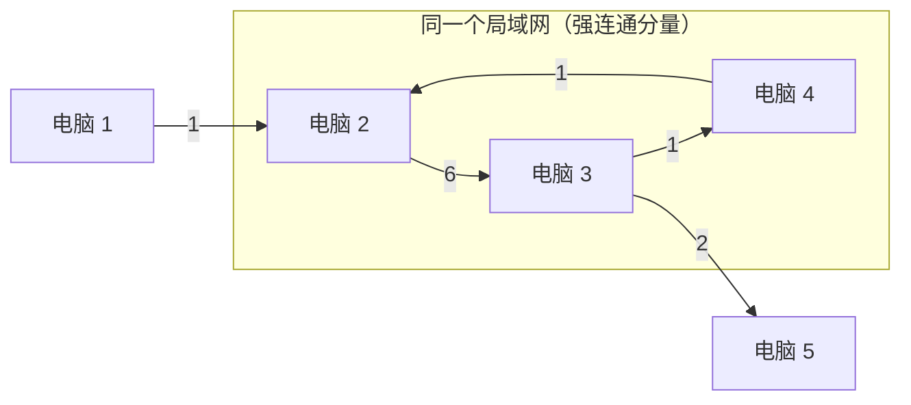

[[TOC]]

## 形式化题目

给定一张 $n$ 个点、$m$ 条边的带权有向图，边 $u \to v$ 的权值为 $w \geqslant 0$。规则是：

> 若 $u$ 能到达 $v$，且 $v$ 也能到达 $u$（即 $u$、$v$ 互相可达），则 $u$ 与 $v$ 之间的传输耗时为 $0$。

求点 $1$ 到点 $n$ 的最小传输耗时。重边、自环都可能出现。

关键是把“$u$、$v$ 互相可达”认成一种**等价关系**：它把点集划分成若干组，组内任意两点耗时都是 $0$，组间才按原边权计费。这种等价关系在图论里有一个现成的名字——**强连通分量**。所以本题的实质是：

> 把每个强连通分量缩成一个点（分量内部边权视为 $0$），在缩点后的图上求最短路。

## 暴力解法

### 思路

先不引入任何图论概念，只把题面这句话逐字翻译成代码。判断“$u$ 能不能到 $v$”最直白的办法是 **Floyd 传递闭包**：

1. 用 `reach[i][j]` 表示 $i$ 能否走到 $j$，初始时只有边和 `reach[i][i] = true`；
2. 跑一遍 Floyd 闭包，得到所有可达关系；
3. 对每个点对 $(i,j)$：若 `reach[i][j] && reach[j][i]`，说明两者互相可达，属于同一局域网，把 `dist[i][j]` 置 $0$；否则保留原边权；
4. 再跑一遍 Floyd，在带上这些 $0$ 权边的图上求 $1$ 到 $n$ 的最短路。

这版代码就是题意的直接翻译，没有任何技巧，因此它是对的——它就是“互相可达则耗时 $0$”这句话本身。代价是完全的 $O(n^3)$，只能过 $40\%$ 的数据。

顺带一提，这也是检验理解是否正确的试金石。如果只把“存在 $A\to B$ 且存在 $B\to A$”读成“**直接互相有边**”，第 3 步就会改成“只对存在直接反向边的点对置 $0$”，那个写法在本文章的样例 2 上会输出 $9$ 而不是 $3$（原因见“正解”一节）。

### 代码

@include-code(./brute.cpp, cpp)

### 复杂度

- 时间复杂度：两遍 Floyd，$O(n^3)$；
- 空间复杂度：$O(n^2)$。

### 瓶颈

瓶颈在“判断任意两点是否互相可达”这件事本身。它是一个**全源**可达性问题，朴素做法对每个点对都要重新判断，于是花了 $O(n^3)$。

但换个角度想：题目其实并不关心“点 $i$ 到点 $j$ 具体怎么走”，它只关心“哪些点两两互相可达”，也就是只要把这个等价关系分好组就行。用一个 $O(n^3)$ 的算法去算一个只需要“分组”的问题，显然浪费。分组的数量最多 $n$ 组，每组平均只有几个点——这就是优化的入口。

## 正解

### 关键观察一：局域网就是强连通分量

先确认“同一局域网”到底该怎么理解。

题面说“存在 $A$ 到 $B$ 的连接的同时也存在 $B$ 到 $A$ 的连接，那么 $A$ 和 $B$ 处于同一局域网内”。这句话容易被读成“只有 $A$、$B$ 之间**直接**存在一对反向边时才算同一局域网”。但这个读法是错的，样例 2 就能证明：

```text
5 5
1 2 1
2 3 6
3 4 1
4 2 1
3 5 2
```

它的边是 $1\to2$、$2\to3$、$3\to4$、$4\to2$、$3\to5$。逐条检查可以发现，**这张图里没有任何一对点之间存在直接的反向边**（$2\to3$ 有，$3\to2$ 没有；$3\to4$ 有，$4\to3$ 没有……一对都没有）。

- 若按“直接反向边才免费”计算，最短路径只能是 $1\to2\to3\to5$，耗时 $1+6+2=9$；
- 而官方答案是 $3$。

答案 $3$ 从哪来？$2,3,4$ 构成环 $2\to3\to4\to2$，在这三个点之间任意走动都是“本地传输”，耗时 $0$。于是 $1 \to 2 \to (\text{在} \{2,3,4\} \text{内免费走到} 3) \to 5$ 的耗时是 $1+0+2=3$。

所以正确的理解是：**“同一局域网” = “互相可达” = “属于同一个强连通分量（SCC）”**。判断标准不是“有没有直接的反向边”，而是“绕一圈能不能互相走到”。

下图画出样例 2 的结构：$\{2,3,4\}$ 因为成环而互相可达，合并成一个局域网；点 $1$ 和点 $5$ 各自单独成一个分量。



观察重点：局域网内部的三条边总权是 $6+1+1=8$，但因为是环形结构，走一圈能回到原点，所以内部任意两点之间的实际耗时都是 $0$；真正要付费的只有离开局域网的 $1\to2$ 和 $3\to5$ 两条边，合计 $1+2=3$。这也解释了为什么“直接反向边”的读法会漏掉这个局域网——环上的每条边都是单向的，但绕一圈就形成了互相可达。

### 关键观察二：局域网内部耗时确实为 0

上面的例子说明了直觉，这里补上严格理由。

设 $u$、$v$ 在同一 SCC。取一条 $u \to v$ 的路径 $u=x_0,\ x_1,\ \dots,\ x_k=v$。由于 $v$ 也能到达 $u$，这条路径上的每个中间点 $x_i$ 都同时满足“$u$ 能到 $x_i$”和“$x_i$ 能到 $v$ 能到 $u$”，即 $x_i$ 与 $u$ 互相可达；相邻的 $x_i$ 与 $x_{i+1}$ 自然也互相可达。于是路径上的**每一跳**都能按“本地传输”免费通过，整条路径耗时 $0$。

注意这个论证用到的正是“绕一圈能回来”，而不是“相邻两点有反向边”。这再次说明必须按互相可达理解。

由此得到：同一个 SCC 内部，任意两点耗时 $0$，整个分量可以等价地看成一个点。

### 关键观察三：缩点后跑最短路

既然分量内部耗时 $0$，那么在缩点建新图时：

- **分量内部的边全部丢弃**（它们等价于权值 $0$，对最短路没有贡献）；
- **跨分量的边原样保留**，因为跨局域网传输要按原权计费。

缩点后得到一个有向无环图。虽然它也是 DAG、可以用拓扑序 DP，但边权非负，直接用堆优化 Dijkstra 更简洁：不必处理“分量内多个入度源合并”的细节，也不会写错。

新图的起点是 `belong[1]`，终点是 `belong[n]`，答案就是 `dist[belong[n]]`。

### 实现细节：Tarjan 不能写递归

$n$ 最大 $2\times10^5$。如果 Tarjan 写递归，在 $1\to2\to\dots\to n$ 这样的链状数据上，递归深度会达到 $2\times10^5$ 层。本机实测（macOS，栈上限 8MB）直接 `Segmentation fault: 11`。

所以 `main.cpp` 用显式栈把递归改成循环，两个数组的分工是：

- `dfs_stk_u[i]`：第 $i$ 层正在访问的结点；
- `dfs_stk_e[i]`：该结点下一条待处理的出边。

一次 while 循环处理一条出边；当某点的出边遍历完，就相当于递归返回：弹出一层，并用它的 `low` 去更新父结点的 `low`，然后判断它是否为 SCC 的根。这与递归写法逐句对应，只是把函数调用栈换成了数组。

### 代码

@include-code(./main.cpp, cpp)

### 复杂度

- Tarjan 求 SCC：$O(n+m)$；
- 缩点重建：$O(n+m)$；
- 堆优化 Dijkstra：$O((n+m)\log n)$；

总计 $O((n+m)\log n)$ 时间、$O(n+m)$ 空间。在 $n \leqslant 2\times10^5$、$m \leqslant 10^6$ 下实测约 $0.15$ 秒。

## 总结

本题的难点不在算法，而在**读题**：

1. “$A$ 与 $B$ 处于同一局域网”必须理解成“$A$、$B$ **互相可达**”，而不是“$A$、$B$ 之间有直接的反向边”。样例 2 里没有任何一对直接反向边，却存在一个 $\{2,3,4\}$ 的局域网，答案 $3$ 就是证据。
2. 而“互相可达”这个关系恰好就是强连通分量定义的等价类，于是全源可达性判断问题被 Tarjan 的线性扫描解决。
3. 分量内部任意两点耗时 $0$（因为环路可以免费绕回来），所以缩点后内部边全部丢弃、跨分量边保留原权。
4. 最后在缩点图上跑堆优化 Dijkstra。数据规模要求 Tarjan 必须用迭代写法，否则链状数据会爆栈。

一句话概括：**“局域网”就是强连通分量，“局域网内耗时 0”就是缩点时把内部边权视作 0。**
