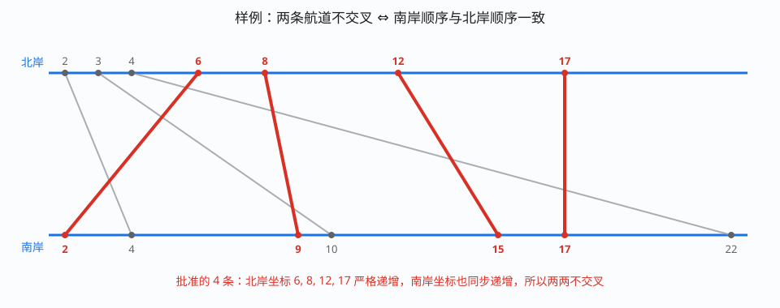

[[TOC]]

## 形式化题目

河的两岸各有 $N$ 个位置互不相同的城市，两岸之间一一对应地配成 $N$ 对友好城市。第 $i$ 对用 $(s_i,t_i)$ 表示：南岸坐标 $s_i$、北岸坐标 $t_i$（每个南岸城市恰好出现在一对中，每个北岸城市也恰好出现在一对中）。

把每对城市看成一条连接南岸 $s_i$ 与北岸 $t_i$ 的直线航道，求最大的 $k$，使得可以从 $N$ 对中选出 $k$ 对，对应的 $k$ 条航道两两不相交。

## 解法路线

题面给了两份真实的数据范围，正好对应两层解法：

| 层次 | 约束 | 做法 | 复杂度 |
| --- | --- | --- | --- |
| 暴力 | 很小 | 01 序列枚举每条申请批准/拒绝，叶子两两判断是否交叉 | $O(2^N N^2)$ |
| 子任务 | $N \leqslant 5000$ | 按南岸坐标排序后转成 LIS，再用 $O(N^2)$ 的 DP | $O(N^2)$ |
| 正解（正式主解） | $N \leqslant 2 \times 10^5$ | 二分维护 `c[j]`，把 DP 的内层扫描换成二分 | $O(N\log N)$ |

第一层把"批准一批申请"翻译成可执行的枚举，第二层给出本题的核心模型，第三层把 LIS 的 DP 内层扫描换成二分。本文的正式主解是第三层，代码见 `## 正解`。

核心模型和 [[luogu/P1439]] 是同一件事：那一题把 $P_2$ 的值映射成它在 $P_1$ 中的下标后求 LIS，本题把友好城市按南岸坐标排序后求 LIS。正解的 LIS 写法也沿用 P1439 的 `c[]` / `f[]` 版本。

## 暴力解法

### 适用范围

$N \leqslant 15$ 左右。它只用来把"批准一批申请"变成可执行的程序，并作为对拍的基线。

### 思路

每个申请只有**批准**和**拒绝**两种选择，$N$ 个申请一共产生 $2^N$ 条完整的 01 选择序列。用 `choose[i]` 记录第 $i$ 个申请的选择，`dfs(dep)` 只负责决定第 `dep` 个申请选不选，到 `dep == N+1` 时一条完整选择序列就生成完毕。

在叶子节点做两件事：

- `check()` 两两检查被批准的航道是否交叉；
- `calc_answer()` 统计被批准的条数，并更新最大值。

两条航道 $(s_1,t_1)$ 和 $(s_2,t_2)$ 交叉，等价于两岸坐标的大小顺序相反：

$$(s_1-s_2)\times(t_1-t_2) < 0.$$

这个式子可以这样理解：南岸坐标较小的一条从左边出发，如果它在北岸落点也靠左，两条航道"从西到东"的走向一致，不会相遇；如果它的落点反而靠右，两条线段在两条平行岸线之间的端点次序相反，就必然相交。只要发现一对交叉，`check()` 立刻返回，整个方案不合法。

### 代码

@include-code(./brute.cpp, cpp)

### 复杂度与瓶颈

- 时间：$2^N$ 条选择序列，每条最坏花 $O(N^2)$ 检查，总 $O(2^N N^2)$。
- 空间：$O(N)$。

瓶颈是枚举量 $2^N$，和坐标的具体取值无关。想覆盖 $N \leqslant 2\times10^5$，必须换一种只和"批准的方案满足什么形状"有关的建模，而不是逐条枚举。

## 子任务解法：$N \leqslant 5000$

### 适用范围

$N \leqslant 5000$，此时 $O(N^2)$ 次比较可以接受。它已经就是本题的核心模型。

### 思路

先只盯两条航道。设它们的南岸坐标 $s_1 < s_2$：

- 若北岸坐标 $t_1 < t_2$，两条航道的走向一致，不相交；
- 若 $t_1 > t_2$，一条从左下走到右上、另一条从左上走到右下，两条线段必然在两岸之间相交。

所以**两条航道不交叉 $\iff$ 两岸坐标的大小顺序一致**。

注意这句话里"谁在前、谁在后"是由坐标大小决定的。把结论推广到多条：一个合法方案里，选中航道按南岸坐标从小到大排好序后，它们的北岸坐标也必须严格递增。

于是问题就变成"固定下面那一排的顺序，上面也必须照这个顺序排"：

1. 先把所有友好城市按**南岸坐标**从小到大排序。此后下标 $1,2,\dots,N$ 就是南岸从西到东的顺序，也就是"谁在前、谁在后"；
2. 按这个顺序取出北岸坐标，得到序列 $t_1,\dots,t_N$；
3. 在 $t$ 中选一个最长的、值严格递增的子序列。

第 3 步为什么就是原问题？因为整个 $t$ 已经按南岸排好序，取子序列时南岸的相对顺序自然保持；只要再要求北岸的值递增，两岸顺序就一致，这个子集就是合法方案。反过来，任何合法方案排序后都对应 $t$ 的一个严格上升子序列。两个方向的方案一一对应，所以答案就是 $t$ 的**最长严格上升子序列（LIS）**长度。

用 DP 直接求 LIS。设 `dp[i]` 表示以第 $i$ 对城市结尾时，最多能批准多少条：

$$dp_i = 1 + \max\{\,dp_j : j < i,\ t_j < t_i\,\},$$

没有可接的前驱时 $dp_i=1$，答案是 $\max_i dp_i$。

样例的 7 对按南岸坐标排序后，北岸坐标序列是：

| 排序后位置 | 1 | 2 | 3 | 4 | 5 | 6 | 7 |
| --- | --- | --- | --- | --- | --- | --- | --- |
| 南岸 $s$ | 2 | 4 | 9 | 10 | 15 | 17 | 22 |
| 北岸 $t$ | 6 | 2 | 8 | 3 | 12 | 17 | 4 |

`t` 的最长严格上升子序列可以取 `6, 8, 12, 17`，长度 4，与样例输出一致；它对应航道 $(2,6),(9,8),(15,12),(17,17)$。



图中红色是被批准的 4 条航道，灰色是被拒绝的。只看红色航道：按南岸坐标从左到右排列时，北岸端点也正好从左到右递增，所以两两不交叉；灰色航道与红色航道在两岸的先后顺序相反，都会产生交叉。整张图把"不交叉 $\iff$ 同一顺序"这件事直接画了出来。

#### 子任务解法的 DP 扫描表

这张表展示排序后北岸序列 `t = [6, 2, 8, 3, 12, 17, 4]` 上，$O(N^2)$ 的 LIS 扫描过程：每一行是 `i`、`t[i]`、所有满足 `t[j] < t[i]` 的前驱、以及 `dp[i]` 和当前答案。

<!-- 由 problem-analysis-workspace/viz_render.py 生成，表格内容见 problem-analysis-workspace/dp-table.md。 -->

| $i$ | $t_i$ | 可接前驱 $j$（$t_j < t_i$） | $dp_i$ | 当前答案 |
| ---: | ---: | --- | ---: | ---: |
| 1 | 6 | — | 1 | 1 |
| 2 | 2 | — | 1 | 1 |
| 3 | 8 | t[1]=6(dp=1), t[2]=2(dp=1) | 2 | 2 |
| 4 | 3 | t[2]=2(dp=1) | 2 | 2 |
| 5 | 12 | t[1]=6(dp=1), t[2]=2(dp=1), t[3]=8(dp=2), t[4]=3(dp=2) | 3 | 3 |
| 6 | 17 | t[1]=6(dp=1), t[2]=2(dp=1), t[3]=8(dp=2), t[4]=3(dp=2), t[5]=12(dp=3) | 4 | 4 |
| 7 | 4 | t[2]=2(dp=1), t[4]=3(dp=2) | 3 | 4 |

第 3 列列出了所有合法的前驱及其 `dp` 值，`dp[i]` 取其中的最大值加 1。每一行都要回头扫一遍前面的所有元素，这正是 $O(N^2)$ 的来源。

### 代码

@include-code(./main2.cpp, cpp)

### 复杂度与瓶颈

- 时间：排序 $O(N\log N)$，DP 两重循环 $O(N^2)$，总 $O(N^2)$。
- 空间：$O(N)$。

瓶颈在内层那个 $\max$：每个 $i$ 都要回头扫所有 $j$，找"$t_j < t_i$ 且 $dp_j$ 最大"的那个。$N=2\times10^5$ 时是 $10^{10}$ 次比较，过不去。但注意我们并不需要知道具体是哪个 $j$，只想知道**能接上的最大长度**——这个信息足够小，可以用另一种结构存下来。

## 正解

### 关键观察

**问题？** 内层扫描要找的到底是什么？

要找的是 $\max\{dp_j : t_j < t_i\}$。`dp` 值越大越难接上，所以真正需要记住的信息是：

> 对于每个长度 $j$，所有长度为 $j$ 的合法链中，结尾的北岸坐标最小能是多少。

把这个最小值记为 `c[j]`。它就是"长度 $j$ 的最好接点"。于是

$$t_i \text{ 能接在长度 } j \text{ 的链后} \iff c_j < t_i,$$

因为只要存在一条长度 $j$、结尾小于 $t_i$ 的链就能接，而 `c[j]` 是所有结尾里最小的。

**问题？** `c[]` 有什么结构？

`c[]` 严格递增。任取一条长度为 $j+1$ 的链，去掉最后一个元素就得到一条长度 $j$ 的链，它的结尾比最后一个元素小，所以长度 $j$ 的最小结尾 $c_j$ 一定小于长度 $j+1$ 的最小结尾 $c_{j+1}$。

于是"满足 $c_j < t_i$ 的 $j$"一定是一段**前缀**：小的 $j$ 都行，大的 $j$ 不行。令

$$f_i = \text{第一个满足 } c_j > t_i \text{ 的位置 } j.$$

`f[i]` 的左边恰好有 $f_i-1$ 个能接上的长度，把 $t_i$ 接在长度 $f_i-1$ 的链后面，就得到一条以 $t_i$ 结尾、长度为 $f_i$ 的链。所以 `f[i]` 正是"以第 $i$ 对城市结尾时最多批准多少条"。因为 `c` 递增，这个"第一个大于 $t_i$ 的位置"用二分可以在 $O(\log N)$ 内找到——内层的线性扫描被彻底消掉。

### 思路

把观察写成算法：

1. 把所有友好城市按南岸坐标排序；
2. 从左到右扫描北岸坐标 $t_i$：
   - 二分找第一个满足 `c[j] > t[i]` 的位置 $p$；
   - 令 `f[i] = p`，这就是以第 $i$ 对城市结尾的答案；
   - 令 `c[p] = t[i]`，用更小的结尾替换掉原来的值；
3. 答案取所有 `f[i]` 的最大值。

顺序扫描保证只用到前面的元素；二分条件是 `c[j] > t[i]`，对应严格上升（需要 $t_j < t_i$）。`c[]` 单调递增，所以手写二分就是 rbook《二分查找》里 `first_true` 的形状：把区间右端取到虚拟位置 $N+1$，`c[N+1]` 放哨兵无穷大，表示"不存在大于 $t_i$ 的元素"，这样不必额外判断越界。

#### 正解的 c[] 更新表

这张表展示 `c[j]`（长度恰好为 $j$ 的合法链中，结尾最小值）如何随扫描更新。`f[i]` 是第一个满足 `c[j] > t[i]` 的位置，也就是以 `t[i]` 结尾的最长链长度。

| $i$ | $t_i$ | $f_i$（第一个 $c_j > t_i$ 的位置） | 更新后的 $c$ | 当前答案 |
| ---: | ---: | ---: | --- | ---: |
| 1 | 6 | 1 | 6 | 1 |
| 2 | 2 | 1 | 2 | 1 |
| 3 | 8 | 2 | 2, 8 | 2 |
| 4 | 3 | 2 | 2, 3 | 2 |
| 5 | 12 | 3 | 2, 3, 12 | 3 |
| 6 | 17 | 4 | 2, 3, 12, 17 | 4 |
| 7 | 4 | 3 | 2, 3, 4, 17 | 4 |

第 $i=2$ 行是个典型：$t_2=2$ 比 `c[1]=6` 还小，所以第一个大于它的位置是 1，`c[1]` 被改小成 2，为后面留出更大的空间。第 $i=7$ 行 $t_7=4$ 落在 3 和 12 之间，于是 `c[3]` 从 12 换成 4，长度 4 的 `c[4]=17` 保持不变。因为 `c` 严格递增，这个位置可以用二分在 $O(\log N)$ 内找到，于是总复杂度从 $O(N^2)$ 降到 $O(N\log N)$。

### 代码

@include-code(./main.cpp, cpp)

### 复杂度

- 时间：读入与排序 $O(N\log N)$，$N$ 次二分各 $O(\log N)$，总 $O(N\log N)$。
- 空间：`a[]`、`c[]`、`f[]` 各 $O(N)$。

## 总结

- **不能交叉的条件**：两条航道交叉 $\iff$ 南岸坐标的先后顺序与北岸坐标的先后顺序相反。所以一个合法方案按南岸坐标排序后，北岸坐标必须严格递增。
- **转成 LIS**：下面（南岸）按坐标排出"谁在前、谁在后"，上面（北岸）也必须照同样的顺序排；把所有友好城市按南岸坐标排序，取出北岸坐标序列，答案就是这个序列的最长严格上升子序列长度。
- **从 $O(N^2)$ 到 $O(N\log N)$**：DP 内层要找 `t_j < t_i` 中最大的 `dp_j`；改成维护 `c[j]` = 长度为 $j$ 的链的最小结尾，它单调递增，于是二分第一个 `> t_i` 的位置即可。
- **易错点**：要求严格递增（`c[j] > t[i]`，不是 $\geqslant$）；排序必须按同一岸做，不能两边各排各的；`f[i]` 是"以第 $i$ 对结尾"的答案，最终要取 $\max_i f_i$。

## 图示解析

这张图串起本题从"不能交叉"到"求 LIS"的主线：

```text
输入 N 对 (南岸 s, 北岸 t)
`- 关键观察：两条航道交叉 ⇔ 两岸坐标顺序相反
   `- 按 s 排序后，北岸 t 必须严格递增 ⇒ 问题变成求 t 序列的 LIS
      |- O(N^2)：dp[i] = 1 + max{ dp[j] : t[j] < t[i] }
      `- O(N log N)：维护 c[j] = 长度 j 的最小结尾，二分第一个 c[j] > t[i]
         `- f[i] 即以第 i 对结尾的答案，取 max f[i]
```

先看第一行如何把"选一个不交叉的子集"翻译成"固定南岸顺序"；第二行说明合法方案只剩北岸递增这一个条件，于是落到 LIS；最后两行是同一条 LIS 的两种求法，$O(N^2)$ 暴露瓶颈、二分版本给出正解。
