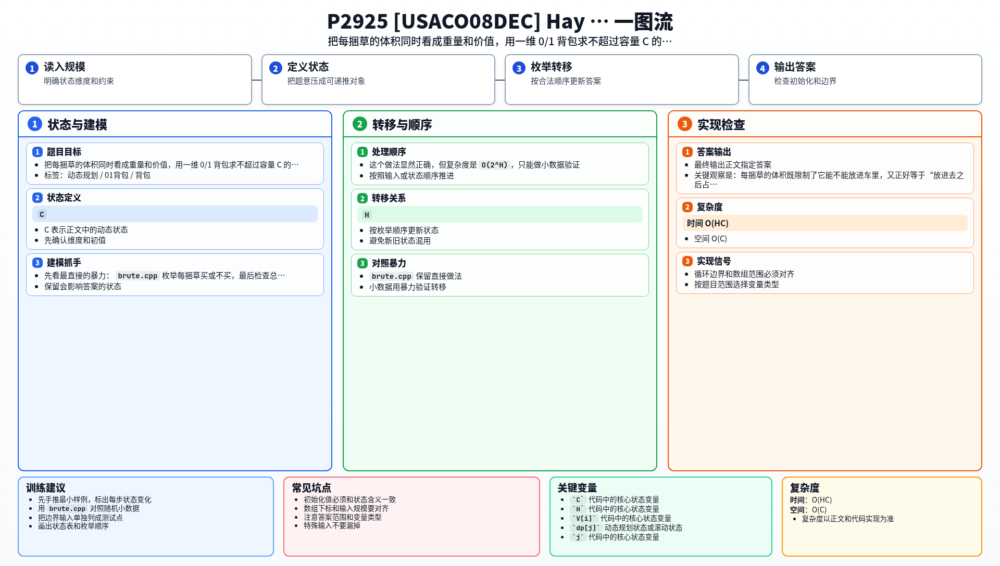

[[TOC]]

## 形式化题目

有一辆容量为 `C` 的车，现在有 `H` 捆草可买。

- 每捆草有一个体积 `V[i]`
- 每捆草最多只能买一次
- 不能只买一部分
- 总体积不能超过 `C`

要求在不超过容量 `C` 的前提下，让买到的草总体积尽量大。

这张表可以把原题直接翻译成背包模型：

| 原题对象 | 背包含义 |
| --- | --- |
| 一捆草 | 一个只能选一次的物品 |
| 草捆体积 `V[i]` | 物品重量 |
| 草捆体积 `V[i]` | 物品价值 |
| 车的容量 `C` | 背包容量 |

从这里就能看出，本题本质上是"总容量不超过 `C` 时，最多能装多少体积"。

## 暴力

先看最直接的暴力：

@include-code(./brute.cpp, cpp)

`brute.cpp` 把每捆草看成一个 01 选择：`choose_hay[i] = 0/1` 表示不买或买。递归先生成完整选择，叶子节点再检查总体积是否超过 `C`，并统计最大装载体积。

这个做法显然正确，但复杂度是 $O(2^H)$，只能做小数据验证。

## 思路

**一句话本质**：每捆草体积同时充当重量和价值，求不超过容量 C 的最大总体积。

本题有两种解法：

- **解法一：标准 0/1 背包** — 维护 `f[j]` 表示容量 `j` 能装下的最大体积，逆序遍历每个草捆。最贴合背包模板，适合理解"价值 = 体积"的特殊情况。
- **解法二：bitset + 01 背包恰好装满** — 用布尔 `dp[j]` 表示体积 `j` 是否可达，配合 bitset 位移完成转移。当重量和价值相等时，用可行性 DP 比维护最大值更简洁高效。

两份代码都可以作为本题的提交答案，其中 `main.cpp`（解法二）是仓库中的正式主解。

## 解法一：标准 0/1 背包

### 思路

每捆草的体积就是重量，也是价值。套用标准 0/1 背包：

- 定义 `f[j]` 表示容量 `j` 能装下的最大体积
- 初始化 `f[0..C] = 0`
- 对每个草捆体积 `v`，逆序更新 `f[j] = max(f[j], f[j-v] + v)`
- 最终 `f[C]` 就是答案

因为价值 = 重量，背包的"最大价值"就是"最大体积"。

### 代码

@include-code(./main-rainboy.cpp, cpp)

### 复杂度

- 时间复杂度：$O(HC)$
- 空间复杂度：$O(C)$

## 解法二：bitset + 01 背包恰好装满

### 思路

**每捆草的价值恰好等于它的体积，这意味着什么？**

普通 01 背包需要同时记录重量和价值两个量。但这题每捆草的价值 = 体积，所以只要知道"体积 j 能否恰好凑出"，答案自然就是最大的 j。不用额外维护价值数组。

**用可行性（布尔）DP 代替最大值 DP，有什么好处？**

布尔 dp[j] 表示体积 j 是否可达。转移 dp[j] |= dp[j - v] 只有位运算，而且 C ≤ 50000，可以用 bitset 一行写完：dp |= (dp << v)。bitset 把 50000 位的转移压缩成 ~782 个 64 位机器字的批量移位和或，比循环 bool 数组快得多。

**bitset 转移为什么不会让同一捆草被用多次？**

dp |= (dp << v) 是用上一轮的 dp（右操作数）生成新状态并或入当前 dp。如果你写 dp = dp | (dp << v)，那就完全没问题——每次移位基于移位前的 dp。C++ 中 dp |= (dp << v) 的语义是先算 (dp << v)（基于当前 dp 的快照），再或入 dp。等价于一次性做完所有基于本轮开始状态的转移。

**最后怎么获得答案？**

从 C 向 0 扫描，第一个 dp[j] = true 的 j 就是最大可装载体积。因为如果能凑出 j，j 就是可达总体积。

#### 状态表

这张表说明状态定义：

| 状态 | 含义 |
| --- | --- |
| `dp[j]` | 总体积 `j` 是否可达 |

#### DP 公式

设 $dp_j$ 表示总体积 $j$ 是否可达。初始化 $dp_0 = true$。加入体积为 $v_i$ 的草捆时：

$$
dp \leftarrow dp \lor (dp \ll v_i)
$$

最终从 $C$ 向 $0$ 找第一个 $dp_j = true$ 的 $j$。

公式解释：bitset 位移等价于"原来能凑出的每个体积加上当前草捆体积"，然后与原可达集合取或。位移基于上一轮结果，保证每捆草只用一次。

### 代码

@include-code(./main.cpp, cpp)

### 复杂度

- 时间复杂度：$O(HC / w)$，$w$ 为机器字长（通常 64）
- 空间复杂度：$O(C)$

## 总结

这题和最基础的 0/1 背包完全同型，只是物品价值刚好等于物品体积。当重量和价值一致并且只需知道最大可达容量时，bitset 可行性 DP 比维护最大值更简洁高效。两种解法基于同样的"重量 = 价值"建模，选择哪种取决于个人偏好和运行环境。

## 图示解析

这张图把本题的建模、关键转移、实现检查和训练方法压缩到一页，适合读完正文后复盘。

