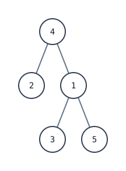

[[TOC]]

## 形式化题目

给定一棵以 $s$ 为根的有根树，共 $n$ 个结点。给出 $m$ 个询问，每个询问给出两个结点 $u, v$，求它们的最近公共祖先 $\text{LCA}(u, v)$：既是 $u$ 的祖先又是 $v$ 的祖先、且深度最大的那个结点。不保证 $u \neq v$。

## 思路

先看一个可以直接验证想法的朴素解：

@include-code(./brute.cpp, cpp)

`brute.cpp` 对每个询问把 `x` 到根的整条路径标记出来，再从 `y` 向上爬父亲，遇到的第一个被标记结点就是 LCA：公共祖先就是两条到根路径的交点。单次询问 $O(n)$，链形树上 $m$ 次询问 $O(nm)$，无法通过 $5\times10^5$ 的数据。

关键观察有两点：

1. **LCA 一定是两个点的祖先**：问题等价于「两条到根路径的交点里深度最大的点」，只要能快速向上跳，就能快速找 LCA；
2. **任意上跳距离可拆成二进制位**：$13 = 8 + 4 + 1$，只要会跳 $2^j$ 步，就能一次跳任意步。

于是预处理倍增祖先表：$up[u][j]$ 表示 $u$ 向上跳 $2^j$ 步到达的祖先，转移式

$$up[u][j] = up[up[u][j-1]][j-1]$$

先跳 $2^{j-1}$ 步、再从那跳 $2^{j-1}$ 步，合起来就是 $2^j$ 步。查询分两步走：先把较深点按深度差的二进制位向上跳，和另一个点同深；若此时两点相同，浅点本身就是 LCA；否则从高位到低位枚举 $j$，只有 $up[u][j] \neq up[v][j]$ 才一起跳（说明两点仍在 LCA 下方不同分支，安全），最后两点停在 LCA 的两个不同儿子上，父亲就是答案。

这张图是样例树（根为 4，2 与 1 是它的孩子，3 和 5 是 1 的孩子）：



观察要点：$\text{LCA}(3,5) = 1$，因为 3、5 同在 1 的子树；$\text{LCA}(2,4) = 4$，因为 2 的父亲就是 4。样例五个询问 $(2,4),(3,2),(3,5),(1,2),(4,5)$ 的答案分别是 $4,4,1,4,4$，读者可以对照树图逐条验证「先同深、再同步跳」两步。

## 代码

@include-code(./main.cpp, cpp)

## 复杂度

- 时间：预处理 $O(n \log n)$，单次询问 $O(\log n)$，总计 $O((n+m)\log n)$。
- 空间：倍增表 $O(n \log n)$，邻接表与深度数组 $O(n)$。

## 总结

LCA 倍增的本质是把「一次向上跳一步」升级成「一次跳 $2^j$ 步」：预处理 2 的幂祖先表，查询时先对齐深度、再从高位到低位同步跳，保证跳后两点仍分居 LCA 两侧，最后返回父亲。rbook 的《[倍增求 LCA](https://rbook2.roj.ac.cn/tree-algo/jump-lca/index.html)》讲解了同一种 `up` / `depth` 模板（`lca-binary-lifting`）与「同深不丢答案」「从大到小跳正确」的完整证明，本解按该模板的接口实现，仅把递归 DFS 预处理换成 BFS，避免 $5\times10^5$ 规模递归爆栈。

## 图示解析

这张 ASCII 图展示整道题的解题路线：

```text
朴素暴力（brute.cpp）
  每次询问：标记 x 到根的整条路径，y 沿父亲向上爬找第一个标记点
  单次 O(n)，m 次询问 O(n*m)
        |
        | 瓶颈：最坏是链，一次询问要爬 O(n) 次父亲
        v
关键观察
  LCA 一定是两个点的祖先 => 到根的两条路径交点里深度最大的那个
  任意上跳距离可拆成二进制位：13 = 8 + 4 + 1
        |
        v
倍增预处理（main.cpp）
  depth[u] 深度；up[u][j] 表示 u 的 2^j 级祖先
  up[u][j] = up[up[u][j-1]][j-1]
  查询两步走：① 深点先提到同深  ② 从高位到低位同步跳，祖先不同才跳
        |
        v
复杂度 O((n + m) log n)，空间 O(n log n)
```

图中三条主线对应「暴力慢在哪」「用什么性质加速」「倍增如何兑现这个性质」。整个算法只有两个动作——先把深度对齐，再一起向上跳到 LCA 的下方一层，最后父亲就是答案；把「爬一步」升级成「跳 $2^j$ 步」就是倍增的全部内容。
