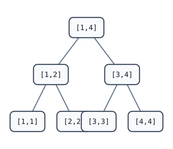

[[TOC]]

## 形式化题目

有一个长度为 $n$ 的 0/1 序列，初始所有位置都是 0。给出 $m$ 次操作：

1. 把区间 $[a,b]$ 内的每个值取反（0 变 1，1 变 0）；
2. 询问区间 $[a,b]$ 内值为 1 的位置数量。

要求按顺序处理全部操作，并输出每次询问的答案。

## 思路

先看一个可以直接验证想法的朴素解：

@include-code(./brute.cpp, cpp)

`brute.cpp` 直接维护数组 `lamp[]`：区间翻转逐盏取反，区间查询逐盏计数，单次操作 $O(n)$，总复杂度 $O(nm)$，无法通过 $10^5$ 的数据。

关键观察有两点：

1. **翻转的自逆性**：同一个位置翻转两次等于不翻，所以懒标记只要一个 `bool`，合并规则就是异或。
2. **整段翻转可以整体结算**：长度为 `len` 的区间亮灯数量为 `sum`，整体取反后数量变成 `len - sum`，不需要逐个访问叶子。

于是用线段树 + 懒标记：每个节点存这段区间内亮灯的数量；区间翻转完全覆盖一个节点时，只改这个节点的数量和标记，把翻转“欠”在节点上；之后要进入它的子树时，再把标记下传给两个儿子。

### 数学视角：为什么懒标记能成立

把上面的观察用代数语言压缩，可以得到懒标记成立的精确条件：

- **查询信息构成幺半群**：区间和用 $+$ 合并，$+$ 满足结合律，且存在单位元 $0$（空区间的和、查询累加的初始值），所以区间和构成交换幺半群 $(\mathbb{Z}, +, 0)$。
- **翻转是摘要上的自同态**：翻转可以仅凭节点摘要结算，$\text{flip}(\text{sum}) = \text{len} - \text{sum}$，并且能与合并操作交换：

$$\text{flip}(a+b) = \text{len} - (a+b) = (\text{len}_A - a) + (\text{len}_B - b) = \text{flip}(a) + \text{flip}(b)$$

  这就是“翻转不必下到叶子”的数学原因。又因为 $\text{flip} \circ \text{flip} = \text{id}$（翻转自逆），懒标记可以用 `bool` 异或合并。

一句话概括：**查询信息构成幺半群，且区间更新是幺半群上的自同态，就可以用懒标记线段树维护**。反过来，如果更新依赖区间内部的具体值（例如“把区间内每个数换成它的后继”），它就不是摘要自同态，懒标记会失效。

下面这张图展示一棵规模为 4 的线段树，节点上的数字是它代表的区间：



任意操作区间都能拆成 $O(\log n)$ 个“整段节点”。例如查询/翻转 $[2,4]$ 会命中 `[2,2]` 和 `[3,4]` 这两个整段节点，各花 $O(1)$ 结算，这就是 $O(\log n)$ 的来源：不需要访问区间内的每个点。

以样例为例，4 盏灯每次操作后的真实状态如下：

| 操作 | 灯 1 2 3 4 | 输出 |
| --- | --- | --- |
| 初始 | 0 0 0 0 |  |
| 翻转 [1,2] | 1 1 0 0 |  |
| 翻转 [2,4] | 1 0 1 1 |  |
| 查询 [2,3] | 1 0 1 1 | 1 |
| 翻转 [2,4] | 1 1 0 0 |  |
| 查询 [1,4] | 1 1 0 0 | 2 |

观察表中两次翻转 $[2,4]$：第一次后该段从 `0 1 1` 变 `1 0 0`，第二次又恢复原样。这正是节点数量公式 `len - sum` 和懒标记异或（翻两次抵消）在样例上的直接体现。

## 代码

@include-code(./main.cpp, cpp)

## 复杂度

- 时间：单次操作 $O(\log n)$，总 $O(m \log n)$。
- 空间：线段树四倍数组，$O(n)$。

## 总结

这道题是区间翻转懒标记最标准的模板：数量用 `len - sum` 结算，标记用异或合并。“翻转两次抵消”是布尔懒标记的典型合并规则；理解了 `apply` + `push` 的写法，就掌握了线段树处理区间翻转类问题的核心套路。rbook 的《[线段树：区间赋值与区间查询](https://rbook2.roj.ac.cn/data_structure/segment_tree/update_range/index.html)》讲解了同一种 `pull` / `apply` / `push` 模板结构，本解即由该模板（`segtree-range-assign`）改造而来。

## 图示解析

这张 ASCII 图展示整道题的解题路线：

```text
朴素模拟（brute.cpp）
  数组 lamp[1..n] 逐盏翻转 / 逐盏计数      O(n) 每次操作
        |
        | 瓶颈：单次操作 O(n)，m 次操作 O(n*m) 太大
        v
关键观察
  区间翻转 = 区间内 1 的数量变成长度减原数量
  同一个点翻转两次等于没翻（取反的自逆性）
        |
        v
线段树 + 懒标记（main.cpp）
  节点存区间内亮灯数量 sum
  懒标记 lazy 表示整段待翻转（异或合并）
  翻转：整段直接 sum = len - sum，标记取反，不下传
  查询：遇到标记先下传，再进子树
        |
        v
复杂度 O((n + m) log n)，空间 O(n)
```

图中三条主线分别对应“暴力在哪里慢”“观察到什么性质”“正式解如何利用这个性质”。懒标记的本质是把“整段翻转”这个操作暂停在节点上，等真正要访问子树时才往下传，从而让一次操作只走一条树链。
