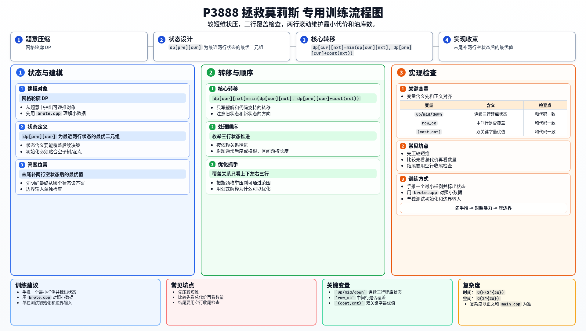

[[TOC]]

### 题意

在网格图上选择一些格子建油库，使得每个格子都被自己或四邻中的油库覆盖。

要求先最小化总代价；若总代价相同，再最小化油库数量。

### 思路

先看一个小数据暴力：

@include-code(./brute.cpp, cpp)

暴力会枚举每个格子建不建油库，再检查是否覆盖整张图。

正解利用“一个格子是否被覆盖，只和上下左右有关”这一点，做按行推进的轮廓 DP。

把较短的一维作为状态宽度，转成 `W <= 7`。

然后设每一行的建库方案是一个二进制状态。

当我们处理到三行 `up, mid, down` 时，
中间这一行是否已被完全覆盖就可以被完全确定：

- `mid` 自己建库
- `up / down` 负责上下覆盖
- `mid` 左右移位负责左右覆盖

所以可以写一个 `row_ok(up, mid, down)` 检查函数。

DP 时维护相邻两行状态，不断枚举下一行状态并转移。

#### DP 转移方程

设状态保留最近两行 `(pre, cur)`，枚举下一行 `nxt`。
若 `row_ok(pre, cur, nxt)` 成立，就可以转移：

$$
dp[cur][nxt] =
\min(dp[cur][nxt],\ dp[pre][cur] + cost(nxt))
$$

这里的 `min` 是双关键字比较：先比较总代价，再比较油库数量。

由于题目有双关键字，需要把每个状态的值记成：

- 总花费
- 油库数量

比较时先比花费，再比数量。

### 代码

@include-code(./main.cpp, cpp)

### 复杂度

设压缩后宽度为 `W`，时间复杂度约为 $O(H * 2^{3W})$，空间复杂度 $O(2^{2W})$。

### 总结

这题本质上是网格上的带权最小支配集。
真正让它可做的关键，是利用局部覆盖关系，把问题压成“三行判定、两行滚动”的轮廓 DP。

### 一图流解析

这张图把本题的建模、关键转移、实现检查和训练方法压缩到一页，适合读完正文后复盘。

