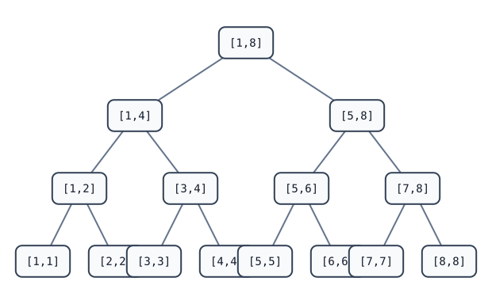

[[TOC]]

## 形式化题目

有 $m$ 个长度为 $n$ 的字符串，每个位置是 `0`、`1` 或 `?`，$n \leqslant 30$。支持两类操作：

1. 询问区间 $[l, r]$：求有多少个 0/1 串 $S$，满足区间内每个字符串都能把 `?` 替换成 0 或 1 后变成 $S$；
2. 把某一个字符串整体替换成新串。

最后把所有询问答案异或起来输出。

本质上：每个带 `?` 的串是一个「位置约束的集合」——位置要么被固定为 0、要么被固定为 1、要么自由。询问就是求区间内这些约束集合的交集大小。

## 思路

先看一个直接按题面定义的朴素解：

@include-code(./brute.cpp, cpp)

这个暴力把每次询问看成一串 01 选择：`choose[j] = 0/1` 表示候选串 $S$ 第 $j$ 位的取值。递归先生成完整的 $n$ 位候选串，到叶子节点再与 $[l, r]$ 内每一封信逐位检查是否兼容，统计兼容的候选串个数。一次询问 $O(2^n \cdot n \cdot (r-l+1))$，只适合 $n \leqslant 6$ 左右的小数据，但它是独立于位掩码公式的验证基准。

瓶颈在于逐候选串、逐信、逐位地检查。优化思路是把一封信的约束压进**两个位掩码**（每个位置一个 bit，$n \leqslant 30$ 正好放进一个 32 位整数）：

- `zero`：出现 `0` 的位置集合；
- `one`：出现 `1` 的位置集合；
- `?` 不贡献任何位。

编码动作本身很简单：约定字符串第 $i$ 个字符（从 0 开始数）对应二进制第 $i$ 位，遍历字符串时用 `1 << i` 把对应位置 1：

```cpp
int z = 0, o = 0;
for (int i = 0; i < n; i++) {
    if (t[i] == '0') z |= (1 << i);       // 第 i 位固定为 0
    else if (t[i] == '1') o |= (1 << i);  // 第 i 位固定为 1
    // '?' 不设置任何位
}
```

以 `010` 为例：第 0、2 个字符是 `0`，把 bit 0 与 bit 2 置 1，得 $z = 0\text{b}101$；第 1 个字符是 `1`，得 $o = 0\text{b}010$。下表中集合 {1, 3}、{2} 正是这两个掩码转成 1-indexed 位置后的写法。这样每一封信就压缩成两个 32 位整数，线段树节点直接存这两个值。

关键观察是**区间合并就是按位或**：$S$ 同时兼容区间内每一封信，等价于 $S$ 满足所有信约束的并集。于是区间 $[l, r]$ 的约束是：

$$Z = \bigvee_{i=l}^{r} z(s_i), \qquad O = \bigvee_{i=l}^{r} o(s_i)$$

答案公式：若 $Z \cap O \neq \varnothing$（某一位同时被固定为 0 和 1，说明区间内有两封信冲突）答案为 0；否则被固定过的位置有 $|Z \cup O|$ 个，剩下 $n - |Z \cup O|$ 个位置自由，答案为 $2^{\,n - |Z \cup O|}$。

「按位或合并」满足结合律、单位元为 0（空集合），且操作形态是单点修改 + 区间查询——这正是线段树的标准形态。每个节点存 `(zero, one)` 两个掩码，`push_up` 时分别 OR；一次询问只访问 $O(\log m)$ 个整段节点。

以样例的三封信为例（位置 1..3），掩码编码与合并过程如下：

第一张表展示每封信编码出的两个掩码：

| 串 | zero（固定为 0 的位置） | one（固定为 1 的位置） |
| --- | --- | --- |
| 010 | {1, 3} | {2} |
| 0?0 | {1, 3} | ∅ |
| 1?0 | {3} | {1} |
| 0??（修改后的 s3） | {1} | ∅ |

第二张表展示 4 次询问的合并结果：

| 询问 | 合并 Z | 合并 O | Z∩O | 自由位 | 答案 |
| --- | --- | --- | --- | --- | --- |
| [1,2] | {1, 3} | {2} | ∅ | 0 | 1 |
| [2,3] | {1, 3} | {1} | {1} | — | 0 |
| 修改后 [2,3] | {1, 3} | ∅ | ∅ | 1 | 2 |
| 修改后 [1,3] | {1, 3} | {2} | ∅ | 0 | 1 |

观察要点：第二次询问中位置 1 被 s2 固定为 0、又被 s3 固定为 1，`Z ∩ O ≠ ∅` 直接判 0；把 s3 改成 `0??` 后冲突消除，位置 2 成为唯一的自由位，答案变成 $2^1 = 2$。这正是「OR 合并 + 冲突判定 + 2 的幂」三条规则在样例上的体现，异或总答案为 $1 \oplus 0 \oplus 2 \oplus 1 = 2$。

下面这张图展示一棵规模为 8 的线段树，节点上的数字是它代表的区间：



任意询问区间都能拆成 $O(\log m)$ 个整段节点。例如查询 $[2,7]$ 会命中 `[2,2]`、`[3,4]`、`[5,6]`、`[7,7]` 四个整段节点，各花 $O(1)$ 做两次 OR 合并，这就是 $O(\log m)$ 的来源：不需要逐个访问区间里的每封信。

## 代码

@include-code(./main.cpp, cpp)

## 复杂度

- 时间：建树 $O(m)$；单次修改或询问 $O(\log m)$；总复杂度 $O(m + q \log m)$。
- 空间：线段树四倍数组 $O(m)$，另有 $O(nm)$ 的原串数组（$n \leqslant 30$ 视为常数），共 $O(m)$。

## 总结

这道题把「带 `?` 的字符串区间约束」压缩成「两个位掩码 + 按位或合并」：交集语义对应 OR 合并，冲突判定与 $2^{\text{自由位}}$ 都是 $O(1)$ 的位运算。$n \leqslant 30$ 是位压进 32 位整数的关键前提，OR 的结合律则让它无缝套进线段树。rbook 的《[线段树：单点修改与区间查询](https://rbook2.roj.ac.cn/data_structure/segment_tree/update_one/index.html)》讲解了同一种 `push_up` / `build` / 单点改 / 区间查模板结构，本解即由该模板（`segtree-point-add-range-sum`）把「加合并」改成「OR 合并」而来。

## 图示解析

这张 ASCII 图展示整道题的解题路线：从暴力枚举出发，到位掩码 + 线段树解法：

```text
朴素暴力（brute.cpp）
  枚举全部 2^n 个候选串 S（choose[j] = 第 j 位取 0 或 1）
  叶子节点逐信逐位检查兼容性      O(2^n * n * 区间长) 每次询问
        |
        | 瓶颈：候选串指数级、区间逐串线性级，都不行
        v
关键观察
  一封信的约束 = 两个位置集合：zero（固定为 0）、one（固定为 1）
  区间内所有信同时满足 ⇔ 约束取并集 ⇔ 掩码按位或
  z∩o ≠ ∅（某位同时被固定为 0 和 1）→ 答案 0
  否则答案 = 2^(n - |z∪o|)（自由位各两种取法）
        |
        v
线段树（main.cpp）
  节点存区间 (zero, one) 两个掩码
  push_up：左右儿子分别按位或合并
  修改：叶子重新编码，路径上 push_up 上推
  查询：区间拆成 O(log m) 个整段节点，OR 进累计变量
        |
        v
复杂度 O((m + q) log m)，空间 O(m)
```

观察要点：图中三条主线分别对应「暴力慢在哪里」「观察到的合并规则」「正式解如何利用这个规则」。合并规则是这道题的灵魂——交集大小的语义落到位掩码上就是 OR；冲突判定与 $2^{\text{自由位}}$ 公式只是 OR 之后的两次位运算。
