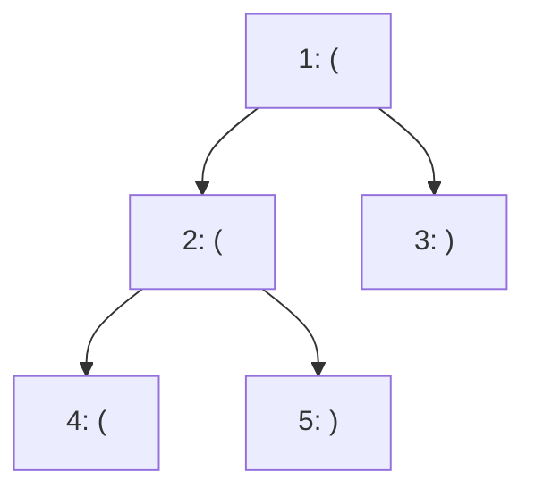

[[TOC]]

## 形式化题目

给定一棵以结点 $1$ 为根的树，共 $n$ 个结点，父亲满足 $f_u<u$。每个结点 $u$ 上有一个括号 $c_u\in\{\texttt{(},\texttt{)}\}$。

记 $s_u$ 为根到 $u$ 的简单路径上的括号按经过顺序拼接得到的字符串。设 $k_u$ 为 $s_u$ 中**位置不同**的合法括号子串个数，求

$$
(1k_1)\oplus(2k_2)\oplus\cdots\oplus(nk_n).
$$

其中 $\oplus$ 是位异或。所谓“位置不同”，是指子串的起止位置 $(l,r)$ 不同，即使内容相同也分别计数。

样例 $1$ 的树如下，结点上标注了它对应的括号。

从图中可以看到根到每个结点的路径：$s_1=\texttt{(}$，$s_2=\texttt{((}$，$s_3=\texttt{()}$，$s_4=\texttt{(((}$，$s_5=\texttt{(()}$。只有 $s_3$ 与 $s_5$ 各含一个合法子串，所以答案是 $3\oplus 5=6$。

## 暴力解法

### 思路

最直接的做法是照着题意把每个 $s_u$ 都构造出来，再枚举它的所有子串，逐个判断是不是合法括号串。

判断合法性用括号匹配的经典判据：从左到右扫描，任意前缀的 `(` 数都不少于 `)` 数，且最后两者数量相等。

### 代码

@include-code(./brute.cpp, cpp)

### 复杂度

每个结点要拼一次路径，再枚举 $O(n^2)$ 个子串、每个子串 $O(n)$ 判定，单结点是 $O(n^3)$，全部结点 $O(n^4)$，空间 $O(n)$。

### 瓶颈

这个做法把“不同子串按位置计数”完整做了一遍，思路最贴近题意，但连 $n=2000$ 都跑不动。瓶颈有两处：

1. 每个结点都重新拼一遍路径；
2. 每个结点都重新枚举一遍子串。

题目要求 $n\leqslant 5\times10^5$，这两处都必须消掉。

## 正解

### 思路

#### 把问题拆成“旧的 + 新增的”

从父亲 $f_u$ 走到 $u$ 时，路径字符串只在末尾多了一个字符。因此 $s_u$ 的合法括号子串要么原来就在 $s_{f_u}$ 里，要么必须以 $u$ 结尾。设

- $end\_count[u]$：$s_u$ 中以结点 $u$ 结尾的合法括号子串数量；
- $total\_count[u]$：$s_u$ 中全部合法括号子串数量，即题面的 $k_u$。

于是

$$
total\_count[u]=total\_count[f_u]+end\_count[u].
$$

第一处瓶颈就此消除：父亲的答案可以直接复用，不必重新枚举。

#### 关键观察：与右括号配对的左括号是唯一确定的

如果 $c_u=\texttt{(}$，任何合法括号串都不可能以它结尾，直接有 $end\_count[u]=0$。

如果 $c_u=\texttt{)}$，设 $p$ 是根到 $u$ 的路径上、$u$ 左边最近的未被匹配左括号，也就是对前缀 $s_u$ 做括号匹配时与 $u$ 配对的左括号。

任意一个以 $u$ 结尾的合法括号子串 $T$，都对应路径上一段连续区间 $[l,u]$。$T$ 本身是合法括号串，而合法括号串内部的配对关系与在整个前缀 $s_u$ 中的配对关系一致，所以 $T$ 里与末尾那个 `)` 配对的左括号必然就是 $p$。

于是 $T=[l,p]\cup[p+1,u]$。其中 $[p+1,u]$ 已经是一对合法括号，剩下的 $[l,p-1]$ 也必须是一个以 $f_p$ 结尾的合法括号串（或者为空）。以 $f_p$ 结尾的合法括号串有 $end\_count[f_p]$ 个，再加上“$[l,p-1]$ 为空、$T$ 就是 $[p,u]$”这一种，得到

$$
end\_count[u]=end\_count[f_p]+1.
$$

这里必须用 $end\_count[f_p]$ 而不是 $total\_count[f_p]$：能和 $[p,u]$ 拼在一起的合法串必须**紧贴在 $p$ 前面**，因此必须以 $f_p$ 结尾；$total\_count[f_p]$ 里那些更早结束的串中间隔着字符，拼不成连续子串。

#### 让每个结点都有一份栈

现在只剩第二处瓶颈：如何快速找到 $p$，而且不重复扫描路径前缀。

沿一条路径走时，未匹配左括号天然构成一个栈：遇到 `(` 压入，遇到 `)` 弹出栈顶。链上的情况可以维护一个全局栈，但树会分叉，回溯时恢复现场很麻烦。更干净的做法是让每个结点**只记录栈顶**，栈本身通过父亲方向共享：

- `stack_top[u]`：处理完结点 $u$ 之后，根到 $u$ 路径上的未匹配左括号栈顶结点编号（$0$ 表示栈空）；
- `stack_next[x]`：结点 $x$ 在栈中的下一个结点，沿着它就能还原整条栈。

转移就很直接：

- $c_u=\texttt{(}$：$u$ 自己成为新栈顶，`stack_top[u] = u`，并令 `stack_next[u] = stack_top[f_u]`；
- $c_u=\texttt{)}$ 且 `stack_top[f_u] != 0`：栈顶 $p$ 被匹配弹出，`stack_top[u] = stack_next[p]`，同时取 $end\_count[u]=end\_count[f_p]+1$；
- $c_u=\texttt{)}$ 且栈空：`stack_top[u] = 0`，$end\_count[u]=0$。

每个结点只会写入一次 `stack_next[u]`（只有在它自己是 `(` 时才写），而不同分支的结点各自持有自己的指针，因此共享前缀不会互相干扰，栈的总空间是 $O(n)$。

题目保证 $f_u<u$，所以按 $u=1,2,\ldots,n$ 的顺序递推时父亲一定已经算完，连 DFS 都不需要。

#### 样例推演

下表用样例 $1$ 走一遍。约定 $f_1=0$，且 $end\_count[0]=total\_count[0]=0$。

| 结点 $u$ | $c_u$ | 匹配到的 $p$ | `stack_top[u]` | $end\_count[u]$ | $total\_count[u]$ |
| --- | --- | --- | --- | --- | --- |
| $1$ | `(` | 无 | $1$ | $0$ | $0$ |
| $2$ | `(` | 无 | $2$ | $0$ | $0$ |
| $3$ | `)` | $1$ | $0$ | $end\_count[f_1]+1=1$ | $total\_count[1]+1=1$ |
| $4$ | `(` | 无 | $4$ | $0$ | $0$ |
| $5$ | `)` | $2$ | $1$ | $end\_count[f_2]+1=1$ | $total\_count[2]+1=1$ |

最后 $(1\cdot0)\oplus(2\cdot0)\oplus(3\cdot1)\oplus(4\cdot0)\oplus(5\cdot1)=3\oplus5=6$，与样例一致。

### 代码

@include-code(./main.cpp, cpp)

### 复杂度

- 时间复杂度：$O(n)$。每个结点只处理一次，压栈、弹栈、递推都是 $O(1)$。
- 空间复杂度：$O(n)$。需要存父亲、括号、两个栈数组和两个计数数组，均为 $n$ 级别。

## 总结

这题的核心是不要把路径上的子串真的枚举出来，而是拆成

$$
total\_count[u]=total\_count[f_u]+end\_count[u].
$$

当 $c_u=\texttt{)}$ 且匹配到左括号 $p$ 时，

$$
end\_count[u]=end\_count[f_p]+1.
$$

这个式子只看“紧贴在 $p$ 前面、并且以 $f_p$ 结尾”的合法串，因此用的是 $end\_count$ 而不是 $total\_count$。

实现上，用 `stack_top` 记录每个结点的栈顶、用 `stack_next` 共享栈结构，就不必在回溯时恢复现场，一次线性递推即可处理任意分叉的树。

本文的 `main.cpp` 已用逐路径枚举子串的 `brute.cpp` 对拍 $400$ 组随机数据（链与随机树各半）。
