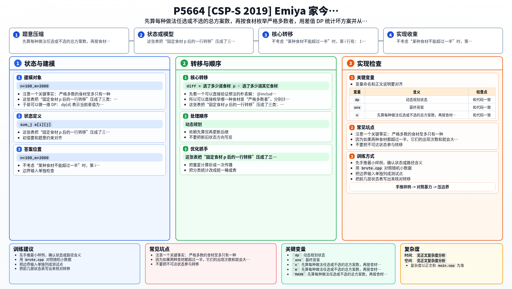

[[TOC]]

## 形式化题目

给定一个 $n \times m$ 的非负整数矩阵 $a$，$a_{i,j}$ 表示第 $i$ 种烹饪方法、第 $j$ 种食材能做的不同菜的数量。

要求选出一个非空方案，满足：
- 每种烹饪方法至多选一道菜（每行至多选一个）
- 设最终选了 $k$ 道菜，则每种食材出现的次数都不超过 $\lfloor k/2 \rfloor$

统计所有合法方案数，对 $998\,244\,353$ 取模。

## 暴力解法

### 思路

逐行枚举：对第 $i$ 行，要么不选，要么选某一种食材 $j$（有 $a_{i,j}$ 种具体菜）。

枚举完所有行后，检查是否存在某种食材出现次数严格超过一半。若没有，则把该方案的方案数累入答案。

### 代码

@include-code(./brute.cpp, cpp)

### 复杂度

- 时间：$O(2^n \cdot m)$，每行有"不选"和"选食材 $j$"共 $m+1$ 种选择
- 空间：$O(m)$，只记录每种食材被选次数

### 瓶颈

枚举量随 $n$ 指数增长，只能处理 $n \leqslant 15$ 左右的小数据。

## 正解

### 思路

先不考虑"每种食材不能超过一半"的限制，计算总方案数，再扣掉**坏方案**（存在某种食材严格超过一半）。

**总方案数**：第 $i$ 行有 $1$ 种"不选"和 $\sum_j a_{i,j}$ 种"选"，所以总方案数为：

$$\prod_{i=1}^{n} \left(1 + \sum_{j=1}^{m} a_{i,j}\right) - 1$$

减一是去掉空方案。

**坏方案计数**：关键观察是——**严格多数的食材至多只有一种**。若两种食材都超过一半，则它们的出现次数之和大于总菜数，矛盾。

因此可以枚举哪一种食材 $p$ 是"严格多数者"，分别计数后求和。

#### 固定食材 $p$ 后的三种选择

把每一行的选择分成三类：

| 对第 $i$ 行的处理 | 方案数 | 差值变化 |
| --- | --- | --- |
| 不选 | $1$ | $0$ |
| 选食材 $p$ | $a_{i,p}$ | $+1$ |
| 选其它食材 | $\sum_j a_{i,j} - a_{i,p}$ | $-1$ |

定义 $\mathit{diff} =$（选食材 $p$ 的次数）$-$（选其它食材的次数）。

最终 $\mathit{diff} > 0$ 就意味着食材 $p$ 比其它所有食材加起来还多，即严格超过一半。

于是做一维 DP：
- $dp[d]$ 表示当前差值为 $d$ 的方案数（$d$ 用偏移量 $n+1$ 映射到非负下标）
- 每一行按上表做三种转移
- 最后把所有 $\mathit{diff} > 0$ 的状态加起来，就是"食材 $p$ 成为严格多数"的坏方案数

把所有食材的坏方案数加起来，从总方案数里减掉即得答案。

### 代码

@include-code(./main.cpp, cpp)

### 复杂度

- 时间：$O(nm + mn^2)$，读入 $O(nm)$，枚举 $m$ 种食材各做一次 $O(n^2)$ 的 DP
- 空间：$O(nm)$，输入矩阵占主要空间，DP 数组 $O(n)$

## 总结

这题最关键的两步是：

1. 把"每种食材都不能超过一半"改写成"不能存在严格多数食材"
2. 固定一个候选多数食材后，把所有其它食材合并成一类，只维护两边数量差

一旦做到这一步，原本看起来像多维计数的问题，就被压成了一个很规整的一维 DP。

## 图示解析

这张图把本题的建模、关键转移、实现检查和训练方法压缩到一页，适合读完正文后复盘。

