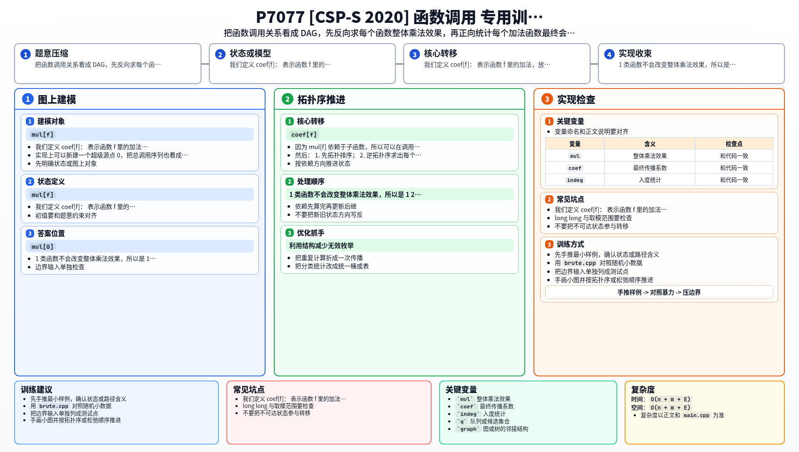

[[TOC]]

## 形式化题目

给定长度为 $n$ 的数组 $a_1,\dots,a_n$，以及 $m$ 个函数。每个函数属于以下三类之一：

1. 单点加法：$a_{P_j}\mathrel{+}=V_j$；
2. 整体乘法：对所有 $i$，$a_i\mathrel{*}=V_j$；
3. 顺序调用：依次执行给定的若干函数 $g^{(j)}_1,\dots,g^{(j)}_{C_j}$。

再给定长度 $Q$ 的调用序列 $f_1,\dots,f_Q$。要求依次执行 $f_1,f_2,\dots,f_Q$，输出执行后的数组，答案对 $998244353$ 取模。

函数调用关系不递归，即构成一张有向无环图。所有运算都在模 $998244353$ 意义下进行。

样例 $1$ 的调用关系如下。

```dot
digraph G {
  rankdir=LR;
  F0["超级源点 0"] -> F2["f2: 全体 *2"];
  F0 -> F3["f3"];
  F3 -> F1["f1: a1 += 1"];
  F3 -> F2;
}
```

图中 `f3` 先调用 `f1` 再调用 `f2`，而总调用序列是先 `f2` 后 `f3`。可以看到 `f1` 加上的那个 $1$ 会被 `f2` 放大成 $2$，而 `f2` 在序列里出现两次，最终原数组被整体放大了 $4$ 倍。

## 暴力解法

### 思路

最直接的做法就是照着题意递归模拟：遇到 $1$ 类函数就单点加，遇到 $2$ 类函数就整段乘，遇到 $3$ 类函数就按顺序递归执行它调用的函数。

### 代码

@include-code(./brute.cpp, cpp)

### 复杂度

设 $E=\sum C_j$ 为调用边总数。一次函数执行最多展开 $O(E)$ 次子调用，总调用序列最多 $Q$ 项，最坏时间复杂度 $O(Q\cdot E)$，空间 $O(n+m+E)$。

### 瓶颈

这个做法在测试点 $1\sim 2$ 这种小数据上完全正确，但大数据的规模是 $n,m,Q\leqslant 10^5$、$E\leqslant 10^6$。同一个函数如果在不同的调用链里被反复展开，暴力会把它重算很多遍，$O(Q\cdot E)$ 直接超时。

真正的问题是：我们其实并不需要知道每个函数被执行的**过程**，只需要知道两件事——它让整个数组乘了几倍，以及它里面的加法最后被乘了几倍。

## 正解

### 思路

#### 第一个量：整体乘法倍数 `mul_all`

先只关心乘法。对每个函数 $f$，设

$$
mul\_all[f]=\text{函数 } f \text{ 完整执行一次后，整个数组额外乘上的倍数}.
$$

- $1$ 类函数不改变整体倍数，$mul\_all[f]=1$；
- $2$ 类函数就是它自己的乘数，$mul\_all[f]=V_f$；
- $3$ 类函数按顺序执行 $g_1,\dots,g_k$，整体倍数就是各子函数倍数的乘积：

$$
mul\_all[f]=\prod_{i=1}^{k}mul\_all[g_i].
$$

因为 $mul\_all[f]$ 只依赖子函数，所以在调用 DAG 上按**逆拓扑序**就能一次算完。

#### 第二个量：加法的最终系数 `coef`

光有 `mul_all` 还不够。以样例 $1$ 为例，`f1` 加的是 $1$，但它在 `f3` 里排在 `f2` 前面，会被 `f2` 放大成 $2$，而 `f2` 在总序列里又出现一次，最终贡献是 $2$。

设

$$
coef[f]=\text{函数 } f \text{ 里的加法，落到最终答案时还要再乘上的系数}.
$$

超级源点 $0$ 代表总调用序列，显然 $coef[0]=1$。

考虑一个父函数按顺序调用 $g_1,g_2,\dots,g_k$，父函数继承到的系数是 $C$：

- $g_k$ 后面没有兄弟函数，直接继承 $C$；
- $g_{k-1}$ 后面还要执行 $g_k$，所以继承 $C\cdot mul\_all[g_k]$；
- 更靠前的 $g_i$ 要再乘上它后面所有兄弟的倍数。

因此**从后往前**扫描子函数列表，维护一个后缀积 `suffix`，就能把系数发下去：

```text
suffix = C
for i = k down to 1:
    coef[g_i] += suffix
    suffix *= mul_all[g_i]
```

这里每个子函数接收到的都是“父函数系数 × 自己后面所有兄弟的倍数”，正是它执行完之后还会被放大多少次。

#### 为什么必须先拓扑排序

注意函数编号和拓扑序**没有关系**：题面只保证调用关系无环，编号小的函数完全可能调用编号大的函数。所以不能简单地按 $1,2,\dots,m$ 的顺序递推，必须先把整张调用 DAG 拓扑排序，得到 `order[]`：

- 逆着 `order[]` 扫，求 `mul_all`；
- 顺着 `order[]` 扫，把 `coef` 从父传给子。

#### 汇总答案

把所有 $1$ 类函数的贡献按最终系数加到对应位置上：

$$
add\_sum[P_f]\mathrel{+}=coef[f]\cdot V_f.
$$

最后

$$
a_i\leftarrow a_i\cdot mul\_all[0]+add\_sum[i].
$$

#### 样例推演

样例 $1$：$n=3$，$a=[1,2,3]$，$f_1$ 是 `a1 += 1`，$f_2$ 是 `all *= 2`，$f_3$ 依次调用 $f_1,f_2$，总调用序列为 $[f_2,f_3]$。

| 阶段 | 对象 | 结果 |
| --- | --- | --- |
| `mul_all` | $f_1$ | $1$（加法不影响整体倍数） |
| `mul_all` | $f_2$ | $2$ |
| `mul_all` | $f_3$ | $mul\_all[f_1]\cdot mul\_all[f_2]=2$ |
| `mul_all` | 源点 $0$ | $mul\_all[f_2]\cdot mul\_all[f_3]=4$ |
| `coef` | 源点 $0$ | $1$ |
| `coef` | $f_3$ | 从 $0$ 的列表末尾继承，$1$ |
| `coef` | $f_2$ | 源点列表里 $f_3$ 排在它后面，$1\cdot mul\_all[f_3]=2$；再加 $f_3$ 列表里它排在最后、直接继承 $coef[f_3]=1$，合计 $3$ |
| `coef` | $f_1$ | $f_3$ 列表里它后面是 $f_2$，$1\cdot mul\_all[f_2]=2$ |
| `add_sum` | 位置 $1$ | $coef[f_1]\cdot V_{f_1}=2\cdot1=2$ |
| 答案 | $a$ | $[1\cdot4+2,\ 2\cdot4+0,\ 3\cdot4+0]=[6,8,12]$ |

与样例输出 `6 8 12` 一致。

### 代码

@include-code(./main.cpp, cpp)

### 复杂度

设 $E=\sum C_j$ 为调用边总数。

- 拓扑排序 $O(m+E)$；
- 逆拓扑序求 `mul_all` 一次 $O(m+E)$；
- 正拓扑序传播 `coef` 一次 $O(m+E)$；
- 汇总答案 $O(n+m)$。

总时间复杂度 $O(n+m+E)$，空间复杂度 $O(n+m+E)$。

## 总结

这题不是模拟题，而是把“顺序调用”拆成两个可以复用的量：

- `mul_all[f]`：函数 $f$ 对整体数组的乘法倍数，逆拓扑序求；
- `coef[f]`：函数 $f$ 中加法落到答案上的最终系数，正拓扑序从后往前传播。

一旦把这两个量分开，每个函数就只需要被处理常数次，问题落成调用 DAG 上的两次线性扫描。最容易踩的坑是函数编号不等于拓扑序，必须先做一次拓扑排序。

本文的 `main.cpp` 已用递归模拟的 `brute.cpp` 对拍 $400$ 组随机数据（链与随机树各半），并另外核对了两组题面样例：`in1` / `out1`（样例 1）与 `in2` / `out2`（样例 2）。题面列出的样例 3 是 `call/call3.in` 外部附件，本题目录未收录。

## 图示解析

这张图把本题的建模、关键转移、实现检查和训练方法压缩到一页，适合读完正文后复盘。


