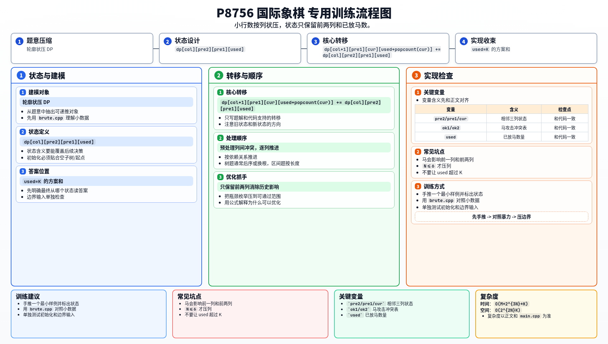

[[TOC]]

### 题意

在 `N x M` 的棋盘上放 `K` 个马，要求任意两个马都不能互相攻击。
问方案数，对 `1e9+7` 取模。

### 思路

先看一个小数据暴力：

@include-code(./brute.cpp, cpp)

暴力就是逐格枚举放不放马，再检查是否合法。

正解要利用 `N<=6` 很小这一点，把“一整列”压成一个二进制状态。

关键观察是：

- 当前列只会和前一列、前两列发生马的攻击关系
- 更早的列不会再影响当前列

因此状态中只需要记住：

- 前两列的摆放情况
- 已经放了多少个马

设列状态为 `s`。

预处理两种合法性：

- `ok1[a][b]`：相邻两列 `a,b` 是否冲突
- `ok2[a][b]`：相隔两列 `a,b` 是否冲突

然后做按列推进的 DP：

- `dp[col][pre2][pre1][used]`

#### DP 转移方程

枚举当前列状态 `cur`，若它和前两列都不冲突，则：

$$
dp[col+1][pre1][cur][used+popcount(cur)]
\mathrel{+}= dp[col][pre2][pre1][used]
$$

其中合法条件是 `ok1[pre1][cur]` 且 `ok2[pre2][cur]`。

每次枚举当前列状态 `cur`，只要满足：

- `ok1[pre1][cur]`
- `ok2[pre2][cur]`

就能转移。

这就是典型的“小行数、大列数”的轮廓 DP。

### 代码

@include-code(./main.cpp, cpp)

### 复杂度

时间复杂度约为 $O(M * 2^{3N} * K)$，但由于 `N<=6`，状态数很小，可以通过。

### 总结

这题的关键是识别马的攻击范围只跨 1 列和 2 列，因此状态只需要保留前两列。
看清这一点后，问题就会自然落到列状压 DP 上。

### 一图流解析

这张图把本题的建模、关键转移、实现检查和训练方法压缩到一页，适合读完正文后复盘。

