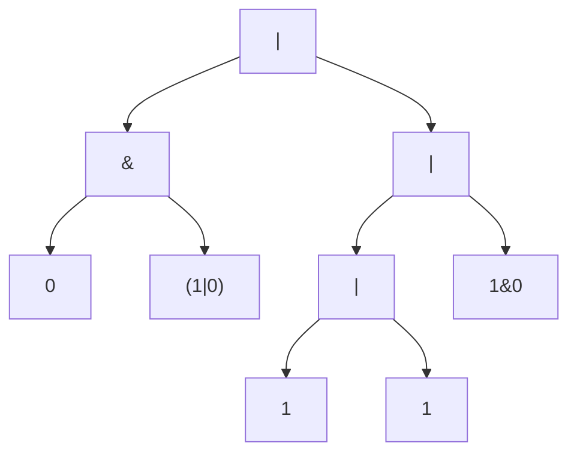
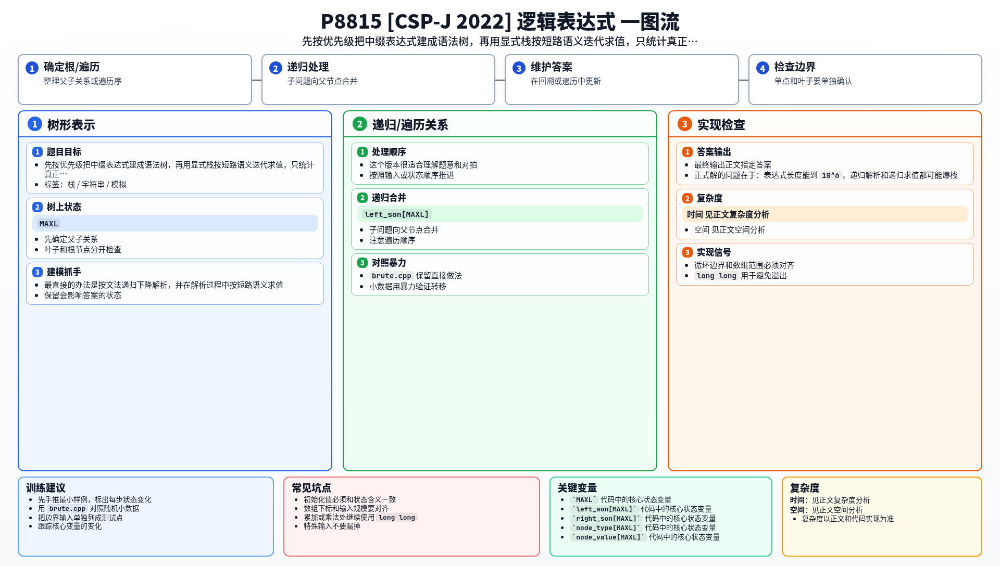

[[TOC]]

### 题意

给出一个只包含 `0`、`1`、`&`、$|$、括号的合法逻辑表达式。

需要输出：

1. 表达式最终的值
2. 形如 `a&b` 的短路次数
3. 形如 $a|b$ 的短路次数

题目规定括号优先，`&` 高于 $|$，同级从左到右计算。

### 思路

最直接的办法是按文法递归下降解析，并在解析过程中按短路语义求值。

先看一个可以直接验证想法的朴素解：

@include-code(./brute.cpp, cpp)

`brute.cpp` 用 $parse_or / parse_and / parse_factor$ 描述整个文法，并在发生短路时用 $skip_*$ 函数把右侧子表达式整体跳过。这个版本很适合理解题意和对拍。

但表达式长度能到 $10^6$，递归下降的解析最坏要递归 $O(|s|)$ 层。正式解把解析换成非递归的调度场算法，求值改成在显式语法树上做短路 dfs。

#### 样例语法树

这张图展示样例 $0&(1|0)|(1|1|1&0)$ 对应的主要语法结构：

从图里可以看到，短路求值本质上就是“先看左儿子，再决定要不要进右儿子”。
例如左边的 $0&(1|0)$，只要看到左儿子是 `0`，就能直接确定整棵 `&` 子树结果为 `0`，右边整块都不会被访问。
因此右子树内部的任何短路，也都不该被统计。

所以正式解分成三步：

1. 用调度场算法把中缀表达式转成后缀表达式（后缀里不含括号）
2. 扫描后缀表达式建出语法树
3. 在语法树上 dfs 后根遍历，边求值边统计短路次数

第三步是后根遍历：先递归算左子树，拿到左值后才能判断本节点会不会短路：

- 遇到 `&` 且左值为 `0`，统计一次 `&` 短路，本节点值为 `0`，并且**不递归右子树**
- 遇到 $|$ 且左值为 `1`，统计一次 $|$ 短路，本节点值为 `1`，同样跳过右子树
- 否则递归右子树，最后用左右儿子的值算出本节点的值

短路时不递归右子树，右子树内部的短路自然不会被统计，正满足“被外层短路的整块不计入统计”。
表达式退化成一条链（如 `1|1|1|...`）时递归深度会到 $O(|s|)$，评测机栈足够大时可以直接递归。

### 代码

@include-code(./main.cpp, cpp)

### Python 短解法

Python 版可以更进一步：不显式建树，把“一段表达式的结果”记成三元组（值、`&` 短路次数、$|$ 短路次数）。
调度场算法每归约一次，就把栈顶的左右两段合成一段：左段一旦短路，右段一整段都不求值，
右段的短路次数直接丢弃——这正对应树上写法“短路时不递归右子树”。归约完栈里剩下的最后一段就是答案。

@include-code(./main.py, python)

时间复杂度同为 $O(|s|)$，只是 Python 常数更大，$10^6$ 长度的最坏数据实测不到 $1$ 秒。

### 复杂度

建树和求值都只会对每个字符或节点做常数次处理，所以总时间复杂度是 $O(|s|)$，空间复杂度也是 $O(|s|)$。

### 总结

这题的关键不是普通表达式求值，而是“短路会让整棵右子树失去访问资格”。把表达式显式建成语法树后，这个限制就会变得很自然。

### 一图流解析

这张图把本题的建模、关键转移、实现检查和训练方法压缩到一页，适合读完正文后复盘。

