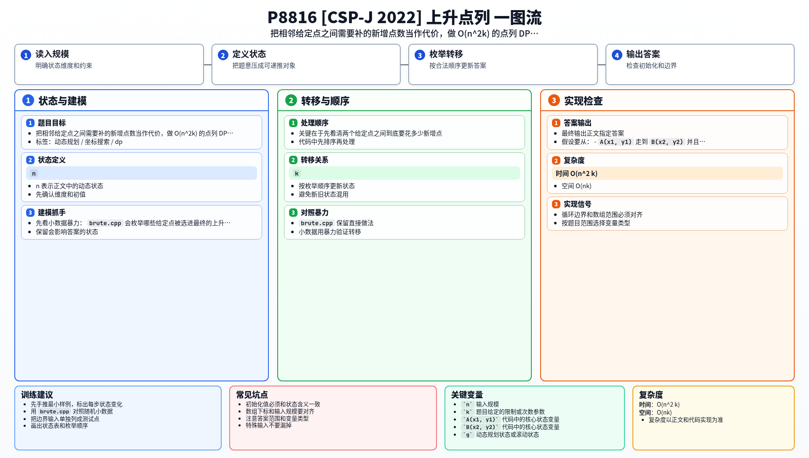

[[TOC]]

### 题意

给出 `n` 个整数点，还允许你额外添加 `k` 个整数点。

要求从这些点里选出一个序列，使得相邻两点距离恰好为 `1`，并且坐标都单调不减。也就是说，每一步只能：

- 向右走一格
- 或向上走一格

问这样的点列最大能有多长。

### 思路

先看小数据暴力：

@include-code(./brute.cpp, cpp)

下面是另一种「01 序列」风格的暴力写法。它按排序后的给定点依次决定“选 / 不选”，递归生成完整选择后，叶子节点统一检查任意两点的横纵坐标差是否都满足限制，并统计可选点数：

另一种暴力写法：01 序列

@include-code(./brute_01_style.cpp, cpp)

`brute.cpp` 会枚举哪些给定点被选进最终的上升点列，只要下一个点坐标不下降，并且连接它所需的新增点数还没超预算，就继续 DFS。

关键在于先看清两个给定点之间到底要花多少新增点。

假设要从：

- `A(x1, y1)` 走到 `B(x2, y2)`

并且 $x2 >= x1, y2 >= y1$。

因为每一步只能向右或向上，所以总步数固定是：

- `(x2-x1) + (y2-y1)`

而这段路的两个端点已经是给定点，所以中间真正需要补上的新增点数就是：

- `(x2-x1) + (y2-y1) - 1`

#### 两点代价表

| 起点到终点 | 总步数 | 需要补的新增点数 |
| --- | --- | --- |
| `(1,2) -> (3,2)` | `2` | `1` |
| `(3,3) -> (3,4)` | `1` | `0` |
| `(2,2) -> (5,5)` | `6` | `5` |

接下来有个很关键的化简：

如果一条点列里一共选了 `g` 个给定点，并且为了把它们连起来用了 `t` 个新增点，那么这条点列当前长度就是：

- `g + t`

而剩下的 `k-t` 个新增点总能继续接到点列末尾（一路向右或向上走），把长度再增加 `k-t`。

所以我们干脆让 DP 直接把 `g + t` 这个“已经定下来的点列长度”统计进去，最后再补上剩下的新增点。

于是做 DP。

先按 `(x 升序, y 升序)` 排序，设：

- `dp[i][t]` 表示以第 `i` 个给定点为终点，恰好用了 `t` 个新增点时，整条点列最多包含多少个点（新增点也算进去）

排序之后只要从前面找一个前驱即可，和 LIS 一样写双重循环，枚举终点 `i`、再枚举前驱 `j < i`。若 `j` 满足 `y_j <= y_i`，就计算：

- $need = (x_i-x_j) + (y_i-y_j) - 1$

注意这里的下标方向：是从前驱 `j` 转移到终点 `i`，所以 `need` 用 `i` 减 `j`。转移为：

- `dp[i][t+need] = max(dp[i][t+need], dp[j][t] + need + 1)`

其中 `+need` 是补进去的新增点，`+1` 是终点 `i` 自己。

因为 `dp` 已经把新增点算进去了，最后剩下的 `k-t` 个新增点还能继续接在点列末尾，所以答案就是：

- $\max_{i,t}\left(dp_{i,t} + (k - t)\right)$

#### DP 公式

设前驱为 $j$、终点为 $i$，两点能相连时，所需新增点数为：

$$
need(i,j)=(x_i-x_j)+(y_i-y_j)-1
$$

（要求 $x_i\geqslant x_j$、$y_i\geqslant y_j$，且 $need\geqslant 0$）

设 $dp_{i,t}$ 表示以第 $i$ 个给定点为终点、恰好用了 $t$ 个新增点时，点列最多包含的点数（含新增点）。初始 $dp_{i,0}=1$，则：

$$
dp_{i,t+need(i,j)}=\max(dp_{i,t+need(i,j)},\ dp_{j,t}+need(i,j)+1)
$$

最终答案为：

$$
\max_{i,0\leqslant t\leqslant k}\left(dp_{i,t}+k-t\right)
$$

公式解释：两个给定点之间的曼哈顿步数固定，中间缺多少整数点也随之固定。`dp_{i,t}` 记录在新增点预算消耗为 `t` 时点列已经有多长（含新增点）；剩余新增点总能继续补在点列末端，所以答案再统一加上 $k-t$。

#### 样例 1 DP 表格

以样例 1 为例：$n = 8, k = 2$，排序后的给定点为：

| 编号 $i$ | 1 | 2 | 3 | 4 | 5 | 6 | 7 | 8 |
| --- | --- | --- | --- | --- | --- | --- | --- | --- |
| 坐标 | $(1,2)$ | $(2,2)$ | $(3,1)$ | $(3,2)$ | $(3,3)$ | $(3,6)$ | $(5,3)$ | $(5,5)$ |

关键转移和 $dp_{i,t}$ 的非平凡值（初始 $dp_{i,0} = 1$，$dp$ 已含新增点）：

| 前驱 $j \to$ 终点 $i$ | $need(j,i)$ | 更新 |
| --- | --- | --- |
| $1 \to 2$ | 0 | $dp_{2,0} = 1 + 0 + 1 = 2$ |
| $2 \to 4$ | 0 | $dp_{4,0} = 2 + 0 + 1 = 3$ |
| $4 \to 5$ | 0 | $dp_{5,0} = 3 + 0 + 1 = 4$ |
| $5 \to 7$ | 1 | $dp_{7,1} = 4 + 1 + 1 = 6$ |
| $7 \to 8$ | 1 | $dp_{8,2} = 6 + 1 + 1 = 8$ |

最优链：$(1,2) \to (2,2) \to (3,2) \to (3,3) \to (5,3) \to (5,5)$，中间共消耗 $need = 0+0+0+1+1 = 2$ 个新增点，加上 6 个给定点，点列长度为 $6 + 2 = 8$。

终点为 8、$t = k = 2$，所以答案 $= dp_{8,2} + (k - t) = 8 + 0 = 8$，与样例输出一致。

### 代码

@include-code(./main.cpp, cpp)

### 复杂度

- 时间复杂度：$O(n^2 k)$
- 空间复杂度：$O(nk)$

### 总结

这题最重要的化简是：

- 一条已连好的点列长度就是“选中给定点个数 + 已用新增点个数”，所以可以让 `dp[i][t]` 直接统计这个长度，最后再补上剩下的 `k - t` 个新增点。

这样新增点就只剩下“作为代价连接给定点”的作用，整题自然落到一个带资源限制、写法类似 LIS 的点列 DP 上。

### 一图流解析

这张图把本题的建模、关键转移、实现检查和训练方法压缩到一页，适合读完正文后复盘。

