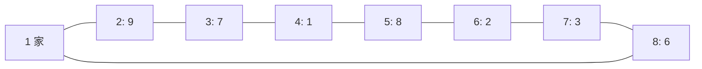

[[TOC]]

## 形式化题目

给定一张 $n$ 个结点的无向图，结点 $1$ 是家，结点 $2\sim n$ 是景点，景点 $i$ 有分数 $s_i$。

两个结点 $x,y$ **可转车 $k$ 次通达**，指 $x$ 到 $y$ 的简单路径边数不超过 $k+1$。

要求选四个互不相同的景点 $A,B,C,D$，使得

$$
1\to A\to B\to C\to D\to 1
$$

这五段行程都可转车 $k$ 次通达，并最大化

$$
s_A+s_B+s_C+s_D.
$$

保证至少存在一组符合要求的行程。

样例 $1$ 是一个 $8$ 个结点的环，$k=1$，即每段行程最多走 $2$ 条边。



最优行程是 $2\to3\to5\to7$，对应 $9+7+8+3=27$。

## 暴力解法

### 思路

先用 BFS 求出 `can_reach[x][y]`，表示 $x$ 到 $y$ 是否可转车 $k$ 次通达。然后直接枚举四个互不相同的景点 $A,B,C,D$，逐段检查

$$
1\to A,\ A\to B,\ B\to C,\ C\to D,\ D\to 1
$$

是否都可达，可行就更新分数和的最大值。

### 代码

@include-code(./brute.cpp, cpp)

### 复杂度

BFS 部分是 $O(n(n+m))$，枚举四个景点是 $O(n^4)$，总时间复杂度 $O(n^4+n(n+m))$，空间 $O(n^2)$。

### 瓶颈

当 $n=2500$ 时 $n^4$ 达到 $4\times10^{13}$，绝对跑不动。暴力里真正有价值的只有一件事：把“最多转车 $k$ 次”预处理成一个布尔可达矩阵。剩下的四重枚举必须消掉。

## 正解

### 思路

#### 拆成“中间一段 + 两侧各选一个”

行程是

```text
1 -> A -> B -> C -> D -> 1
```

如果固定中间的 $B\to C$，那么 $A$ 只需要满足 $1\to A\to B$ 都可达，$D$ 只需要满足 $C\to D\to 1$ 都可达，两边完全独立。

于是问题变成：对每个结点 $x$，维护“能排在 $x$ 前面的高分候选”集合

$$
best[x]=\{\,p : p\neq x,\ can\_reach[1][p],\ can\_reach[p][x]\,\}.
$$

因为图是无向的，$can\_reach$ 对称，所以 $best[C]$ 同时就是“能排在 $C$ 后面、且能回到家”的候选集合，两份候选列表可以共用同一套数据结构。

#### 为什么只留 4 个候选

枚举一对 $B,C$ 后，$A$ 要避开 $\{B,C,D\}$，$D$ 要避开 $\{A,B,C\}$。设最优解是 $(A^\*,D^\*)$：

在 $best[B]$ 中，凡是排在 $A^\*$ 前面的候选，分数都不低于 $A^\*$。若它们都不是最优，就说明在配对 $(\cdot,D^\*)$ 下都被排除了，只能是等于 $B$、$C$ 或 $D^\*$——最多 $3$ 个点。而 $B$ 本身已经不进候选表，所以真正会挤掉 $A^\*$ 的至多 $2$ 个点，$A^\*$ 最坏排在第 $3$ 位。

同理 $D^\*$ 最坏也排在第 $3$ 位。因此每份候选表保留前 $4$ 个就一定够用，枚举 $4\times4=16$ 组组合即可得到最优。

#### 样例中的候选表

下面列出样例 $1$ 里每个结点的 `best_node`（括号内是分数），只保留分数最高的若干个。

| $x$ | $best[x]$（按分数降序） |
| --- | --- |
| $2$ | $3\,(7),\ 8\,(6)$ |
| $3$ | $2\,(9)$ |
| $4$ | $2\,(9),\ 3\,(7)$ |
| $5$ | $3\,(7),\ 7\,(3)$ |
| $6$ | $8\,(6),\ 7\,(3)$ |
| $7$ | $8\,(6)$ |
| $8$ | $2\,(9),\ 7\,(3)$ |

表中可以看出 $best[3]$ 只有一个候选 $2$，说明要经过 $3$ 就只能从 $2$ 过来。枚举到 $B=3,\ C=5$ 时，$A=2$、$D$ 在 $best[5]=\{3,7\}$ 里排除掉与 $B=3$ 重合的 $3$，取 $7$，得到

$$
s_2+s_3+s_5+s_7=9+7+8+3=27,
$$

正是样例答案。

### 代码

@include-code(./main.cpp, cpp)

### 复杂度

- 时间复杂度：$O(n(n+m)+n^2\cdot 16)$。每个点做一次 BFS 共 $O(n(n+m))$，候选收集和枚举 $B,C$ 都是 $O(n^2)$ 级别，只带一个很小的常数。
- 空间复杂度：$O(n^2+n+m)$，主要来自可达矩阵。

## 总结

这题的关键拆法是不要直接枚举 $A,B,C,D$，而是先固定中间一段 $B\to C$：

- BFS 把“最多转车 $k$ 次”变成布尔可达矩阵，负责判可行；
- 每个结点只留前 $4$ 个高分候选，把两侧选择从 $O(n)$ 降到常数。

“前 4 个够用”这件事来自一个很短的排除论证：一对 $B,C$ 固定后，一个候选最多被 $2$ 个点挤掉。这类“只留常数个最优候选”的剪枝是枚举题里把指数级压成多项式级的常用手法。

本文的 `main.cpp` 已用四重枚举的 `brute.cpp` 对拍 $600$ 组随机数据（含稠密图与稀疏图），两组题面样例均通过。
