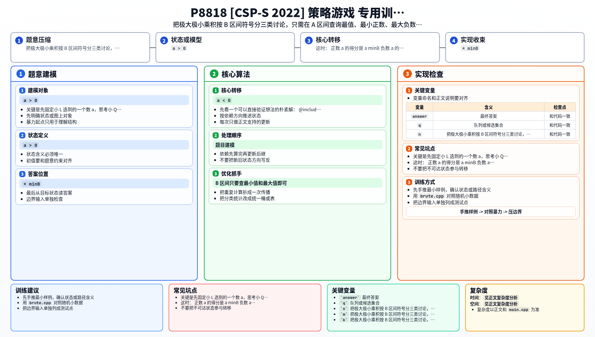

[[TOC]]

## 形式化题目

给定长度 $n$ 的数组 $A$ 和长度 $m$ 的数组 $B$，定义矩阵 $C_{ij} = A_i \times B_j$。

每次询问给出 $l_1, r_1, l_2, r_2$。小 L 先从 $[l_1, r_1]$ 选一个下标 $x$，小 Q 再从 $[l_2, r_2]$ 选一个下标 $y$，得分是 $C_{xy}$。小 L 想让得分尽量大，小 Q 想让得分尽量小，双方都采用最优策略。

求每次询问的得分。

## 暴力解法

### 思路

枚举小 L 选哪个 $x$，再枚举小 Q 选哪个 $y$，对每个 $x$ 求小 Q 能压到的最小得分，最后取最大值。

### 代码

@include-code(./brute.cpp, cpp)

### 复杂度

- 时间：$O(|A区间| \times |B区间|)$ 每次询问
- 空间：$O(n + m)$

### 瓶颈

单次询问就是区间长度的乘积级，$n, m, q \leqslant 10^5$ 时完全不可行。

## 正解

### 思路

先固定小 L 选到的一个数 $a$，思考小 Q 会怎么选：

- 如果 $a > 0$，为了让乘积尽量小，小 Q 一定会选 $B$ 区间里的最小值；
- 如果 $a < 0$，小 Q 一定会选 $B$ 区间里的最大值；
- 如果 $a = 0$，结果恒为 $0$。

所以一轮查询里，$B$ 区间真正有用的信息只有最小值 $\min B$ 和最大值 $\max B$。然后按 $B$ 区间的符号分三类讨论。

#### 1. $B$ 区间全非负

- 正数 $a$ 的得分是 $a \times \min B$
- 负数 $a$ 的得分是 $a \times \max B$

为了让结果尽量大：

- 如果 $A$ 区间里有非负数，选最大的 $a$
- 否则只能在负数里选最接近 $0$ 的那个负数

#### 2. $B$ 区间全非正

- 正数 $a$ 的得分是 $a \times \min B$（非正数）
- 负数 $a$ 的得分是 $a \times \max B$（非负数）

为了让结果尽量大：

- 如果 $A$ 区间里有非正数，选最小的那个数（负数绝对值最大，乘积最大）
- 否则只能选最小正数

#### 3. $B$ 区间同时有正有负

- 正数 $a$ 会被乘上 $\min B$，结果是负数
- 负数 $a$ 会被乘上 $\max B$，结果也是负数
- 如果 $A$ 区间有 $0$，那直接选 $0$ 最优

否则只需要比较：

- 最小正数 $\times \min B$
- 最大负数（最接近 $0$ 的负数）$\times \max B$

于是 $A$ 区间里需要查询的量只有：最大值、最小值、最小正数、最大负数、是否存在 $0$。这些都可以用 ST 表和前缀和在 $O(1)$ 查询出来；$B$ 区间只要查最小值和最大值即可。

### 代码

@include-code(./main.cpp, cpp)

### 复杂度

- 预处理 ST 表：$O((n+m)\log(n+m))$
- 每次查询：$O(1)$

总时间复杂度 $O((n+m+q)\log(n+m))$，空间复杂度 $O((n+m)\log(n+m))$。

## 总结

这题本质不是矩阵博弈，而是：

1. 先把"对手会怎么选"压缩成符号分类；
2. 再把每种情况需要的区间信息整理成固定几个最值；
3. 用 ST 表把这些区间最值做到 $O(1)$ 查询。

最关键的是把极大极小问题拆成清楚的分类讨论。

## 图示解析

这张图把本题的建模、关键转移、实现检查和训练方法压缩到一页，适合读完正文后复盘。

